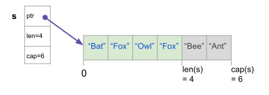
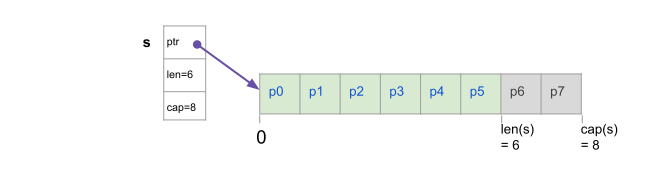
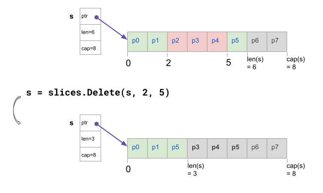
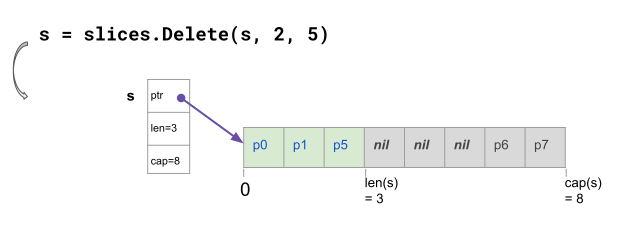

> https://go.dev/blog/generic-slice-functions

# Robust generic functions on slices
- `slices` package cũng cấp các functions để xử lý với tất cả các kiểu dữ liệu.
- Bài này nói về cách sử dụng các functions này một cách hiệu quả, hiểu xem slice được lưu thế nào trong RAM, ảnh hưởng thế nào đến Garbage collector; team Go đã update các functions liên quan đến slice gần đây thế nào để tránh việc gây ra các lỗi "surprising" kiểu Gotcha.

- Slice package bao gồm nhiều helper functions để xử lý slice

```golang
    s := []string{"Bat", "Fox", "Owl", "Fox"}

    s2 := slices.Clone(s)
    slices.Sort(s2)
    fmt.Println(s2) // [Bat Fox Fox Owl]

    s2 = slices.Compact(s2)
    fmt.Println(s2) // [Bat Fox Owl]

    fmt.Println(slices.Equal(s, s2)) // false
```
- Trước tiên, hãy hiểu về cấu tạo của slice:
    - Slice có thể hiểu là một phần của array.
    - Slice có 3 thuộc tính:
        - Con trỏ (pointer): trỏ tới vị trí của array lưu trữ value.
        - Độ dài (len)
        - Sức chứa (cap)
    - 2 slice có thể trỏ đến cùng 1 array và trỏ đến các vị trí khác nhau.



- Nếu 1 function thay đổi length của slice, slice được pass vàp parameter, thì nên return slice mới cho caller. Array phía dưới có thể giữ nguyên nếu slice không có thêm phần tử.
    - `slice.Compact` trả về giá trị (do compact thay đổi size), `slice.Sort` lại không (giữ nguyên size)

## Xét ví dụ xóa 1 đoạn của slice
- Slice trỏ tới 1 array có 8 phần tử, tuy nhiên chỉ lấy ở 6 phần tử đầu (cap = 6)


- Bây giờ muốn xóa đi 3 phần tử: p2, p3, p4:
```
s = append(s[:2], s[5]...)
```

- Thực tế thì hàm Delete được implement như trên luôn:
```
func Delete[S ~[]E, E any](s S, i, j int) S {
       return append(s[:i], s[j:]...)
}
```
- Về cơ bản thì đoạn code trên sẽ xử lý xóa phần tử p2, p3, p4 bằng cách:
    - Lấy 2 phần tử đầu tiên (p0, p1)
    - Lấy từ phần tử số 5 đến cuối slice (p5)
        - Vì len của slice chỉ là 6 nên chỉ lấy p5, không lấy p6, p7
    - Thực tế thì ở phía dưới, Go sẽ copy phần tử p5 về sát với p0, p1 như hình dưới. (chú ý có 2 p5)


- Code implement nhanh như này:
```Golang
func main() {
	//cmdRoot.Execute()
	slice := []string{"p0", "p1", "p2", "p3", "p4", "p5", "p6", "p7"}
	sliceOrigin := slice[:6]
	sliceResult := slices.Delete(sliceOrigin, 2, 5)

	fmt.Println(sliceResult)
	fmt.Println(sliceOrigin)
	fmt.Println(slice)
}

// [p0 p1 p5]
// [p0 p1 p5 p3 p4 p5]
// [p0 p1 p5 p3 p4 p5 p6 p7]
```
- Có thể thấy là hàm Delete không tạo array mới mà dùng lại array, chỉ dịch chuyển các phần tử thôi.
- Pattern này khá phổ biến, dùng cả cho `Compact, CompactFunc, DeleteFunc, Grow, Insert, Replace`.
- Cách dùng này khá rủi ro, nhất là trong trường hợp anh em quên không lấy array return về, mà dùng array gốc.

# Update mới từ phía Go
- Từ Go 1.22 quyết định update thêm 1 chút: set các cháu bị remove đi thành nil

- Trong code change thì trông như này

- Tất nhiên việc có changes ntn sẽ làm một số test fail. Anh em lưu ý check kĩ lại trước khi update nhé.