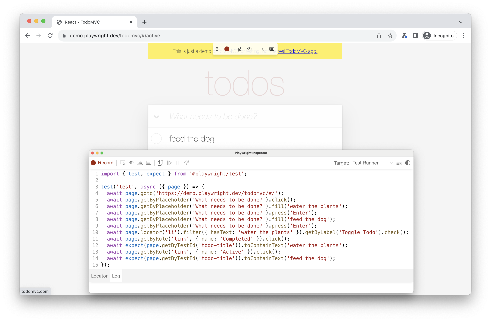

> https://playwright.dev/docs/codegen-intro

# Generating test
- Đại khái là thao tác (click chuột, gõ phím) mà ra được test. Không cần code.
- Trong bài này bạn sẽ học được cách:
    - Record 1 test
    - Generate locator.

# Sử dụng Codegen
- Command `codegen` dùng để chạy tool sinh ra code của Playwright.
```
npx playwright codegen
```
- Bạn có thể thêm luôn url của website cần test vào cuối, trình duyệt mở lên sẽ tự động mở trang web đó
```
npx playwright codegen demo.playwright.dev/todomvc
```

## Record 1 test
- Khi run lên thì bạn sẽ thấy có 1 browser trông như hình dưới

- Chi tiết hơn thì codegen có thể làm những thứ sau:
    - Record những hành động như: click, điền dữ liệu
    - Kiểm tra các phần tử bằng cách click vào cái toolbar nổi trên màn hình:
        - "Assert visibility": kiểm tra phần tử có hiển thị hay không.
        - "Assert text": Kiểm tra phần tử có chứa text.
        - "Assert value": Kiểm tra phần tử có chứa giá trị đặc biệt nào không.
- Sau khi record xong thì bạn bấm nút record để tắt record đi, bấm nút copy để copy code.
- Dùng nút clear để xóa code đi và record lại. Khi bạn finish thì Playwright sẽ đóng trình duyệt code gen lại và dừng terminal command.
- Xem thêm về code gen tại [đây](https://playwright.dev/docs/codegen)

## Generate locator
- Click vào nút "Record" để dừng recording lại. Nút "Pick locator" sẽ xuất hiện.
- Click vào nút "Pick locator", sau đó hover qua các phần tử bạn muốn lấy locator. Lúc này phần tử sẽ sáng lên
- Khi click vào element thì ở tab Locator trên Playground sẽ có locator xuất hiện.
- Bạn có thể sửa locator cho phù hợp rồi copy vào test.

## Emulation (giả lập)
- Bạn có thể gen test sử dụng giả lập kích thước viewport, thiết bị, color scheme cũng như các vị trí, ngôn ngữ và timezone.
- Test generator cũng có thể lưu lại trạng thái đăng nhập.
- Xem thêm tại [Test Generator](https://playwright.dev/docs/codegen#emulation)