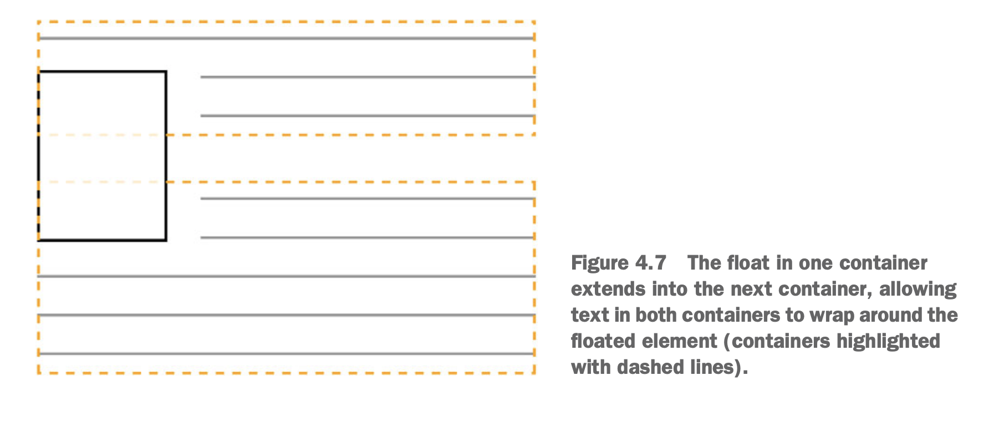

# Part 1: Reviewing fundamental
```
- 4 phần make up the cascade (?)
- Sự khác nhau giữa cascade & inhenritance
- Cách control style nào apply vào element nào
- Các vân đề thường hiểu nhầm khi dùng short-hand declaretion
```
- CSS không phải là 1 ngôn ngữ lập trình
- Cũng ko phải design tool, nhưng cần 1 chút sáng tạo
- Chữ C trong CSS là cascade

# Chap 1: Cascade, specificity, inhenritance
## 1.1: Cascade (nghĩa là dòng chảy)
-  Về cơ bản, CSS là định nghĩa ra các rule.
    - VD: nếu X là con Y, apply style này; 
- Hiểu được cơ bản => đoán được style mà element sẽ apply => ngon
- Khi các rule conflict sẽ dựa trên 3 yếu tố sau để quyết định:
    - Stylesheet origin: Style đến từ đâu (?)
    - Selector specificity: Selector nào được quyền ưu tiên hơn
    - Source order: thứ tự của style được khai báo


### 1.1.1. Stylesheet origin
- Có 2 loại:
    - User agent style: style của browser
    - Style của bạn (your style)
- Thi thoảng có browser cho nhúng 1 style thứ 3 gọi là user stylesheet = nhúng 1 đoạn code css vào browser. Thằng này nằm giữa 2 loại trên
- Tức là theo thứ tự ưu tiên giảm dần:

```
Your style > user style > user agent style
```
- Thêm "!important" vào thì độ ưu tiên sẽ cao vkl

### 1.1.2. Specificity
- Nếu conflict chưa xử lý được bằng cách dùng origin bên trên thì sẽ dùng đến tầng này
- Chia làm 2 loại:
    - inline style
    - style được định nghĩa bằng selector
- Inline thì ưu tiên nhất rồi
- Style định nghĩa bằng selector nằm trong cặp thẻ <style></style>
    - Cách tính ưu tiên selector thì đọc bài này: https://minhphong306.wordpress.com/2020/12/15/tinh-thu-tu-uu-tien-css-selector/


### 1.1.3. Source order
- Nếu cùng độ ưu tiên => thằng nào khai báo sau thì thằng đấy ăn

### 1.1.4. 2 điều cần lưu ý
- Tránh dùng ID selector
- Tránh dùng !important

## 1.2 Inhenritance
- Thường thì css sẽ được inhenritance từ cha. 
- Không phải tất cả đều thừa kế nha, chủ yếu là:
    -  các thuộc tính từ text như: `color, font, font-family, font-size, font-weight, font-variant, font-style, line-height, letter-spacing, text-align, text-indent, text-transform, white-space, and word-spacing`
    - các thuộc tính là list property: `list-style, list-style -type, list-style-position, and list-style-image`
    - table border: `border-collapse and border-spacing`

## 1.3. Special value
- `inherit` và `initial`
- inherit thì là kế thừa
- initial là giá trị mặc định. Giống như reset css vậy.

## 1.4. Shorthand prop
- Short hand là dạng ngắn gọn, vd: font thay cho font-family, font-weight...
- Cẩn thận short-hand sẽ ghi đè giá trị của bạn. VD:
```
p {
  font-weight: bold;
}
.title {
  font: 32px Helvetica, Arial, sans-serif;
}

<p class="title">Oh my god</p>
```
- Ở trên định nghĩa font-weight là `bold` rồi, tuy nhiên bên dưới chỉ dùng short hand là `font`, ko định nghĩa bold => bị ghi đè về normal
- Thực tế là định nghĩa sẽ trở thành như này:
```
h1 {
  font-weight: bold;
}
.title {
  font-style: normal;
  font-variant: normal;
  font-weight: normal;
  font-stretch: normal;
  line-height: normal;
  font-size: 32px;
  font-family: Helvetica, Arial, sans-serif;
}
```
- Thứ tự của short hand prop là top, right, bottom, left (ghi nhớ là TRouBLe)

# Chap 2: Working with unit

## 2.1: Power of relative value
- Trước đây mọi người thường làm việc với absolute unit như pixel (hay còn gọi là pixel perfect design)
- Dần công nghệ phát triển, absolute ko còn phù hợp nữa
- Pixel, point và pica
    - 1 inch = 2.54 cm = 6 pc = 72 pt = 96 px

## 2.2: Em & rem
- `em` là đơn vị đi theo font-size

```
<span class="box box-small">Small</span>
<span class="box box-large">Large</span>


.box {
  padding: 1em;
  border-radius: 1em;
  background-color: lightgray;
}
.box-small {
  font-size: 12px
}
.box-large {
  font-size: 18px;
}
```

### 2.2.1. Sử dụng `em` để định nghĩa font-size
- bình thường `em` tính theo font-size
- => định nghĩa font-size = 1.2em nghĩa là to gấp 1.2 font-size được inherit từ element phía trên

#### Lưu ý: Sử dụng em cho thuộc tính khác ngoài font-size có thể xảy ra vấn đề


- Trong VD trên thì `.slogan` có font-size = 1.2em = 19.2px
- padding sẽ lấy giá trị theo fontsize của phần tử hiện tại => tức là 1.2 x 19.2 = 23.04
- Một ví dụ khác đối với list

```
body {
  font-size: 16px;
}
ul {
  font-size: .8em;
}
```

- ul đầu tiên = 0.8em, ul thứ 2 = 0.8em của ul trước đó,... tương tự vậy nên nó giảm size => nhỏ vkl.
- Tóm lại là shriking xảy ra khi có nhiều thằng tính bằng đơn vị em nằm nested nhau.
- Có 1 cách để fix là set cha của nó về 1em (bằng đúng cha)
```
ul {
  font-size: .8em;
}
ul ul {
  font-size: 1em;
}
```
- Cách trên thì cũng xử lý được, nhưng không hay lắm.
- Hạn chế override CSS bằng cách tăng cấp độ của selector lên
- Rõ ràng em cũng hay, nhưng khi nested thì phức tạp phết => tìm hiểu về rem đi

### 2.2.3: Sử dụng rem
- rem = root em = size của phần tử `:root` (hay `html`)
- Phía trên dùng `em` gặp vấn đề là do list phụ thuộc vào thằng cha => thằng cha nhỏ đi => thằng con nhỏ đi.
- => dùng rem giải quyết được vấn đề này

## 2.3: Stop thinking pixel
- Một số pattern thường thấy trước đây: reset page font-size về 62.5%
```
html {
    font-size: .625em;
}
```
- Mục đích pattern: reset font size về 10px cho dễ tính thằng khác (62.5% của 16 là 10).
- VD: 14px là 1.4 rem
- Cái này có nhiều bất lợi:
    - Viết nhiều duplicate style (do reset cmn về 10px => những thằng thẻ p, span,... đi theo sẽ nhỏ đi => cần viết lại cho nó to ra thì mới đọc được)
    - Vẫn đang nghĩ theo cách tính pixel.

- Thật ra 16px vẫn hơi to thật, nhưng set về thằng nào vừa phải hơn thì hợp lí hơn. Thường set về 14px:

```
:root {
    font-size: 0.875em;
}
```
- VD code 1 cái panel

```
<div class="panel">
  <h2>Single-origin</h2>
  <div class="panel-body">
    We have built partnerships with small farms around the world to
    hand-select beans at the peak of season. We then carefully roast
    in <a href="/batch-size">small batches</a> to maximize their
    potential.
</div>
</div>


.panel {
  padding: 1em;
  border-radius: 0.5em;
  border: 1px solid #999;
}
.panel > h2 {
  margin-top: 0;
  font-size: 0.8rem;
  font-weight: bold;
  text-transform: uppercase;
}
```
- Có thể dùng @media để làm responsive

```
:root {
  font-size: 0.75em;
}
@media (min-width: 800px) {
  :root {
    font-size: 0.875em;
  }
}

@media (min-width: 1200px) {
  :root {
      font-size: 1em;
  }
}
```
- Có thể resizing 1 component bằng cách add thêm class vào cho nó

```
.panel.large {
  font-size: 1.2rem;
}
```

## 2.4: Viewport relative unit
- Viewport = vùng màn hình hiển thị (không tính address bar, statusbar,...)
- Quy đổi:
```
- vh = 1/100 viewport height
- vw = 1/100 viewport width
- vmin = 1/100 của chiều nhỏ hơn (không phải lúc nào dài cũng > rộng, do user xoay ngang màn hình chẳng hạn)
- vmax = 1/100 của chiều lớn hơn
```
- Ví dụ
```
.square {
  width: 90vmin;
  height: 90vmin;
  background-color: #369;
}
```


- Như hình thì lúc nào hình vuông cũng chỉ = 90% của chiều nhỏ nhất (vmin mà)

- Một chút note về CSS3:
    - Một số đơn vị trong quyển sách này không support ở các version trước đó của CSS (VD: vh, vw, rem,...)
    - Khoảng giữa những năm 90 và 2000, CSS2 ra đời
    - 1998, CSS 2.1 ra đời
    - Khoảng 2013 gì đấy thì CSS3 ra đời
    - ... nói cái gì đấy xiaolin, ko hay lắm nên ko đọc tiếp

### 2.4.1: Sử dụng vw cho font-size
- Dùng vw cho font-size khá hay, VD màn 1200px -> font= 2vw = 2% = 24px; màn nhỏ cũng tự co về
- Tuy nhiên 24px thì hơi to, còn với màn có vw nhỏ như iphone6 thì 2vw lại bé quá -> dùng hàm calc()

### 2.4.2: Sử dụng calc() cho font-size
- Dùng remix giữa các đơn vị luôn. VD:
```
:root {
  font-size: calc(0.5em + 1vw);
}
```
- Trong VD trên thì 0.5em gần vừa mắt với người dùng. 1vw vừa đủ để tăng linh hoạt khi viewport thay đổi.

## 2.5: Unitless numbers and line height
- Một số thuộc tính ko cần unit (VD: line-height, z-index, font-weight)
- Trong trường hợp = 0 thì ko cần unit (do 0px hay 0% thì có khác mẹ gì nhau đâu :v)
- line height khá đặc biệt, nó accept cả có unit và ko có unit
    - Có unit => tính toán ra luôn giá trị
    - Không unit => giá trị tuỳ thuộc vào phần tử con của nó
- VD:

```
<style>
    body {
        line-height: 1.2em;
    }
    .about-us {
        font-size: 2em;
    }
</style>

<body>
    <!-- <p class="title">Oh my god</p> -->
    <p class="about-us">
        We have built partnerships with small farms around the world to
        hand-select beans at the peak of season. We then carefully roast in
        small batches to maximize their potential. We then carefully roast in
        small batches to maximize their potential. We then carefully roast in
        small batches to maximize their potential.
    </p>
</body>
```
- Như trên sẽ bị lỗi, dòng mau di dít vào với nhau như này

- Lí do: để đơn vị line-height = 1.2em => tính luôn = 1.2 x 16 = 19.2px. Font size của thẻ p là 2em = 32px => 32px mà giãn dòng có 19.2 thì nó mau là đúng rồi.
- Cách fix: bỏ đơn vị đi

```
<style>
    body {
        line-height: 1.2;
    }
    .about-us {
        font-size: 2em;
    }
</style>
```
- Bỏ đơn vị đi thì nó chỉ tình là 1.2 lần, khi vào đến thẻ p có class about-us => 1.2 lần của 32px = 38.4


## 2.6: Custom property (aka CSS variable)
- Có thể anh em làm SASS hay LESS đã có variable từ lâu rồi => coi thường mục này
- ĐỪNG. variable này có thể làm được nhiều thứ mà SASS hay LESS làm được. Hồi sau sẽ rõ :v

- Khai báo custom prop

```
:root {
  --main-font: Helvetica, Arial, sans-serif;
}
```
- Dùng custom prop: dùng hàm `var()`
```
:root {
  --main-font: Helvetica, Arial, sans-serif;
}

p {
  font-family: var(--main-font);
}
```
- Hàm var() dùng thêm đối thứ 2 là fallback cũng được

```
:root {
    --main-font: Helvetica, Arial, sans-serif;
    --brand-color: #369;
}
p{
    font-family: var(--main-font, sans-serif); color: var(--secondary-color, blue);
}
```

- Lưu ý là nếu value không hợp lệ => sẽ set về initial value
- VD: padding mà value lại là color => set về gía trị 0

```
padding: var(--brand -color)
```

### 2.6.1: Change custom property dynamically
- Custom prop đơn thuần chỉ là giúp bạn không phải viết quá nhiều duplicate code
- Điều đặc biệt hơn: nó chảy xuống (cascade) và kế thừa (inherit)
- VD về việc thay đổi custom property để làm dark mode

```
<!DOCTYPE html>
<html lang="en">
<head>
    <meta charset="UTF-8">
    <title>Demo css darkmode, css in depth</title>
    <style>
        :root {
            --main-bg: #fff;
            --main-color: #000;
        }

        .panel {
            font-size: 1rem;
            padding: 1em;
            border: 1px solid #999;
            border-radius: 0.5em;
            background-color: var(--main-bg);
            color: var(--main-color);
        }

        .panel > h2 {
            margin-top: 0;
            font-size: 0.8em;
            font-weight: bold;
            text-transform: uppercase;
        }

        .dark {
            margin-top: 2em;
            padding: 1em;
            background-color: #999;
            --main-bg: #333;
            --main-color: #fff;
        }
    </style>
</head>
<body>
<div class="panel">
    <h2>Single origin</h2>
    <div class="body">
        We have built partnerships with small farms
        around the world to hand-select beans at the
        peak of season. We then careful roast in
        small batches to maximize their potential.
    </div>
</div>

<aside class="dark">
    <div class="panel">
        <h2>Single origin</h2>
        <div class="body">
            We have built partnerships with small farms
            around the world to hand-select beans at the
            peak of season. We then careful roast in
            small batches to maximize their potential.
        </div>
    </div>
</aside>
</body>
</html>
```
### 2.6.2: Change custom property với javascript
```
<script type="text/javascript">
  var rootElement = document.documentElement;
  var styles = getComputedStyle(rootElement);
  var mainColor = styles.getPropertyValue('--main-bg');
  console.log(String(mainColor).trim());


  var rootElement = document.documentElement;
rootElement.style.setProperty('--main-bg', '#cdf');
</script>
```

### 2.6.3: Experimenting with custom property
- Custom property này cũng mới, nên chưa được dùng nhiều lắm
- Tin rằng tương lai sẽ rất hữu hiệu
- Khi dùng tốt nhất cứ thêm fallback vào nha ae
```
color: black;
color: var(--main-color);
```

# Chap 3: Mastering the box model
## 3.1: Difficulty with element width
- Mặc định kích thước phần tử không bao gồm padding & border
- Cần dùng `box-sizing: border-box` để bao gồm luôn cho dễ tính
- Dùng * để reset cho all element

```
*,
::before,
::after {
  box-sizing: border-box;
}
```
- Tuy nhiên nếu reset hết -> có thể conflict CSS với third party (do third party không reset css mà tính dựa trên box-sizing: content-box) -> nên viết CSS như bên dưới, inherit dựa trên parent

```
:root {
  box-sizing: border-box;
}
*,
::before,
::after {
  box-sizing: inherit;
}
```
- Mặc định thì box-sizing nó ko inherit -> nếu css của third party bị conflict, có thể chủ động set lại cho component cha thì những css bên trong không bị lỗi
```
.third-party-component {
  box-sizing: content-box;
}
```
- VD muốn add 1 khoảng trống nhỏ giữa 2 element, có thể dùng calc cho chuẩn

```
.main {
  float: left;
  width: 70%;
  background-color: #fff;
  border-radius: .5em;
}

.sidebar {
  float: left;
  width: calc(30% - 1.5em);
  margin-left: 1.5em;
  padding: 1.5em;
  background-color: #fff;
  border-radius: .5em;
}
```

## 3.2: Difficulty with element heigh
- Làm việc với heigh thì khó hơn width
- Lí do thì thường content chỉ tính theo chiều ngang, chiều dọc sẽ là infinity, tuỳ độ dài của content

### 3.2.1: Control overflow behavior
- VD set heigh cho 1 cái box, mà nội dung nó tràn ra ngoài gọi là overflow

- Over flow có 4 giá trị:
  - visible (mặc định): tất cả content đều visible, kể cả tràn ra khỏi content box
  - hidden: Content mà bị tràn là cắt liền
  - scroll: scroll được add vào container. Một số hệ điều hành thì content box sẽ được add mặc định vào, kể cả content có tràn hay không. Trường hợp content ko tràn thì cái scroll nó xám (disable đi) 
  - auto: chỉ add scroll trong trường hợp content overflow


- Hãy dùng scroll 1 cách khôn ngoan. Nếu có 2 scroll trong 1 màn hình: 1 scroll cho toàn trang, 1 scroll cho 1 box nhỏ; nếu người dùng đang scroll cả trang xuống mà con trỏ chuột chạy vào box nhỏ => dừng scroll toàn trang mà chỉ scroll trong box nhỏ => user bực bội.
- Horizontal overflow:
  - Kể cả chiều ngang cũng có overflow, ko chỉ là chiều dọc => nhiều khi xuất hiện kết quả không mong muốn (VD: chỉ muốn overflow chiều dọc thôi, ko thích ngang)
  - => dùng `overflow-x` và `overflow-y` sẽ chỉ overflow theo 1 chiều nào đó thôi.

### 3.2.2: Applying alternative to percentage-based heights
- Tính heigh theo % có vấn đề:
  - % dựa trên chiều cao của thằng cha chứa nó
  - Chiều cao của thằng cha chứa nó lại phụ thuộc vào thằng con
=> nó cứ bị vòng tròn luẩn quẩn => browser ignore cmnl
- Lí do mà thích dùng % là muốn vừa với screen
- Cách tốt nhất là ae dùng vh (viewport-heigh) đã chém trong chương 2 ý

- Chia những cột có chiều cao = nhau đã từng là vấn đề của những năm 2000. Những năm này dùng table để chia :v
- Giờ xịn hơn rồi, có thể dùng mấy cái mới như: display: table, flex box
- VD dùng table thì set container cha là `display: table`, mấy thằng con là `display: table-cell`


```
<!DOCTYPE html>
<html lang="en">

<head>
    <meta charset="UTF-8">
    <meta http-equiv="X-UA-Compatible" content="IE=edge">
    <meta name="viewport" content="width=device-width, initial-scale=1.0">
    <title>Demo CSS
    </title>
    <style>
        :root {
            box-sizing: border-box;
        }

        *,
        ::before,
        ::after {
            box-sizing: inherit;
        }

        body {
            background-color: #eee;
            font-family: Helvetica, Arial, sans-serif;
        }

        header {
            color: #fff;
            background-color: #0072b0;
            border-radius: .5em;

        }

        main {
            display: block;
        }

        .container {
            display: table;
            width: 100%;
        }

        .main {
            display: table-cell;
            width: 70%;
            background-color: #fff;
            border-radius: .5em;
        }

        .sidebar {
            display: table-cell;
            width: 30%;
            margin-left: 1.5em;
            padding: 1.5em;
            background-color: #fff;
            border-radius: .5em;
        }
    </style>
</head>

<body>
    <header>
        <h1>Franklin Running Club</h1>
    </header>
    <div class="container">
        <main class="main">
            <h2>Come join us!</h2>
            <p>
                The Franklin Running club meets at 6:00pm every Thursday
                at the town square. Runs are three to five miles, at your
                own pace.
            </p>
        </main>
        <aside class="sidebar">
            <div class="widget"></div>
            <div class="widget"></div>
        </aside>
    </div>
</body>

</html>
```
- Chạy lên sẽ thấy bị mất khoảng trống do margin không work với display table
- Có thể fix bằng cách: thêm `border-spacing: 1.5em 0` vào container. Tuy nhiên nó sẽ thêm vào cả 2 phía => trông bên trái bị thừa 1 khoảng
- Lại fix bằng cách thêm 1 thẻ `<div class="wrapper">` bao quanh container. Sau đó dùng margin âm để lùi về phía tay trái
```
.wrapper {
  margin-left: -1.5em;
  margin-right: -1.5em;
}

.container {
  display: table;
  width: 100%;
  border-spacing: 1.5em 0;
}
```

- Có thể ae đã nghe rằng HTML table là bad practice cho layout. Đúng là như vậy. Anh em nên dùng float, flexbox, inline-block thay vì table.

#### Flexbox
- Lưu ý: không support IE9 đổ về trước
```
.container {
  display: flex;
}

.main {
  width: 70%;
  background-color: #fff;
  border-radius: 0.5em;
}

.sidebar {
  width: 30%;
  padding: 1.5em;
  margin-left: 1.5em;
  background-color: #fff;
  border-radius: .5em;
}
```
- Như trên thì chỉ cần apply display: flex cho container, ko cần set display ở mấy thằng con.
- Flex khá hay, kể cả set tổng width > 100% thì nó vẫn tự căn lại cho mình. Chi tiết hơn sẽ nói ở chương 5

### 3.2.3: Using min-heigh and max-height
- Thay vì set fixed, có thể dùng `min-height` và `max-height` để set cho element dịch chuyển trong khoảng đó.
- VD set `min-height` thôi thì:
  - Khi elem ko đủ cao bằng `min-height` thì vẫn tự động cao = `min-height`
  - Nếu elem cao hơn `min-height` => tự động được giãn thêm, ko bị overflow
- Max height cũng tương tự nha


### 3.2.4: Vertically centering content (căn giữa content theo chiều dọc)
- Căn giữa theo chiều ngang còn dễ, theo chiều dọc khó vkl.
- Một số thanh niên dùng `vertical-align: middle` nhưng ko work. Vì nó chỉ work với display: table thôi nha
- Cách khá hay để căn giữa content là dùng padding top và bottom bằng nhau => nó tự căn giữa trên khung của nó.
- Tuy nhiên thì ko phải lúc nào cũng dùng padding được. Có trường hợp bạn muốn child element nó sát vào phần tử cần căn. Nếu set padding thì thằng child nó sẽ xa cmn rời thằng mẹ luôn.
- Lúc này solution ngon nhất là dùng CSS tables hoặc flexbox nha;

#### Cách hay nhất để vertically centering
- Dựa trên 1 số điều kiện để định hình xem tình huống của bạn là gì
- ... đoạn này nói linh tinh gì đó.

## 3.3: Margin âm
- Không giống như padding hay border, margin có thể âm.
- Margin âm đưa phần tử tiến về phía bị âm 1 khoảng


- Chưa hiểu thằng margin âm này làm cái mẹ gì cho đời :v

## 3.4: Collapsed margin
- Collapsed margin đại khái là hiện tượng bị đè margin.
- VD: 
  - thẻ <p> mặc định có margin 1 em top và bottom, nhưng 2 thẻ <p> cạnh nhau ko phải là 2 em mà vẫn là 1em
  - Trường hợp có nhiều margin khác nhau nằm cạnh nhau => lấy margin lớn nhất.
- Vài cách để stop collapsed margin:
  - Dùng overflow: auto (hoặc giá trị nào khác visible cũng đc)
  - Thêm padding hoặc border
  - Margin ko collapse bên ngoài đối với container float. Chỉ collapsed với inline, block, absolute, fixed position.
  - Flex và grid cũng ko collapsed nha
  - Element `table-cell`, `table-row` ko có margin => ko bị collapsed. `table`, `table-inline`, `table-caption` thì vẫn bị collapsed (?)

## 3.5: Spacing element within container
// TOREAD: Đoạn này hơi lú, quay lại note sau vậy

# Part 2: Mastering layout

# Chap 4: Making sense of float
- Part 1 nói về element & sizing rồi, part2 sẽ nói về tổ chức layout.
- Chúng ta sẽ đi qua 3 cách quan trọng nhất để tạo layout cho trang web: float, flexbox, grid layout. Sau đó nói về positioning - cách để sắp xếp element chồng lên nhau (stacking)
- Flex và grid mới xuất hiện, nhưng nó trở thành công cụ không thể thiếu rồi. Còn float thì có từ lâu nhưng vẫn có những hiểu nhầm.
## 4.1: Mục đích của float
- Float kéo element về 1 phía của container. Nếu có nhiều thành phần float thì sẽ nằm liên tiếp, kề nhau.

- Nhiều khi bạn tự hỏi:
  - Flex ra đời rồi có cần học float ko?
  - => câu trả lời là có, vì:
    - VD code cần support browser cũ (IE10, IE11) => chỉ dùng đc float thôi pa
    - Fix code cũ => cần hiểu float mới fix được
    - Float là cách duy nhất để viết đoạn văn tràn xung quanh image/
## 4.2: Container collapsing & clearfix
### 4.2.1: Understanding container collapsing
- VD đoạn code sau (xem ở trang practices/css-in-depth/03.html cũng được)
```
<!DOCTYPE html>
<html lang="en">

<head>
    <meta charset="UTF-8">
    <meta http-equiv="X-UA-Compatible" content="IE=edge">
    <meta name="viewport" content="width=device-width, initial-scale=1.0">
    <title>Demo CSS
    </title>
    <style>
        :root {
            box-sizing: border-box;
        }

        *,
        ::before,
        ::after {
            box-sizing: inherit;
        }

        body {
            background-color: #eee;
            font-family: Helvetica, Arial, sans-serif;
        }

        body *+* {
            margin-top: 1.5em;
        }

        header {
            padding: 1em 1.5em;
            color: #fff;
            background-color: #0072b0;
            border-radius: .5em;
            margin-bottom: 1.5em;
        }

        .main {
            padding: 0 1.5em;
            background-color: #fff;
            border-radius: .5em;
        }

        .container {
            max-width: 1080px;
            margin: 0 auto;
        }

        .media {
            float: left;
            width: 50%;
            padding: 1.5em;
            background-color: #eee;
            border-radius: 0.5em;
        }
    </style>
</head>

<body>
    <div class="container">
        <header>
            <h1>Franklin Running Club</h1>
        </header>
        <main class="main clearfix">
            <h2>Running tips</h2>
            <div>
                <div class="media">
                    
                    <div class="media-body">
                        <h4>Strength</h4>
                        <p>
                            Strength training is an important part of
                            injury prevention. Focus on your core&mdash;
                            especially your abs and glutes.
                        </p>
                    </div>
                </div>
                <div class="media">
                    
                    <div class="media-body">
                        <h4>Cadence</h4>
                        <p>
                            Check your stride turnover. The most efficient
                            runners take about 180 steps per minute.
                        </p>
                    </div>
                </div>
                <div class="media">
                    
                    <div class="media-body">
                        <h4>Change it up</h4>
                        <p>
                            Don't run the same every time you hit the
                            road. Vary your pace, and vary the distance
                            of your runs.
                        </p>
                    </div>
                </div>
                <div class="media">
                    
                    <div class="media-body">
                        <h4>Focus on form</h4>
                        <p>
                            Run tall but relaxed. Your feet should hit
                            the ground beneath your hips, not out in
                            front of you.
                        </p>
                    </div>
                </div>
            </div>
        </main>
    </div>
</body>

</html>
```

- Khi run lên trình duyệt trông sẽ như này:

- Lí do là vì mặc định thì float sẽ không add height cho phần tử cha
- Nhìn thì có vẻ là lỗi, nhưng thực tế không phải vậy. 
- Float sinh ra để text nằm xung quanh nó. VD có 1 cái image float, text sẽ nằm xung quanh nó như này:

- Anh em để ý sẽ thấy mặc dù set background cho thẻ main
```
.main {
  padding: 0 1.5em;
  background-color: #fff;
  border-radius: .5em;
}
```
- Nhưng chỉ có mỗi cái title có bg trắng thôi.
- Lí do vì float không tính vào height của phần tử.
- Trong thẻ main chỉ có mỗi thằng title là ko float => chiều cao của thằng main = chiều cao thẻ title.

- Cách fix thì ae thêm dòng sau vào gần cuối thẻ main

```
<main>
...
<div style="clear: both"></div>
</main>
```
- `clear: both` sẽ kéo độ dài của container xuống vị trí có chứa đoạn css này.
- Làm cách trên cũng được, nhưng mà đang add thừa 1 thẻ HTML vào. Có thể dùng cách pseudo element (element ảo after, before) để xử lý.

### 4.2.2: Understanding clearfix
- pseudo element là ::after và ::before đó.
- CSS sẽ như này:
```
.clearfix::after {
  display: block;
  content: " ";
  clear: both;
}
```
