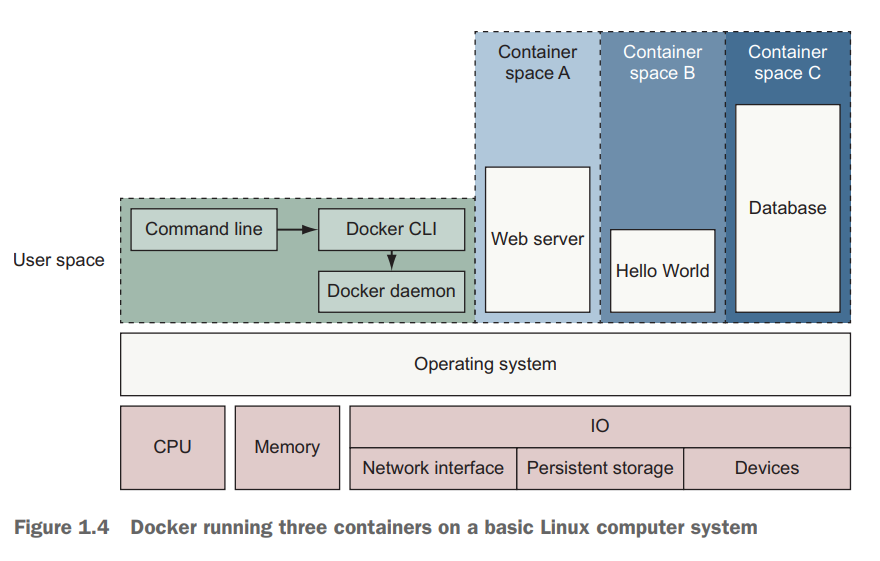
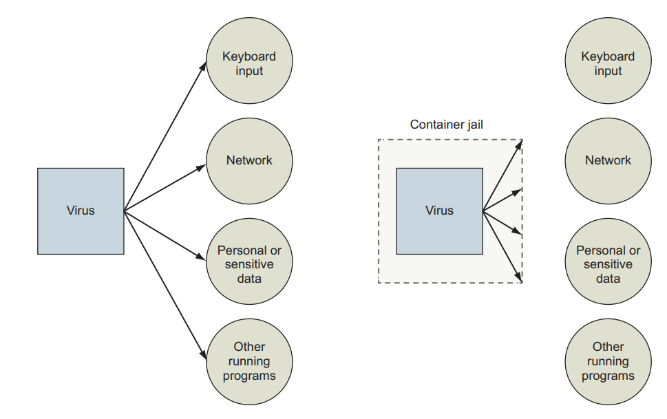
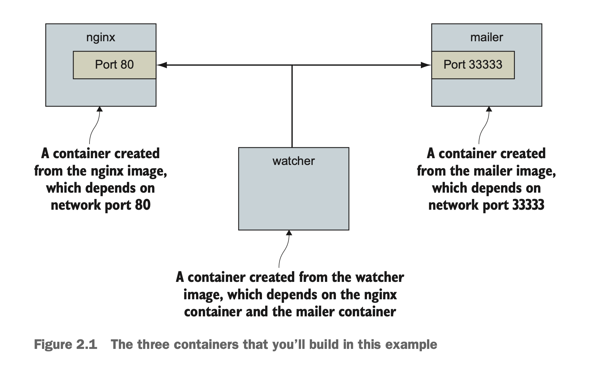
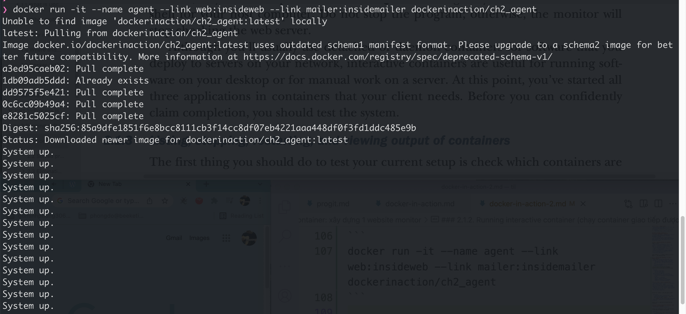
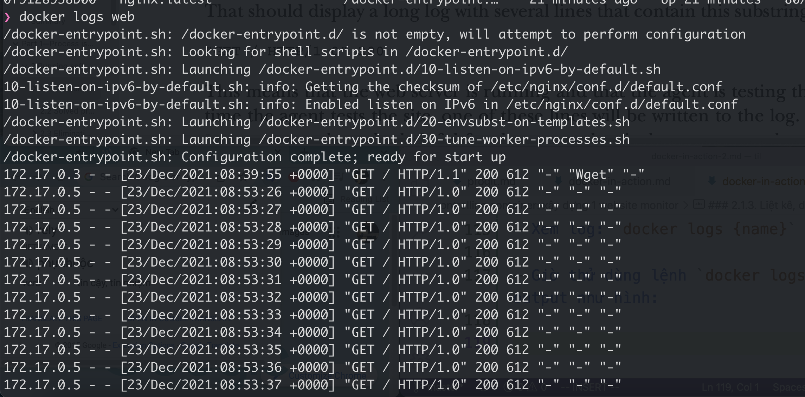
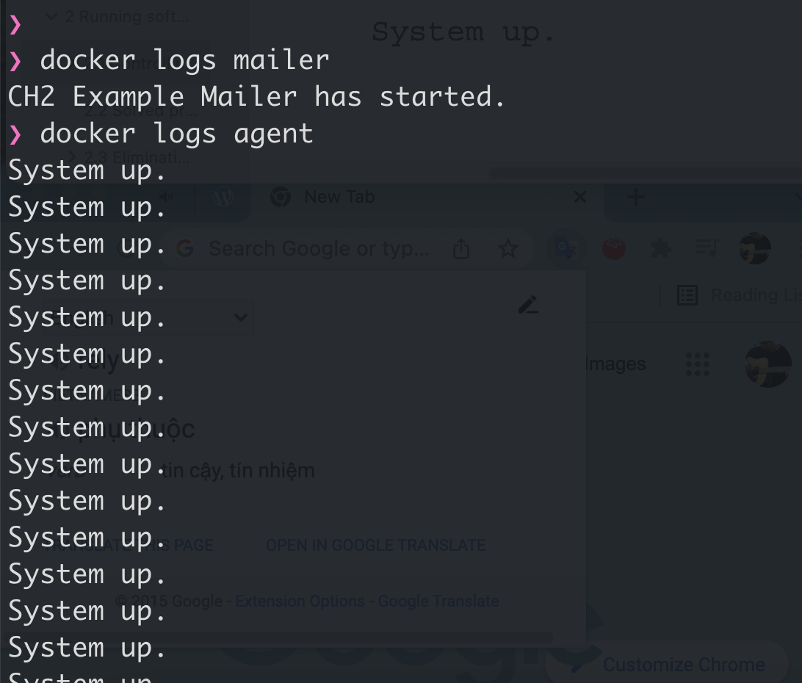
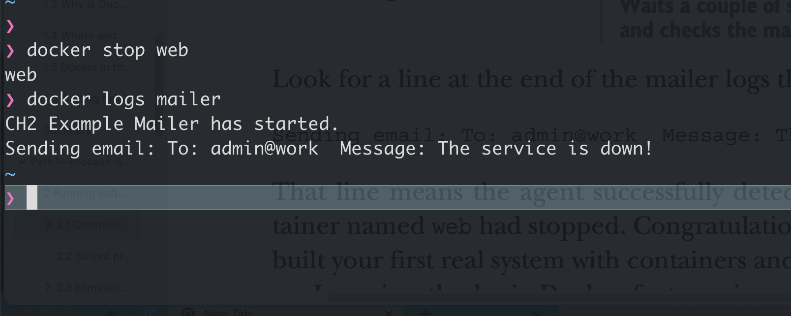
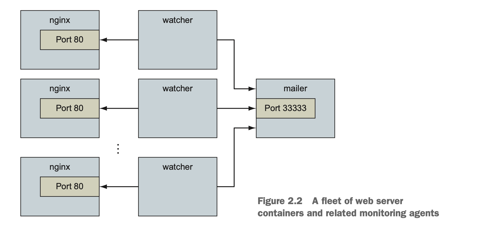

// Đây là note khi đọc lại cuốn docker in action lần 2

# Chap 1: Welcome to Docker


### 1.1: Intro
- Docker launch vào 2013
- Docker là tool, không phải ngôn ngữ hay fw
- Trong lịch sử, UNIX-style system có khái niêm `jail` để limit resource mà chương trình có thể access
- 2005, Solaris 10 và Solaris Container của Sun được release, đưa ra khái niệm container, để nâng quyền hạn truy cập resource của ứng dụng (kiểu cấp cho quyền nào thì đc access cái đó, không bị fix cứng như thằng `jail` nữa)
- Container của Sun dùng cũng ngon, nhưng có 1 số vấn đề:
    - Dùng phức tạp => người dùng hay config sai => gặp vấn đề về security

- Hình minh hoạ docker

- Image = shipable unit
- Container là instance của image
- Docker distribute (phân phối) các image này 1 cách dễ dàng thông qua `registries` và `indexes`. Có thể dùng luôn hàng có sẵn của docker là docker hub hoặc tự host 1 cái cho ngầu.

- Điểm mạnh của docker:
    - Tăng tính portable: vì dễ cài giống JVM
    - Bảo vệ máy tính đỡ rác, virus



### 1.2: Tại sao docker quan trọng?
- Docker cung cấp giải pháp abtract (?)
    - Thay vì phải quan tâm những thứ hoa lá cành như: cài phần mềm này thế nào thì chỉ cần quan tâm: cần cài phần mềm nào. Còn lại bố mày lo.
- Làm cho những ông lớn công nghệ như Amazon, Google, Microsoft ngồi lại với nhau, phát triển nhiều sản phẩm phục vụ open source hơn thay vì phát triển các giải pháp, dịch vụ riêng bên họ.
- Docker làm việc cài và gỡ app giống như trên app store trên điện thoại: thích thì cài, ko thích thì gỡ là xong.
- Docker không làm ảnh hưởng đến máy tính của bạn. Lỡ cài phần mềm nào ngu ngu thì xoá cmn đi là xong, nhẹ người.

### 1.3: Khi nào dùng docker?
- Docker chỉ run được app linux ở OS linux, app window ở Window server thôi
- Nếu muốn run app native ở MacOS hay Window thì chịu nhá.
- ... nói chung cũng xàm thôi, ko hay lắm.

## Part 1: Process isolation & environment-independent computing
- Isolation (độc lập) là concept quan trọng của rất nhiều computing pattern, resource management strategy.
- Cái khó nhất của việc áp dụng container là việc tìm xem phần mềm cần chạy trong container muốn isolate cái gì. Mỗi chương trình có các yêu cầu khác nhau.

# Chap 2: Running software in containers
Chap này cover:
- Chạy interactive (tương tác - tức là sẽ attach vào terminal) và deamon (tức là chạy ngầm) các chương trình trong container
- Một số lệnh docker cơ bản
- Isolate chương trình khỏi chương trình khác và đưa vào configuration
- Chạy nhiều chương trình trong 1 container
- Durable container (tức container chạy lâu dài) và container life cycle
- Cleaning up (dọn dẹp)

Trong chương này, sẽ dùng 1 chương trình gọi là Nginx - 1 con webserver nha.

## 2.1. Controlling container: xây dựng 1 website monitor
- Tưởng tượng rằng một ngày đẹp trời, khách hàng bước vào văn phòng của bạn và nói rằng:
    - Tao muốn có 1 website được monitored
    - Khi web down, cần email tới cho tụi tao biết
    - Mày nhớ dùng Nginx nhá, vì tao thấy nó đang hot thì phải.
- Cái mô hình trông đại khái thế này:


- Trong đó:
    - Con số 1 chạy Nginx
    - Con số 2 chạy mailer
    - Có số 3 chạy watcher
- Dưới đây bạn sẽ được học 1 số skill:
    - Tạo detached và interactive container
    - Liệt kê các container có trong hệ thống của bạn
    - Xem log của container
    - Stop và restart container
    - Reattach terminal vào 1 container
    - Detach từ 1 attached container

### 2.1.1: Tạo và start 1 container mới
- Docker gọi tập hợp các file và các chỉ dẫn để chạy 1 chương trình là image.
- Khi cài software thì thực ra chúng ta đang dùng Docker để tải image hoặc tạo ra 1 image.
- Image chi tiết hơn thì sẽ được cover ở chương 3. Tạm thời giờ cứ hiểu image là image, dùng để chạy chương trình là ok.
- Bây giờ chạy command sau:

```
docker run --detach --name web nginx:latest
```
- Giải thích:
    - Lệnh trên chạy 1 container tên là web, build dựa trên image có tên là `nginx` ở phiên bản mới nhất (`latest`)
    - `--detach` để chạy service dưới background
- Chạy thêm 1 container nữa ở background cho con mailer:
```
docker run -d --name mailer dockerinaction/ch2_mailer
```
### 2.1.2. Running interactive container (chạy container giao tiếp được)
- Ví dụ chạy 1 container interactive
```
docker run --interactive --tty --name web_test --link web:web busybox:1.29 /bin/sh
```
- Trong đó:
    - `--interactive --tty`: option để attach terminal hiện tại vào
    - `--link`: dùng để liên kết 2 con container vào với nhau (để gọi được tới nhau ấy)
- Bây giờ thử test gọi sang container web bằng lệnh `wget`:
```
wget -O - http://web:80/
```
- Sẽ thấy trả về HTML của nginx như hình dưới


- Bây giờ để làm nốt yêu cầu của khách hàng, ta chạy 1 container nữa:

```
docker run -it --name agent --link web:insideweb --link mailer:insidemailer dockerinaction/ch2_agent
```
- Sẽ thấy mỗi giây in ra dòng chữ `System up` như hình dưới


### 2.1.3. Liệt kê, dừng, restart và xem output của container
- Xem container đang chạy: `docker ps`
- Restart container: `docker restart {name}`
- Xem log: `docker logs {name}`

- Giờ thử dùng lệnh `docker logs web`, sẽ thấy output như hình:


- Bạn thấy log là do container `agent` đang gửi request sang để kiểm tra xem còn running hay không.
- Cách này dùng tạm thôi, vì nếu container chạy lâu dài mà cứ log như này thì không ổn (nhiều log quá)
    - Cách tốt hơn là sử dụng volumes, sẽ được discuss ở chap 4
- Thử log ở cả mailer và agent:


- TIP: thêm `--follow` hoặc `-f` vào thì sẽ watch log của container và in ra. Bình thường không có thì nó chỉ in ra log tới thời điểm gọi thôi.

- Để stop container: `docker stop {name}`
- Ví dụ stop con web: `docker stop web`
    - Khi tail log sẽ thấy thế này:


- OK. Như vậy là đã detect được khi NGINX server down, client vui rồi.
- Học feature cơ bản của docker là một chuyện, nhưng hiểu tại sao nó hữu ích, cách sử dụng và customize nó cho các task khác nhau mới là chuyện khó & hay.

## 2.2 Solve problems and the PID namespace
- Chương này nói về vấn đề PID trong UNIX:
    - Đại khái ở hệ điều hành Linux thì mỗi chương trình đều có 1 PID khác nhau
    - Nếu 2 container cùng chạy mà trùng PID -> cái chạy sau sẽ không run lên được
    - Docker resolve vấn đề này bằng cách dùng namespace trong Linux

## 2.3. Loại bỏ xung đột: xây dựng 1 bộ các website
- Thử lấy 1 ví dụ khác:
    - Client muốn build 1 hệ thống có thể tự dựng rất nhiều website cho khách hàng của họ.
    - Client cũng muốn dùng lại công nghệ monitor dùng ở chap trước.
- Bạn có thể nghĩ: đơn giản vl, nhân lên là xong như hình dưới



- Tuy nhiên, sự thật phức tạp hơn những gì bạn nghĩ

### 2.3.1: Flexible container identification (Đặt ID container động)
- Thử chạy nhiều con web xem sao:
```
docker run -d --name webid nginx
docker run -d --name webid nginx
```
- Sẽ gặp lỗi thế này:
```
FATA[0000] Error response from daemon: Conflict. The name "webid" is
already in use by container 2b5958ba6a00. You have to delete (or rename)
that container to be able to reuse that name.
```
- Có thể đổi tên lại container là lại chạy được bth:
```
docker rename webid webid-old
docker run -d --name webid nginx
```
- Tuy nhiên, việc rename này có ít thì còn dùng được, nhiều thì ko dùng được.
- Solution thì có thể dùng luôn id của docker generate ra là được.

```
CID = $(docker create nginx:latest)
echo $CID
```
- Dùng shell variable thì cũng được, mà nó chỉ dùng được trong terminal session hiện tại thôi, mở 1 cái terminal khác là chịu.
- Docker hỗ trợ option cidfile để lưu cái id của container vào file

```
docker create --cidfile /tmp/web.cid nginx
cat /tmp/web.cid
```
- Lưu ý là nếu file web.cid trong vd trên mà tồn tại rồi thì docker sẽ báo lỗi nhé.
- Như VD của khách hàng cần, anh em có thể dùng chiến thuật thế này:
    - Dựng 1 cái pattern cho cid file, vd: /container/web/customer{id}/web.cid
    - VD khách hàng số 8 thì cid file sẽ lưu ở /container/web/customer8/web.cid

### 2.3.2. Container state & dependencies
- Các state của container


- Đến thời điểm hiện tại thì script của chúng ta trông như này:

```
MAILER_CID=$(docker run -d dockerinaction/ch2_mailer)
WEB_CID=$(docker create nginx)
AGENT_CID=$(docker create --link $WEB_CID:insideweb --link $MAILER_CID:insidemailer dockerinaction/ch2_agent)
```

- 2 container WEB_CID và AGENT_CID sẽ chưa chạy luôn, mà chỉ create để đó thôi.
- Nếu gõ `docker ps` thì sẽ không thấy ngay đâu, vì docker ps chỉ hiển thị các container running thôi.
    - Muốn xem tất thì dùng `docker ps -a` nhé.
- Giờ gõ:
```
docker start $AGENT_CID
docker start $WEB_CID
```

- khi chạy thì sẽ hiển thị ra lỗi, đại khái như này:
```

Error response from daemon: Cannot start container 03e65e3c6ee34e714665a8dc4e33fb19257d11402b151380ed4c0a5e38779d0a: Cannot link to a non running container: /clever_wright AS /modest_hopper/insideweb FATA[0000] Error: failed to start one or more containers
```
- Lí do: do container AGENT_CID phụ thuộc vào WEB_CID => muốn start được agent lên thì chạy con web lên trước đã.
    - Solution là đổi thứ tự chạy lại là được

```
docker start $WEB_CID
docker start AGENT_CID
```
- Hiểu sâu hơn tại sao:
    - Bản chất việc link là dựa vào IP address.
    - Nếu 1 container chưa được start => làm méo gì có IP mà link được.
- Feature link là feature cũ, may be sẽ bị gỡ trong các version tiếp theo của Docker
    - Việc học con link này chỉ để hiểu sâu hơn nó work thế nào thôi.

- Đến lúc này, ae có thể sửa script lại chạy cho ngon:

```
MAILER_CID = $(docker run - d dockerinaction/ch2_mailer)
WEB_CID=$(docker run -d nginx)
AGENT_CID=$(docker run -d --link $WEB_CID:insideweb --link $MAILER_CID:insidemailer dockerinaction/ch2_agent)
```
- Về cơ bản thì script của bạn ngon vkl rồi. Sau này có site mới thì cứ cầm script run lên là xong.
- Client cảm ơn bạn về web và hệ thống monitor. Tuy nhiên, mọi thứ lại thay đổi:
    - Họ dự định build website với Wordpress.
    - Wordpress thì có sẵn image trên dockerhub rồi.
    - Bạn cần build 1 hệ thống ít phụ thuộc vào môi trường nhất có thể