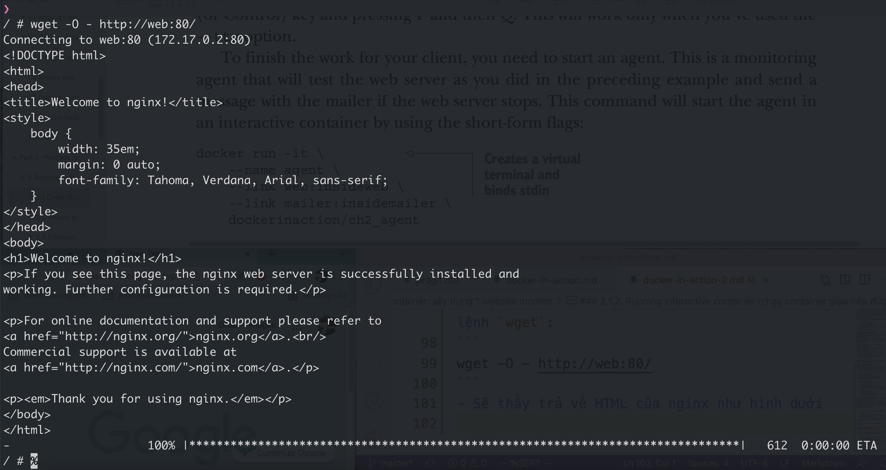
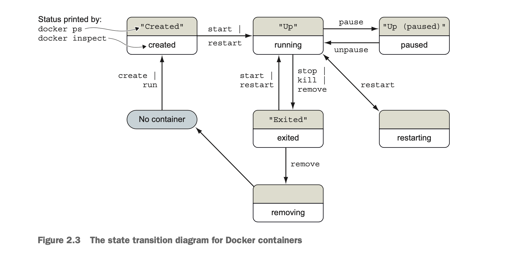

// Đây là note khi đọc lại cuốn docker in action lần 2

# Chap 1: Welcome to Docker


### 1.1: Intro
- Docker launch vào 2013
- Docker là tool, không phải ngôn ngữ hay fw
- Trong lịch sử, UNIX-style system có khái niêm `jail` để limit resource mà chương trình có thể access
- 2005, Solaris 10 và Solaris Container của Sun được release, đưa ra khái niệm container, để nâng quyền hạn truy cập resource của ứng dụng (kiểu cấp cho quyền nào thì đc access cái đó, không bị fix cứng như thằng `jail` nữa)
- Container của Sun dùng cũng ngon, nhưng có 1 số vấn đề:
    - Dùng phức tạp => người dùng hay config sai => gặp vấn đề về security

- Hình minh hoạ docker

- Image = shipable unit
- Container là instance của image
- Docker distribute (phân phối) các image này 1 cách dễ dàng thông qua `registries` và `indexes`. Có thể dùng luôn hàng có sẵn của docker là docker hub hoặc tự host 1 cái cho ngầu.

- Điểm mạnh của docker:
    - Tăng tính portable: vì dễ cài giống JVM
    - Bảo vệ máy tính đỡ rác, virus


### 1.2: Tại sao docker quan trọng?
- Docker cung cấp giải pháp abtract (?)
    - Thay vì phải quan tâm những thứ hoa lá cành như: cài phần mềm này thế nào thì chỉ cần quan tâm: cần cài phần mềm nào. Còn lại bố mày lo.
- Làm cho những ông lớn công nghệ như Amazon, Google, Microsoft ngồi lại với nhau, phát triển nhiều sản phẩm phục vụ open source hơn thay vì phát triển các giải pháp, dịch vụ riêng bên họ.
- Docker làm việc cài và gỡ app giống như trên app store trên điện thoại: thích thì cài, ko thích thì gỡ là xong.
- Docker không làm ảnh hưởng đến máy tính của bạn. Lỡ cài phần mềm nào ngu ngu thì xoá cmn đi là xong, nhẹ người.

### 1.3: Khi nào dùng docker?
- Docker chỉ run được app linux ở OS linux, app window ở Window server thôi
- Nếu muốn run app native ở MacOS hay Window thì chịu nhá.
- ... nói chung cũng xàm thôi, ko hay lắm.

## Part 1: Process isolation & environment-independent computing
- Isolation (độc lập) là concept quan trọng của rất nhiều computing pattern, resource management strategy.
- Cái khó nhất của việc áp dụng container là việc tìm xem phần mềm cần chạy trong container muốn isolate cái gì. Mỗi chương trình có các yêu cầu khác nhau.

# Chap 2: Running software in containers
Chap này cover:
- Chạy interactive (tương tác - tức là sẽ attach vào terminal) và deamon (tức là chạy ngầm) các chương trình trong container
- Một số lệnh docker cơ bản
- Isolate chương trình khỏi chương trình khác và đưa vào configuration
- Chạy nhiều chương trình trong 1 container
- Durable container (tức container chạy lâu dài) và container life cycle
- Cleaning up (dọn dẹp)

Trong chương này, sẽ dùng 1 chương trình gọi là Nginx - 1 con webserver nha.

## 2.1. Controlling container: xây dựng 1 website monitor
- Tưởng tượng rằng một ngày đẹp trời, khách hàng bước vào văn phòng của bạn và nói rằng:
    - Tao muốn có 1 website được monitored
    - Khi web down, cần email tới cho tụi tao biết
    - Mày nhớ dùng Nginx nhá, vì tao thấy nó đang hot thì phải.
- Cái mô hình trông đại khái thế này:


- Trong đó:
    - Con số 1 chạy Nginx
    - Con số 2 chạy mailer
    - Có số 3 chạy watcher
- Dưới đây bạn sẽ được học 1 số skill:
    - Tạo detached và interactive container
    - Liệt kê các container có trong hệ thống của bạn
    - Xem log của container
    - Stop và restart container
    - Reattach terminal vào 1 container
    - Detach từ 1 attached container

### 2.1.1: Tạo và start 1 container mới
- Docker gọi tập hợp các file và các chỉ dẫn để chạy 1 chương trình là image.
- Khi cài software thì thực ra chúng ta đang dùng Docker để tải image hoặc tạo ra 1 image.
- Image chi tiết hơn thì sẽ được cover ở chương 3. Tạm thời giờ cứ hiểu image là image, dùng để chạy chương trình là ok.
- Bây giờ chạy command sau:

```
docker run --detach --name web nginx:latest
```
- Giải thích:
    - Lệnh trên chạy 1 container tên là web, build dựa trên image có tên là `nginx` ở phiên bản mới nhất (`latest`)
    - `--detach` để chạy service dưới background
- Chạy thêm 1 container nữa ở background cho con mailer:
```
docker run -d --name mailer dockerinaction/ch2_mailer
```
### 2.1.2. Running interactive container (chạy container giao tiếp được)
- Ví dụ chạy 1 container interactive
```
docker run --interactive --tty --name web_test --link web:web busybox:1.29 /bin/sh
```
- Trong đó:
    - `--interactive --tty`: option để attach terminal hiện tại vào
    - `--link`: dùng để liên kết 2 con container vào với nhau (để gọi được tới nhau ấy)
- Bây giờ thử test gọi sang container web bằng lệnh `wget`:
```
wget -O - http://web:80/
```
- Sẽ thấy trả về HTML của nginx như hình dưới


- Bây giờ để làm nốt yêu cầu của khách hàng, ta chạy 1 container nữa:

```
docker run -it --name agent --link web:insideweb --link mailer:insidemailer dockerinaction/ch2_agent
```
- Sẽ thấy mỗi giây in ra dòng chữ `System up` như hình dưới


### 2.1.3. Liệt kê, dừng, restart và xem output của container
- Xem container đang chạy: `docker ps`
- Restart container: `docker restart {name}`
- Xem log: `docker logs {name}`

- Giờ thử dùng lệnh `docker logs web`, sẽ thấy output như hình:


- Bạn thấy log là do container `agent` đang gửi request sang để kiểm tra xem còn running hay không.
- Cách này dùng tạm thôi, vì nếu container chạy lâu dài mà cứ log như này thì không ổn (nhiều log quá)
    - Cách tốt hơn là sử dụng volumes, sẽ được discuss ở chap 4
- Thử log ở cả mailer và agent:


- TIP: thêm `--follow` hoặc `-f` vào thì sẽ watch log của container và in ra. Bình thường không có thì nó chỉ in ra log tới thời điểm gọi thôi.

- Để stop container: `docker stop {name}`
- Ví dụ stop con web: `docker stop web`
    - Khi tail log sẽ thấy thế này:


- OK. Như vậy là đã detect được khi NGINX server down, client vui rồi.
- Học feature cơ bản của docker là một chuyện, nhưng hiểu tại sao nó hữu ích, cách sử dụng và customize nó cho các task khác nhau mới là chuyện khó & hay.

## 2.2 Solve problems and the PID namespace
- Chương này nói về vấn đề PID trong UNIX:
    - Đại khái ở hệ điều hành Linux thì mỗi chương trình đều có 1 PID khác nhau
    - Nếu 2 container cùng chạy mà trùng PID -> cái chạy sau sẽ không run lên được
    - Docker resolve vấn đề này bằng cách dùng namespace trong Linux

## 2.3. Loại bỏ xung đột: xây dựng 1 bộ các website
- Thử lấy 1 ví dụ khác:
    - Client muốn build 1 hệ thống có thể tự dựng rất nhiều website cho khách hàng của họ.
    - Client cũng muốn dùng lại công nghệ monitor dùng ở chap trước.
- Bạn có thể nghĩ: đơn giản vl, nhân lên là xong như hình dưới


- Tuy nhiên, sự thật phức tạp hơn những gì bạn nghĩ

### 2.3.1: Flexible container identification (Đặt ID container động)
- Thử chạy nhiều con web xem sao:
```
docker run -d --name webid nginx
docker run -d --name webid nginx
```
- Sẽ gặp lỗi thế này:
```
FATA[0000] Error response from daemon: Conflict. The name "webid" is
already in use by container 2b5958ba6a00. You have to delete (or rename)
that container to be able to reuse that name.
```
- Có thể đổi tên lại container là lại chạy được bth:
```
docker rename webid webid-old
docker run -d --name webid nginx
```
- Tuy nhiên, việc rename này có ít thì còn dùng được, nhiều thì ko dùng được.
- Solution thì có thể dùng luôn id của docker generate ra là được.

```
CID = $(docker create nginx:latest)
echo $CID
```
- Dùng shell variable thì cũng được, mà nó chỉ dùng được trong terminal session hiện tại thôi, mở 1 cái terminal khác là chịu.
- Docker hỗ trợ option cidfile để lưu cái id của container vào file

```
docker create --cidfile /tmp/web.cid nginx
cat /tmp/web.cid
```
- Lưu ý là nếu file web.cid trong vd trên mà tồn tại rồi thì docker sẽ báo lỗi nhé.
- Như VD của khách hàng cần, anh em có thể dùng chiến thuật thế này:
    - Dựng 1 cái pattern cho cid file, vd: /container/web/customer{id}/web.cid
    - VD khách hàng số 8 thì cid file sẽ lưu ở /container/web/customer8/web.cid

### 2.3.2. Container state & dependencies
- Các state của container


- Đến thời điểm hiện tại thì script của chúng ta trông như này:

```
MAILER_CID=$(docker run -d dockerinaction/ch2_mailer)
WEB_CID=$(docker create nginx)
AGENT_CID=$(docker create --link $WEB_CID:insideweb --link $MAILER_CID:insidemailer dockerinaction/ch2_agent)
```

- 2 container WEB_CID và AGENT_CID sẽ chưa chạy luôn, mà chỉ create để đó thôi.
- Nếu gõ `docker ps` thì sẽ không thấy ngay đâu, vì docker ps chỉ hiển thị các container running thôi.
    - Muốn xem tất thì dùng `docker ps -a` nhé.
- Giờ gõ:
```
docker start $AGENT_CID
docker start $WEB_CID
```

- khi chạy thì sẽ hiển thị ra lỗi, đại khái như này:
```

Error response from daemon: Cannot start container 03e65e3c6ee34e714665a8dc4e33fb19257d11402b151380ed4c0a5e38779d0a: Cannot link to a non running container: /clever_wright AS /modest_hopper/insideweb FATA[0000] Error: failed to start one or more containers
```
- Lí do: do container AGENT_CID phụ thuộc vào WEB_CID => muốn start được agent lên thì chạy con web lên trước đã.
    - Solution là đổi thứ tự chạy lại là được

```
docker start $WEB_CID
docker start AGENT_CID
```
- Hiểu sâu hơn tại sao:
    - Bản chất việc link là dựa vào IP address.
    - Nếu 1 container chưa được start => làm méo gì có IP mà link được.
- Feature link là feature cũ, may be sẽ bị gỡ trong các version tiếp theo của Docker
    - Việc học con link này chỉ để hiểu sâu hơn nó work thế nào thôi.

- Đến lúc này, ae có thể sửa script lại chạy cho ngon:

```
MAILER_CID = $(docker run - d dockerinaction/ch2_mailer)
WEB_CID=$(docker run -d nginx)
AGENT_CID=$(docker run -d --link $WEB_CID:insideweb --link $MAILER_CID:insidemailer dockerinaction/ch2_agent)
```
- Về cơ bản thì script của bạn ngon vkl rồi. Sau này có site mới thì cứ cầm script run lên là xong.
- Client cảm ơn bạn về web và hệ thống monitor. Tuy nhiên, mọi thứ lại thay đổi:
    - Họ dự định build website với Wordpress.
    - Wordpress thì có sẵn image trên dockerhub rồi.
    - Bạn cần build 1 hệ thống ít phụ thuộc vào môi trường nhất có thể

## 2.4. Building environment-agnostic systems
- Việc xây dựng 1 hệ thống ít phụ thuộc vào môi trường là rất quan trọng.
- Docker cung cấp 3 tính năng cho việc này:
    - Read-only filesystem
    - Environment variable injection
    - Volumes

- Volume thì sẽ được học ở Chap 4. Giờ học trước 2 cái đầu nha.
- Giờ tưởng tượng là chúng ta cần dùng thêm MySQL cho hệ thống web wordpress.
    - Web của chúng ta sẽ chỉ ghi vào MySQL thôi, k ghi ra container nữa, nên ta sẽ dùng Read-only file system để tránh ghi thêm vào đâu nữa.

### 2.4.1. Read-only filesystems
- Thử run container ở ready only mode:

```
docker run -d --name wp --read-only wordpress:5.0.0-php7.2-apache
```
- Thử check xem container có running hay không:

```
docker inspect --format "{{.State.Running}}" wp
```
- Quả này log ra false. Check log thử coi sao:
```
docker logs wp
```

- Sẽ nhả log ra thế này:
```

WordPress not found in /var/www/html - copying now...
Complete! WordPress has been successfully copied to /var/www/html
... skip output ...
Wed Dec 12 15:17:36 2018 (1): Fatal Error Unable to create lock file: ↵ Bad file descriptor (9)
```
- Vấn đề:
    - Đại khái là con apache lúc run lên thì nó cần tạo ra 1 file, gọi là lock file.
    - Container lại run ở mode read-only => ghi fail => error
- Mà giờ lại có 1 vấn đề nữa:
    - container ghi 1 file cho apache, mà không nói file này ở đâu
    - => làm sao ta có thể tạo exception cho nó được
    - Solution: dùng command docker diff để check:

- Thực hiện:
    - Run 1 container writeable lên:
    ```
    docker run --name writeable_wp wordpress:5.0.0-php7.2-apache
    ```
    - Chạy lệnh diff:
    ```
    docker container diff wp_writeable
    ```
        - Sẽ thấy log ra như sau:
        ```
        C /run
        C /run/apache2
        A /run/apache2/apache2.pid
        ```
    - Command diff sẽ được giải thích chi tiết ở chapter 3
    - Giờ sẽ mount 1 folder từ host vào để apache trong container write được lock file
        - Ngoài ra cũng cần cung cấp in-memory system file để apache chạy nữa
    ```
    docker run -d --name wp2 --read-only -v /run/apache2/ --tmpfs /tmp wordpress:5.0.0-php7.2-apache
    ```
- Chạy command trên thì container chạy ngon lành rồi
```
docker logs wp2
WordPress not found in /var/www/html - copying now...
Complete! WordPress has been successfully copied to /var/www/html
... skip output ...
[Wed Dec 12 16:25:40.776359 2018] [mpm_prefork:notice] [pid 1] ↵
AH00163: Apache/2.4.25 (Debian) PHP/7.2.13 configured -- ↵
resuming normal operations
[Wed Dec 12 16:25:40.776517 2018] [core:notice] [pid 1] ↵
AH00094: Command line: 'apache2 -D FOREGROUND'
```

- Wordpress thì cũng có liên quan đến con MySQL
```
docker run -d --name wpdb -e MYSQL_ROOT_PASSWORD=ch2demo mysql:5.7
```
- Như vậy cần link đến con MySQL để con wp chạy được:
```
docker run -d --name wp3 --link wpdb:mysql -p 8080:80 --read-only -v /run/apache2/ --tmpfs /tmp wordpress:5.0.0-php7.2-apache
```
- Kiểm tra xem container có chạy hay không:
```
docker inspect --format "{{.State.Running}}" wp3
```
- Bây giờ, script cài đặt của bạn đã được thay đổi:

```bash
DB_CID=$(docker create -e MYSQL_ROOT_PASSWORD=ch2demo mysql5.7)
docker start $DB_CID

MAILER_CID =$(docker create dockerinaction/ch2_mailer)
docker start $MAILER_CID

WP_CID=$(docker create --link $DB_CID:mysql -p 80 --read-only -v /run/apache2/ --tmpfs /tmp wordpress:5.0.0-php7.2-apache)
docker start $WP_CID

AGENT_CID = $(docker create --link $WP_CID:insideweb --link $MAILER_CID:insidemailer dockerinaction/ch2_agent)

docker start $AGENT_CID
```

- OK. Đến giờ mọi chuyện cũng ổn: bạn có 1 container WP read-only đang chạy, ghi dữ liệu vào 1 container khác. 
- Design này vẫn còn 2 vấn đề:
    - 1: wp container và mysql container đang chạy trên cùng 1 máy
    - 2: wp đang dùng 1 số setting default quan trọng như: admin pass, admin user, db salt,... => dễ bị lộ
- Để giải quyết vấn đề trên, dùng Environment variable

### 2.4.2: Environment variable injection
- Để dùng env var thì image của container phải support env var.
- Wordpress container có support variable:
    - WORDPRESS_DB_HOST
    - WORDPRESS_DB_USER
    - WORDPRESS_DB_PASSWORD
    - WORDPRESS_DB_NAME
    - ....

- Ví dụ mà muốn connnect đến 1 máy khác chứa db thì chạy như này:
```
docker create --env WORDPRESS_DB_HOST=<db_host_name> wordpress:5.0.0-php7.2-apache
```
- Sử dụng environment variable giúp bạn tách biệt được mối quan hệ vật lý (cùng 1 máy tính) giữa container wordpress và MySQL.
- Script lúc này trông như sau:

```
#!/bin/sh
if [ ! -n "$CLIENT_ID" ]; then
 echo "Client ID not set"
 exit 1
fi
WP_CID=$(docker create \
 --link $DB_CID:mysql \
 --name wp_$CLIENT_ID \
 -p 80 \
 --read-only -v /run/apache2/ --tmpfs /tmp \
 -e WORDPRESS_DB_NAME=$CLIENT_ID \
 --read-only wordpress:5.0.0-php7.2-apache)
docker start $WP_CID

AGENT_CID=$(docker create \
 --name agent_$CLIENT_ID \
 --link $WP_CID:insideweb \

 --link $MAILER_CID:insidemailer \
 dockerinaction/ch2_agent)
docker start $AGENT_CID
```
- Muốn run thì chạy lệnh:
```
CLIENT_ID=dockerinaction ./start-wp-multiple-clients.sh
```

## 2.5 Building durable containers
- Thi thoảng software có thể bị crash khi gặp 1 số điều kiện hiếm gặp cụ thể.
- Con watcher build ở chương trước giúp detect được container down, nhưng mà nó không giúp restore service.

### 2.5.1: Automatically restarting containers
- docker có option `--restart` ở lúc tạo container để giúp container có thể tự restart nếu gặp lỗi.
- default thì docker để là never restart
    - lí do: vì nhiều khi việc restart không những không giải quyết được vấn đề mà còn làm vấn đề phức tạp lên.
- Khi restart thì docker dùng backoff strategy, kiểu sẽ tăng thời gian lên theo hàm số mũ (2, 4, 8, 16,... giây)


### 2.5.2: Sử dụng PID 1 và init systems
- `init system` là chương trình sử dụng để chạy và maintain state của chương trình khác.
- process nào có id là 1 đều được coi là init process (kể cả về lí thuyết, nó không phải là init process đi chăng nữa)
- init process:
    - start các process khác
    - restart chúng trong trường hợp có fail
    - transform và forward signal gửi bởi OS
    - Ngăn việc resource leak.
## 2.6: Cleaning up
- docker rm <container-name>
- container đang chạy thì không dừng được. Muốn dừng thì có 2 cách:
    - dùng `-f`: force, sẽ gửi SIG_KILL, container dừng luôn
    - stop lại trước (docker stop): sẽ gửi SIG_HUP, container sẽ có thời gian xử lý trước khi xoá (dạng graceful shutdown)
- Đối với 1 số container tạo ra để trải nghiệm chơi, có thể để nó tự xoá bằng cách thêm --rm vào:
```
docker run --rm --name auto-exit-test busybox:1.29 echo Hello World
docker ps -a
```

## Tóm tắt các nội dung đã được học của chương:
- Container có thể run attach vào terminal hoặc run ở detach mode (background)
- Mặc định, tất cả các container của Docker đều có PID namespace riêng, isolate process với các conainer khác.
- Docker phân biệt các container dựa vào id, hoặc name
- Có 6 trạng thái của container: created, running, restarting, paused, removing, exited
- `docker exec` command có thể dùng để chạy process run bên trong của container.
- Có thể truyền thêm input hoặc config thông qua environment variable lúc container creation.
- Sử dụng `--read-only` để container chỉ đọc
- Sử dụng `--restart` để cấu hình container restart theo ý muốn.
- Có thể clean up các image không sử dụng bằng command `docker rm`

## Chap 3: Software installation simplified
- Chương này nói về:
    - Cài đặt phần mềm
    - Tìm & cài ở Docker hub
    - Cài ở source khác
    - Hiểu về filesystem isolation
    - Làm việc với images và layers

- Các phần mềm được distribute thông qua image.
- Để nói cho docker biết image nào bạn muốn sử dụng, cần đưa ra các thông số như:
    - repo nào
    - tag nào (phiên bản nào)
- Chap này nói về layer nữa. Khá quan trọng để build được 1 con image xịn nên chú ý vào.

## 3.1. Identitfying software
- Đoạn này ko quan trọng lắm, đại khái nói về software đang ở host nào

## 3.2. Finding & installing software
- Mục này đại khái nói về config registries ở terminal để dùng đúng (kiểu tự host 1 cái docker registry private chẳng hạn)
- Dùng 1 registry riêng thì có thể theo cú pháp này:

```
docker pull [REGISTRYHOST:PORT/][USERNAME/]NAME[:TAG]

VD:
docker pull quay.io/dockerinaction/ch3_hello_registry:latest
```
- Sau khi dùng xong, có thể remove image đi:
```
docker rmi quay.io/dockerinaction/ch3_hello_registry
```
- command `docker load` để load image từ file vào trong Docker
- Để lưu 1 image vào file, dùng command `docker save`
```
docker pull busybox:latest
docker save -o myfile.tar busybox:latest
```
- Nhìn chung đoạn trên nói về việc sử dụng file để đóng gói và sharing docker image (docker save & docker load). Cái này hiện ko xài nữa đâu.

### 3.2.4: Cài image từ dockerfile
- Về mặt kĩ thuật thì cách này bạn ko cài 1 image, mà là bạn làm theo hướng dẫn để build 1 con image (chi tiết sẽ có ở chương 7).
- Distribute image tương tự như việc distribute file vậy. Có cái nó sẽ nhỏ gọn hơn nhiều.
- Cách này có 2 nhược điểm:
    - Thứ 1: tuỳ từng project, thời gian build có thể sẽ lâu
    - Thứ 2: kết quả build ra có thể khác nhau giữa các máy khác nhau (VD như build phụ thuộc vào version lúc đó. Giống image của con openresty ấy, toàn bị outdate/ tác giả remove cmn đi rồi => run ko lên được)
- Dù có nhược điểm, nhưng cách này hiện vẫn đang là cách phổ thông vkl nhé ae.

#### Activity
- Chỗ này có 1 activity nho nhỏ: tìm password
- Đại khái cho 1 repo: `docker run -it --rm dockerinaction/ch3_ex2_hunt`
- Chạy con này lên sẽ dòi pass. Tìm pass và điền vào.
- Tìm pass bằng cách chạy container khác lên:`docker run -it --rm dockerinaction/ch3_huntanswer`
    - Kĩ năng chỗ này là vào docker hub để tìm file chứ ko có vẹo gì cả.

### 3.3. Installation file & isolation
