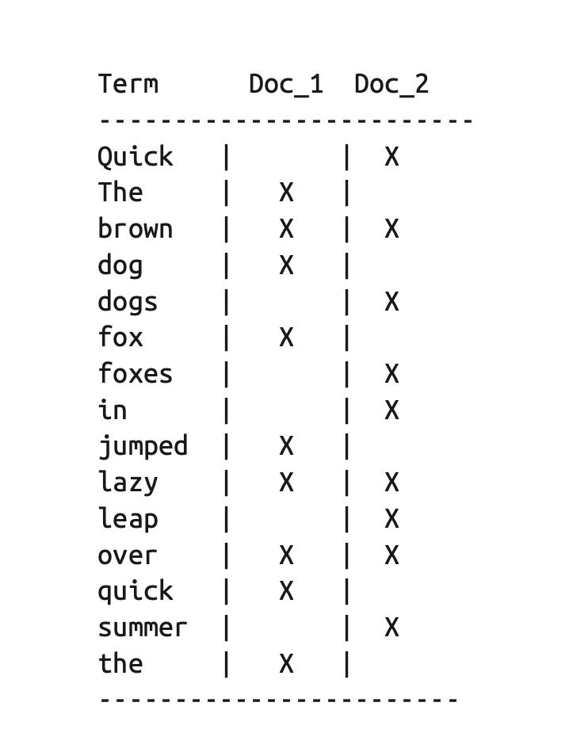
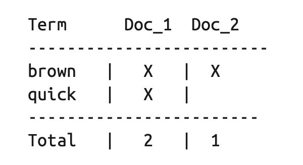
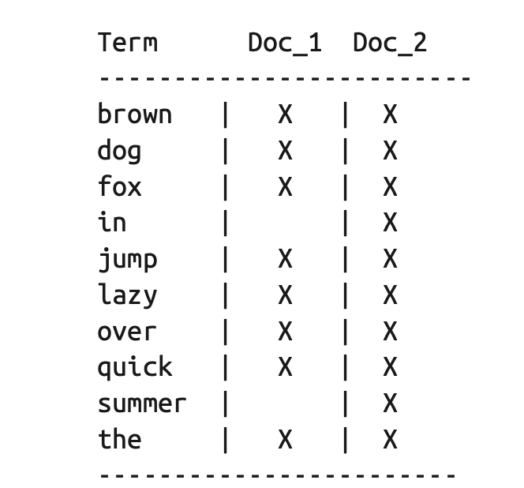

# Elastic Search - The definitive guide
> Mình note lại những ý chính mà mình đọc hiểu được. Recommend bạn nên đọc bản gốc của tác giả để có 1 góc nhìn đầy đủ hơn.

> Bản mình đọc ở version khá cổ đại (1.4) => cân nhắc cập nhật kiến thức hiện tại trước khi áp dụng

# Chap 1: You know, for search...
- ES là 1 opensource search engine, built on top của Apache Lucene.
- ES giúp simplify Lucene.

# Chap 2: Life inside a cluster

# Chap 3: Data in, data out
- Ứng dụng làm gì đi nữa thì cuối cùng vẫn là làm việc với data
- Data sẽ có ý nghĩa hơn nếu ta biết mối quan hệ giữa chúng
- Các data có cấu trúc khác nhau:
    - VD:
        - Có người có cell phone; có người có home phone, có người có cả 2
        - Người Tây Ba Nha có thể có 2 last name; nhưng người Anh thì chỉ có 1
- Traditional database thường giống spreadsheet, nên việc data flexible thường khó (do dung lượng bộ nhớ có hạn; cứ thêm field vào mà lưu trữ dư thừa => sml)
- Nếu lưu ở dạng object -> tiết kiệm hơn
- ES là distributed document store
- Mặc định, tất cả các field trong ES đều được index để tìm cho nhanh.

## Document metadata
- Index: Nơi document được lưu
- Type: Loại object mà document biểu thị
- Id: id của document

## Indexing document
- Mặc định ES tự gen id (22 char, url safe, base64 encoded, uuid). Nếu muốn own id thì đưa id vào url:
```
PUT /{index}/{type}/{id}
{
    "field": "value"
}
```
- Lấy dữ liệu

```
GET /{index}/{type}/{id}
GET /{index}/{type}/{id}?_source=title,text // lấy vài field
GET /{index}/{type}/{id}?_source // chỉ lấy source, không lấy meta data
```

- Check doc exist: dùng method HEAD
```
HEAD /{index}/{type}/{id}
res = 200 => exist
res = 404 => not exist
```

- Update toàn bộ document
```
PUT /{index}/{type}/{id}

{
    // document source
}
-> response sẽ có 2 field quan trọng: _version, created
{
    "_index": "blog",
    "type": "comment",
    "_id": 123,
    "_version": 2, // tăng version lên 1
    "created": false // = false vì doc này tồn tại rồi
}
```
- Thực ra ES sẽ xoá document này đi, thêm doc mới chứ ko update vào doc hiện tại.
- Tí sẽ đọc cái update 1 phần, tuy nhiên update 1 phần diễn ra thế này:
    - lấy doc cũ
    - update data vào
    - delete doc cũ đi
    - insert & index doc mới vào

## Creating new document
- Như trên thì biết là dùng 
```
POST /{index}/{type}/
```
- Tuy nhiên nhiều trường hợp:
    - Đã biết id
    - Muốn nếu có rồi thì ko insert nữa mà trả về 409 conflict

```
PUT /{index}/{type}/{id}?op_type=create
PUT /{index}/{type}/{id}/_create
```

## Delete document
```
DELETE {index}/{type}/{id}

exist -> 200
not exist -> 404
```
- Lưu ý là khi delete thì version response về vẫn tăng nha.

## Dealing with conflict
- Có 2 cách:
 - Lock resource lại
 - Optimize lại luồng concurrency: cung cấp cơ chế detect conflict

- Trong es dùng version để detect (truyền current version vào)
```
PUT /{index}/{type}/{id}?version=xxx

- Dùng external version:
    - Trong case dùng DB khác làm DB chính, sync sang es để search thôi
    - => khi sync từ A => B, multiple process có thể làm data bị sai
    - => dùng version bằng time updated_at (unix) cho nó chuẩn

```
PUT /{index}/{type}/{id}?version={version_from_external}&version_type=external

# Chap 4: Distributed document store
// TOREAD & TONOTE

# Chap 5: Searching - The Basic Tool
## Empty search
- Trả về tất cả các document trong cluster
```
GET /_search
```
- Có mấy thông số quan trọng:
    - hit: tổng số document
    - took: thời gian search
    - shards: số shard tham gia vào quá trình search; bao nhiêu success, bao nhiêu fail
    - timeout: true/false - có bị timeout ko.
- Có thể định nghĩa timeout vào
```
GET /_search?timeout=10ms
```
## Multi-index, multitype

```
/_search - search all
/gb/_search - search ở index gb
/gb,us/_search - search ở index gb,us
/g*,u*/_search - search ở index bắt đầu bằng g và u
/gb/user/_search - search ở index gb và type user
/gb,us/user,tweet/_search - search ở index gb
/_all/user,tweet/_search
```

## Pagination

```
/gb/_search?size=5&from=10
```
- Kết quả được sort ở mỗi shard, sau đó return về trung tâm để kết quả chính xác => lượng kết quả nhiều vkl => nên limit khoảng 10,000 thôi.

## Search lite

```
GET /_all/tweet/_search?q=tweet:elasticsearch
```
Có thể dùng + cho must, - cho must not

```
GET /_search?q=+name:john
GET /_search?q=-name:john
```

### _all field
- Mặc định ES sẽ convert giá trị tất cả các field thành string, sau đó đưa vào field `_all` chứa metadata.
- Đầu tiên mới build app, bạn cũng méo biết cần dùng field nào => cái _all này thật sự là hữu ích.
- Sau khi app bạn chạy ngon rồi, bạn search đúng chính xác field thì sau đó disable field _all này đi cũng chưa muộn

### Query phức tạp hơn
- Query lite có thể query phức tạp hơn tí. Nhưng bt người ta méo làm thế đâu, search trong body cho khoẻ. Biết cho vui thôi.
- VD muốn search:
    - field `name` bao gồm john hoặc mary
    - field `date` lớn hơn `2021-09-09`
    - field `_all` bao gồm từ phong hoặc daicaphong

```
?q=+name:(mary john) +date:>2021-09-09 +(phong daicaphong)
```

# Chap 6: Mapping & analysis
- Lấy ví dụ với việc có 12 document có chứa text: `2021-09-09`
- Lúc search ra kết quả khác nhau:
```
GET /_search?q=2021             // 12 result
GET /_search?q=2021-09-09       // 12 result
GET /_search?q=date:2021-09-09  // 1 result
GET /_search?q=2021             // 0 result
GET /_search?q=2014
```
- Mặc định ES sẽ đoán kiểu dữ liệu, sau đó tạo mapping (trường hợp mapping chưa có)

## Exact value vs full text
- Exact value = value chính xác (VD: Foo khác với foo)
- Full text hay còn gọi là textual data, viết ở human language.
- Full text thường được gọi là unstructured data, thường xuất hiện trong ngôn ngữ tự nhiên.
- Full text thường phức tạp nên khó để máy tính parse đúng.
 - VD: `May is fun but June bores me`. => nói về tháng hay tên người ?

- Exact value thì query dễ, giống WHERE trong MySQL vậy:
```
WHERE name    = "John Smith"
      AND user_id = 2
      AND date    > "2014-09-15"
```

- Full text value thì query khó hơn:
 - chúng ta không chỉ muốn tìm document có match query không, mà còn muốn tìm document match query thế nào nữa.
 - Ngoài ra ta còn muốn nó hiểu ý định của chúng ta nữa:
  - Search `UK` thì trả về cả doc nói về United Kingdom nữa.
  - Search `jump` thì trả về cả doc liên quan đến jumped, jumps, jumping...

- Để đáp ứng điều này, elasticsearch đầu tiên phân tích text, dùng kết quả để build `inverted index` và `analysis process`

## Inverted index
- Dịch ra là index ngược.
- ES map `word` -> documents (tức là từ này xuất hiện ở những document nào)
- Ví dụ có 2 câu sau: 
 - The quick brown fox jumped over the lazy dog
 - Quick brown foxes leap over lazy dogs in summer

- Các bước ES làm:
 - Tách các từ riêng biệt ra (gọi là `term` hay `token`)
 - Sắp xếp lại các từ riêng biệt này
 - Lên danh sách các document mà từ này xuất hiện



- Khi search  `quick brown`, dễ dàng tìm được các document mà 2 từ này xuất hiện

- Cả 2 document đều match, nhưng rõ ràng là thằng 1 match nhiều hơn.
- Khi áp dụng thuật toán similarity (đếm số lượng khớp) thì rõ ràng kết luận luoon thằng 01 match nhiều hơn.
- Tuy nhiên có vài vấn đề với inverted index hiện tại:
 - `Quick` và `quick` xuất hiện là 2 term riêng biệt, nhưng user thì nghĩ chúng giống nhau.
 - `fox` và `foxes`, `dog` và `dogs` là giống nhau (vì cùng từ gốc)
 - `jump` và `leap` không cùng từ gốc nhưng lại là từ đồng nghĩa.

- Để giải quyết điều này, ES dùng 1 kĩ thuật gọi là normalize:
 - Lowercase hết đi -> `quick` và `Quick` giống nhau
 - Đưa về từ gốc -> `foxes` và `fox` giống nhau
 - Đưa về từ gốc kể cả là đồng nghĩa -> `jump` và `leap` giống nhau

Lúc này cái inverted index trông sẽ như sau:


- Quá trình `tokenize` và `normalization` này gọi là `analysis`, sẽ discuss ở chapter tiếp theo.

## Analysis & analyzer
- Quá trình analysis bao gồm các bước sau:
 - Đầu tiên, tokenizing text block thành các term khác nhau
 - Sau đó normalizing các term này theo chuẩn để improve khả năng search

- Quá trình analysis được thực hiện bởi analyzer.
- Analyzer thực hiện ba chức năng:
 - Character filter: filter out những kí tự đặc biệt (VD: thẻ html), hoặc đổi kí tự thành từ (VD: `&` -> `and`)

 - Tokenizer: string sau đó được tách thành từng token khác nhau (có thể là by whitespace/ punctuation)
 
 - Token filter: token filter sẽ change term để improve khả năng search (VD: lowercase (`Quick` -> `quick`), remove stopword (`a`, `an`, `the`), add terms (các từ đồng âm như `jump`, `leap`))

- ES cung cấp rất nhiều built-in analyzer, và bạn cũng có thể custom analyzer lại theo nhu cầu sử dụng.

### Built-in analyzer
- VD có string sau:
```
"Set the shape to semi-transparent by calling set_trans(5)"
```
- Các analyzer built-in của ES sẽ hoạt động như sau:
 - Simple analyzer: tách string bởi các kí tự không phải là letter, sau đó lowercase tụi nó
 
 ```
set, the, shape, to, semi, transparent, by, calling, set, trans
```
 - Whitespace analyzer: tách các từ bởi dấu cách
 ```
 Set, the, shape, to, semi-transparent, by, calling, set_trans(5)
 ```

 - Language analyzer: có rất nhiều package cho từng language khác nhau. VD như tiếng anh sẽ remove các stop word như: `a`, `an`, `the`,..; sau đó đưa các từ về dạng nguyên gốc (vd: calling -> call, semi_trans -> semi_tran)
 
 ```
 set, shape, semi, transpar, call, set_tran, 5
 ```

### Khi nào analyzer được sử dụng?
- Tuỳ vào kiểu field của bạn:
 - VD field của bạn kiểu string (full text) -> khi bạn search bằng field này, mặc định ES sẽ analyze request ra để search
 - VD field của bạn kiểu date (kiểu extract) -> khi search, es sẽ search chính xác luôn, không analyze nữa.

- Search mà không ghi rõ field ra thì đang search trên field `_all`:
```
GET /_search?q=2014         # 12 results
GET /_search?q=2014-09-15   # 12 results !
```
- Khi search rõ field ra thì tuỳ theo kiểu của field, es sẽ quyết định có dùng analyzer hay không

```
GET /_search?q=date:2014-09-15  # 1 result
GET /_search?q=date:2014        # 0 results !
```

### Testing analyzer
- ES cung cấp API để biết text được analyze thế nào.

```
GET /_analyze?analyzer=standard
Text to analyze
```
- Nhận được body như sau:

```
{
  "tokens": [
    {
      "token": "text",
      "start_offset": 0,
      "end_offset": 4,
      "type": "<ALPHANUM>",
      "position": 1
    },
    {
      "token": "to",
      "start_offset": 5,
      "end_offset": 7,
      "type": "<ALPHANUM>",
      "position": 2
    },
    {
      "token": "analyze",
      "start_offset": 8,
      "end_offset": 15,
      "type": "<ALPHANUM>",
      "position": 3
    }
  ]
}
```
- Trong đó:
    - `token`: Đây chính xác là những gì được lưu trong index
    - `start offset`, `end_offset`: cái tên nói lên tất cả. Vị trí mà cái token này bắt đầu và kết thúc
    - `type`: loại
    - `position`: số thứ tự token từ trái qua phải
