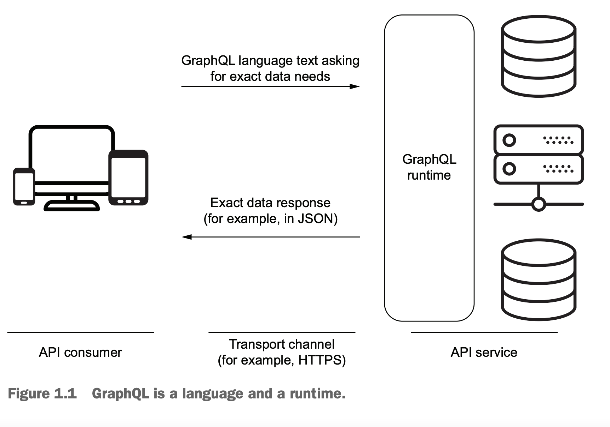
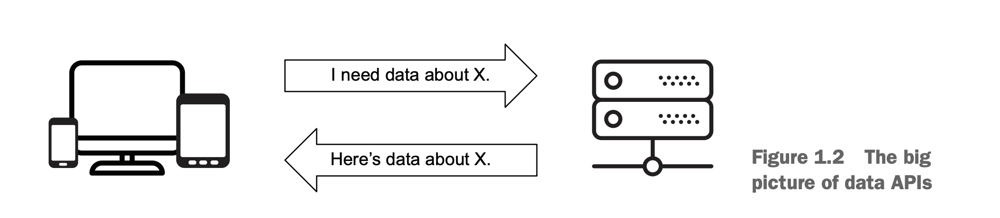
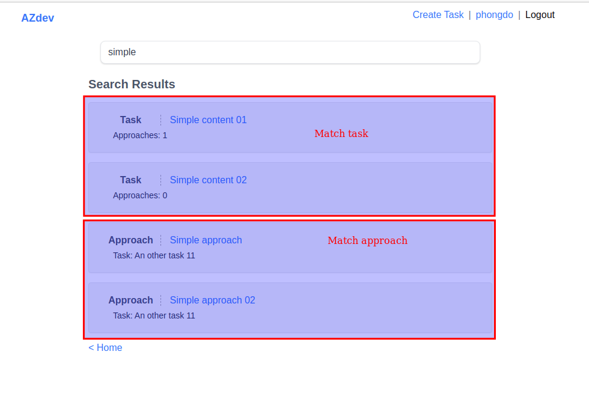

# Part 1: Exploring GraphQL
# Chap 1: Introduce to GraphQL
- Nội dung chap này bao gồm:
    - Hiểu về GraphQL và design concept đằng sau nó
    - GraphQL khác với những công nghệ tương tự khác như REST thế nào?
    - Hiểu về ngôn ngữ GraphQL
    - Hiểu về lợi và bất lợi của GraphQL

- Necessity is the mother of invention
    - GraphQL sáng chế ra bởi FB - công ty có rất nhiều vấn đề về technical với mobile app
    - Tuy nhiên việc graphQL trở nên phổ biến, không phải vì nó giải quyết các vấn đề technical, mà là giải quyết các vấn đề về giao tiếp.
    - Giao tiếp là 1 việc khó. Việc giao tiếp giúp cuộc sống cua chúng ta trở nên dễ dàng hơn.
    - Tương tự vậy, việc giao tiếp giữa các thành phần của ứng dụng tốt hơn cũng giúp ứng dụng dễ hiểu, dễ phát triển, dễ maintain và scale hơn.
    - Đó là lí do tôi nghĩ tại sao GraphQL lại thay đổi cuộc chơi.
    - Nó thay đổi "end" của trò chơi (backend, frontend):
        - Equal power: quyền năng như nhau.
        - Decouple communication process thông qua transport layer
        - Giới thiệu 1 ngôn ngữ mới ngắn gọn và đơn giản.

## 1.1. GraphQL là gì?
- Từ graph trong graphQL đến từ việc nó tổ chức dữ liệu như là dạng đồ thị.
- Nếu bạn phân tích data model lớn hay nhỏ, bạn đều tìm mối quan hệ giữa chúng.
- GraphQL là 1 ngôn ngữ runtime, tức là sẽ phân tích yêu cầu của bạn vào lúc run time


## 1.1.1. The big picture

- Bức tranh tổng quan việc giao tiếp: client muốn lấy dữ liệu từ phía server, nói cho server biết là tôi cần gì.
- Có rất nhiều loại API khác nhau.
- QL trong graphQL thường được so sánh với SQL (do có cùng nghĩa)
    - QL có thể sử dụng trong cả việc đọc và thay đổi dữ liệu
        - Đọc: select
        - Thay đổi: insert
- VD về query graphQL:

```
{
    employee(id: 42) {
        name
        email
        birthDate
        hireDate
    }
}
```
- GraphQL là strong type

### 1.1.2. GraphQL là 1 ngôn ngữ đặc tả
- GraphQL ra bắt đầu từ năm 2012, nhưng 2015 mới có bản spec đầu tiên.

### 1.1.3: GraphQL là 1 ngôn ngữ
- Q = query
    - Khi read: dùng query
    - Khi update: dùng mutation.
    - Tương tự như SQL:
        - Read: dùng select
        - Update: Dùng insert, update, delete
- Ngoài ra thì GraphQL còn hỗ trợ term `subscription` để real-time data monitoring.
- Query language thì khác với programming language:
    - Bạn không thể dùng GraphQL để tạo user interface, hay làm các tính toán phức tạp.
- Nhìn chung, sự phát triển của ngôn ngữ lập trình là giúp chúng gần hơn với ngôn ngữ của con người.
    - Máy thì chỉ hiểu mệnh lệnh thôi.

### 1.1.4: GraphQL là 1 service
- Giống kiểu là 1 phiên dịch viên ý, không phải là storage engine.
- GraphQL chia thành 2 phần chính:
    - structure: hay schema, đại khái là các operation mà GraphQL có thể handle; là mối quan hệ giữa fields và types ...
    - behavior: hay resolver function, đại khái là logic. Mỗi field trong graphQL schema có 1 resolver function. Resolver function tương tự như hướng dẫn nơi lấy và cách lấy dữ liệu. 
- GraphQL tương tự như nhà hàng:
    - Schema giống như cái menu vậy.
    - Khách hàng nhìn vào cái menu gọi món, phục vụ sẽ ghi lại món ăn được làm theo yêu cầu đặc biệt nào không, rồi gửi vào bếp.
    - Giả sử nhà hàng rất bận rộn, mỗi đầu bếp chỉ take care 1 món duy nhất => đầu bếp chính là resolver 
- Resolver trong GraphQL thường được so sánh với Remote Procedure Call (RPC)
- Ví dụ về schema & resolver
    - Ví dụ về query:
    ```
    query {
        employee(id: 42) {
            name
            email
        }
    }
    ```
    - Ví dụ về schema:
    ```
    type Employee (id: Int!) {
        name: String!
        email: String!
    }
    ```
    - Trong đó:
        - Model Employee này có thể được tìm bởi field `id`, có kiểu là int
        - Model có field name, email có kiểu string
        - Dấu `!` có nghĩa là field không được trống.
            - Client khi request không được thiếu id
            - Server response không được thiếu name và email.
        - TIP: Schema language type definition giống như database CREATE statement
    - Ví dụ về resolvers function:
    ```
    const name => (source) => `${source.first_name} ${source.last_name}`;
    const email => (source) => source.email;
    ```
    - Trong đó:
        - Email resolvers được gọi là `trivial` resolver, vì nó không thay đổi gì data cả.
        - Một số implementation như javascript implementation có các built in resolvers, sẽ return chính field đó nếu không có gì được định nghĩa.
- Cuối cùng, graphQL sử dụng cả 3 resolvers function để đưa chúng vào 1 cái response thống nhất như sau:
```
{
    data: {
        employee: {
            name: 'Jan Doe',
            email: 'jane@doe.name'
        }
    }
}
```

## 1.2: Why graphQL
- Vì nó standard (nó tiêu chuẩn hoá)
- GraphQL cung cấp 1 giải pháp tiêu chuẩn toàn diện để implement API maitainable và scalable.
    - Bắt server cung cấp API doc (schema) => client biết tất cả cách mà server triển khai.
    - GraphQL không bao giờ có outdate document, bạn không bao giờ quên viết doc.
- Ở REST, khi bạn lấy nhiều resource, cần call API nhiều lần
    - VD: lấy book, author, reviews => cần call API 3 lần.
    - Ở graphql, chỉ cần call 1 lần thôi.
    - Về cơ bản thì có thể customize REST để trả về như mong muốn được trong 1 request, nhưng nó là customize, ko phải tiêu chuẩn.

### 1.2.1: Về rest API
- REST có vấn đề gì:
    - Có nhiều API endpoint, trong khi Graph thì chỉ có 1
    - Ở rest, frontend ko có tiếng nói. Muốn trả về ít field đi thì cần BE support.
    - Versioning: nếu cần nhiều version => rest cần nhiều endpoint => khi maintain dễ bị duplicate code trên BE
- REST có lợi thế:
    - Dễ cache hơn
    - Optimize code dễ hơn.

- Note:
    - Thực ra những yếu điểm của REST nêu trên hoàn toàn có thể giải quyết được
        - Thêm params `fields` để lấy ra các field cần thiết
        - Thêm 1 số flag để lấy ra các resource liên quan (VD: book, author, comment).
    - Tác giả cũng làm 1 số API simple và cũng vẫn okay.
    - Tuy nhiên với project to thì việc phát triển những thứ đặc biệt như vậy sẽ làm take time hơn; tốc độ phát triển sản phẩm cũng chậm hơn.

### 1.2.2. GraphQL way
- The typed schema
    - Tạo graph api cần định nghĩa schema rõ ràng.
    - Việc này giúp graph api predicable & discoverable
- The declaretive language:
    - Cung cấp cho client quyền năng định nghĩa những gì mà mình muốn.
- Single endpoint & client language:
    - Single endpoint giải quyết vấn đề multiple round trip
    - Việc để cho FE tự định nghĩa thứ mình cần lấy, giúp BE dễ dàng phân tích được thứ gì cần hơn, để scale cho dễ
        - Bình thường trả về hết thì cũng không biết là cái gì cần hơn cái gì
    - Cũng có thể dùng để detect điểm bất thường, cũng như client version change.
- The simple versioning:
    - Version ở graph dễ vkl, cứ code thêm thôi, ko sinh ra endpoint nào cả
    - Đặc biệt khi tích hợp với mobile: 
        - Bình thường app mobile update lên là do người dùng
        - Một khi đang ở version app cũ, trong code fix cứng endpoint rồi thì lúc đổi khá khó
        - Khác với ứng dụng web, push code lên là toàn bộ user dùng luôn code mới (do Chrome tải html mới về)
    - Simple versioning cũng có challenge:
        - Giữ những node cũ thì đồng nghĩa cũng có nhiều thứ phải maintain hơn.
        - Frontend cũng khó biết được field nào là mới, field nào là cũ hơn nữa.

### 1.2.3: Rest API & GraphQL API in action
- Thử đến với 1 ví dụ cụ thể về so sánh giữa REST API & GraphQL API.
- Giả sử bạn định xây dựng 1 app cho phim Star Wars.

- GraphQL có phải REST killer không?
    - Không.
    - Nhưng web & mobile thì chắc Graph sẽ thay thế dần dần. Giống như JSON thay thế XML vậy.

## 1.3. GraphQL problem

### 1.3.1. Security
- Thứ critical đầu tiên là resource-exhausted attack (cũng có thể hiểu là DDoS).
    - Attacker sẽ build 1 query lấy ra các resource rất phức tạp (nested relationship), hoặc dùng alias để lấy cùng 1 field rất nhiều lần.
        - Có thể chặn bằng cách dùng cost analysis để limit lại.
        - Hoặc dùng timeout, rate limit, whitelist query(trường hợp internal app)
- Authen & authorization: học ở chương 8

### 1.3.2. Caching & optimizing
- Caching khá phức tạp:
    - Dùng query làm key để cache thì cũng không hiệu quả lắm.
    - Cách hay hơn là dùng id của mỗi record làm key của cache. Lúc query thì lấy dữ liệu ra để process trước. Tuy nhiên cũng không đơn giản.
        - Graph thì giống như vòng tròn vậy. Mọi thứ đều liên quan đến nhau.
- N+1 query problem:
    - Facebook tiên phong xử lý cái này, dùng DataLoader.
        - Data loader sử dụng sự kết hợp batching và caching để thực hiện được điều này.
        - Học chi tiết hơn ở chap 7
### 1.3.3. Learning curve
- Tốn nhiều thời gian để học hơn:
    - FE cần học cú pháp
    - BE: cần học cú pháp, schema, resolvers và 1 số concept khác nữa.


# Chap 2: Exporing GraphQL API
## 2.2 Basic of GraphQL Language
### 2.2.1. Request
### 2.2.2 Field
- Là 1 core concept của GraphQL
- Field nằm trong cặp ngoặc {}, 
- Support 2 loại dữ liệu:
  - Scalar type (primitive type): Int, String, Float, Boolean, ID (xem chương 4)
  - Object

## 2.3. Example from Github API
### 2.3.3. Introspective query
- Đại khái là các prop để lấy ra meta data
  - __type
  - __schema
  - __typename

# Chap 3: Customizing & organizing GraphQL operations
- Chap này cover:
  - Sử dụng arg để customize thứ mà request field trả về
  - Customize response property name với alias
  - Describe runtime excution với directive
  - Giảm duplicate text với fragments
  - Composing query & separating data requirement responsibilities

## 3.1. Customizing fields with args
- Field giống như function vậy: nhân vào args. VD:
```
query UserInfo {
  user(email: "jane@doe.name") {
    firstName
    lastName
    userName
  }
}
```

### 3.1.1: Identifying a single record to return
- Đại ý là dùng id làm param để return về 1 record duy nhất.
- Một số  framework sử dụng Node interface để tìm kiếm thông tin về bất cứ Node nào trong database.

```
query NodeInfo {
  node(id: "UNIQUE-ID") {
    ... on USER {
      firstName
      lastName
      username
      email
    }
  }
}
```

### 3.1.2: Limit số lượng record trả về của list field
- Thiết kế API mà ko limit => bad practice
- Vì thế mà Github API luôn dùng arg `first` hoặc `last` khi bạn request 1 list các record. VD:

```
query OrgInfo {
  organization(login: "jscomplete") {
    name
    description
    websiteUrl
    repositories(last: 10) {
      nodes {
        name
      }
    }
  }
}
```

### 3.1.3: Sắp xếp record, sử dụng arg
- VD lấy repo sắp xếp theo tên
```
query orgReposByName {
  organization(login: "jscomplete") {
    repositories(first: 10, orderBy: { field: NAME, direction: ASC}) {
      nodes {
        name
      }
    }
  }
}
```
- Order by độ phổ biến giảm dần (STARGAZERS)
```
query  orgReposByStargazer {
  organization(login: "jscomplete") {
    repositories(first: 10, orderBy: {field: STARGAZERS, direction: DESC }) {
      nodes {
        name
      }
    }
  }
}
```

### 3.1.4. Phân trang
- Dùng Github API, provide `after` và `before`
- Để lấy ra cursor phân trang, dùng edges

```
query OrgRepoConnectionExample {
  organization(login: "jscomplete") {
    repositories (
      first: 10,
      orderBy: { field: CREATED_AT, direction: ASC }
    ) {
      edges {
        cursor
        node {
          name
        }
      }
    }
  }
}
```
- Response trả về sẽ có thêm `cursor`

```
{
  "data": {
    "organization": {
      "repositories": {
        "edges": [
          {
            "cursor": "Y3Vyc29yOnYyOpK5MjAxNi0wNy0yNFQxMDo0NzoxNCswNzowMM4D0UlB",
            "node": {
              "name": "graphql-project"
            }
          },
          {
            "cursor": "Y3Vyc29yOnYyOpK5MjAxNi0wOC0wNVQxMjowNDo0MyswNzowMM4D36tI",
            "node": {
              "name": "react-virtual-dom-demo"
            }
          },
          {
            "cursor": "Y3Vyc29yOnYyOpK5MjAxNi0wOC0xMlQxMToyNjoyMCswNzowMM4D583W",
            "node": {
              "name": "learning-graphql-and-relay"
            }
          },
          {
            "cursor": "Y3Vyc29yOnYyOpK5MjAxNi0wOS0yM1QwMDozOTo0MiswNzowMM4EHAlI",
            "node": {
              "name": "learn-fullstack-javascript"
            }
          },
          {
            "cursor": "Y3Vyc29yOnYyOpK5MjAxNi0wOS0yOVQwOTowOToyOCswNzowMM4EJM_h",
            "node": {
              "name": "learning-reactjs"
            }
          },
          {
            "cursor": "Y3Vyc29yOnYyOpK5MjAxNi0xMS0wM1QwMTo1ODowMyswNzowMM4EVOFK",
            "node": {
              "name": "node-react-template"
            }
          },
          {
            "cursor": "Y3Vyc29yOnYyOpK5MjAxNy0wMS0yMVQyMzo1NTo0MyswNzowMM4Ev4A3",
            "node": {
              "name": "advanced-nodejs"
            }
          },
          {
            "cursor": "Y3Vyc29yOnYyOpK5MjAxNy0wMS0yN1QxMTozNjo1MyswNzowMM4Ex3iC",
            "node": {
              "name": "react-blog-example"
            }
          },
          {
            "cursor": "Y3Vyc29yOnYyOpK5MjAxNy0wMy0xNFQwMToyMTozNSswNzowMM4FDt1k",
            "node": {
              "name": "graphfront"
            }
          },
          {
            "cursor": "Y3Vyc29yOnYyOpK5MjAxNy0wMy0xNFQwMToyMzo0OSswNzowMM4FDt4-",
            "node": {
              "name": "graphfront-ui"
            }
          }
        ]
      }
    }
  }
}
```
- Muốn paging thì thêm after vào param:

```
query OrgRepoConnectionExample {
  organization(login: "jscomplete") {
    repositories(
      first: 10,
      after: "{cursor}"
      orderBy: { field: CREATED_AT, direction: ASC }
    ) {
      edges {
        cursor
        node {
          name
        }
      }
    }
  }
}
```
- Có thể thêm 1 số meta data để lấy thông tin khác như: pageInfo, totalCount

```
query metaData {
  organization(login: "jscomplete") {
    repositories(
      first: 50,
      orderBy: { field: STARGAZERS, direction: DESC }
    ) {
      totalCount
      pageInfo {
        hasNextPage
      },
      
    }
  }
}
```

### 3.1.5: Searching & filtering
### 3.1.6: Providing inpujt for mutation
- Ở github API, dùng param input là 1 object cho tất cả các mutation

```
mutation StarARepo {
  addStar(input: { starrableId: "ID" }) {
    starrable {
      stargazers {
        totalCount
      }
    }
  }
}
```

## 3.2. Renaming fields with aliases
- Cú pháp: `aliasName: fieldName`
- Thêm dấu : vào. Dưới đây rename company -> companyName
```
query ProfileInfoWithAlias {
  user(login: "minhphong306") {
    name
    companyName: company
    bio
  }
}
```

## 3.3: Customizing response with directives
- ..

### 3.3.1. Variables and input values
- Có thể khai báo variable:

```
query OrgInfo($orgLogin: String!) {
  organization(login: $orgLogin) {
    name
    description
    websiteUrl
  }
}
```
- Khi execute ở phía editor, provide biến json vào tab query variable
```
{
  "orgLogin": "beeketing"
}
```

- Có thể dùng default variable;

```
query OrgInfoWithDefault ($orgLogin: String = "jsComplete") {
  organization(login: $orgLogin) {
    name
    description
    websiteUrl
  }
}
```

### 3.3.2. @include directive
- Đại khái là sẽ trả về field nếu điều kiện if bên trong đúng
```
fieldName @include(if: $condition)
```

- VD:

```
query OrgInfo($orgLogin: String!, $fullDetails: Boolean!) {
  organization(login:$orgLogin) {
    name
    description
    websiteUrl @include(if:$fullDetails)
  }
}


{
  "orgLogin": "jscomplete",
  "fullDetails": false
}
```

### 3.3.3. @skip directive
- ngược lại với @include

```
query OrgInfo($orgLogin: String!, $partialDetails: Boolean!){
  organization(login:$orgLogin) {
    name
    description
    websiteUrl @skip(if:$partialDetails)
  }
}

{"orgLogin": "jscomplete", "partialDetails": false}
```

### 3.3.4. @deprecated directive
- Dùng để cảnh báo cho người dùng field đó bỏ đi

```
type User {
  emailAddress: String
  email: String @deprecated(reason: "User 'emailAddress'.")
}
```

## 3.4. GraphQL fragment
- Đại khái là tách code ra thành các thành phần nhỏ hơn

```
fragment orgFields on Organization {
  name
  description
  websiteUrl
}
```
- Chỉ có thể define fragment của object type thôi, ko define đươc fragment của scalar value
- DÙng như sau:

```
query OrgInfoWithFragment {
  organization(login: "jscomplete") {
    ...orgFields
  }
}
```
- `...` được gọi là fragment spread

# Part 2: Building GraphQL APIs
- Nội dung phần này:
    - Chap 4: Học về cách plan để map UI -> APIs operations
    - Chap 5: Make graphQL schema
    - Chap 6: Resolve field on get
    - Chap 7: Optimize
    - Chap 8: Resolve field on create, update, delete

# Chap 4: Designing GrapQL schema
- Chap này sẽ build 1 trang để lookup snippet code, gọi là AZdev

## 4.1. Why azdev
## 4.2. API requirements
- Sử dụng 2 loại db:
    - Postgre để lưu transactional data 
    - MongoDB để lưu dynamic data
- Việc sử dụng nhiều loại db là không hiếm gặp, vd như việc đọc từ cache ra
- Quy ước:
    - Task: coi là 1 document
    - Approach: coi là 1 cách để làm task.
    - 1 task có thể có nhiều cách làm, 1 cách làm thì thuộc về 1 task
    - Mọi người đều có thể vào AZdev để tìm kiếm task và các approach
    - Ngườ dùng đã đăng nhập có thể thêm Task, Approach, upvote hay downvote
    - Những entity Task, Approach, User sẽ được lưu ở PostgreSQL
    - Một số data khác như: giải thích, lưu ý, general note sẽ được lưu ở Mongo.
- Naming entities trong GraphQL schema:
    - Với db to, nên đầu tư chút thời gian để đặt tên cho cần thận
    - Trong GraphQL schema, nên sử dụng specific name cho type khi có thể
        - VD: Bạn có 1 `Lesson`, thuộc về 1 `Course` -> nên đặt lên là `CourseLesson` thay vì `Lesson`, dù database model đặt tên là `lessons`.
        - Điều này đặc biệt quan trọng nếu GraphQL service của bạn public.
            - Khi db của bạn phát triển lên, bạn có nhu cầu giới thiệu 1 entity mới, và deprecate cái cũ đi.
            - Nếu bạn đặt cụ thể cho các entity thì drop sẽ dễ hơn nhiều.

### 4.2.1. The core types
- Entity chính: User, Task, Approach
- Trong GraphQL schema:
    - Table thường map với object types
    - Table column thường map với field
- Thử design 3 core type trên:

```
type User {
    id: ID!
    createdAt String!
    username: String!
    name: String
}

type Task {
    id: ID!
    createdAt: String!
    content: String!
}

type Approach {
    id: ID!
    createdAt: String!
    content: String!
}
```
- Kiểu ID là kiểu đặc biệt, nó là unique identifier; là kiểu String (kể cả value trong DB có lưu là int đi nữa).
    - Việc lưu String sẽ ổn hơn là int, vì int ở javascript có limit.
- Kiểu createdAt cũng là string. GraphQL thì không có built-in forrmat cho trường date-time, cách đơn giản nhất là serialize đội này về định dạng standard như ISO/UTC
- Dấu `!` biểu thị là không được null

- Note graphQL & type modifier
    - Dấu `!` được gọi là modifier, vì nó thay dổi kiểu dữ liệu về not null
    - `[]` cũng được gọi là moditifer, vì nó đổi dữ liệu sang kiểu array
    - Các modifier này có để được combine với nhau, VD:
        - `[String!]!`: nghĩa là array này không được null (vẫn được rỗng nhé)
        - Nếu muốn validate 1 field là non-empty array, chỉ có cách bạn tự viết logic trong resolver hoặc định nghĩa 1 custom type cho nó.
- `id` và `createdAt` là 2 field điển hình cho việc type của GraphQL không nhất thiết phải giống hệt với column trong database.
- Các type viết bên trên được hiểu là `output type` - type cho output operation.
    - Type này khác với `input type`, là các type được dùng cho mutation (input operation). Chỗ này sẽ được học sau.

- Vậy password field ở đâu?
    - password không nên là readable field trong output.
    - password chỉ dùng trong mutation, hoặc authenticate user

## 4.3. Queries
- Viết pseudo code cho các query cần thiết

### 4.3.1. List các task mới nhất
```
query {
    taskMainList {
        id
        content
    }
}
```
- Dùng `taskMainList` mà không dùng `mainTaskList`, dù `mainTaskList` nghe có vẻ thuận hơn, vì để group lại theo nhóm. Sau này dùng GraphiQL cũng autocomplete tiện hơn.
- Query root field là cái định nghĩa ngay phía dưới Query type

```
type Query {
    taskMainList: [Task!]

    # more query on root fields
}
```
- `[Task!] nghĩa là các item bên trong array trả về không được null
- Root field nullability
    - Một good practice trong GraphQL schema là chỉ để field non-null nếu bạn thật sự muốn phân biệt rõ ràng giữa null và empty
    - Chỉ sử dụng nullable field nếu bạn muốn hiểu sự vắng mặt của chúng có ý nghĩa.
    - Tuy nhiên, root field thì đặc biệt hơn.
    - Khi 1 field có lỗi, executor sẽ set field này là null
    - Nếu field này định nghĩa là non-null, executor sẽ lan truyền đến cha của nó.
    - Nếu cha lại non-null -> executor tiếp tục tìm kiếm lên trên theo tree.

    - Điều này nghĩa là nếu root `taskMainList` mà là non-null => error sẽ throw lên trên là Query type (parent của taskMainList) => toàn bộ response sẽ bị null, mặc dù query có thể có root field khác.
    - Đây không phải là 1 ý tưởng hay. 1 bad root field có thể block data response của field khác. Ở chương tiếp theo sẽ gặp lại ví dụ này.

### 4.3.2. Search & the union/interface types
- Giả sử cần thiết kế tính năng search:
    - Khi search sẽ phân tích fulltext
    - Nếu match task, sẽ hiển thị approach count
    - Nếu match approach, sẽ hiển thị task info

- Để support việc này, đơn giản là thêm field vào 3 core type bên trên:

```
type Task {
    ....
    approachCount: Int!
}

type Approach {
    ....
    task: Task!
}
```
- Có thể bạn sẽ nghĩ tới design: tách result trả về thành 2 cục khác nhau: cục TaskList và cục ApproachList như bên dưới

```
query {
    search(term: "something") {
        taskList {
            id
            content
            approachCount
        }

        approachList {
            id
            content
            task {
                id
                content
            }
        }
    }
}
```
- Làm như trên sẽ mất đi độ chính xác (độ khớp) của search  (cái nào khớp nhiều hơn thì nằm bên trên)
- Như vậy, ta cần return về 1 list các object match thôi.
- Tuy nhiên thì 2 object này lại có các field khác nhau => cần tạo ra 1 type kết hợp 2 type trên lại.
- Một cách tiếp cận là làm cho search root field biểu thị một array object, có các nullable field tùy theo model mà nó biểu thị. VD:

```
search(term: "something") {
    id
    content
    
    approachCount // when result is a Task

    task { // when result is a Approach
        id
        content
    }
}
```

- Cách này tốt hơn, giải quyết vấn đề
- Tuy nhiên thì người nào dùng API lại cần dựa trên field nào null để xác định cách hiển thị kết quả tìm kiếm (tức là phía FE cần check field nào null và đoán type là approach hay task)
- GraphQL có cách tốt hơn để giải quyết bài toán này: sử dụng union type hoặc interface type

#### Sử dụng union type
```
query {
    search(term: "something") {
        type: __typename {
            ... on Task {
                id
                content
                approachCount
            }

            ... on Approach {
                id
                content
                task {
                    id
                    content
                }
            }
        }
    }
}
```
- Dựa vào inline fragment ... on mà ta build được điều kiện, nếu là type A thì hiển thị field này, nếu là fieldB thì hiển thị cái này
- Query thì ok rồi, còn schema cũng cần định nghĩa type nữa. GraphQL có từ khóa union dùng để implement việc build ra 1 type kết hợp giữa 2 type như sau:

```
union TaskOrApproach = Task | Approach

type Query {
    #...
    search(term: String!): [TaskOrApproach!]
}
```

#### Sử dụng interface type
- Nhìn cái trên thì có 1 tí duplicate: field type, id, content trong task luôn được sử dụng, mà lại định nghĩa đi định nghĩa lại.
- Nếu mà gộp vào search root field được như sau thì ngon:

```
query {
    search(term: "something") {
        type: __typename
        id
        content
        ... on Task {
            approachCount
        }

        ... on Approach {
            task {
                id
            }
        }
    }
}
```
- Câu hỏi đặt ra là: Khi nào dùng interface, khi nào dùng union
    - Dùng interface: khi 2 model có shared field
    - Dùng union: khi 2 group model không có shared field

- Dùng interface trong schema như sau:

```
interface SearchResultItem {
    id: ID!
    content: String!
}

type Task implements SearchResultItem {
    #....
    approachCount: Int!


}

type Approach implements SearchResultItem {
    #...
    task: Task!
}

type Query {
    #...
    search(term: String!): [SearchResultItem!]
}
```
- Dùng interface hay hơn dùng union ở chỗ nhìn cái là biết ngay các field nào khác nhau. Union thì vẫn cần phải đọc code khá nhiều.

- TIP: 1 graphQL type có thể implement nhiều type khác nhau. Muốn implement chỉ cần đưa list các dấu phẩy vào là ok.

### 4.3.4. Page cho 1 task record

```
query {
    taskInfo() {

    }
}
```
- Schema design

```
type Query {
    #...
    taskInfo(id: ID!): Task
}
```
- Hơn nữa, Az dev cho phép sắp xếp Approach theo vote count. Để làm điều này, thêm field VoteCount vào:

```
type Approach implements SearchResultItem {
    #....
    voteCount: Int!
}
```

### 4.3.5. Entity relationships
