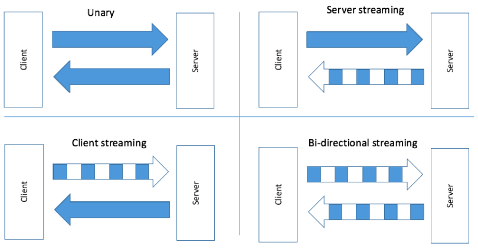

# Bài 1: Overview
- gRPC = general-purpose Remote Procedure Calls
- Phát triển bởi Google
- Xây dựng trên HTTP/2
- Protobuf sử dụng file có đuôi .proto, sử dụng để định nghĩa ra message (data, request, response) và service
- Tại sao dùng gRPC:
 - Payload là binary, việc gửi/nhận (serialize/deserialize) được tối ưu trên CPU rất hiệu quả.
 - PB dùng số thứ tự để quy định field, giúp ko ảnh hưởng đến các service đang chạy trong quá trình phát triển.

- Có 4 loại API của gRPC:
    - Unary: client gọi, server trả lời.
    - Server streaming: client gọi, server trả lời nhiều lần
    - Client streaming: cient request nhiều lần, server trả lời 1 lần 
    - Bi-directional streaming: client và server cùng gọi và trả lời nhiều lần.



- Khác nhau giữa gRPC và REST

|gRPC   | JSON  |
|-------|---    |
|Protocol buffer, nhỏ, nhẹ, nhanh   |JSON text base, to hơn, chậm hơn|
|HTTP2 - 2015| HTTP 1.1 - 1997|
|Bidirection & async| Client -> server request|
|Stream support|Request/ response|
|API oriented| CRUD oriented (POST GET PUT DELETE)|

# Bài 2: Cài đặt
- Chạy cmd để cài: 
```
go get -u github.com/golang/prôtbù/{proto,protoc-gen-go}
go get -u google.golang.org/grpc
```
- Tạo project calculator để demo
- Tạo file calculator.proto
```
syntax = "proto3";

package calculator;

option go_package="calculatorpb";

service CalculatorService {

}
```
- Command gen:
```
protoc calculator/calculatorpb/calculator.pb --go_out=plugins=grpc:.
```
- Tuy nhiên command này hơi dài, dùng Makefile cho ngắn:
 - Tạo `Makefile`
 ```
 gen-cal:
    protoc calculator/calculatorpb/calculator.pb --go_out=plugins=grpc:.
```
