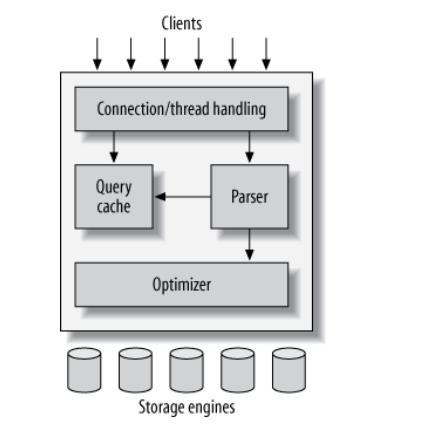

# Chap 1: MySQL architecture & history
- MySQL khác với các loại DB khác: phù hợp với nhiều loại hình nhu cầu từ nhỏ tới to. Không phải là perfect nhưng flexible
- Để sử dụng MySQL hiệu quả => cần hiểu architecture
## 1.1: MySQL's logical architecture

- Tầng trên cùng: network-based client/server tools, connection handling, authentication, security,...
- Tầng thứ 2 - bộ não của MySQL: Code query parsing, analysis, optimization, caching,built-in function, stored procedures, triggers, views
- Tầng 3: Gồm storage engines

- Connection management & security
    - Mỗi connection có 1 thread riêng. Thread thì được MySQL cache lại để tối ưu perf
    - Security thì mysql có basic auth qua usr, pwd
- Optimization & excution
    - MySQL parse query ra internal structure (parse tree), sau đó apply nhiều optimization vào (rewrite query, ordering, index choosing)
    - Bạn có thể truyền hint vào để MySQL chọn trong quá trình decision making
    - Cũng có thể yêu cầu server explain quá trình xử lý
    - Optimizer không care lắm tới storage engine, nhưng storage engine lại ảnh hưởng tới quá trình optimize => optimizer vẫn cần hỏi storage engine 1 vài thông số để tính toán (VD: cost của operation này là bao nhiêu, statistic của table này như nào)
    - 

## 1.2: Concurrency control
- Khi nhiều query cùng change data 1 lúc => xảy ra vấn đề concurrency control. MySQL xử lý vấn đề này ở cả 2 tầng: server và storage engine
- Vì chủ đề này rộng vkl nên ở đây chỉ nói đến những thứ cơ bản thôi
- VD như mbox của linux:
    - Nếu cứ từng cái mail đến, sau đó append dần vào cuối list mail => ok
    - Nhưng 2 con mail mà đến cùng lúc thì conflict (do 2 con cùng muốn đưa vào cuối list). Nếu dùng lock thì sẽ bị chậm

### 1.2.1: Read, write lock
- Đừng tưởng đọc thì nhiều thằng đọc cũng đc, ko cần lock nha. VD đang đọc mà có thằng xoá => inconsistence
- 2 loại lock: shared locks & exclusive lock (hay là read locks và write locks)
    - shared locks: tất cả client cùng đọc 1 resource cùng 1 lúc, không quan tâm đến thằng khác
    - exclusive lock: block read lock và write lock của thằng khác.
    - đoạn lock này chưa clear lắm. TOREAD trang 34

### 1.2.2: Locking granularity (chi tiết hơn)
- Một cách lock tốt hơn là thay vì lock toàn bộ, chỉ lock chỗ nào bị thay đổi thôi
- Việc quản lí lock cũng khá phức tạp và tốn tài nguyên. Quản lí lock rất tốt nhưng rất tốn tài nguyên thì cũng không phải là giải pháp hay (do hết tài nguyên cho việc khác cmnr)
- Một chiến thuật lock là sự hài hoà giữa chi phí cho việc lock và sự an toàn của dữ liệu. 
- MySQL cung cấp các lựa chọn lock khác nhau cho từng loại storage engine. Chọn kiểu lock phù hợp với bài toán rất quan trọng. Gíup tăng perf đáng kể
- Có 2 locking strategy chính: table lock & row lock

- Table lock:
    - Vẫn read được bình thường
    - Không write được khi table lock
    - Write lock ưu tiên hơn read lock trong queue (tức là kể cả read lock xếp hàng trước thì vẫn ko được ưu tiên = write lock)
    - Table lock thường dùng trong case alter table nha.
- Row lock:
    - 

