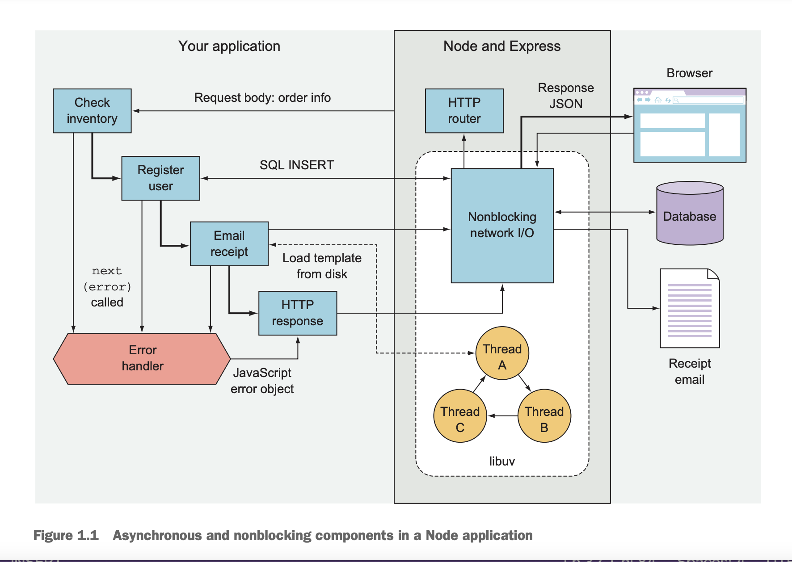
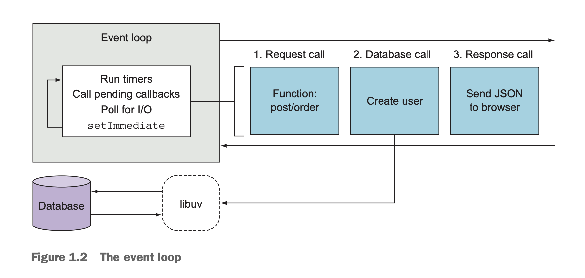
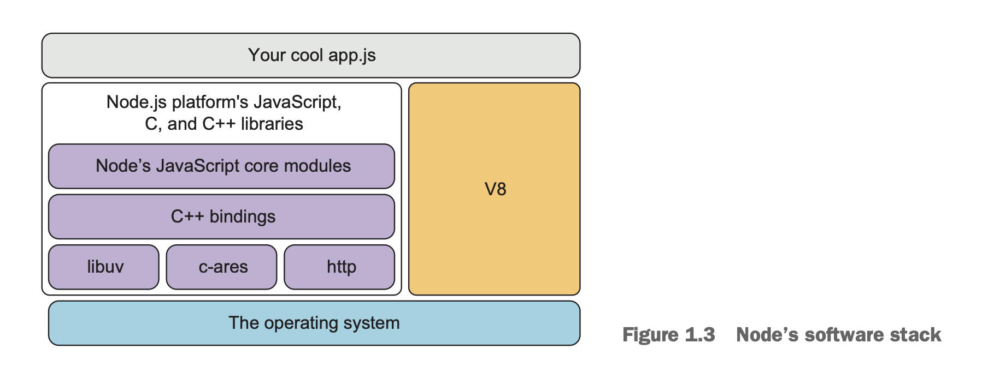
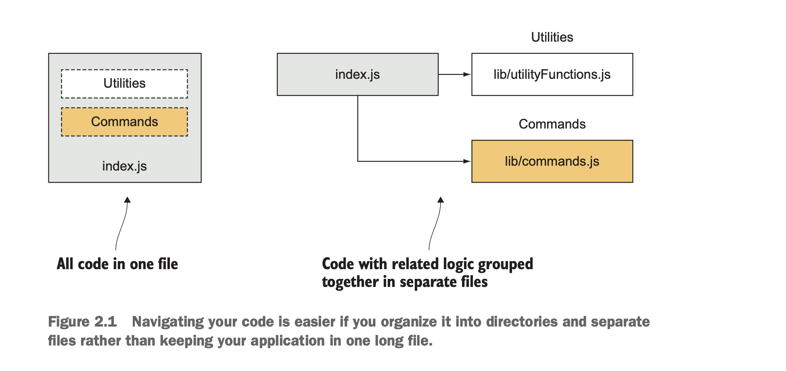
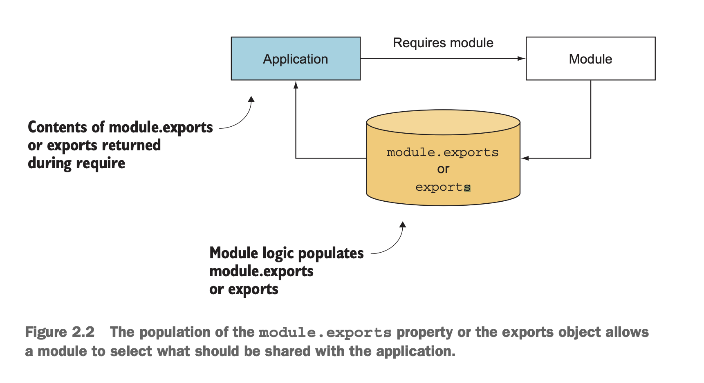
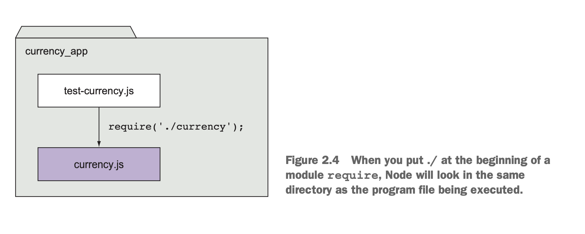
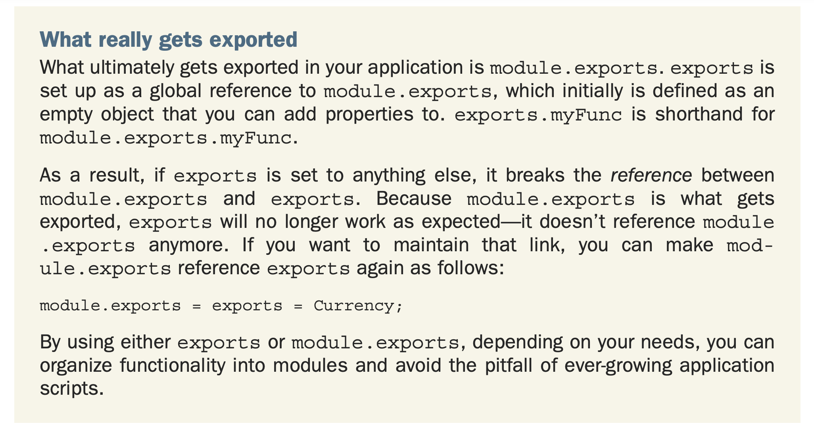

# Part 1: Welcome to Node
- Node là 1 web fw trưởng thành & ổn định rồi.

# Chap 1: Welcome to Nodejs
- Nodejs là 1 asynchronous, event-drivent.
- Từ khi Nodejs xuất hiện vào 2009, đã thay đổi cuộc chơi. Js từ ngôn ngữ chỉ tập trung vào trình duyệt, ít được chấp nhận, đã trở thành 1 ngôn ngữ quan trọng vkl
- Có nhiều công ty lớn như Microsoft hỗ trợ Nodejs và góp phần vào quá trình thành công của nó.
- Trong chương này, bạn sẽ được học về Node, event-drivent nonblocking model của nó, và 1 số lí do để js trở thành một ngôn ngữ lập trình phổ thông.

## 1.1 A typical Node web application
- Một trong những điểm mạnh của Node và Javascript là single-threaded programming model.
- Thread thường code dễ bị bug => một số ngôn ngữ như Rust, Go cung cấp bộ concurrency tool riêng để an toàn hơn.
- Node sử dụng cách giống như dùng trên browser: dùng single thread, mỗi thời điểm chị chạy 1 cái thôi.
- Tuy nhiên thì việc bị blocking khi làm các action cần time wait cao như file access/ network sẽ làm user experience bị thấp.

### 1.1.1. Nonblocking I/O
- Việc đọc file hoặc gửi message trên network hầu như là chậm. Nếu người dùng mà phải đợi các ông xử lý xong thì mới đc thao tác tiếp thì tệ quá.
- Node dùng 3 kĩ thuật để xử lý vụ này: events, asynchronous API, nonblocking I/O
- Hiểu đơn giản: 
    - Ứng dụng của bạn có thể make network request
    - Trong thời gian ấy có thể làm tiếp việc khác cũng được.
    - Sau khi luồng make network request chạy xong thì tự gọi 1 cái callback handler

- Hình dưới là 1 ví dụ điểm hình của 1 Node app:
    - Trình duyệt gửi request mua sản phẩm
    - Application kiểm tra còn hàng không
        - Sau đó tạo acc cho customer
        - Sau đó gửi email hoá đơn
        - Sau đó gửi response JSON HTTP
- Ta nhận thấy, có 2 việc xảy ra đồng thời: Gửi mail cho user và lưu thông tin khách hàng vào database; mặc dù nhìn code vẫn theo thứ tự 1 mạch qua sông, không có thread hay gì đặc biệt cả.
- Nhìn vào hình dưới thì thấy database được truy cập thông qua network.
    - Trong ứng dụng Node, network access là nonblocking, vì nó dùng thư viện libuv



- Lợi ích của việc sử dụng asynchronous API với nonblocking I/O: Node có thể làm những việc khác, trong khi những tiến trình tương đối chậm khác vẫn đang xảy ra.
    - Mặc dù chỉ có 1 thread, 1 process Node web app đang chạy, nó vẫn có thể xử lý nhiều hơn 1 connection  đến từ hàng ngàn visitor.
    - Để hiểu hơn, hãy đến với event loop

### 1.1.2. Event loop


// TOREAD: đoạn này quay lại note sau, đại khái nói về cơ chế event loop hoạt động, sử dụng event & call back thay cho concurrency

## 1.2. ES2015, Node và V8
// TOREAD: đoạn này quay lại note sau. Đã đọc trên kindle, đại khái nói về một số tính năng mới như `let, const`, `arrow func`, arrow func xử lý issue của con trỏ this

### 1.2.1. Node & V8

- Đoạn này nói về việc Node dùng V8 engine, phát triển bởi Chromium project cho Google Chrome.
    - V8 compile trực tiếp ra mã máy
    - V8 có bộ optimize code để Node chạy nhanh hơn.

### 1.2.2. Working with feaure groups
- Đoạn này đại khái nói về trạng thái của 3 loại feature của Node:
    - Shipping: feature đã ngon
    - Staged: feature dạng beta, dùng flag --harmony để trải nghiệm
    - Progress: feature đang làm, dùng cmd để xem: `node --v8-options | grep "in progress"`

### 1.2.3: Hiểu về Node release schedule
- Có 3 phiên bản: LTS (Long-Term Support), Currrent và Nightly:
    - LST: có 18 tháng support và 12 tháng maintain (? clgt). Đại khái bản này ổn định nhất
    - Current: bản hiện tại, có nhiều feature mới.
    - Nightly: ko hiểu nói gì. Mà lên trang chủ thì có vẻ không có.

## 1.3: Cài node
- Cái này dễ vl, ko viết lại làm gì.

## 1.4: Node built-in tools
- npm: node package manager
- core module:
    - FILESYSTEM (fs, path)
    - NETWORKING (http)
- debugger:
    - Để chạy debug, run `node debug ${file}`
    - Support dùng Chrome debug luôn, dùng lệnh: `node --inspect --inspect-brk` để nó expose ra 1 cái websocket, xong chắc dùng để cắm vào trình duyệt debug.
        - Chỗ này cũng nâng cao, chưa cần dùng tới ngay đâu.

## 1.5: Ba loại chương trình Node chính
- Web app:
    - Express
- Command-line tool & daemon:
    - pm2
- Desktop app: dùng electron
    - VS Code
    - Atom

# Chap 2: Node programming fundamentals (a ă â b c về Node)
- Chap này cover:
    - Tổ chức code theo module
    - Handing one-off events với callbacks (?)
    - Handling event lặp đi lặp lại với event emitters
    - Thử implement code tuần tự và song song (serial & parallel flow control)
    - Sử dụng flow-control tools

## 2.1: Tổ chức và tái sử dụng tính năng của Node
- Tổ chức tất cả các code vào 1 file thì lởm lắm. Khó maintain nữa.

- Đoạn này nói về việc tách code ra các file, khi import vào có khả năng bị conflict name.
    - VD đoạn code PHP:
        - Đoạn này chạy sẽ báo lỗi: `Fatal error: Cannot redeclare uppercase_trim()`. Lí do vì hàm uppercase_trim kia trong file string_handlers.php cũng có -> lỗi
        - Để khắc phục thì PHP 
```
function uppercase_trim($text) {
    return trim(strtoupper($text));
}
include('string_handlers.php');
```
- Để khắc phục lỗi này, đội PHP dùng khái niệm namespace, Ruby thì dùng module
- Kiểu import của mấy ngôn ngữ kia thì vẫn import tất cả file vào
- Node thì cho phép chỉ import cái mình dùng vào thôi. Tránh được việc trùng tên.
    - Các module của Node dùng từ khoá `module.exports` hoặc `exports` để biểu thị việc tạo 1 module riêng


## 2.2. Tạo 1 Node project mới
```
mkdir 1_module
cd 1_module
npm init -y
```
- Trong đó:
    - init -y: để đồng ý các option luôn, đỡ phải lằng ngoằng.
### 2.2.1: Tạo module
- Tạo file `currency.js`:
```
const canadianDollar = 0.91;
const canadianDollar = 0.91;

function roundTwo(amount) {
        return Math.round(amount * 100) / 100;
}

exports.canadianToUS = canadian => roundTwo(canadian * canadianDollar);
export.USToCanadian = us => roundTwo(us/canadianDollar);
```
- Như vậy 2 con hàng: `canadianToUS` và `USToCanadian` đã được export ra để sử dụng.
- Khi dùng import, node sẽ tìm theo thứ tự:
    - core module
    - folder hiện tại
    - thư mục node_modules

- ** LƯU Ý VỀ DÙNG REQUIRE **
    - `require` là một trong những synchronous operation hiếm hoi ở Node.
        - Vì module thường được sử dụng ở trên đầu của file.
        - Dùng require synchronous giúp cho code clean, có thứ thự và dễ đọc hơn
    - Hạn chế sử dụng `require` trong business logic của ứng dụng, có thể làm chậm ứng dụng.
    - Nên dùng lúc khởi tạo ứng dụng thôi nhé ae.
- Tạo file `test_currency.js`:
```
const currency = require('./currency');
console.log('50 Can -> US:');
console.log(currency.canadianToUS(50));
console.log('30 US -> Can:');
console.log(currency.USToCanadian(30));
```
- Trong đó:
    - `./`: biểu thị là muốn import file cùng thư mục
    - Khi import không có đuôi gì:
        - Đầu tiên tìm file `.js`
        - Sau tìm file `.JSON`


## 2.3: Fine-tuning module creation by using module.exports
- Ý là fix cái hệ số 0.91 trong file kia thì nghe vẻ không thơm lắm.
- Cái export nên return 1 cái function ra, sau đó dùng hàm tạo để truyền hệ số vào thì application có vẻ ổn áp hơn nhiều. VD như này:

```
const Currency = require('./currency');
const canadianDollar = 0.91;
const currency = new Currency(canadianDollar);
console.log(currency.canadianToUS(50));
```
- Lưu ý là node không cho overwritten lại exports. Như vd dưới đây là invalid:

```nodejs
exports = Currency // Invalid
```
- Muốn hoạt động được thì thay export = modules.exports.
- Lưu ý:
    - Nếu có cả exports và module.exports => module.exports được sử dụng, exports sẽ bị ignore
