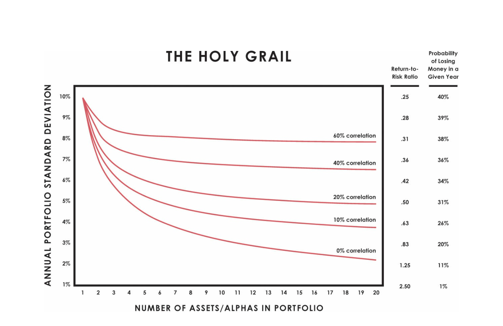
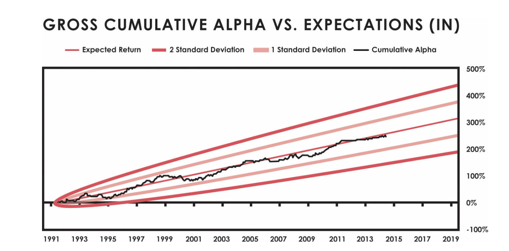

## CHAPTER 4: MY ROAD OF TRIALS (CON ĐƯỜNG THỬ THÁCH CỦA TÔI): 1983–1994

Sau vụ tai nạn, tôi khánh kiệt đến mức không thể gom đủ tiền để mua vé máy bay đến Texas thăm một khách hàng tiềm năng, mặc dù
phí mà tôi kiếm được cao gấp nhiều lần giá vé—vì vậy tôi đã không thực hiện chuyến đi đó. Tuy nhiên, tôi dần dần có thêm khách hàng, doanh thu và một nhóm mới. Cùng với thời gian, những lần đi lên của tôi tăng cường độ và những lần đi xuống của tôi đều có thể chấp nhận được và mang tính giáo dục. Tôi chưa bao giờ nghĩ việc mình đang làm là xây dựng (hoặc xây dựng lại) một công ty; Tôi chỉ nhận được những thứ tôi cần để chơi trò chơi của mình.
Máy tính là một trong những thứ có giá trị nhất mà tôi có được, vì cách chúng giúp tôi suy nghĩ. Nếu không có họ, Bridgewater gần như đã không thành công như mong đợi.
Những chiếc máy vi tính đầu tiên (sau này được gọi là máy tính cá nhân) đã xuất hiện trên thị trường vào cuối những năm 1970, và tôi đã sử dụng chúng như những nhà kinh tế lượng đã làm, áp dụng số liệu thống kê và sức mạnh tính toán vào dữ liệu kinh tế để phân tích hoạt động của cỗ máy kinh tế. Như tôi đã viết trong một bài báo tháng 12 năm 1981, tôi đã tin (và vẫn tin) rằng “về mặt lý thuyết . . . nếu có một chiếc máy tính có thể nắm giữ tất cả các dữ kiện của thế giới và nếu nó được lập trình một cách hoàn hảo để thể hiện một cách toán học tất cả các mối quan hệ giữa tất cả các phần của thế giới, thì tương lai có thể được báo trước một cách hoàn hảo.”
Nhưng tôi còn lâu mới làm được điều đó. Mặc dù các hệ thống ban đầu của tôi cung cấp những hiểu biết có giá trị về nơi giá cuối cùng sẽ đạt đến trạng thái cân bằng, nhưng chúng đã không giúp tôi phát triển các chiến lược giao dịch mạnh mẽ; họ chỉ cho tôi thấy rằng một vụ cá cược cụ thể cuối cùng sẽ được đền đáp. Ví dụ: tôi đã xem qua phân tích của mình và kết thúc với quan điểm rằng giá của một số mặt hàng phải là 75 xu hoặc hơn. Nếu giá hiện tại là 60 xu, tôi sẽ biết mình muốn mua nó,
nhưng tôi sẽ không thể dự đoán rằng giá sẽ giảm xuống 50 xu trước khi tăng trở lại 75 xu và tôi sẽ không biết khi nào nên mua và bán. Hiếm khi, nhưng vẫn còn quá thường xuyên, hệ thống sẽ bị sai và tôi sẽ thua rất nhiều.
“Ai sống bằng quả cầu pha lê thì nhất định phải ăn thủy tinh vụn” là câu nói mà tôi trích dẫn rất nhiều vào thời đó. Từ năm 1979 đến năm 1982, tôi đã ăn đủ cốc để nhận ra rằng điều quan trọng nhất không phải là biết trước tương lai mà là biết cách phản ứng phù hợp với thông tin có sẵn tại mỗi thời điểm. Để làm được điều đó, tôi sẽ phải có một kho dữ liệu kinh tế và thị trường khổng lồ để dựa vào—và như nó đã xảy ra, tôi đã làm được.
Ngay từ rất sớm, bất cứ khi nào tôi tham gia một vị thế trên thị trường, tôi đều viết ra các tiêu chí mà tôi đã sử dụng để đưa ra quyết định của mình. Sau đó, khi tôi đóng một giao dịch, tôi có thể suy nghĩ xem các tiêu chí này đã hoạt động tốt như thế nào. Tôi chợt nhận ra rằng nếu tôi viết các tiêu chí đó thành các công thức (ngày nay được gọi là thuật toán thời trang hơn) và sau đó chạy dữ liệu lịch sử thông qua chúng, tôi có thể kiểm tra xem các quy tắc của mình sẽ hoạt động tốt như thế nào trong quá khứ. Đây là cách nó hoạt động trong thực tế: Tôi sẽ bắt đầu với trực giác của mình như tôi vẫn luôn làm, nhưng tôi sẽ diễn đạt chúng một cách logic, như những tiêu chí ra quyết định, và nắm bắt chúng một cách có hệ thống, tạo ra một bản đồ tinh thần về những gì tôi sẽ làm trong tương lai. từng tình huống cụ thể. Sau đó, tôi sẽ chạy dữ liệu lịch sử thông qua các hệ thống để xem quyết định của tôi đã thực hiện như thế nào trong quá khứ và tùy thuộc vào kết quả, sửa đổi các quy tắc quyết định một cách thích hợp.
Chúng tôi đã thử nghiệm các hệ thống từ xa nhất có thể, thường là hơn một thế kỷ, ở mọi quốc gia mà chúng tôi có dữ liệu, điều này cho tôi cái nhìn tuyệt vời về cách thức hoạt động của cỗ máy kinh tế/thị trường theo thời gian và cách đặt cược vào nó. Làm điều này đã giúp giáo dục tôi và khiến tôi tinh chỉnh các tiêu chí của mình để chúng vượt thời gian và phổ biến. Sau khi tôi kiểm tra các mối quan hệ đó, tôi có thể chạy dữ liệu qua các hệ thống khi dữ liệu đến với chúng tôi trong thời gian thực và máy tính có thể hoạt động giống như bộ não của tôi xử lý dữ liệu và đưa ra quyết định.
Kết quả là hệ thống lãi suất, chứng khoán, tiền tệ và kim loại quý ban đầu của Bridgewater, sau đó chúng tôi kết hợp thành một hệ thống để quản lý danh mục đầu tư đặt cược của mình. Hệ thống của chúng tôi giống như một EKG về các dấu hiệu quan trọng của nền kinh tế; khi họ thay đổi, chúng tôi đã thay đổi vị trí của mình. Tuy nhiên, thay vì làm theo khuyến nghị của máy tính một cách mù quáng, tôi sẽ để máy tính hoạt động song song với phân tích của riêng tôi rồi so sánh cả hai. Khi quyết định của máy tính khác với quyết định của tôi, tôi sẽ xem xét lý do tại sao. Hầu hết thời gian, đó là bởi vì tôi đã bỏ qua một cái gì đó.

Trong những trường hợp đó, máy tính đã dạy tôi. Nhưng đôi khi tôi nghĩ về một số tiêu chí mới mà hệ thống của tôi đã bỏ lỡ, vì vậy tôi sẽ dạy máy tính. Chúng tôi đã giúp đỡ lẫn nhau. Không mất nhiều thời gian trước khi chiếc máy tính, với sức mạnh xử lý khủng khiếp của nó, trở nên hiệu quả hơn tôi rất nhiều. Điều này thật tuyệt, vì nó giống như có một đại kiện tướng cờ vua giúp tôi vạch ra các nước đi của mình, ngoại trừ kỳ thủ này hoạt động theo một bộ tiêu chí mà tôi hiểu và tin là hợp lý, vì vậy không có lý do gì để chúng tôi bất đồng về cơ bản.
Máy tính tốt hơn nhiều so với bộ não của tôi trong việc “suy nghĩ” về mẹ

bất kỳ thứ gì cùng một lúc và nó có thể thực hiện chính xác hơn, nhanh hơn và ít cảm xúc hơn. Và, bởi vì nó có một bộ nhớ tuyệt vời như vậy, nên nó có thể làm tốt hơn việc tổng hợp kiến thức của tôi và kiến thức của những người mà tôi đã làm việc cùng khi Bridgewater phát triển. Thay vì tranh luận về kết luận của mình, tôi và các đối tác sẽ tranh luận về các tiêu chí ra quyết định khác nhau của chúng tôi. Sau đó, chúng tôi giải quyết những bất đồng của mình bằng cách kiểm tra các tiêu chí một cách khách quan. Sức mạnh mở rộng nhanh chóng của máy tính trong thời đại đó giống như một dòng quà tặng liên tục từ các vị thần cho chúng ta. Tôi nhớ khi RadioShack ra mắt một máy tính chơi cờ cầm tay rẻ tiền; chúng tôi đã gửi cho từng khách hàng của mình một cái với thông báo, “Phương pháp tiếp cận có hệ thống từ Bridgewater.” Trò chơi cờ vua máy tính nhỏ đó có thể đá đít tôi ở cấp độ hai trong số chín cấp độ của nó. Thật thú vị khi so sánh nó với từng khách hàng của tôi để họ có thể thấy việc đánh bại quá trình ra quyết định trên máy vi tính khó đến mức nào.
Tất nhiên, chúng tôi luôn có quyền tự do ghi đè lên hệ thống, điều mà chúng tôi thực hiện chưa đến 2% thời gian—chủ yếu là để lấy tiền ra khỏi bàn trong các sự kiện bất thường không được lập trình sẵn, chẳng hạn như Trung tâm Thương mại Thế giới sụp đổ vào ngày 9/9. 11. Mặc dù máy tính tốt hơn nhiều so với bộ não của chúng ta về nhiều mặt, nhưng nó không có trí tưởng tượng, sự hiểu biết và logic như chúng ta. Đó là lý do tại sao bộ não của chúng ta làm việc với máy tính đã tạo nên một mối quan hệ hợp tác tuyệt vời như vậy.
Các hệ thống ra quyết định này tốt hơn nhiều so với các hệ thống dự báo mà tôi đã sử dụng trước đây, chủ yếu là do chúng kết hợp các phản ứng liên tục của chúng ta với các diễn biến, cho phép chúng ta giải quyết nhiều khả năng hơn. Chúng cũng có thể bao gồm các quy tắc về thời gian. Trong một bài báo tháng 1 năm 1987 có tựa đề “Kiếm tiền so với Lập dự báo,” tôi đã giải thích rằng:
Sự thật mà nói, các dự báo không có giá trị lắm và hầu hết những người đưa ra chúng không kiếm được tiền trên thị trường. . . . Điều này là bởi vì không có gì

là chắc chắn và khi người ta tính xác suất của tất cả những thứ khác nhau ảnh hưởng đến tương lai để đưa ra dự báo, người ta sẽ nhận được một loạt các khả năng với các xác suất khác nhau, chứ không phải một kết quả có khả năng xảy ra cao. . . . Chúng tôi tin rằng các chuyển động của thị trường phản ánh các chuyển động của nền kinh tế. Các chuyển động kinh tế được phản ánh trong các số liệu thống kê kinh tế. Bằng cách nghiên cứu mối quan hệ giữa số liệu thống kê kinh tế và biến động thị trường, chúng tôi đã phát triển các quy tắc chính xác để xác định những thay đổi quan trọng trong môi trường kinh tế/thị trường và từ đó xác định vị trí của chúng tôi. Nói cách khác, thay vì dự đoán những thay đổi trong môi trường kinh tế và thay đổi vị trí để đón đầu chúng, chúng tôi đón nhận những thay đổi này khi chúng đang diễn ra và luân chuyển tiền của mình để giữ ở những thị trường hoạt động tốt nhất trong môi trường đó.
Trong ba thập kỷ qua để xây dựng các hệ thống này, chúng tôi đã kết hợp nhiều loại quy tắc hơn để định hướng mọi khía cạnh giao dịch của chúng tôi. Giờ đây, khi dữ liệu thời gian thực được phát hành, máy tính của chúng tôi phân tích thông tin từ hơn 100 triệu bộ dữ liệu và đưa ra hướng dẫn chi tiết cho các máy tính khác theo cách mà tôi thấy hợp lý. Nếu tôi không có những hệ thống này, có lẽ tôi đã khánh kiệt hoặc chết vì căng thẳng khi phải cố gắng hết sức. Chúng tôi chắc chắn sẽ không làm tốt ở các thị trường như chúng tôi có. Như bạn sẽ thấy sau này, tôi hiện đang phát triển các hệ thống tương tự để giúp chúng tôi đưa ra các quyết định quản lý. Tôi tin rằng một trong những điều có giá trị nhất mà bạn có thể làm để cải thiện việc ra quyết định của mình là suy nghĩ về các nguyên tắc ra quyết định, viết chúng ra bằng cả lời nói và thuật toán máy tính, kiểm tra lại chúng nếu có thể và sử dụng chúng trong thực tế. cơ sở thời gian để chạy song song với việc ra quyết định của bộ não của bạn.
Nhưng tôi đang vượt lên chính mình. Hãy quay trở lại năm 1983.
HỒI SINH NƯỚC CẦU
Cuối năm 1983, Bridgewater có sáu nhân viên. Cho đến lúc đó, tôi chưa thực hiện bất kỳ hoạt động tiếp thị nào; công việc kinh doanh mà chúng tôi có được đến từ những lời truyền miệng và từ những người đọc telex hàng ngày của tôi và xem những lần xuất hiện trước công chúng của tôi. Nhưng rõ ràng nhu cầu đối với nghiên cứu của chúng tôi ngày càng tăng và tôi nhận ra rằng chúng tôi có thể bán nó để bổ sung thu nhập từ hoạt động tư vấn và giao dịch của mình. Vì vậy, tôi đã thuê một nhân viên thứ bảy, một cựu nhân viên bán Kinh thánh từng nhà tên là Rob Fried, và chúng tôi

lên đường, mang theo một chiếc máy chiếu và một chồng slide khổng lồ, rao bán gói nghiên cứu trị giá 3.000 đô la mỗi tháng với các cuộc điện đàm hàng ngày, các cuộc gọi hội nghị hàng tuần, các báo cáo nghiên cứu hai tuần một lần và hàng quý, và các cuộc họp hàng quý. Trong năm tiếp theo, Rob đã mời một số tổ chức và nhà quản lý đầu tư tổ chức, bao gồm General Electric, Keystone Custodian Funds, Ngân hàng Thế giới, Brandywine, Loomis Sayles, Provident Capital Management, Singer Company, Loews Corporation, GTE Corporation và Wellington Sự quản lý.
Vào thời điểm đó, hoạt động kinh doanh của chúng tôi bao gồm ba lĩnh vực chính: tư vấn về phí, quản lý rủi ro của công ty đối với các khoản phí khuyến khích và bán các gói nghiên cứu. Chúng tôi đã làm việc với tất cả các loại tổ chức doanh nghiệp, tài chính và chính phủ có tiếp xúc với thị trường — ngân hàng, doanh nghiệp quốc tế đa dạng, sản xuất hàng hóa.

ers, nhà sản xuất thực phẩm, tiện ích công cộng, v.v. Ví dụ: chúng tôi sẽ xây dựng một kế hoạch để giúp một công ty đa quốc gia đối phó với rủi ro tiền tệ mà công ty này phải đối mặt khi hoạt động ở các quốc gia khác nhau.
Cách tiếp cận của tôi là đắm mình vào công việc kinh doanh cho đến khi tôi cảm thấy rằng các chiến lược mà tôi đang đưa ra là những chiến lược tôi sẽ sử dụng khi tự mình điều hành công ty. Tôi sẽ chia nhỏ từng công ty thành các bộ phận hợp lý riêng biệt và sau đó đưa ra kế hoạch quản lý từng bộ phận, sử dụng nhiều công cụ tài chính khác nhau, đặc biệt là các công cụ phái sinh. Các thành phần quan trọng nhất cần tách biệt là lợi nhuận đến từ hoạt động kinh doanh cốt lõi và những thành phần là lợi nhuận đầu cơ và thua lỗ do thay đổi giá. Chúng tôi sẽ làm điều này để cho họ thấy vị thế “trung lập với rủi ro” trông như thế nào, tức là vị thế được phòng hộ đúng cách mà một người sẽ thực hiện nếu một người không có quan điểm về thị trường. Tôi khuyên họ chỉ nên đi chệch khỏi vị trí này khi họ muốn đầu cơ, điều mà họ chỉ nên làm theo những cách đã được đo lường và với đầy đủ kiến thức về những tác động mà nó có thể gây ra đối với hoạt động kinh doanh cốt lõi của họ. Cách tiếp cận này đã mở mang tầm mắt cho hầu hết các công ty mà chúng tôi đã làm việc cùng. Nó mang lại cho họ sự rõ ràng và khả năng kiểm soát, đồng thời mang lại cho họ những kết quả tốt hơn. Đôi khi họ muốn chúng tôi đầu cơ cho họ, điều mà chúng tôi sẽ làm để được chia lợi nhuận.
Cách tiếp cận này để thiết lập một vị trí chuẩn “trung lập với rủi ro” và đi chệch khỏi vị trí đó bằng các khoản đặt cược được đo lường là nguồn gốc của phong cách quản lý đầu tư mà sau này chúng ta gọi là “lớp phủ alpha”, trong đó thụ động (“beta”) và chủ động (“alpha ”) phơi sáng được tách ra. Sự trở lại của một thị trường (chẳng hạn như thị trường chứng khoán) được gọi là phiên bản beta của nó. Alpha là tiền lãi đến từ việc đánh cược với những người khác. Ví dụ, một số người làm tốt hơn

thị trường chứng khoán và những thị trường khác hoạt động kém hiệu quả hơn; chúng được cho là có alpha dương hoặc âm. Với lớp phủ alpha, chúng tôi đã cung cấp một cách đặt cược độc lập với hiệu suất thị trường cơ bản. Tiếp cận thị trường theo cách này đã dạy tôi rằng một trong những chìa khóa để trở thành một nhà đầu tư thành công là chỉ đặt cược mà bạn tin tưởng cao và đa dạng hóa chúng thật tốt.
Một trong những khách hàng của chúng tôi vào giữa những năm 1980 là Alan Bond, một doanh nhân táo bạo và là một trong những người giàu nhất ở Úc. Là một người đàn ông tự lập, anh ấy nổi tiếng vì là người không phải người Mỹ đầu tiên giành chiến thắng trong cuộc đua thuyền buồm America’s Cup trong lịch sử 132 năm sau đó. Giống như Bunker Hunt, cuối cùng ông đã đánh cược thua lỗ và buộc phải tuyên bố phá sản. Tôi đã khuyên anh ấy và nhóm của anh ấy trên con đường của họ và tiếp tục vượt qua sự sụp đổ của anh ấy, vì vậy tôi đã chứng kiến ​​thảm kịch diễn ra từ cự ly gần. Trường hợp kinh điển của ông là nhầm lẫn kinh doanh với đầu cơ và chỉ phòng ngừa rủi ro khi đã quá muộn.
Trái phiếu vay đô la Mỹ để mua tài sản như nhà máy bia ở Úc. Anh ấy đã làm điều đó bởi vì lãi suất của Hoa Kỳ thấp hơn so với ở Úc. Mặc dù anh ta không nhận ra điều đó, nhưng anh ta đang suy đoán rằng đồng đô la Mỹ, thứ mà anh ta sẽ phải trả các khoản vay của mình, sẽ không tăng giá. Khi đồng đô la Mỹ tăng giá so với đồng đô la Úc vào giữa những năm 1980 và thu nhập từ việc bán bia bằng đô la Úc của anh ấy không đủ để trả nợ, nhóm của anh ấy đã gọi cho tôi để xin lời khuyên. Tôi đã tính toán vị trí của Bond Corp sẽ như thế nào nếu họ phòng ngừa rủi ro bằng tiền tệ và thấy rằng làm như vậy sẽ dẫn đến những khoản lỗ có thể hủy hoại họ, vì vậy tôi khuyên họ nên chờ đợi. Khi đồng đô la Úc tăng giá, tôi đã khuyên họ nên áp dụng các biện pháp phòng ngừa rủi ro, nhưng họ đã không làm vậy vì họ tin rằng vấn đề tiền tệ đã biến mất. Chẳng bao lâu sau, đồng đô la Úc giảm xuống mức thấp mới và họ gọi tôi vào một cuộc họp khẩn cấp. Họ không thể làm được gì nhiều mà không bị mắc kẹt trong những khoản thua lỗ nặng nề, vì vậy họ lại không làm gì cả, và lần này đồng đô la Úc không tăng giá. Việc chứng kiến một trong những người đàn ông giàu có và thành đạt nhất hành tinh mất đi tất cả đã gây ấn tượng rất lớn đối với tôi.
Chúng tôi cũng đã thực hiện các dự án tư vấn một lần liên quan đến thị trường. Năm 1985, tôi làm việc với Paul Tudor Jones, một người bạn tốt và một nhà giao dịch tuyệt vời, để thiết kế một hợp đồng tương lai bằng đô la Mỹ (một chỉ số có thể giao dịch theo dõi giá của đồng đô la Mỹ so với một rổ ngoại tệ) được giao dịch (và vẫn giao dịch) trên sàn giao dịch bông New York. Tôi cũng đã làm việc với New York Futures Exchange để giúp thiết kế và tiếp thị hợp đồng tương lai CRB của họ (một chỉ số có thể giao dịch theo dõi giá của một rổ hàng hóa).

Không giống như hầu hết những người làm việc trên thị trường, tôi chưa bao giờ có mong muốn xây dựng các sản phẩm đầu tư, đặc biệt là những sản phẩm thông thường, chỉ vì chúng sẽ bán chạy. Tất cả những gì tôi muốn là giao dịch trên thị trường và xây dựng các mối quan hệ, làm cho khách hàng của chúng tôi chính xác những gì tôi sẽ làm nếu tôi ở trong hoàn cảnh của họ. Nhưng tôi cũng thích xây dựng những thứ hoàn toàn mới, đặc biệt nếu chúng tuyệt vời và mang tính cách mạng. Vào giữa những năm 1980, tôi nhận ra một số điều rõ ràng: Đầu tiên, chúng tôi đã có những cuộc gọi tốt trên thị trường lãi suất và tiền tệ, và các nhà quản lý đầu tư tổ chức mua nghiên cứu của chúng tôi đang sử dụng nó để

làm ra tiền. Thứ hai, chúng tôi đã quản lý thành công rủi ro lãi suất và tiền tệ của các công ty. Với hai điều đó đang diễn ra tốt đẹp như hiện tại, tôi cho rằng chúng tôi có thể trở thành những nhà quản lý đầu tư tổ chức thành công. Vì vậy, tôi đã thuyết phục những người điều hành quỹ hưu trí của Ngân hàng Thế giới, quan trọng nhất là Hilda Ochoa, giám đốc đầu tư của quỹ vào thời điểm đó. Mặc dù thực tế là chúng tôi không có tài sản nào được quản lý và không có hồ sơ theo dõi, cô ấy đã đưa cho chúng tôi một tài khoản trái phiếu Mỹ trị giá 5 triệu đô la để quản lý.
Đó là một bước ngoặt lớn đối với chúng tôi, vì đó là bước khởi đầu của Bridgewater như chúng ta biết ngày nay. Chiến lược mà chúng tôi sử dụng cho Ngân hàng Thế giới đã thay đổi giữa nắm giữ tiền mặt và nắm giữ trái phiếu kho bạc Hoa Kỳ kỳ hạn 20 năm, bởi vì những vị thế này sẽ cho chúng tôi đặt cược đòn bẩy vào xu hướng lãi suất. Khi hệ thống của chúng tôi chỉ ra rằng áp lực lên lãi suất sẽ khiến chúng giảm xuống, chúng tôi sẽ nắm giữ trái phiếu kho bạc kỳ hạn 20 năm và khi hệ thống chỉ ra rằng lãi suất tăng, chúng tôi sẽ giữ tiền mặt. Chúng tôi đã làm rất tốt, và chẳng bao lâu sau, các nhà đầu tư tổ chức lớn khác cũng cho chúng tôi tiền để quản lý. Mobil Oil và Singer là hai tài khoản tiếp theo của chúng tôi và những tài khoản khác nối tiếp nhau nhanh chóng. Chúng tôi tiếp tục trở thành nhà quản lý trái phiếu Hoa Kỳ hoạt động hiệu quả nhất trên thế giới.

Mạo hiểm sau “cánh cửa đóng kín” của Trung Quốc
Một phần điều tuyệt vời về công việc tư vấn là nó cho tôi cơ hội đi du lịch. Một nơi càng khác thường, tôi càng thấy nó thú vị. Sự tò mò này đã lôi kéo tôi đến Bắc Kinh vào năm 1984. Hình ảnh duy nhất mà tôi nhìn thấy về Trung Quốc khi tôi lớn lên là đám đông người vẫy cuốn Sách nhỏ màu đỏ của Mao, vì vậy có cơ hội tìm hiểu đằng sau những gì hầu như vẫn “đóng cửa”.
cửa” thật hấp dẫn. Tôi nhận được lời mời vì tôi có một văn phòng nhỏ ở Hồng Kông với giám đốc là cố vấn cho CITIC, “công ty cửa sổ” là doanh nghiệp duy nhất ở Trung Quốc được phép giao dịch với thế giới bên ngoài. Bắc Kinh tràn ngập những con người tuyệt vời và vô cùng hiếu khách, những người đã giới thiệu cho chúng tôi về truyền thống uống rượu Moutai trong khi hét lên Ganbei! (Từ dưới lên!) và thường cho chúng tôi thấy một khoảng thời gian tuyệt vời. Chuyến đi đầu tiên mà tôi thực hiện cùng vợ và một số người khác đã bắt đầu một hành trình hơn 30 năm vô cùng bổ ích đã có tác động sâu sắc đến gia đình tôi và tôi.
Không có thị trường tài chính ở Trung Quốc vào thời điểm đó; cuối cùng một nhóm nhỏ được thành lập bởi bảy công ty Trung Quốc (bao gồm cả CITIC) được gọi là Hội đồng Giáo dục Điều hành Chứng khoán đã bắt đầu phát triển chúng. Họ bắt đầu vào năm 1989, ngay trước sự kiện Thiên An Môn, khiến họ phải thụt lùi vì những phát triển thị trường như vậy vẫn bị coi là quá tư bản chủ nghĩa. Họ hoạt động từ một phòng khách sạn nhỏ và hầu như không có bất kỳ khoản tài chính nào. Tôi vẫn có thể hình dung ra thùng rác lớn dưới cầu thang kim loại đi lên văn phòng của họ. Tôi thực sự tôn trọng những rủi ro mà những người trẻ tuổi này đang gặp phải khi làm điều này vào thời điểm bất ổn như vậy, vì vậy tôi đã quyên góp một khoản nhỏ để giúp họ một tay và rất vui được chia sẻ kiến thức của mình với họ. Từ con số không, những người này đã xây dựng thị trường Trung Quốc và cơ quan quản lý chứng khoán của chính phủ.
Năm 1994, tôi thành lập công ty Bridgewater China Partners. Lúc đó, tôi tin rằng Trung Quốc đã sẵn sàng trở thành nền kinh tế lớn nhất thế giới trong thế kỷ 21, nhưng hầu như không có ai đầu tư vào Trung Quốc; giao dịch tốt vẫn có thể được thực hiện. Tôi có thể kiếm tiền bằng cách giới thiệu các cơ hội cho các khách hàng đầu tư tổ chức của mình và tôi có thể cung cấp bí quyết bằng cách giới thiệu các công ty Trung Quốc với các công ty Mỹ. Đổi lại, chúng tôi sẽ có cổ phần trong các công ty này. Về cơ bản, tôi đang thành lập công ty cổ phần tư nhân đầu tiên có trụ sở tại Hoa Kỳ ở Trung Quốc.
Tôi đã thành lập công ty bằng cách đưa một nhóm nhỏ các khách hàng là nhà đầu tư tổ chức, những người đã cùng nhau quản lý số tài sản trị giá 70 tỷ USD, đến thăm Trung Quốc. Khi trở về, chúng tôi đồng ý tiến lên phía trước bằng cách thành lập một ngân hàng thương mại thuộc sở hữu chung ở Bắc Kinh. Mặc dù tôi biết rằng việc bước vào một lãnh thổ mà trước đây ít người đến sẽ cần rất nhiều thử nghiệm và học hỏi, nhưng tôi sớm nhận ra rằng mình đã đánh giá quá thấp mức độ phức tạp của nhiệm vụ mà chúng tôi đặt ra cho chính mình và lượng thời gian cần thiết. Tôi thấy mình liên tục nói chuyện điện thoại vào lúc ba giờ sáng, cố gắng hiểu về kế toán không ổn định và các biện pháp kiểm soát đáng ngờ tại các công ty mà chúng tôi quan tâm.

—với tất cả trách nhiệm ở Bridgewater đang chờ đợi tôi khi mặt trời mọc.
Sau khoảng một năm kể từ đó, tôi nhận thấy rằng việc điều hành cả Bridgewater và Bridgewater China Partners là không khả thi, vì vậy tôi đã đóng cửa. Không ai kiếm được hay mất tiền, bởi vì tôi không đủ thoải mái với những gì tôi thấy để thực hiện bất kỳ khoản đầu tư nào. Tôi chắc chắn rằng nếu tôi dành toàn bộ thời gian của mình cho nó, chúng tôi đã có được thành công rực rỡ, nhưng sau đó Bridgewater sẽ không được như ngày hôm nay. Mặc dù bỏ lỡ cơ hội tuyệt vời này, tôi không hối hận về sự lựa chọn của mình. Tôi học được rằng nếu bạn làm việc chăm chỉ và sáng tạo, bạn có thể có mọi thứ bạn muốn, nhưng không phải mọi thứ bạn muốn. Trưởng thành là khả năng từ chối những lựa chọn thay thế tốt để theo đuổi những lựa chọn tốt hơn.
Trong khi tôi từ bỏ cơ hội đó, Trung Quốc vẫn là một phần quan trọng trong cuộc sống của tôi và gia đình tôi. Chúng tôi yêu thích nó, đặc biệt là người dân. Năm 1995, vợ tôi, Barbara, con trai mười một tuổi của chúng tôi, Matt, và tôi cùng nhau quyết định rằng Matt sẽ dành một năm ở Bắc Kinh, theo học một trường toàn người Trung Quốc và sống với người bạn Madame Gu, người đã ở cùng chúng tôi. ở Mỹ trong những ngày xảy ra sự kiện Thiên An Môn và người mà Matt đã đến thăm ở Trung Quốc cùng chúng tôi khi anh ấy lên ba. Mức sống ở Trung Quốc rất khác so với những gì Matt đã quen ở Connecticut. Ví dụ, căn hộ mà vợ chồng bà Gu sống chỉ có nước nóng để tắm hai lần một tuần, và ngôi trường mà Matt theo học không có hệ thống sưởi cho đến tận mùa đông, vì vậy học sinh mặc áo khoác trong lớp. Matt không nói được tiếng Trung Quốc và không bạn học nào của anh ấy nói được tiếng Anh.
Tất cả những điều này không chỉ là một cuộc phiêu lưu vĩ đại đối với Matt; nó hoàn toàn chưa từng có và cần có sự cho phép đặc biệt của chính phủ Trung Quốc. Tôi rất phấn khích cho Matt vì tôi biết anh ấy sẽ nhìn thấy một thế giới khác và mở mang đầu óc. Barbara cần một chút thuyết phục và một vài

nhiều lần đến gặp bác sĩ tâm lý trẻ em để được trấn an, nhưng bản thân cô ấy đã sống ở khắp nơi trên thế giới và biết điều đó mang lại lợi ích như thế nào cho mình, vì vậy cuối cùng cô ấy đã tiếp thu ý tưởng này, ngay cả khi cô ấy không mấy hào hứng với việc phải xa con trai mình. Hành trình khó khăn nhưng thay đổi cuộc đời của Matt đã ảnh hưởng sâu sắc đến các giá trị và mục tiêu của anh ấy. Bởi vì anh ấy yêu Trung Quốc (anh ấy nói rằng anh ấy đã trở thành một phần của Trung Quốc vào năm đó) và vì anh ấy đã học được giá trị của sự đồng cảm so với giá trị của cải vật chất, anh ấy đã thành lập một tổ chức từ thiện có tên China Care để giúp đỡ những đứa trẻ mồ côi có hoàn cảnh đặc biệt của Trung Quốc khi anh ấy mới mười sáu tuổi. Anh ấy đã điều hành nó trong mười hai năm (và, ở một mức độ thấp hơn nhiều, vẫn còn), trong khi chuyển nỗ lực của mình sang

hình dung lại điện toán có thể là gì trong thế giới mới nổi, thứ mà anh ấy đang thực hiện thông qua công ty Endless của mình. Đến lượt mình, tôi học được rất nhiều điều từ Matt, đặc biệt là về niềm vui của hoạt động từ thiện, và cả hai chúng tôi đều học được niềm vui sâu sắc của những mối quan hệ cá nhân tuyệt vời. Trong những năm qua, tôi (và ngược lại là Bridgewater) cũng đã xây dựng các mối quan hệ có ý nghĩa với nhiều người tuyệt vời ở Trung Quốc và chúng tôi đã giúp các tổ chức tài chính của nước này phát triển từ các tổ chức non trẻ thành những người khổng lồ tinh vi.
Trung Quốc không phải là quốc gia duy nhất mà người dân và chính phủ Bridgewater sẽ tham gia. Thông qua các đại diện của họ, các quỹ đầu tư của chính phủ Singapore, Abu Dhabi và Úc cũng như các nhà hoạch định chính sách của Nga và châu Âu đã đến gõ cửa nhà chúng tôi. Những kinh nghiệm tôi đã có, những quan điểm tôi đã đạt được và sự giúp đỡ mà tôi có thể cung cấp, tất cả được cộng lại thành một gói phần thưởng lớn như bất kỳ phần thưởng nào khác mà tôi nhận được sau sự nghiệp của mình.
Việc tiếp xúc với người dân và các tổ chức của Singapore cũng làm tôi xúc động. Đã và vẫn chưa có nhà lãnh đạo nào mà tôi ngưỡng mộ hơn Lý Quang Diệu, người đã biến Singapore từ một nước tù túng đầy muỗi trở thành một nền kinh tế kiểu mẫu. Điều đó nói lên rất nhiều điều, vì tôi đã biết và ngưỡng mộ một số nhà lãnh đạo thế giới. Một trong những khoảnh khắc hồi hộp nhất của tôi là bữa tối tôi dùng với ông tại nhà riêng ở New York, không lâu trước khi ông qua đời vào năm 2015. Lee yêu cầu bữa tối để thảo luận về tình hình kinh tế thế giới. Tôi đã mời cựu chủ tịch Fed Paul Volcker (một anh hùng khác của tôi), cựu Bộ trưởng Tài chính Bob Rubin (người có bề dày kinh nghiệm đã đưa ra quan điểm tuyệt vời) và Charlie Rose (một trong những người tò mò và sâu sắc nhất mà tôi biết). Bên cạnh việc trả lời các câu hỏi của anh ấy, chúng tôi đã thăm dò Lee về các vấn đề thế giới và các nhà lãnh đạo thế giới. Vì bản thân ông đã quen biết hầu như tất cả các nhà lãnh đạo trên thế giới trong hơn 50 năm qua, chúng tôi đã hỏi Lee về những phẩm chất giúp phân biệt những người vĩ đại với những người tồi tệ và ông nghĩ gì về những người đang lãnh đạo vào thời điểm đó. Ông đánh giá Angela Merkel là nhà lãnh đạo giỏi nhất ở phương Tây và coi Vladimir Putin là một trong những nhà lãnh đạo giỏi nhất trên toàn thế giới. Ông giải thích rằng các nhà lãnh đạo phải được đánh giá trong bối cảnh hoàn cảnh mà họ gặp phải và sau đó tiếp tục chia sẻ quan điểm của ông về việc lãnh đạo nước Nga khó khăn như thế nào và tại sao ông nghĩ rằng Putin đã làm tốt điều đó. Ông cũng phản ánh về mối quan hệ đặc biệt của mình với Đặng Tiểu Bình, người mà ông coi là nhà lãnh đạo tốt nhất trong tất cả.
Tôi thích làm quen với những người thú vị từ những nơi thú vị và nhìn thế giới qua đôi mắt của họ. Điều này đúng cho dù họ giàu hay nghèo. Nhìn cuộc sống qua con mắt của những người dân bản địa mà tôi đã biết trong

Đối với tôi, Papua New Guinea như được khai sáng khi có được quan điểm của các nhà lãnh đạo chính trị và kinh tế, các doanh nhân đang thay đổi thế giới và các nhà khoa học tiên tiến mà tôi đã dành thời gian làm việc cùng. Tôi sẽ không bao giờ quên vị thánh mù mà tôi đã gặp trong một nhà thờ Hồi giáo ở Syria, người đã giải thích Kinh Qur'an và mối liên hệ của ông với Chúa cho tôi. Những cuộc gặp gỡ như thế này đã dạy tôi rằng sự vĩ đại và khủng khiếp của con người không tương quan với sự giàu có hay các thước đo thành công thông thường khác. Tôi cũng đã học được rằng việc đánh giá mọi người trước khi thực sự nhìn mọi thứ qua đôi mắt của họ sẽ cản trở việc hiểu hoàn cảnh của họ— và điều đó không thông minh. Tôi khuyên bạn nên đủ tò mò để muốn hiểu làm thế nào mà những người nhìn mọi thứ khác với bạn lại nhìn họ theo cách đó. Bạn sẽ thấy điều đó thật thú vị và vô giá, và quan điểm phong phú hơn mà bạn có được sẽ giúp bạn quyết định mình nên làm gì.
GIA ĐÌNH TÔI VÀ GIA ĐÌNH MỞ RỘNG CỦA TÔI
Gia đình tôi, đại gia đình đồng nghiệp của tôi và công việc của tôi đều cực kỳ quan trọng đối với tôi. Cân bằng giữa công việc và gia đình là một thách thức đối với tôi cũng như bất kỳ ai khác, đặc biệt là vì tôi muốn cả hai đều tuyệt vời, vì vậy tôi đã kết hợp chúng bất cứ khi nào có thể. Ví dụ, tôi đưa con đi công tác. Lúc đầu, khi tôi đưa con trai Devon và sau đó là Matt đến các cuộc họp kinh doanh ở Trung Quốc, những người chủ nhà của chúng tôi luôn rất tử tế—họ sẽ cho chúng bánh quy và sữa. Một kỷ niệm tuyệt vời ở Abu Dhabi là khi khách hàng/bạn bè của tôi đưa con trai tôi là Paul và tôi đến sa mạc để ăn một con dê mới giết và nướng bằng tay không. Tôi hỏi Paul, người đang mặc chiếc áo choàng truyền thống mà họ đã tặng cho anh ấy, rằng anh ấy thích nó như thế nào và anh ấy nói: “Còn gì tuyệt hơn t

o ngồi trên sàn, mặc đồ ngủ, ăn bằng tay, với những người tử tế?” Tất cả chúng tôi đều cười. Tôi nhớ một lần khác khi con trai lớn của tôi, Devon, lúc đó khoảng 10 tuổi, mang về những chiếc khăn lụa từ Trung Quốc mà nó đã mua với giá 1 đô la và bán với giá 20 đô la tại một trung tâm mua sắm ngay trước lễ Giáng sinh - đó chỉ là dấu hiệu đầu tiên cho công việc kinh doanh của nó. hiểu.
Vào giữa những năm 1980, Bridgewater đã tăng lên khoảng 10 người, vì vậy tôi đã thuê một trang trại lớn cũ kỹ. Bridgewater chiếm một phần của nó và gia đình tôi chiếm phần còn lại. Nó cực kỳ thân mật và giống như một gia đình: Mọi người đỗ xe trên đường lái xe vào nhà, chúng tôi gặp nhau quanh bàn bếp, và các con tôi sẽ để cửa mở khi chúng ngồi trong nhà vệ sinh. Những người tôi làm việc cùng sẽ vẫy tay chào khi họ đi ngang qua.

Cuối cùng, trang trại được rao bán nên tôi đã mua một nhà kho trong khu đất và cải tạo nó. Vợ tôi, những đứa con của chúng tôi (cuối cùng là bốn đứa), và tôi sống trong một căn hộ nhỏ bên trong nhà kho, và tôi biến căn gác xép cỏ khô dang dở có thể sử dụng làm văn phòng bằng cách lắp hệ thống sưởi bằng điện cho ván chân tường, thứ mà tôi chọn vì nó rẻ nhất để lắp đặt. Đó là một không gian tuyệt vời cho các bữa tiệc và có đủ đất để chúng tôi chơi bóng đá, bóng chuyền và tổ chức tiệc nướng ngoài trời. Đối với bữa tiệc Giáng sinh của công ty chúng tôi, chúng tôi sẽ tổ chức một bữa tối thịnh soạn với gia đình. Sau một vài ly rượu, ông già Noel sẽ xuất hiện và tất cả chúng tôi sẽ ngồi vào lòng ông ấy để chụp ảnh và tìm xem ai đã nghịch ngợm hay tốt bụng. Đêm luôn kết thúc với rất nhiều khiêu vũ. Chúng tôi cũng có “Ngày nhếch nhác” hàng năm khi mọi người ăn mặc nhếch nhác. Bạn hiểu ý: Bridgewater là một cộng đồng nhỏ gồm những người bạn làm việc chăm chỉ và tiệc tùng chăm chỉ.
Bob Prince gia nhập Bridgewater vào năm 1986 khi anh ấy vẫn còn ở độ tuổi đôi mươi, và hơn ba mươi năm sau, chúng tôi vẫn là đối tác thân thiết với tư cách là đồng giám đốc đầu tư. Ngay từ đầu, Bob và tôi đã “cùng nhau chơi nhạc jazz tuyệt vời” bất cứ khi nào chúng tôi trao đổi qua lại về các ý tưởng. Chúng tôi vẫn thích làm điều đó và sẽ làm cho đến khi một trong hai chúng tôi chết. Anh ấy cũng là một giáo viên tuyệt vời, đối với cả khách hàng và đồng nghiệp. Theo thời gian, anh ấy trở nên giống như anh trai tôi cũng như là một trong những người xây dựng và trụ cột quan trọng nhất của Bridgewater.
Chẳng mấy chốc, Bridgewater bắt đầu trông giống như một công ty thực sự. Chúng tôi lớn hơn nhà kho và chuyển đến một văn phòng nhỏ trong một trung tâm mua sắm thoát y; có hai mươi người chúng tôi vào cuối những năm 1980. Nhưng ngay cả khi chúng tôi lớn lên, tôi chưa bao giờ nghĩ đến bất kỳ ai mà tôi đã làm việc cùng với tư cách là nhân viên. Tôi đã luôn muốn có—và được ở cạnh những người cũng muốn có—một cuộc sống với công việc có ý nghĩa và các mối quan hệ có ý nghĩa, và với tôi, một mối quan hệ có ý nghĩa là mối quan hệ cởi mở và trung thực theo cách cho phép mọi người thẳng thắn với nhau. khác. Tôi chưa bao giờ coi trọng các mối quan hệ truyền thống, sát trùng hơn, nơi mọi người khoác lên mình vẻ lịch sự và không nói ra những gì họ thực sự nghĩ.
Tôi tin rằng tất cả các tổ chức về cơ bản đều có hai loại người: những người làm việc để trở thành một phần của sứ mệnh và những người làm việc vì tiền lương. Tôi muốn vây quanh mình với những người cần những gì tôi cần, đó là những thứ có ý nghĩa đối với bản thân tôi. Tôi đã nói thẳng thắn, và tôi mong những người xung quanh tôi cũng nói thẳng thắn. Tôi đã chiến đấu cho những gì tôi nghĩ là tốt nhất và tôi muốn họ cũng làm như vậy. Khi tôi nghĩ ai đó đã làm điều gì đó ngu ngốc, tôi đã nói như vậy và tôi mong họ sẽ nói với tôi khi tôi làm điều gì đó ngu ngốc. Mỗi chúng ta sẽ tốt hơn cho nó. Đối với tôi, đó là những gì mạnh mẽ và hiệu quả

các mối quan hệ trông như thế nào. Điều hành bất kỳ cách nào khác sẽ không hiệu quả và phi đạo đức.
NHIỀU LẦN XOAY LỚN HƠN TRONG NỀN KINH TẾ VÀ THỊ TRƯỜNG
Năm 1987 và 1988 chứa đầy những bước ngoặt lớn đã giúp hình thành nên tôi và cách tiếp cận cuộc sống cũng như đầu tư của tôi. Chúng tôi là một trong số ít những nhà quản lý đầu tư bán khống cổ phiếu trước “Ngày thứ Hai đen tối” ngày 19 tháng 10 năm 1987, khi đó là đợt sụt giảm phần trăm trong một ngày lớn nhất trong lịch sử thị trường chứng khoán. Chúng tôi nhận được rất nhiều sự chú ý vì chúng tôi đã tăng 22% trong khi hầu hết những người khác đều giảm rất nhiều. Các phương tiện truyền thông gọi chúng tôi là một trong những “Anh hùng của Tháng Mười”.
Đương nhiên, tôi cảm thấy khá ổn khi bước vào năm 1988. Tôi đã lớn lên trong thời đại có nhiều biến động và đã học được rằng cách tốt nhất để chơi nó là nắm bắt một nước đi lớn và thực hiện nó. Chúng tôi đã sử dụng các chỉ báo của mình để nắm bắt các nguyên tắc cơ bản đang thay đổi và các bộ lọc theo xu hướng kỹ thuật của chúng tôi để xác nhận rằng các biến động giá phù hợp với những gì các chỉ báo đề xuất. Khi cả hai chỉ về cùng một hướng, chúng tôi có tín hiệu mạnh; khi họ mâu thuẫn, chúng tôi có rất ít hoặc không có tín hiệu. Nhưng hóa ra là hầu như không có bất kỳ biến động nào trong năm 1988, và vì vậy các bộ lọc kỹ thuật của chúng tôi đã đánh lừa chúng tôi và cuối cùng chúng tôi đã trả lại hơn một nửa số tiền kiếm được trong năm 1987. Điều đó thật khó chịu, nhưng nó cũng dạy cho chúng tôi một số bài học quan trọng và thôi thúc Bob và tôi thay thế bộ lọc theo xu hướng kỹ thuật của chúng tôi bằng các thước đo giá trị và kiểm soát rủi ro tốt hơn.
Cho đến lúc đó, hệ thống của chúng tôi hoàn toàn rời rạc—chúng tôi sẽ chuyển từ vị thế mua hoàn toàn sang vị thế bán hoàn toàn khi chúng tôi vượt qua ngưỡng định trước (giống như khi chúng tôi chuyển từ trái phiếu sang tiền mặt cho Ngân hàng Thế giới). b

Tuy nhiên, chúng tôi không phải lúc nào cũng tự tin như nhau vào quan điểm của mình và chúng tôi cũng sẽ bị giết khi trả chi phí giao dịch khi chúng tôi qua lại. Điều đó khiến Bob phát điên. Tôi có thể nhớ anh ấy đã chạy một vòng quanh tòa nhà văn phòng để bình tĩnh lại. Vì vậy, vào cuối năm, chúng tôi đã chuyển sang một hệ thống đa dạng hơn cho phép chúng tôi đặt cược theo mức độ tự tin của mình. Những cải tiến này và những cải tiến khác mà Bob thực hiện cho hệ thống của chúng tôi đã được đền đáp nhiều lần kể từ đó.

Không phải ai ở Bridgewater cũng nhìn nhận mọi việc giống như tôi và Bob. Một số người trong công ty nghi ngờ rằng hệ thống hóa có thể hoạt động, đặc biệt là khi các hệ thống không hoạt động tốt, giống như việc ra quyết định thông thường, thỉnh thoảng xảy ra. Phải mất rất nhiều lý do để thuyết phục một số người mà tôi đã làm việc cùng tiếp tục. Nhưng ngay cả khi tôi không thể thuyết phục họ, họ cũng không thể thay đổi ý định của tôi, bởi vì họ không thể chỉ cho tôi lý do tại sao phương pháp xác định rõ ràng, thử nghiệm và hệ thống hóa logic của chúng tôi không thích hợp hơn là đưa ra quyết định kém hệ thống hơn.
Tất cả các nhà đầu tư vĩ đại và phương pháp đầu tư đều có những điểm yếu; mất niềm tin vào họ vào những lúc như vậy là một sai lầm phổ biến giống như quá say mê họ khi họ làm tốt. Bởi vì hầu hết mọi người thiên về cảm xúc hơn là logic, nên họ có xu hướng phản ứng thái quá với những kết quả ngắn hạn; họ từ bỏ và bán thấp khi thời điểm tồi tệ và mua quá cao khi thời điểm thuận lợi. Tôi thấy điều này đúng đối với các mối quan hệ cũng như đối với các khoản đầu tư – những người khôn ngoan gắn bó với những nguyên tắc cơ bản vững chắc qua những thăng trầm, trong khi những người bay bổng phản ứng theo cảm xúc với cảm giác của mọi thứ, nhảy vào mọi thứ khi họ đang nóng và từ bỏ chúng khi họ không phải.
Mặc dù hiệu suất đầu tư tương đối kém, nhưng năm 1988 là một năm tuyệt vời đối với Bridgewater, bởi vì bằng cách suy ngẫm và học hỏi từ hiệu suất kém của mình, chúng tôi đã thực hiện những cải tiến có hệ thống. Tôi đã nhận ra rằng những thời điểm khó khăn cùng với những suy ngẫm tốt sẽ mang đến một số bài học tốt nhất, không chỉ về kinh doanh mà còn về các mối quan hệ. Một người được cho là có nhiều bạn bè hơn khi thăng tiến hơn là khi thất bại, bởi vì hầu hết mọi người đều thích ở bên những người chiến thắng và xa lánh những kẻ thất bại. Những người bạn thật sự thì ngược lại.
Tôi đã học được rất nhiều điều từ những khoảng thời gian tồi tệ của mình, không chỉ vì chúng cho tôi sai lầm để học hỏi mà còn vì chúng giúp tôi tìm ra ai là những người bạn thực sự của mình—những người bạn sẽ cùng tôi vượt qua mọi khó khăn.
CHỖ CHÂN TIẾP THEO CHO BRIDGEWATER
Khi những năm 1980 kết thúc, chúng tôi vẫn là một công ty rất nhỏ, chỉ có hơn hai chục nhân viên. Bob giới thiệu tôi với Giselle Wagner vào năm 1988. Cô ấy sẽ là đối tác của tôi trong việc điều hành mảng phi đầu tư của doanh nghiệp trong hai mươi năm. Dan Bernstein và Ross Waller lần lượt tham gia vào năm 1988 và 1989, cả hai đều mới tốt nghiệp Đại học Dartmouth. Vào thời điểm đó, và trong một thời gian dài hơn, tôi có xu hướng thuê những người mới ra trường không có bằng cấp.

nhiều kinh nghiệm nhưng thông minh, quyết tâm và cam kết thực hiện sứ mệnh làm cho công ty trở nên vĩ đại.
Tôi không coi trọng trải nghiệm bằng tính cách, sự sáng tạo và lẽ thường, những điều mà tôi cho là có liên quan đến việc bản thân tôi đã bắt đầu Bridgewater sau hai năm ra trường và niềm tin của tôi rằng có khả năng tìm ra mọi thứ quan trọng hơn là có kiến thức cụ thể về cách làm một cái gì đó. Đối với tôi, dường như những người trẻ tuổi đang tạo ra sự đổi mới hợp lý và thú vị. Những người lớn tuổi làm mọi việc theo cách cũ không có gì hấp dẫn. Tuy nhiên, tôi nên nói thêm rằng việc giao trách nhiệm cho những người thiếu kinh nghiệm không phải lúc nào cũng hiệu quả. Một số bài học đau đớn mà bạn sẽ đọc sau này đã dạy tôi rằng đánh giá thấp kinh nghiệm có thể là một sai lầm.
Đến giờ, 5 triệu đô-la ban đầu từ Ngân hàng Thế giới đã tăng lên 180 triệu đô-la trong các khoản đầu tư mà chúng tôi đang quản lý cho nhiều khách hàng khác nhau, nhưng chúng tôi vẫn đang cố gắng giành lấy chỗ đứng lớn hơn trong lĩnh vực kinh doanh đầu tư của tổ chức. Khi Rusty Olson, CIO của quỹ hưu trí Kodak, tiếp cận chúng tôi để giải quyết vấn đề đầu tư, chúng tôi đã chớp lấy cơ hội. Rusty là một nhà đổi mới xuất sắc và là một người có cá tính tuyệt vời, người đã bắt đầu làm việc tại Kodak vào năm 1954 và tiếp quản quỹ hưu trí của hãng vào năm 1972; ông được nhiều người kính trọng với tư cách là nhà lãnh đạo trong quỹ hưu trí thế giới. Chúng tôi đã gửi cho anh ấy nghiên cứu của chúng tôi trong một thời gian, và vào năm 1990, anh ấy đã viết thư cho chúng tôi để tìm kiếm ý kiến của chúng tôi về mối quan tâm lớn của anh ấy. Danh mục đầu tư của Kodak được đầu tư rất nhiều vào cổ phiếu và Rusty lo lắng về điều gì sẽ xảy ra trong một môi trường mà giá trị tài sản của anh ấy giảm sút nghiêm trọng. Anh ta đã cố gắng nghĩ ra một cách để tự bảo vệ mình khỏi rủi ro này mà không làm giảm lợi tức kỳ vọng của mình.
Bản fax của Rusty đến vào chiều thứ Sáu và chúng tôi bắt tay vào hành động. Có được một khách hàng uy tín và sáng tạo như vậy sẽ tạo ra sự khác biệt lớn đối với chúng tôi. Chúng tôi biết mình có thể làm một công việc đặc biệt tuyệt vời cho Kodak, bởi vì chúng tôi biết nhiều về trái phiếu và kỹ thuật tài chính, đồng thời chúng tôi có tầm nhìn lịch sử chưa từng có trong ngành. Bob Prince, Dan Bernstein và tôi đã làm việc không ngừng nghỉ suốt cuối tuần để phân tích danh mục đầu tư của Kodak và chiến lược Rusty

đang xem xét. Sau đó, chúng tôi đã viết cho anh ấy một bản ghi nhớ dài trình bày những suy nghĩ của chúng tôi.
Giống như việc tôi đã giải cấu trúc hoạt động kinh doanh của một nhà sản xuất gà vào những năm 1970 và nhiều công ty khác kể từ đó, chúng tôi đã chia quỹ hưu trí của Kodak thành các bộ phận cấu thành để hiểu rõ hơn về “cỗ máy”. Các giải pháp đề xuất của chúng tôi dựa trên các ý tưởng kỹ thuật danh mục đầu tư mà sau này trở thành cốt lõi cho cách quản lý tiền độc đáo của Bridgewater. Rusty mời Bob

và tôi đến Rochester, và chúng tôi về nhà với tài khoản 100 triệu đô la. Đó là một thay đổi trò chơi. Nó không chỉ mang lại cho chúng tôi nhiều uy tín mà còn mang lại cho chúng tôi nguồn doanh thu đáng tin cậy vào thời điểm chúng tôi cần.
KHÁM PHÁ “Chén thánh đầu tư”
Từ những thất bại trước đây của mình, tôi biết rằng cho dù tôi có tự tin đến đâu khi đặt cược vào bất kỳ khoản nào thì tôi vẫn có thể sai lầm—và sự đa dạng hóa phù hợp là chìa khóa để giảm thiểu rủi ro mà không làm giảm lợi nhuận. Nếu tôi có thể xây dựng một danh mục đầu tư chứa đầy các luồng thu nhập chất lượng cao3 được đa dạng hóa phù hợp (chúng chạy ngoằn ngoèo theo cách cân bằng lẫn nhau), thì tôi có thể mang lại cho khách hàng lợi nhuận danh mục đầu tư tổng thể nhất quán và đáng tin cậy hơn nhiều so với những gì họ có thể nhận được ở nơi khác .
Nhiều thập kỷ trước, nhà kinh tế học đoạt giải Nobel Harry Markowitz đã phát minh ra một mô hình được sử dụng rộng rãi cho phép bạn nhập một tập hợp các tài sản cùng với lợi nhuận kỳ vọng, rủi ro và mối tương quan của chúng (cho thấy các tài sản đó hoạt động tương tự như thế nào trong quá khứ) và xác định một "sự kết hợp tối ưu" của những tài sản đó trong một danh mục đầu tư. Nhưng mô hình của anh ấy không cho bạn biết bất cứ điều gì về tác động gia tăng của việc thay đổi bất kỳ một trong những biến số đó hoặc cách xử lý việc không chắc chắn về những giả định đó. Lúc đó tôi vô cùng sợ hãi về điều sẽ xảy ra nếu giả định của mình sai, vì vậy tôi muốn hiểu sự đa dạng hóa theo một cách rất đơn giản. Tôi đã nhờ Brian Gold, một sinh viên mới tốt nghiệp chuyên ngành toán học ở Dartmouth, người đã gia nhập Bridgewater năm 1990, vẽ một biểu đồ cho thấy mức độ biến động của một danh mục đầu tư sẽ giảm như thế nào và chất lượng của nó (được đo bằng mức lợi nhuận so với rủi ro) sẽ cải thiện nếu Tôi tăng dần các khoản đầu tư với các mối tương quan khác nhau. Tôi sẽ giải thích chi tiết hơn trong Nguyên tắc kinh tế và đầu tư của mình.
Biểu đồ đơn giản đó đã gây ấn tượng với tôi bằng chính sức mạnh mà tôi tưởng tượng rằng Einstein chắc hẳn đã cảm thấy khi ông phát hiện ra E=mc2: Tôi thấy rằng với 15 đến 20 dòng lợi nhuận tốt, không tương quan, tôi có thể giảm đáng kể rủi ro mà không làm giảm lợi nhuận kỳ vọng. Thật đơn giản nhưng nó sẽ là một bước đột phá nếu lý thuyết hoạt động tốt trong thực tế như trên giấy tờ. Tôi gọi nó là “Chén thánh đầu tư” vì nó chỉ ra con đường làm giàu. Đây là một thời điểm quan trọng khác trong giáo dục của chúng tôi.

Nguyên tắc mà chúng tôi đã khám phá ra có thể áp dụng tốt như nhau cho tất cả các cách cố gắng kiếm tiền. Cho dù bạn sở hữu một khách sạn, điều hành một công ty công nghệ hay làm bất cứ điều gì khác, doanh nghiệp của bạn đều tạo ra dòng lợi nhuận. Có một vài luồng lợi nhuận tốt không tương quan tốt hơn là chỉ có một luồng và biết cách kết hợp các luồng lợi nhuận thậm chí còn hiệu quả hơn so với việc có thể chọn những luồng tốt (mặc dù tất nhiên bạn phải làm cả hai). Vào thời điểm đó (và vẫn còn cho đến ngày nay), hầu hết các nhà quản lý đầu tư đã không tận dụng lợi thế này. Họ quản lý các khoản đầu tư vào một loại tài sản duy nhất: nhà quản lý vốn cổ phần quản lý cổ phiếu, nhà quản lý trái phiếu quản lý trái phiếu, v.v. Khách hàng của họ đã đưa tiền cho họ với kỳ vọng rằng họ sẽ nhận được tổng lợi tức của loại tài sản (ví dụ: chỉ số thị trường chứng khoán S&P 500) cộng với một số lợi nhuận bổ sung từ các nhà quản lý đặt cược đã lấy của các tài sản cụ thể quá mức và quá thấp (ví dụ: mua nhiều cổ phiếu Microsoft hơn so với chỉ số). Nhưng các tài sản riêng lẻ trong một loại tài sản nói chung tương quan với nhau khoảng 60 phần trăm, có nghĩa là chúng tăng hoặc giảm cùng nhau trong hơn một nửa thời gian. Như biểu đồ Chén Thánh cho thấy, một nhà quản lý vốn chủ sở hữu có thể đưa một nghìn cổ phiếu có mức tương quan 60% vào danh mục đầu tư của họ và điều đó sẽ không mang lại sự đa dạng hóa nhiều hơn so với việc họ chỉ chọn năm cổ phiếu. Sẽ dễ dàng đánh bại những kẻ đó bằng cách cân bằng tiền cược của chúng tôi theo cách mà biểu đồ chỉ ra.
Nhờ quá trình ghi lại một cách có hệ thống các nguyên tắc đầu tư của tôi và những kết quả mà chúng có thể tạo ra, tôi đã có một bộ sưu tập lớn các dòng tiền lãi không tương quan. Trong thực tế, tôi đã có một cái gì đó giống như một ngàn trong số họ. Bởi vì chúng tôi đã giao dịch một số loại tài sản khác nhau và
trong mỗi quy tắc chúng tôi đã lập trình và thử nghiệm rất nhiều quy tắc giao dịch cơ bản, chúng tôi có nhiều quy tắc chất lượng cao hơn để lựa chọn so với một người quản lý thông thường đang theo dõi một số lượng tài sản nhỏ hơn và có thể không giao dịch một cách có hệ thống.
Tôi đã làm việc với Bob và Dan để lấy ra các quy tắc đưa ra quyết định tốt nhất của chúng tôi từ đống tài liệu đó. Khi chúng tôi có chúng, chúng tôi đã kiểm tra lại chúng trong các khung thời gian dài, sử dụng các hệ thống để mô phỏng cách các quy tắc quyết định sẽ hoạt động cùng nhau trong quá khứ.
Chúng tôi giật mình trước kết quả. Trên giấy tờ, cách tiếp cận mới này đã cải thiện lợi nhuận của chúng tôi theo hệ số từ ba đến năm lần trên mỗi đơn vị rủi ro và chúng tôi có thể hiệu chỉnh mức lợi nhuận mà chúng tôi muốn dựa trên mức độ rủi ro mà chúng tôi có thể chịu đựng được. Nói cách khác, chúng tôi có thể kiếm được nhiều tiền hơn những người khác, với nguy cơ bị loại khỏi cuộc chơi thấp hơn—như tôi suýt nữa đã từng làm trước đây. Tôi gọi nó là “hệ thống giết người” bởi vì nó sẽ tạo ra những kết quả giết người cho chúng tôi và khách hàng của chúng tôi hoặc nó sẽ giết chúng tôi vì chúng tôi đã bỏ lỡ một điều gì đó quan trọng.
Thành công của cách tiếp cận này đã dạy cho tôi một nguyên tắc mà tôi áp dụng cho mọi mặt trong cuộc sống của mình: Thực hiện một số vụ cá cược tốt không tương quan, được cân bằng và sử dụng đòn bẩy tốt là cách chắc chắn nhất để có nhiều thuận lợi mà không phải đối mặt với những bất lợi không thể chấp nhận được.
Dù rất hào hứng với cách tiếp cận mới này, chúng tôi vẫn tiến hành một cách thận trọng. Ban đầu, chúng tôi đặt cho hệ thống 10% trọng lượng và nó đã kiếm được tiền trong 19 trong số 20 tháng trong giai đoạn thử nghiệm của chúng tôi. Khi chúng tôi đã tự tin hơn, tôi quyết định liên hệ với một nhóm nhà đầu tư chọn lọc mà tôi biết rõ về việc đầu tư vào chiến lược này bằng tài khoản dùng thử trị giá 1 triệu đô la. Tôi biết rằng việc yêu cầu các nhà đầu tư tổ chức này đầu tư số tiền tương đối khiêm tốn như vậy sẽ khiến họ khó từ chối chúng tôi. Lúc đầu, tôi gọi sản phẩm mới là “Top 5%” vì nó bao gồm 5% tốt nhất trong các quy tắc quyết định của chúng tôi; sau đó tôi đổi tên thành Pure Alpha để truyền đạt rằng nó hoàn toàn bao gồm các alpha. Vì Pure Alpha không có bất kỳ bản beta nào nên nó không có bất kỳ xu hướng tăng hay giảm nào cùng với bất kỳ thị trường nào. Lợi nhuận của nó chỉ phụ thuộc vào việc chúng ta vượt trội hơn những người khác như thế nào.
Phương pháp tiếp cận “lớp phủ alpha” hoàn toàn mới của chúng tôi cho phép các nhà đầu tư nhận được tiền lãi của loại tài sản họ đã chọn (thị trường chứng khoán S&P 500, chỉ số trái phiếu, hàng hóa—bất kỳ thứ gì) cộng với tiền lãi từ danh mục đầu tư đặt cược mà chúng tôi đã thực hiện trên tất cả các loại tài sản . Cách tiếp cận của chúng tôi chưa từng có tiền lệ, chúng tôi đã giải thích logic của mình một cách cẩn thận, cho thấy lý do tại sao nó thực sự ít hơn nhiều

rủi ro hơn so với các phương pháp truyền thống. Chúng tôi cũng cho họ thấy chúng tôi mong đợi hiệu suất tích lũy sẽ diễn ra như thế nào và phạm vi hiệu suất dự kiến xung quanh đó sẽ là bao nhiêu. Đối với khách hàng của chúng tôi, điều đó giống như được trình bày thiết kế của một chiếc máy bay chưa từng bay trước đây nhưng nhìn hoàn toàn đẹp hơn bất kỳ chiếc máy bay nào khác trên giấy. Có ai đủ can đảm để lên tàu không?

Một số khách hàng đã nắm được các khái niệm và hào hứng thay đổi các quy tắc; những người khác không hiểu hoặc làm việc cho các tổ chức từ chối thử những thứ tiên tiến. Thành thật mà nói, chúng tôi rất vui vì bất kỳ ai trong số họ cũng sẵn sàng thử. Hơn 26 năm nay, loại máy bay mới đó đã bay đúng như chúng tôi dự đoán, kiếm tiền trong 23 năm trong số này (chỉ bị lỗ ở mức vừa phải trong 3 năm còn lại) và tổng cộng kiếm được nhiều tiền hơn cho khách hàng của chúng tôi hơn bất kỳ năm nào. quỹ phòng hộ khác bao giờ hết. Mặc dù các khái niệm quản lý đầu tư làm nền tảng cho Pure Alpha cuối cùng đã thay đổi ngành của chúng tôi, nhưng hành trình từ ý tưởng đến sự chấp nhận chung đã mất nhiều năm học hỏi và mài giũa công việc của một nhóm đối tác tận tâm.
ĐƯA HỆ THỐNG KILLER CỦA CHÚNG TÔI RA THẾ GIỚI
Pure Alpha đại diện cho cách tốt nhất mà chúng tôi biết để chủ động quản lý tiền, nhưng chúng tôi cũng biết rằng nếu muốn quản lý một lượng tiền có ý nghĩa của tổ chức, chúng tôi phải chấp nhận thực tế rằng chỉ một số lượng hạn chế khách hàng sáng tạo sẽ thử phương pháp này. Vì vậy, trong khi chúng tôi cố gắng thuyết phục khách hàng chấp nhận cách của chúng tôi, vào cuối những năm 1990 và đầu những năm 2000,
 
Pure Alpha chỉ chiếm khoảng 10% tổng tài sản chúng tôi quản lý.
Mặc dù chúng tôi không thể giao dịch cổ phiếu và hàng hóa trong tài khoản trái phiếu thuần túy của mình, nhưng chúng tôi đã áp dụng các nguyên tắc cấu trúc danh mục đầu tư mà chúng tôi đã khám phá và sử dụng với Pure Alpha để mang lại cho khách hàng trái phiếu của mình lợi nhuận cao hơn với mức độ rủi ro thấp hơn. Điều này bao gồm giao dịch trái phiếu chính phủ nước ngoài, nợ thị trường mới nổi, trái phiếu liên quan đến lạm phát, trái phiếu doanh nghiệp và rủi ro tiền tệ đi kèm với đầu tư nước ngoài. Trong danh mục đầu tư trái phiếu tự do nhất của chúng tôi, chúng tôi sẽ thực hiện khoảng năm mươi loại cược khác nhau, nhiều hơn so với các nhà quản lý trái phiếu truyền thống được giao dịch. Làm như vậy đã mang lại cho chúng tôi một lợi thế lớn và đưa chúng tôi lên đầu nhiều bảng hiệu suất đầu tư năm này qua năm khác.
Sản phẩm Pure Alpha của chúng tôi chỉ là sản phẩm đầu tiên trong số rất nhiều thiết kế sáng tạo mà chúng tôi đã mang đến cho khách hàng của mình. Vào năm 1991, chúng tôi đã trở thành nhà quản lý lớp phủ tiền tệ đầu tiên cho các nhà đầu tư tổ chức. Vào thời điểm đó, các nhà đầu tư tổ chức đang đặt phần lớn danh mục đầu tư của họ vào thị trường trái phiếu và vốn cổ phần toàn cầu. Trong khi đầu tư quốc tế bổ sung tính đa dạng có giá trị, nó cũng bổ sung thêm rủi ro tiền tệ không được quản lý. Đây là một vấn đề lớn vì rủi ro tiền tệ làm tăng thêm rủi ro mà không mang lại bất kỳ lợi nhuận kỳ vọng nào. Chúng tôi đã giao dịch tiền tệ trong nhiều năm và đã phát triển chuyên môn về kỹ thuật danh mục đầu tư, vì vậy chúng tôi đang ở vị trí hàng đầu để giải quyết vấn đề này. Cuối cùng, chúng tôi đã trở thành nhà quản lý tiền tệ hoạt động lớn nhất trên thế giới.
Chúng tôi cũng tạo ra một số cách quản lý tiền mới và hiệu quả khác, vận hành chính xác như chúng được thiết kế. Với mỗi loại, chúng tôi cung cấp cho khách hàng những kỳ vọng về hiệu suất được nêu rõ ràng trong biểu đồ thể hiện đường lợi nhuận tích lũy và các biến thể dự kiến xung quanh đường đó. Chúng tôi có thể làm được điều này vì quá trình ra quyết định được hệ thống hóa cho phép chúng tôi kiểm tra căng thẳng hiệu quả của việc ra quyết định trong nhiều điều kiện khác nhau.
HỆ THỐNG HỌC HỎI TỪ NHỮNG SAI LẦM
Tất nhiên chúng tôi vẫn tiếp tục mắc sai lầm, mặc dù chúng đều nằm trong dự đoán của chúng tôi. Điều tuyệt vời là chúng tôi đã tận dụng tối đa những sai lầm của mình vì chúng tôi có thói quen coi chúng là cơ hội để học hỏi và cải thiện. Một trong những sai lầm đáng nhớ nhất của chúng tôi xảy ra vào đầu những năm 1990, khi Ross, người phụ trách giao dịch vào thời điểm đó, đã quên

thực hiện một giao dịch cho một khách hàng và tiền chỉ ở đó bằng tiền mặt. Đến khi phát hiện sai sót, thiệt hại lên tới vài trăm nghìn đô la.
Đó là một sai lầm khủng khiếp và tốn kém, và tôi đã có thể làm một điều gì đó kịch tính như phóng hỏa Ross để tạo ra tiếng vang rằng những sai lầm sẽ không được dung thứ. Nhưng vì sai lầm luôn xảy ra, điều đó sẽ chỉ khuyến khích người khác che giấu sai lầm của họ, điều này sẽ dẫn đến những sai lầm thậm chí còn lớn hơn và tốn kém hơn. Tôi tin tưởng mạnh mẽ rằng chúng ta nên đưa các vấn đề và bất đồng ra bề mặt để tìm hiểu những gì nên làm để làm cho mọi thứ tốt hơn. Vì vậy, Ross và tôi đã làm việc để xây dựng một “nhật ký lỗi” trong bộ phận giao dịch. Kể từ đó trở đi, bất cứ khi nào có bất kỳ loại kết quả tồi tệ nào (giao dịch không được thực hiện, chúng tôi đã trả chi phí giao dịch cao hơn đáng kể so với dự kiến, v.v.), các nhà giao dịch sẽ lập biên bản về điều đó và chúng tôi sẽ theo dõi. Khi chúng tôi liên tục theo dõi và giải quyết những vấn đề đó, cỗ máy thực hiện giao dịch của chúng tôi liên tục được cải thiện.
Có một quy trình đảm bảo các vấn đề được đưa ra bề mặt và nguyên nhân gốc rễ của chúng được chẩn đoán, đảm bảo rằng các cải tiến liên tục xảy ra.
Vì lý do đó, tôi nhấn mạnh rằng nhật ký sự cố phải được thông qua trên khắp Bridgewater. Quy tắc của tôi rất đơn giản: Nếu có điều gì đó tồi tệ xảy ra, bạn phải ghi nó vào nhật ký, mô tả mức độ nghiêm trọng của nó và làm rõ ai chịu trách nhiệm về việc đó. Nếu xảy ra lỗi và bạn đã đăng nhập, bạn vẫn ổn. Nếu bạn không đăng nhập nó, bạn sẽ gặp rắc rối lớn. Bằng cách này, các nhà quản lý đã đưa ra các vấn đề cho họ, đó là điều đáng lo ngại.

lds tốt hơn là phải tìm kiếm chúng. Nhật ký lỗi (mà bây giờ chúng tôi gọi là nhật ký sự cố) là công cụ quản lý đầu tiên của chúng tôi. Sau đó, tôi đã học được tầm quan trọng của các công cụ trong việc giúp củng cố các hành vi mong muốn, điều này đã khiến chúng tôi tạo ra một số công cụ mà tôi sẽ mô tả sau.
Văn hóa đưa vấn đề và bất đồng ra mặt này tạo ra rất nhiều khó chịu và xung đột, đặc biệt là khi khám phá điểm yếu của mọi người. Chẳng bao lâu, mọi thứ trở nên sôi sục.
VẤN ĐỀ VỀ CON NGƯỜI “KHÓ KHĂN” CỦA TÔI
Một ngày mùa đông năm 1993, Bob, Giselle và Dan đề nghị đưa tôi đi ăn tối với mục đích đã nêu là “cho Ray phản hồi về cách anh ấy ảnh hưởng đến mọi người và tinh thần của công ty”. Trước tiên, họ gửi cho tôi một bản ghi nhớ, đại ý là cách điều hành của tôi đang có ảnh hưởng tiêu cực đến mọi người trong công ty. Đây là cách họ đặt nó:

Ray làm gì tốt?
Anh ấy rất thông minh và sáng tạo. Ông hiểu thị trường và quản lý tiền bạc. Anh ấy mãnh liệt và tràn đầy năng lượng. Anh ấy có những tiêu chuẩn rất cao và truyền những tiêu chuẩn này cho những người khác xung quanh anh ấy. Anh ấy có ý định tốt về tinh thần đồng đội, xây dựng quyền sở hữu nhóm, cung cấp điều kiện làm việc linh hoạt cho nhân viên và đền bù xứng đáng cho mọi người.
Điều mà Ray cũng không làm:
Ray đôi khi nói hoặc làm những điều với nhân viên khiến họ cảm thấy mình kém cỏi, không cần thiết, bị sỉ nhục, bị choáng ngợp, bị coi thường, bị áp bức hoặc nói cách khác là tồi tệ. Tỷ lệ xảy ra điều này tăng lên khi Ray bị căng thẳng. Vào những lúc này, lời nói và hành động của anh ta đối với người khác tạo ra sự thù hận đối với anh ta và để lại ấn tượng lâu dài. Tác động của việc này là mọi người mất động lực hơn là được thúc đẩy. Điều này làm giảm năng suất và chất lượng môi trường. Hiệu quả vượt xa một nhân viên. Quy mô nhỏ của công ty và sự cởi mở trong giao tiếp đồng nghĩa với việc mọi người đều bị ảnh hưởng khi một người bị mất động lực, bị đối xử tệ bạc, không được tôn trọng đúng mức. Thành công trong tương lai của công ty phụ thuộc rất nhiều vào khả năng quản lý con người cũng như tiền bạc của Ray. Nếu anh ấy không quản lý tốt con người, sự phát triển sẽ bị kìm hãm và tất cả chúng ta sẽ bị ảnh hưởng.
Ư. Điều đó làm tôi đau đớn và ngạc nhiên. Tôi không bao giờ tưởng tượng rằng tôi đã có loại hiệu ứng đó. Những người này là đại gia đình của tôi. Tôi không muốn họ cảm thấy “bất tài, không cần thiết, bị bẽ mặt, choáng ngợp, bị coi thường, bị áp bức hoặc nói cách khác là tồi tệ”. Tại sao họ không nói trực tiếp với tôi? Tôi đã làm gì sai? Có phải tiêu chuẩn của tôi quá cao? Để Bridgewater tiếp tục là công ty kiểu một phần mười nghìn, chúng tôi phải có những con người đặc biệt và giữ họ ở những tiêu chuẩn cực kỳ cao. Tôi có đòi hỏi quá nhiều không?
Đối với tôi, điều này giống như một trong những trường hợp ngã ba đường mà tôi phải lựa chọn giữa một trong hai lựa chọn có vẻ cần thiết nhưng loại trừ lẫn nhau: 1) hoàn toàn trung thực với nhau, bao gồm cả việc thăm dò để đưa ra các vấn đề và điểm yếu của chúng ta để chúng tôi có thể giải quyết chúng một cách thẳng thắn và 2) có những nhân viên vui vẻ và hài lòng. Và nó nhắc nhở tôi rằng khi đối mặt với sự lựa chọn giữa hai thứ bạn cần mà dường như trái ngược nhau, hãy từ từ tìm ra cách bạn có thể có được cả hai thứ càng nhiều càng tốt. Hầu như luôn có một con đường tốt mà bạn chỉ cần

vẫn chưa tìm ra, vì vậy hãy tìm kiếm nó cho đến khi bạn tìm thấy nó thay vì chấp nhận lựa chọn mà bạn đã rõ ràng.
Bước đầu tiên của tôi là đảm bảo rằng tôi biết chính xác vấn đề là gì và cách xử lý chúng. Vì vậy, tôi đã hỏi Bob, Giselle và Dan xem họ nghĩ điều gì đang xảy ra. Tôi biết được rằng cá nhân họ và nhiều người khác biết rõ về tôi, không bị tôi làm mất tinh thần như một số người khác vì họ hiểu rằng trái tim tôi đang ở một nơi tốt đẹp. Nếu họ không biết thì họ đã bỏ việc rồi, bởi vì, như họ nói, “Tôi đã không trả đủ tiền cho họ để chịu đựng những thứ vớ vẩn của tôi.”
Họ biết rằng tôi muốn điều tốt nhất cho họ và Bridgewater, và để đạt được điều đó, tôi cần hoàn toàn trung thực với họ và tôi cần họ hoàn toàn trung thực với tôi. Điều này không chỉ vì nó tạo ra kết quả tốt hơn, mà còn bởi vì trung thực với nhau là nền tảng để tôi tin rằng chúng ta nên ở bên nhau. Chúng tôi đồng ý rằng theo cách này là cần thiết, nhưng vì nó khiến một số người cảm thấy tồi tệ nên cần phải thay đổi điều gì đó.
Trong khi những người mà tôi tiếp xúc hiểu tôi, thích tôi và trong một số trường hợp thậm chí còn yêu quý tôi, thì những người ít tiếp xúc với tôi lại cảm thấy khó chịu vì sự bộc trực của tôi. Rõ ràng là tôi cần được hiểu rõ hơn và hiểu người khác hơn. Sau đó, tôi nhận ra rằng điều cần thiết là mọi người trong các mối quan hệ phải rõ ràng về các nguyên tắc của họ để cư xử với nhau.
Điều đó đã bắt đầu quá trình kéo dài hàng thập kỷ của chúng tôi trong việc đưa các nguyên tắc của chúng tôi vào văn bản, quá trình này đã phát triển thành Nguyên tắc làm việc. Những nguyên tắc đó vừa là thỏa thuận về cách chúng tôi sẽ cư xử với nhau vừa là suy nghĩ của tôi về cách chúng tôi nên xử lý mọi tình huống xảy ra. Vì hầu hết các loại tình huống phát sinh lặp đi lặp lại với những thay đổi nhỏ, những nguyên tắc này liên tục được cải tiến. Đối với các thỏa thuận của chúng tôi với

nhau, điều quan trọng nhất là chúng ta cần phải làm ba điều:
1. Đặt những suy nghĩ trung thực của chúng tôi lên bàn,
2. Có những bất đồng sâu sắc khiến mọi người sẵn sàng thay đổi quan điểm của họ
ý kiến ​​khi họ tìm hiểu, và
3. Có các cách thức quyết định đã được thống nhất (ví dụ: biểu quyết, có
chính quyền) nếu vẫn còn bất đồng để chúng ta có thể vượt qua chúng mà không oán giận.

Tôi tin rằng để bất kỳ tổ chức nào hoặc bất kỳ mối quan hệ nào trở nên tuyệt vời, những điều này là bắt buộc. Tôi cũng tin rằng để một hệ thống ra quyết định theo nhóm có hiệu quả, những người sử dụng nó phải tin rằng nó công bằng.
Các nguyên tắc làm việc của chúng tôi được viết ra và thống nhất về chúng giống như cách chúng tôi đã làm với các nguyên tắc đầu tư của mình là điều cần thiết để chúng tôi hiểu nhau, đặc biệt là vì cách điều hành độc đáo của chúng tôi—sự thật triệt để và tính minh bạch triệt để này—đã dẫn đến sự độc đáo của chúng tôi. kết quả là phản trực giác và thách thức cảm xúc đối với một số người.
Cố gắng hiểu làm thế nào chúng ta có thể có được công việc có ý nghĩa và các mối quan hệ có ý nghĩa thông qua sự thẳng thắn này đã khiến tôi nói chuyện với các nhà thần kinh học, nhà tâm lý học và nhà giáo dục trong nhiều thập kỷ sau đó. Tôi đã học được rất nhiều, mà tôi có thể tóm tắt như sau. Có hai phần trong bộ não của mỗi người: phần logic ở cấp độ cao hơn và phần cảm xúc ở cấp độ thấp hơn. Tôi gọi đây là “hai bạn”. Họ tranh giành quyền kiểm soát từng người. Cách quản lý xung đột đó là động lực quan trọng nhất đối với các hành vi của chúng ta. Cuộc chiến đó là lý do lớn nhất dẫn đến những vấn đề mà Bob, Giselle và Dan nêu ra. Trong khi phần logic trong não bộ của con người có thể dễ dàng hiểu rằng biết điểm yếu của một người là điều tốt (vì đó là bước đầu tiên để vượt qua chúng), thì phần cảm xúc lại thường ghét điều đó.
3 Khi nói đến “dòng lợi nhuận”, ý tôi là lợi nhuận thu được từ việc thực hiện một quy tắc quyết định cụ thể—hãy nghĩ về chúng như các đường trên biểu đồ theo dõi giá trị của một khoản đầu tư theo thời gian và quyết định để khoản đầu tư đó tiếp tục tăng giá trị hoặc bán.
4 Cách tiếp cận này tôi gọi là “Quy trình 5 bước”. Tôi sẽ đi sâu vào nó chi tiết hơn sau này. 5 Tôi sẽ khám phá thêm về chủ đề làm việc với các hệ thống ra quyết định có sự trợ giúp của máy tính
trong Chương Năm Nguyên tắc sống, Học cách đưa ra quyết định một cách hiệu quả.
6 Với những tiến bộ trong công nghệ kỹ thuật số, chúng tôi tiếp tục đổi mới các phương pháp ghi
và phân phối nội dung này.
7 Bạn có thể tìm thấy tài liệu tham khảo về sách của Robert Kegan, Edward Hess và Adam Grant trong phần thư mục.
8 Các động thái của Bộ trưởng Tài chính Hank Paulson, đặc biệt là đưa tiền của chính phủ vào các ngân hàng quan trọng trong hệ thống, cũng rất quan trọng.

