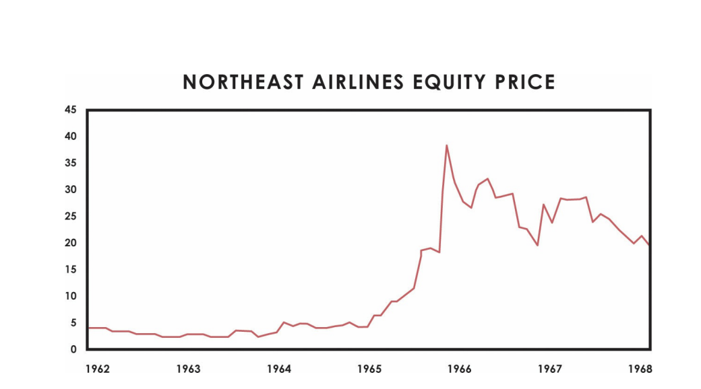

# TÔI ĐẾN TỪ ĐÂU

Thời gian giống như một dòng sông mang chúng ta đi
Chuyển tiếp vào các cuộc chạm trán với
Thực tế đòi hỏi chúng ta phải thực hiện
Quyết định. Chúng tôi không thể ngăn chặn
di chuyển xuống dòng sông này và chúng tôi
không thể tránh khỏi những cuộc gặp gỡ đó. Chúng ta chỉ có thể tiếp cận họ một cách tốt nhất
phương án khả thi

Khi chúng ta còn nhỏ, những người khác, điển hình là cha mẹ của chúng ta, hướng dẫn chúng ta vượt qua
cuộc gặp gỡ của chúng tôi với thực tế. Khi chúng ta già đi, chúng ta bắt đầu tự làm
sự lựa chọn. Chúng tôi chọn những gì chúng tôi đang theo đuổi (mục tiêu của chúng tôi) và điều đó ảnh hưởng đến
con đường của chúng ta. Nếu bạn muốn trở thành bác sĩ, bạn vào trường y; nếu bạn muốn
có gia đình, bạn tìm bạn đời; và như thế. Khi chúng ta tiến tới những mục tiêu này,
chúng ta gặp phải vấn đề, phạm sai lầm và đối mặt với chính bản thân mình
những điểm yếu. Chúng tôi tìm hiểu về bản thân và về thực tế và tạo ra những điều mới
các quyết định. Trong suốt cuộc đời của mình, chúng ta kiếm được hàng triệu triệu
các quyết định về cơ bản là đặt cược, một số lớn và một số nhỏ. Nó trả tiền để suy nghĩ
về cách chúng tôi tạo ra chúng bởi vì chúng là những gì cuối cùng quyết định
chất lượng cuộc sống của chúng ta.
Tất cả chúng ta được sinh ra với những khả năng tư duy khác nhau nhưng chúng ta không được sinh ra với
kỹ năng ra quyết định. Chúng tôi học chúng từ những cuộc gặp gỡ của chúng tôi với thực tế.
Trong khi con đường mà tôi đã đi là độc nhất vô nhị—được sinh ra bởi những bậc cha mẹ đặc biệt,
theo đuổi một nghề nghiệp cụ thể, có những đồng nghiệp cụ thể—tôi tin rằng
những nguyên tắc mà tôi đã học được trong quá trình thực hiện sẽ có hiệu quả như nhau đối với hầu hết mọi người trên
hầu hết các con đường. Khi bạn đọc câu chuyện của tôi, hãy cố gắng nhìn xuyên qua nó và tôi đến
các mối quan hệ nhân quả cơ bản—tại các lựa chọn tôi đã thực hiện và
hậu quả, những gì tôi học được từ chúng và cách tôi thay đổi cách tôi thực hiện
kết quả là các quyết định. Tự hỏi bản thân bạn muốn gì, tìm kiếm các ví dụ khác
những người có được những gì họ muốn, và cố gắng phân biệt nhân quả
các mẫu đằng sau thành tích của họ để bạn có thể áp dụng chúng để giúp bạn
đạt được mục tiêu của riêng bạn 

Để giúp bạn hiểu tôi đến từ đâu, tôi sẽ cho bạn một
tường thuật không tô vẽ về cuộc đời và sự nghiệp của tôi, đặc biệt nhấn mạnh vào
những sai lầm và điểm yếu và những nguyên tắc tôi học được từ chúng

## CHAPTER 1: MY CALL TO ADVENTURE: 1949–1967

sinh năm 1949 và lớn lên ở khu trung lưu Long Island,
con trai duy nhất của một nhạc sĩ nhạc jazz chuyên nghiệp và một bà mẹ nội trợ. tôi đã
một đứa trẻ bình thường trong một ngôi nhà bình thường và một học sinh kém hơn bình thường. TÔI
thích chơi xung quanh với bạn bè của tôi — chạm vào bóng đá trên đường phố và bóng chày
ở sân sau nhà hàng xóm khi tôi còn nhỏ và theo đuổi các cô gái khi tôi có
lớn hơn.
DNA của chúng ta mang lại cho chúng ta những điểm mạnh và điểm yếu bẩm sinh. rõ ràng nhất của tôi
điểm yếu là trí nhớ thuộc lòng tồi tệ của tôi. Tôi không thể, và vẫn không thể, nhớ
những sự thật không có lý do để tồn tại (như số điện thoại),
và tôi không thích làm theo hướng dẫn. Đồng thời, tôi rất tò mò
và thích tìm hiểu mọi thứ cho bản thân mình, mặc dù điều đó ít rõ ràng hơn ở
thời gian.
Tôi không thích trường học, không chỉ vì nó đòi hỏi phải ghi nhớ nhiều mà còn
bởi vì tôi không quan tâm đến hầu hết những điều mà giáo viên của tôi nghĩ là
quan trọng. Tôi chưa bao giờ hiểu học giỏi ở trường sẽ mang lại cho tôi điều gì khác
hơn là sự chấp thuận của mẹ tôi.
Mẹ tôi rất thương tôi và lo lắng về điểm kém của tôi. Cho đến giữa
trường học, cô ấy sẽ bắt tôi vào phòng và học trong vài giờ
trước khi ra ngoài chơi, nhưng tôi không thể tự mình làm điều đó. Cô ấy luôn luôn
ở đó cho tôi. Cô ấy gấp và buộc dây cao su những tờ báo tôi giao và
bánh quy nướng cho hai chúng tôi ăn trong khi xem phim kinh dị
cùng nhau vào tối thứ bảy. Bà mất khi tôi mười chín tuổi. Vào thời điểm đó, tôi
không thể tưởng tượng bao giờ cười một lần nữa. Bây giờ khi tôi nghĩ về cô ấy tôi mỉm cười

Bố tôi làm việc rất khuya với tư cách là một nhạc sĩ—cho đến khoảng ba giờ chiều
buổi sáng - vì vậy anh ấy ngủ muộn vào cuối tuần. Kết quả là, chúng tôi không có nhiều
một mối quan hệ khi tôi còn trẻ ngoài việc anh ấy liên tục cằn nhằn tôi 

chăm sóc các công việc như cắt cỏ và cắt hàng rào, mà tôi
ghét. Anh ấy là một người đàn ông có trách nhiệm đối phó với một đứa trẻ vô trách nhiệm. Ký ức
về cách chúng tôi tương tác có vẻ buồn cười với tôi ngày hôm nay. Ví dụ, một lần anh nói
tôi cắt cỏ và tôi quyết định chỉ làm sân trước và hoãn việc làm
phía sau, nhưng sau đó trời mưa vài ngày và cỏ ở sân sau
trở nên cao đến mức tôi phải cắt nó bằng liềm. Điều đó mất quá lâu đến nỗi vào thời điểm đó
Tôi đã làm xong, sân trước quá cao để cắt cỏ, v.v.
Sau khi mẹ tôi mất, bố tôi và tôi trở nên rất thân thiết, đặc biệt là khi tôi
bắt đầu gia đình riêng của tôi. Tôi vừa thích vừa yêu anh ấy. Anh ấy có một cách giản dị, vui vẻ
về anh ấy theo cách của các nhạc sĩ, và tôi ngưỡng mộ tính cách mạnh mẽ của anh ấy,
mà tôi cho rằng đến từ việc sống qua cuộc Đại suy thoái và chiến đấu
trong cả Thế chiến II và Chiến tranh Triều Tiên. Tôi có những kỷ niệm về anh ấy từ
khi ông ở tuổi bảy mươi, không ngần ngại lái xe qua những cơn bão tuyết lớn,
tự xúc mình ra bất cứ khi nào anh ấy gặp khó khăn như thể đó không phải là vấn đề lớn. Sau đó
chơi trong các câu lạc bộ và lập kỷ lục trong phần lớn cuộc đời mình, anh ấy bắt đầu chơi thứ hai
sự nghiệp ở tuổi ngoài sáu mươi, dạy nhạc ở trường trung học và tại một địa phương
đại học cộng đồng, ông tiếp tục học cho đến khi bị đau tim ở tuổi 81. Anh ấy sống thêm một thập kỷ sau đó, tinh thần minh mẫn hơn bao giờ hết.
Khi tôi không muốn làm điều gì đó, tôi sẽ chống lại nó, nhưng khi tôi
phấn khích về một cái gì đó, không có gì có thể giữ tôi lại. Ví dụ, trong khi tôi
không chịu làm việc nhà, tôi hăng hái làm việc nhà để kiếm tiền
tiền bạc. Bắt đầu từ năm tám tuổi, tôi đã có một lộ trình báo, xúc tuyết
đường lái xe của mọi người, caddyed, bàn ăn và rửa bát đĩa tại địa phương
nhà hàng, và các kệ hàng tại một cửa hàng bách hóa gần đó. Tôi không
nhớ bố mẹ tôi khuyến khích tôi làm những công việc này vì vậy tôi không thể nói làm thế nào tôi
đến bởi họ. Nhưng tôi biết rằng có những công việc đó và có một số tiền
để xử lý độc lập trong những năm đầu đã dạy cho tôi nhiều bài học quý giá
Tôi sẽ không học ở trường hay khi chơi.
Trong những năm đầu tiên của tôi, tâm lý của những năm 1960 ở Hoa Kỳ là khao khát và
truyền cảm hứng—để đạt được những mục tiêu vĩ đại và cao quý. Nó giống như không có gì tôi có
nhìn thấy kể từ đó. Một trong những ký ức đầu tiên của tôi là về John F. Kennedy, một
người đàn ông thông minh, lôi cuốn đã vẽ nên những bức tranh sống động về việc thay đổi thế giới
tốt hơn—khám phá không gian bên ngoài, đạt được quyền bình đẳng và loại bỏ
nghèo. Anh ấy và những ý tưởng của anh ấy có ảnh hưởng lớn đến suy nghĩ của tôi.
Hoa Kỳ lúc đó đang ở đỉnh cao so với phần còn lại của thế giới,
chiếm 40% nền kinh tế so với khoảng 20%
Hôm nay; đồng đô la là tiền tệ của thế giới; và Mỹ chiếm ưu thế

sức mạnh quân sự. “Tự do” có nghĩa là cam kết tiến về phía trước trong
một cách nhanh chóng và công bằng, trong khi “bảo thủ” có nghĩa là bị mắc kẹt trong cái cũ và
những cách không công bằng—ít nhất đó là cách mà tôi và hầu hết mọi người cảm thấy
quanh tôi. Như chúng ta đã thấy, Hoa Kỳ giàu có, tiến bộ, được quản lý tốt và
trên một nhiệm vụ để cải thiện nhanh chóng ở mọi thứ. Tôi có thể đã ngây thơ nhưng tôi
không đơn độc.
Trong những năm đó, mọi người đều nói về thị trường chứng khoán, bởi vì nó
đã làm rất tốt và mọi người đang kiếm tiền. Điều này bao gồm những người
chơi tại một sân gôn địa phương có tên là Links, nơi tôi bắt đầu làm caddie khi tôi
mười hai tuổi. Vì vậy, tôi đã lấy tiền caddie của mình và bắt đầu chơi chứng khoán
chợ. Khoản đầu tư đầu tiên của tôi là vào Hãng hàng không Đông Bắc. Tôi đã mua nó bởi vì nó
là công ty duy nhất mà tôi nghe nói được bán với giá dưới 5 đô la một cổ phiếu. TÔI
hình dung càng mua nhiều cổ phiếu, tôi càng kiếm được nhiều tiền. Đó là một
chiến lược ngu ngốc, nhưng tôi đã nhân ba số tiền của mình. Hãng hàng không Đông Bắc đã thực sự về
bị phá sản và một công ty khác đã mua lại nó. Tôi đã may mắn, nhưng tôi đã không biết điều đó
vào thời điểm đó. Tôi chỉ nghĩ kiếm tiền trên thị trường là dễ dàng, vì vậy tôi đã
mắc câu.
Vào thời đó, tạp chí Fortune có một phiếu giảm giá nhỏ mà bạn có thể
gửi thư để nhận báo cáo hàng năm miễn phí từ các công ty trong danh sách Fortune 500. tôi đã đặt
khu mua sắm. Tôi vẫn có thể nhớ đã xem người đưa thư không vui khi mang theo tất cả
những báo cáo đó đến cửa của chúng tôi, và tôi đã đào sâu vào từng người trong số họ. Đó là cách tôi
bắt đầu xây dựng một thư viện đầu tư. Khi thị trường chứng khoán tiếp tục leo thang,
Chiến tranh thế giới thứ hai và cuộc suy thoái dường như là những ký ức xa xôi và đầu tư
dường như chỉ đơn giản là mua bất cứ thứ gì và xem nó tăng giá. Nó
chắc chắn sẽ tăng lên, kiến thức chung được nắm giữ, bởi vì việc quản lý
kinh tế đã phát triển thành một khoa học. Rốt cuộc, cổ phiếu đã gần như
tăng gấp bốn lần trong mười năm trước, và một số đã làm tốt hơn nhiều so với
cái đó.

Kết quả là, “trung bình hóa chi phí bằng đồng đô la”—đầu tư về cơ bản cùng một đồng đô la
lượng trên thị trường mỗi tháng, bất kể nó có ít hay nhiều cổ phiếu.
có thể mua - là chiến lược mà hầu hết mọi người làm theo. Tất nhiên, chọn
những cổ phiếu tốt nhất thậm chí còn tốt hơn, vì vậy đó là điều mà tôi và những người khác đã cố gắng thực hiện.
Có hàng ngàn lựa chọn, tất cả được liệt kê gọn gàng trên vài trang cuối cùng
của tờ báo.
Trong khi tôi thích chơi thị trường, tôi cũng thích chơi xung quanh với
bạn bè, cho dù trong khu phố khi tôi còn nhỏ, sử dụng ID giả để có được
vào các quán bar khi chúng ta còn là thanh thiếu niên, hoặc ngày nay, đến các lễ hội âm nhạc và trên
những chuyến lặn biển cùng nhau. Tôi luôn là một người có suy nghĩ độc lập nghiêng về
chấp nhận rủi ro để tìm kiếm phần thưởng—không chỉ trên thị trường, mà trong hầu hết
mọi thứ. Tôi cũng sợ sự nhàm chán và tầm thường hơn tôi sợ
sự thất bại. Đối với tôi, tuyệt vời hơn là tồi tệ, và khủng khiếp thì tốt hơn
tầm thường, bởi vì khủng khiếp ít nhất mang lại cho cuộc sống hương vị. Niên giám trung học
trích dẫn những người bạn của tôi đã chọn cho tôi là từ Thoreau: “Nếu một người đàn ông không giữ
tốc độ với những người bạn đồng hành của mình, có lẽ đó là vì anh ta nghe thấy một sự khác biệt
tay trống. Hãy để anh ấy bước theo điệu nhạc mà anh ấy nghe, dù đo hay xa
xa."
Năm 1966, năm cuối trung học của tôi, thị trường chứng khoán vẫn đang bùng nổ
và tôi đã kiếm được nhiều tiền và thành công rực rỡ, học hết mình
bạn Phil đi lướt sóng, và làm điều mà các nam sinh trung học vui vẻ thường làm
LÀM. Tất nhiên lúc đó tôi không biết, nhưng năm đó là thị trường chứng khoán.
đứng đầu. Sau đó, hầu hết mọi thứ tôi nghĩ mình biết về thị trường đều
chứng minh sai.

--
Một cuộc tấn công bất ngờ đồng thời của Bắc Việt vào hơn một trăm thành phố
và các thị trấn ở miền Nam Việt Nam.
--

## CHAPTER 2: CROSSING THE THRESHOLD 1967–1979
Tôi bước vào giai đoạn này với những thành kiến mà tôi có được từ kinh nghiệm của mình
và những người xung quanh tôi. Năm 1966, giá tài sản phản ánh sự lạc quan của các nhà đầu tư
về tương lai. Nhưng giữa năm 1967 và 1979, những bất ngờ kinh tế tồi tệ đã dẫn đến
giảm giá lớn và bất ngờ. Không chỉ nền kinh tế và thị trường mà
tình cảm xã hội cũng xấu đi. Sống qua đó đã dạy tôi rằng
trong khi hầu hết mọi người đều mong đợi tương lai là một phiên bản sửa đổi đôi chút của
hiện tại, nó thường rất khác nhau. Nhưng tôi đã không biết điều đó vào năm 1967.
Chắc chắn rằng cổ phiếu cuối cùng sẽ phục hồi, tôi tiếp tục mua chúng, ngay cả khi
thị trường giảm và tôi mất tiền cho đến khi tôi tìm ra điều gì đang xảy ra và
Làm thế nào để đối phó với nó. Tôi dần dần biết được rằng giá cả phản ánh tâm lý của mọi người
mong đợi, vì vậy chúng tăng lên khi kết quả thực tế tốt hơn mong đợi và
họ đi xuống khi họ tồi tệ hơn dự kiến. Và hầu hết mọi người có xu hướng
bị thiên vị bởi những kinh nghiệm gần đây của họ.
Mùa thu năm đó, tôi bắt đầu học tại một trường cao đẳng địa phương, C. W. Post. tôi vào thử việc
bởi vì điểm trung bình C của tôi ở trường trung học. Nhưng không giống như trường trung học, tôi yêu
đại học bởi vì tôi có thể tìm hiểu về những điều mà tôi quan tâm, không phải vì tôi
phải, vì vậy tôi đã đạt điểm tuyệt vời. Tôi cũng thích sống xa nhà và có
Sự độc lập.
Học thiền cũng giúp ích. Khi The Beatles đến thăm Ấn Độ vào năm 1968 để
học Thiền Siêu Việt tại đạo tràng của Maharishi Mahesh Yogi, tôi
tò mò muốn tìm hiểu nó, vì vậy tôi đã làm. Tôi yêu nó. Thiền đã mang lại lợi ích cho tôi
trong suốt cuộc đời tôi bởi vì nó tạo ra một tâm trí cởi mở bình tĩnh mà
cho phép tôi suy nghĩ rõ ràng và sáng tạo hơn.
Tôi học chuyên ngành tài chính ở trường đại học vì tình yêu của tôi đối với thị trường và
bởi vì chuyên ngành đó không có yêu cầu về ngoại ngữ nên nó cho phép tôi
học những gì tôi quan tâm, cả trong và ngoài lớp học. tôi đã học được rất nhiều
Tôi bước vào giai đoạn này với những thành kiến mà tôi có được từ kinh nghiệm của mình
và những người xung quanh tôi. Năm 1966, giá tài sản phản ánh sự lạc quan của các nhà đầu tư
về tương lai. Nhưng giữa năm 1967 và 1979, những bất ngờ kinh tế tồi tệ đã dẫn đến
giảm giá lớn và bất ngờ. Không chỉ nền kinh tế và thị trường mà
tình cảm xã hội cũng xấu đi. Sống qua đó đã dạy tôi rằng
trong khi hầu hết mọi người đều mong đợi tương lai là một phiên bản sửa đổi đôi chút của
hiện tại, nó thường rất khác nhau. Nhưng tôi đã không biết điều đó vào năm 1967.
Chắc chắn rằng cổ phiếu cuối cùng sẽ phục hồi, tôi tiếp tục mua chúng, ngay cả khi
thị trường giảm và tôi mất tiền cho đến khi tôi tìm ra điều gì đang xảy ra và
Làm thế nào để đối phó với nó. Tôi dần dần biết được rằng giá cả phản ánh tâm lý của mọi người
mong đợi, vì vậy chúng tăng lên khi kết quả thực tế tốt hơn mong đợi và
họ đi xuống khi họ tồi tệ hơn dự kiến. Và hầu hết mọi người có xu hướng
bị thiên vị bởi những kinh nghiệm gần đây của họ.
Mùa thu năm đó, tôi bắt đầu học tại một trường cao đẳng địa phương, C. W. Post. tôi vào thử việc
bởi vì điểm trung bình C của tôi ở trường trung học. Nhưng không giống như trường trung học, tôi yêu
đại học bởi vì tôi có thể tìm hiểu về những điều mà tôi quan tâm, không phải vì tôi
phải, vì vậy tôi đã đạt điểm tuyệt vời. Tôi cũng thích sống xa nhà và có
Sự độc lập.
Học thiền cũng giúp ích. Khi The Beatles đến thăm Ấn Độ vào năm 1968 để
học Thiền Siêu Việt tại đạo tràng của Maharishi Mahesh Yogi, tôi
tò mò muốn tìm hiểu nó, vì vậy tôi đã làm. Tôi yêu nó. Thiền đã mang lại lợi ích cho tôi
trong suốt cuộc đời tôi bởi vì nó tạo ra một tâm trí cởi mở bình tĩnh mà
cho phép tôi suy nghĩ rõ ràng và sáng tạo hơn.
Tôi học chuyên ngành tài chính ở trường đại học vì tình yêu của tôi đối với thị trường và
bởi vì chuyên ngành đó không có yêu cầu về ngoại ngữ nên nó cho phép tôi
học những gì tôi quan tâm, cả trong và ngoài lớp học. tôi đã học được rất nhiều

về tương lai hàng hóa từ một người bạn cùng lớp rất thú vị, một người Việt Nam
cựu chiến binh lớn hơn tôi một chút. Hàng hóa hấp dẫn vì chúng
có thể được giao dịch với yêu cầu ký quỹ rất thấp, nghĩa là tôi có thể tận dụng
số tiền hạn chế mà tôi phải đầu tư. Nếu tôi có thể làm cho chiến thắng
những quyết định mà tôi đã lên kế hoạch thực hiện, tôi có thể vay thêm để kiếm thêm. Cổ phần,
trái phiếu và hợp đồng tương lai tiền tệ không tồn tại vào thời điểm đó. Hàng hóa tương lai đã
các mặt hàng thực sự nghiêm ngặt như ngô, đậu tương, gia súc và lợn. Vì vậy, đó là
những thị trường mà tôi bắt đầu giao dịch và tìm hiểu.
Những năm đại học của tôi trùng với thời của tình yêu tự do, thuốc mở mang đầu óc
thử nghiệm, và từ chối quyền lực truyền thống. Sống qua nó đã có một
ảnh hưởng lâu dài đến tôi và nhiều thành viên khác trong thế hệ của tôi. Ví dụ,
nó đã tác động sâu sắc đến Steve Jobs, người mà tôi dần đồng cảm và ngưỡng mộ.
Giống như tôi, anh ấy bắt đầu hành thiền và không quan tâm đến việc được dạy nhiều như vậy.
vì anh ấy thích hình dung và xây dựng những điều mới mẻ tuyệt vời. Những lần chúng tôi
sống ở đó đã dạy cả hai chúng tôi đặt câu hỏi về những cách làm việc đã được thiết lập sẵn—một
thái độ mà anh ấy đã thể hiện một cách xuất sắc trong biểu tượng của Apple “1984” và “Here's to
the Crazy Ones,” đó là những chiến dịch quảng cáo đã nói chuyện với tôi.
Đối với cả nước, đó là những năm khó khăn. Như dự thảo
mở rộng và số lượng nam thanh niên trở về nhà trong những chiếc túi đựng xác tăng vọt,
Chiến tranh Việt Nam chia cắt đất nước. Có xổ số dựa trên ngày sinh để
xác định thứ tự của những người sẽ được soạn thảo. tôi nhớ đã nghe
xổ số trên đài trong khi chơi bi da với bạn bè của tôi. Nó đã được ước tính
rằng khoảng 160 sinh nhật đầu tiên được gọi sẽ được soạn thảo, mặc dù họ đã đọc sai
tất cả 366 ngày. Sinh nhật của tôi là bốn mươi tám.
Tôi không đủ thông minh để sợ chiến tranh vì tôi ngây thơ
nghĩ rằng không có gì xấu có thể xảy ra với tôi, nhưng tôi không muốn đi vì tôi
đang tiến về phía trước với cuộc sống của tôi và để giữ nó trong hai năm dường như
như một sự vĩnh hằng. Tuy nhiên, bố tôi kiên quyết phản đối chiến tranh và
chống lại tôi, mặc dù anh ấy đã tin tưởng và chiến đấu trong hai lần trước
chiến tranh. Anh ấy đã khám cho tôi bởi một bác sĩ phát hiện ra tôi bị hạ đường huyết,
đã cho tôi một sự miễn trừ. Khi tôi nhìn lại điều đó, tôi thấy rằng tôi đã thoát khỏi
phục vụ có tính kỹ thuật—rằng bố tôi về cơ bản đang giúp tôi tránh
bản nháp—mà giờ đây mang lại cho tôi nhiều cảm xúc lẫn lộn. Tôi cảm thấy tội lỗi tôi đã không làm phần việc của mình,
nhẹ nhõm vì tôi đã không trải qua những hậu quả tai hại như nhiều người khác
đau khổ vì chiến tranh, và đánh giá cao cha tôi vì tình yêu đằng sau
nỗ lực bảo vệ tôi. Tôi không biết mình sẽ làm gì nếu đối mặt với điều tương tự
tình hình ngày nay.

Khi chính trị và kinh tế của Mỹ xấu đi, tâm trạng của đất nước
trở nên chán nản. Trận Tết Mậu Thân tháng 1 năm 1968
1 dường như truyền đạt
Hoa Kỳ đã thua trong cuộc chiến; cùng năm đó Lyndon Johnson quyết định không tranh cử
cho nhiệm kỳ thứ hai và Richard Nixon đắc cử, bắt đầu một
thời đại khó khăn. Cùng lúc đó, tổng thống Pháp Charles de Gaulle đã
chuyển đô la của đất nước mình sang vàng vì anh ta lo ngại Hoa Kỳ
đã in tiền để tài trợ cho chi tiêu của mình. Xem tin tức và
thị trường di chuyển cùng nhau, tôi bắt đầu nhìn thấy bức tranh toàn cảnh và hiểu
quan hệ nhân quả giữa hai bên.
Khoảng năm 1970 hoặc 1971, tôi nhận thấy vàng bắt đầu tăng giá trên thế giới.
thị trường. Cho đến lúc đó, giống như hầu hết mọi người, tôi đã không chú ý nhiều đến
tỷ giá tiền tệ vì hệ thống tiền tệ đã ổn định trong suốt
cả đời. Nhưng khi các sự kiện tiền tệ xuất hiện ngày càng nhiều trên các bản tin, chúng
khiến tôi chú ý. Tôi biết được rằng các loại tiền tệ khác đã được cố định so với
đô la, rằng đồng đô la được cố định so với vàng, rằng người Mỹ không được phép
sở hữu vàng (mặc dù tôi không chắc tại sao) và rằng các ngân hàng trung ương khác có thể
chuyển đổi đô la giấy của họ thành vàng, đó là cách họ được đảm bảo rằng
họ sẽ không bị tổn hại nếu Hoa Kỳ in quá nhiều đô la. tôi nghe nói của chúng tôi
các quan chức chính phủ lo lắng về đồng đô la và
phấn khích về vàng, đảm bảo với chúng tôi rằng đồng đô la ổn định và vàng
chỉ là một kim loại cổ xưa. Các nhà đầu cơ đứng sau việc tăng giá vàng,
họ nói, và họ sẽ bị đốt cháy khi mọi thứ ổn định. Hồi đó, tôi
vẫn cho rằng các quan chức chính phủ là trung thực.
Mùa xuân năm 1971, tôi tốt nghiệp đại học với số điểm gần tuyệt đối
trung bình, điều đó đã đưa tôi vào Trường Kinh doanh Harvard. Mùa hè trước khi tôi
bắt đầu làm việc tại HBS, tôi nhận được công việc thư ký tại sàn chứng khoán New York
Trao đổi. Đến giữa mùa hè, vấn đề đồng đô la bắt đầu đạt đến đỉnh điểm
điểm. Có báo cáo rằng người châu Âu sẽ không chấp nhận đô la từ
du khách Mỹ. Hệ thống tiền tệ toàn cầu đang trong quá trình
phá vỡ, nhưng điều đó vẫn chưa rõ ràng với tôi.
Sau đó, vào Chủ nhật, ngày 15 tháng 8 năm 1971, Tổng thống Nixon lên truyền hình để
thông báo rằng Hoa Kỳ sẽ từ bỏ lời hứa cho phép đô la được
chuyển sang mua vàng, khiến đồng đô la giảm mạnh. Kể từ khi chính phủ
các quan chức đã hứa sẽ không phá giá đồng đô la, tôi đã lắng nghe với sự kinh ngạc khi
anh ấy đã nói. Thay vì giải quyết các vấn đề cơ bản đằng sau
áp lực lên đồng đô la, ông tiếp tục đổ lỗi cho các nhà đầu cơ, tạo ra lời nói của mình
để làm cho có vẻ như anh ta đang di chuyển để hỗ trợ đồng đô la trong khi hành động của anh ta

đang làm điều ngược lại. “Làm nổi nó,” như Nixon đang làm, và sau đó
để nó chìm xuống như một hòn đá, đối với tôi trông giống như một lời nói dối. Qua nhiều thập kỷ
kể từ đó, tôi đã nhiều lần thấy các nhà hoạch định chính sách đưa ra những đảm bảo như vậy ngay lập tức
trước khi phá giá tiền tệ, vì vậy tôi đã học cách không tin vào chính phủ
các nhà hoạch định chính sách khi họ đảm bảo với bạn rằng họ sẽ không để đồng tiền mất giá
xảy ra. Họ càng khẳng định chắc chắn, họ càng tuyệt vọng.
tình hình có thể là như vậy, vì vậy càng có nhiều khả năng xảy ra sự phá giá
địa điểm.
Khi tôi nghe Nixon nói, tôi tự hỏi những diễn biến đó có nghĩa là gì.
Tiền như chúng ta từng biết - séc yêu cầu lấy vàng - không còn tồn tại nữa. Cái đó
không thể tốt được. Tôi thấy rõ ràng rằng kỷ nguyên hứa hẹn mà Kennedy
đã được nhân cách hóa đã được làm sáng tỏ.
Sáng thứ Hai, tôi bước lên sàn giao dịch với hy vọng
hỗn loạn. Có một sự hỗn loạn được rồi, nhưng không phải là loại tôi mong đợi:
Thay vì giảm, thị trường chứng khoán đã tăng khoảng 4%, một con số đáng kể
lãi hàng ngày.
Để cố gắng hiểu chuyện gì đang xảy ra, tôi đã dành phần còn lại của mùa hè đó
nghiên cứu sự phá giá tiền tệ trong quá khứ. Tôi học được rằng mọi thứ đang diễn ra
về—đồng tiền phá vỡ liên kết của nó với vàng và phá giá, thị trường chứng khoán
tăng vọt trong phản ứng - đã xảy ra trước đó, và nguyên nhân hợp lý đó
các mối quan hệ làm cho những phát triển không thể tránh khỏi. sự thất bại của tôi để dự đoán
điều này, tôi nhận ra, là do tôi bị bất ngờ bởi điều gì đó không
đã xảy ra trong cuộc đời tôi, mặc dù nó đã xảy ra nhiều lần trước đây. Các
thông điệp mà thực tế đang truyền đạt cho tôi là “Tốt hơn hết bạn nên hiểu
điều gì đã xảy ra với những người khác ở những thời điểm khác và những nơi khác bởi vì nếu bạn
bạn sẽ không biết nếu những điều này có thể xảy ra với bạn và, nếu chúng xảy ra, bạn
sẽ không biết làm thế nào để đối phó với họ.
Ghi danh vào Trường Kinh doanh Harvard vào mùa thu năm đó, tôi rất phấn khích về
gặp gỡ những người cực kỳ thông minh từ khắp nơi trên hành tinh, những người
sẽ là bạn cùng lớp của tôi. Và cao như mong đợi của tôi, trải nghiệm
thậm chí còn tốt hơn. Tôi đã sống với mọi người từ khắp nơi trên thế giới và chúng tôi đã tiệc tùng
cùng nhau trong một môi trường thú vị, chiết trung. Không có giáo viên trước mặt
một bảng đen cho chúng tôi biết những gì cần nhớ và không có bài kiểm tra nào để xem liệu chúng tôi có
nhớ nó. Thay vào đó, chúng tôi được cung cấp các nghiên cứu điển hình thực tế để đọc và phân tích.
Sau đó, chúng tôi tập hợp thành các nhóm để thảo luận xem chúng tôi sẽ làm gì nếu ở trong
giày của những người trong những tình huống đó. Đây là loại trường học của tôi!

Trong khi đó, nhờ làn sóng in tiền kéo theo
sự sụp đổ của bản vị vàng, nền kinh tế và thị trường chứng khoán đã tăng vọt.
Cổ phiếu đã tăng trở lại vào năm 1972 và thời trang lúc đó là Nifty 50.
Nhóm năm mươi cổ phiếu này có tốc độ tăng trưởng thu nhập nhanh và ổn định và được
được nhiều người tin là một điều chắc chắn.
Khi thị trường chứng khoán nóng, tôi quan tâm đến giao dịch hơn
hàng hóa, vì vậy mùa xuân năm đó tôi đã cầu xin giám đốc hàng hóa tại Merrill
Lynch để cho tôi một công việc mùa hè. Anh ngạc nhiên vì mọi người từ
những nơi như Trường Kinh doanh Harvard thường không quan tâm đến
hàng hóa vốn được coi là đứa con ghẻ khó hiểu của Phố Wall
ngành môi giới. Cho đến lúc đó, theo như tôi biết, không có Harvard Business
Học sinh của trường đã từng làm việc trong tương lai hàng hóa ở bất cứ đâu. tường nhất
Các công ty đường phố thậm chí còn không có bộ phận hợp đồng tương lai hàng hóa, và Merrill
Lynch's nhỏ, nằm khuất trên một con phố nhỏ và được trang bị cơ bản.
bàn kim loại.
Vài tháng sau, khi tôi quay lại học năm thứ hai tại HBS, năm đầu tiên
cú sốc dầu bắt đầu, với giá tăng gấp bốn lần chỉ trong vài tháng. Mỹ.
nền kinh tế chậm lại, giá cả hàng hóa tăng vọt, và vào năm 1973, thị trường chứng khoán
đã lặn. Một lần nữa, tôi đã bị che mắt—nhưng khi nhìn lại, tôi có thể thấy rằng
các domino đã rơi theo một trình tự hợp lý.
Trong trường hợp này, bội chi tài trợ bằng nợ của những năm 1960 đã tiếp tục
vào đầu những năm 1970. Fed đã tài trợ cho chi tiêu này bằng tín dụng dễ dàng
chính sách, nhưng thay vào đó bằng cách trả lại các khoản nợ bằng tiền giấy mất giá
của đô la được bảo đảm bằng vàng, Hoa Kỳ đã vỡ nợ một cách hiệu quả. Đương nhiên, với tất cả điều này
in tiền đồng đô la giảm giá trị. Điều đó cho phép dễ dàng hơn
tín dụng, dẫn đến chi tiêu nhiều hơn. Sự gia tăng lạm phát sau đó
sự sụp đổ của hệ thống tiền tệ khiến giá cả hàng hóa thậm chí còn cao hơn. TRONG
phản ứng lại, vào năm 1973, Fed đã thắt chặt chính sách tiền tệ, đây là điều trọng tâm
các ngân hàng làm gì khi lạm phát và tăng trưởng quá mạnh. Điều này lần lượt gây ra
sự sụt giảm tồi tệ nhất trong chứng khoán và sự suy yếu tồi tệ nhất của nền kinh tế kể từ
Đại khủng hoảng. Nifty 50 bị ảnh hưởng đặc biệt, lao dốc nghiêm trọng.
Bài học? Khi mọi người đều nghĩ giống nhau—chẳng hạn như điều chắc chắn
đặt cược vào Nifty 50 là—nó gần như chắc chắn được phản ánh trong giá cả và đặt cược vào
nó có lẽ sẽ là một sai lầm. Tôi cũng học được rằng đối với mọi hành động (như
như tiền dễ dàng và tín dụng) có một hệ quả (trong trường hợp này, cao hơn
lạm phát) tương ứng với hành động đó, gây ra

phản ứng gần như bằng nhau và ngược lại (thắt chặt tiền tệ và tín dụng)
và đảo ngược thị trường.
Tôi bắt đầu thấy mọi thứ xảy ra lặp đi lặp lại, dẫn đến
tôi để thấy rằng hầu hết mọi thứ đều là “một trong số đó”: Hầu hết mọi thứ đều có
đã xảy ra nhiều lần trước đây vì lý do nhân quả hợp lý. Tất nhiên, được
có thể vừa xác định chính xác cái nào đang xảy ra và để
hiểu mối quan hệ nhân quả đằng sau chúng vẫn còn khó khăn.
Mặc dù hầu hết mọi thứ dường như không thể tránh khỏi và hợp lý khi nhìn lại, nhưng không có gì
gần như rõ ràng trong thời gian thực.
Bởi vì mọi người chạy theo những gì hấp dẫn và tránh những gì không, đầu tư chứng khoán giảm
không còn được ưa chuộng sau năm 1973 và giao dịch hàng hóa trở thành việc phải làm. Với
nền tảng của tôi về hàng hóa và bằng MBA Harvard, tôi đã trở thành tài sản được săn đón. Dominick & Dominick, một cây cỡ trung bình, hàng trăm tuổi
công ty môi giới, đã thuê tôi làm giám đốc hàng hóa với mức lương 25.000 đô la một năm,
gần như cao nhất so với mức lương khởi điểm của sinh viên tốt nghiệp HBS vào năm đó.
Sếp mới của tôi đã ghép tôi với một anh chàng lớn tuổi hơn, có kinh nghiệm và có nhiều
kinh nghiệm môi giới hàng hóa, và chúng tôi được giao nhiệm vụ thiết lập
thành lập bộ phận hàng hóa. Tôi đã vượt qua đầu của tôi, mặc dù tôi đã quá
kiêu ngạo để nhận ra nó vào thời điểm đó. Tôi có lẽ đã học được rất nhiều
bài học đau đớn đã tiếp tục công việc, nhưng thị trường chứng khoán xấu
Dominick & Dominick dưới quyền trước khi chúng tôi đạt được nhiều tiến bộ.
Khi nền kinh tế suy thoái, vụ bê bối Watergate thống trị các tiêu đề
và tôi lại thấy chính trị và kinh tế đan xen như thế nào, thường là với
kinh tế hàng đầu. Vòng xoáy đi xuống này khiến mọi người trở nên bi quan,
vì vậy họ đã bán cổ phiếu của mình và thị trường tiếp tục giảm. Những điều không thể
đã trở nên tồi tệ hơn nhiều nhưng mọi người đều sợ rằng họ sẽ như vậy. đó là
hình ảnh phản chiếu của những gì tôi đã chứng kiến vào năm 1966 khi thị trường chạm đỉnh, và
cũng giống như lúc đó, sự đồng thuận đã sai. Khi mọi người rất
bi quan, họ bán hết, giá thường rất rẻ, và hành động để
cải thiện điều kiện phải được thực hiện. Chắc chắn rồi, Fed nới lỏng chính sách tiền tệ
chính sách và cổ phiếu chạm đáy vào tháng 12 năm 1974.
Vào thời điểm đó, tôi còn độc thân và sống ở New York; tôi đã có một tuyệt vời
thời gian tiệc tùng với bạn bè từ HBS và hẹn hò rất nhiều. bạn cùng phòng của tôi là
hẹn hò với một phụ nữ Cuba và anh ta sắp đặt cho tôi một buổi hẹn hò mù quáng với một trong số cô ấy
bạn bè, một phụ nữ kỳ lạ đến từ Tây Ban Nha tên là Barbara, người hầu như không thể nói được
Tiếng Anh. Đây không phải là một vấn đề, bởi vì chúng tôi đã giao tiếp theo những cách khác nhau.
Cô ấy đã làm tôi rung động gần hai năm trước khi chúng tôi chuyển đến sống cùng nhau, có

đã kết hôn, có bốn người con trai và cùng nhau chia sẻ một cuộc sống tuyệt vời. Cô ấy vẫn hồi hộp
tôi nhưng là một người quá riêng tư để tôi có thể nói nhiều hơn về cô ấy.
Trong khi tôi làm việc trong lĩnh vực môi giới, tôi cũng giao dịch bằng tài khoản của chính mình.
Mặc dù tôi có nhiều vị thế thắng hơn là thua, nhưng tôi chỉ có thể
nhớ lại những người mất bây giờ. Tôi nhớ một cái lớn khi tôi sở hữu thịt lợn
bụng bầu. Trong vài ngày, thị trường dành cho họ đã bị giới hạn - có nghĩa là
giá đã giảm xuống thấp đến mức giao dịch phải dừng lại. Sau đó tôi đã mô tả
tác động của trải nghiệm này đối với Jack Schwager, tác giả cuốn Hedge Fund
Pháp sư thị trường:
Vào thời đó, chúng tôi có những bảng hàng hóa lớn, nhấp vào bất cứ khi nào
giá thay đổi. Vì vậy, mỗi buổi sáng, vào ngày khai mạc, tôi sẽ thấy và nghe thấy
thị trường nhấp xuống 200 điểm, giới hạn hàng ngày, không thay đổi ở mức đó
giá, và biết rằng tôi đã mất nhiều hơn thế, với số lượng
tổn thất bổ sung tiềm ẩn vẫn chưa được xác định. Đó là một xúc giác rất
kinh nghiệm . . . [và] nó đã dạy tôi tầm quan trọng của việc kiểm soát rủi ro, bởi vì
Tôi không bao giờ muốn trải qua nỗi đau đó một lần nữa. Nó tăng cường nỗi sợ hãi của tôi về
đã sai và dạy tôi đảm bảo rằng không có vụ cá cược nào, hoặc thậm chí
nhiều cược, có thể khiến tôi thua nhiều hơn số tiền có thể chấp nhận được. TRONG
giao dịch bạn phải phòng thủ và tích cực cùng một lúc. nếu bạn
không tích cực, bạn sẽ không kiếm được tiền, và nếu bạn không
phòng thủ, bạn sẽ không giữ tiền. Tôi tin rằng bất cứ ai có
kiếm tiền trong giao dịch đã phải trải qua nỗi đau khủng khiếp tại một số
điểm. Giao dịch giống như làm việc với điện; bạn có thể nhận được một điện
sốc. Với việc buôn bán thịt lợn và các giao dịch khác, tôi cảm thấy bị điện giật
và nỗi sợ hãi đi kèm với nó.
Sau khi Dominick & Dominick đóng cửa hoạt động kinh doanh bán lẻ, tôi chuyển sang kinh doanh
công ty môi giới lớn hơn, thành công hơn. Trong thời gian ngắn ở đó, tôi đã mất
qua nhiều công ty khác và đổi tên nhiều lần, cuối cùng
trở thành Shearson, mặc dù Sandy Weill vẫn chịu trách nhiệm về tất cả.
Shearson giao cho tôi phụ trách mảng phòng ngừa rủi ro tương lai của công ty, bao gồm
cả hợp đồng tương lai hàng hóa và hợp đồng tương lai tài chính. tôi là người đã giúp đỡ
những khách hàng gặp rủi ro về giá trong doanh nghiệp của họ quản lý chúng bằng cách sử dụng hợp đồng tương lai.
Tôi đã phát triển khá chuyên môn trong thị trường ngũ cốc và gia súc, những thị trường thường
dẫn tôi xuống Tây Texas và các vùng nông nghiệp của California. Các
Những người môi giới Shearson, những người chăn nuôi gia súc và những người buôn bán ngũ cốc mà tôi đã giao dịch rất tuyệt vời

những người đã đưa tôi vào thế giới của họ, đưa tôi đến với honky-tonks, chim bồ câu
săn bắn, và tiệc nướng. Chúng tôi đã làm việc và cùng nhau bùng nổ, và tôi đã xây dựng một
cuộc sống thứ hai với họ kéo dài vài năm—mặc dù công việc của tôi ở Shearson
chỉ kéo dài hơn một năm.
Mặc dù tôi yêu thích công việc và những người tôi làm việc cùng, nhưng tôi không phù hợp với
Tổ chức Shearson. Tôi đã quá hoang dã. Ví dụ, như một trò đùa mà bây giờ dường như
khá ngu ngốc, tôi đã thuê một vũ nữ thoát y để cởi bỏ chiếc áo choàng của cô ấy khi tôi đang giảng bài tại một
bảng trắng tại hội nghị thường niên của Hiệp hội Ngũ cốc & Thức ăn chăn nuôi California. TÔI
còn đấm vào mặt sếp. Không ngạc nhiên, tôi đã bị sa thải.
Nhưng những người môi giới, khách hàng của họ và thậm chí cả những người đã sa thải tôi đều thích tôi và
muốn tiếp tục nhận được lời khuyên của tôi. Thậm chí tốt hơn, họ sẵn sàng trả tiền cho tôi
vì nó, vì vậy vào năm 1975, tôi thành lập Bridgewater Associates.

> BẮT ĐẦU NƯỚC CẦU

Trên thực tế, tôi đã khởi động lại nó. Ngay sau khi tôi tốt nghiệp HBS và đi làm ở
hàng hóa tại Dominick & Dominick, tôi sẽ thành lập một công việc kinh doanh nhỏ với Bob
Scott, một người bạn từ HBS. Cùng với một vài người bạn ở các quốc gia khác, chúng tôi đã thực hiện
những nỗ lực nửa vời để bán hàng hóa từ Hoa Kỳ sang các nước khác. Chúng tôi
gọi nó là Bridgewater bởi vì chúng tôi đang “bắc cầu qua vùng nước” và nó có một
nhẫn tốt cho nó. Đến năm 1975, công ty hàng hóa này không còn nhiều nữa,
nhưng vì nó đã tồn tại trên giấy nên tôi đã sử dụng nó.
Tôi đã làm việc trong căn hộ hai phòng ngủ của mình. Khi một người bạn từ HBS mà tôi
ở chung căn hộ với người dọn ra ngoài, tôi biến phòng ngủ của anh ấy thành văn phòng. tôi đã làm việc
với một người bạn khác mà tôi chơi bóng bầu dục cùng, và chúng tôi đã thuê một phụ nữ trẻ tuyệt vời
người đã làm việc như trợ lý của chúng tôi. Đó là Bridgewater.
Tôi đã dành phần lớn thời gian của mình để theo dõi thị trường và đặt mình vào
giày của các khách hàng doanh nghiệp của tôi để cho họ thấy tôi sẽ xử lý rủi ro thị trường như thế nào
nếu tôi là họ. Và tất nhiên tôi tiếp tục giao dịch tài khoản của chính mình. Theo đuổi
một nhiệm vụ với bạn bè để giúp khách hàng đánh bại thị trường thú vị hơn nhiều
hơn là có một công việc thực sự. Miễn là chi phí sinh hoạt cơ bản của tôi được trang trải, tôi
biết tôi sẽ được hạnh phúc.
Năm 1977, tôi và Barbara quyết định có một đứa con nên chúng tôi kết hôn. Chúng tôi
chuyển đến một ngôi nhà đá nâu thuê ở Manhattan và tôi chuyển công ty
ở đó nữa. Người Nga đã mua rất nhiều ngũ cốc vào thời điểm đó và muốn tôi
lời khuyên, vì vậy tôi đã đưa Barbara đi hưởng tuần trăng mật kết hợp với chuyến đi công tác tới
Liên Xô. Chúng tôi đến Mát-xcơ-va vào đêm giao thừa và bắt xe buýt từ
sân bay buồn tẻ xuyên qua lớp tuyết phủ đầy bụi, qua Nhà thờ St. Basil đến một tòa nhà lớn
tiệc tùng với rất nhiều người Nga vô cùng thân thiện, vui vẻ.
Công việc kinh doanh của tôi luôn là một cách đưa tôi đến những nơi kỳ lạ và cho phép
tôi để gặp gỡ những người thú vị. Nếu tôi kiếm được tiền từ những chuyến đi đó, đó là
chỉ đóng băng trên bánh

> MÔ HÌNH THỊ TRƯỜNG NHƯ MÁY

Tôi đã thực sự chú tâm vào chăn nuôi, thịt, ngũ cốc và hạt có dầu.
thị trường. Tôi yêu chúng vì chúng cụ thể và ít chủ đề hơn cổ phiếu
đến những nhận thức méo mó về giá trị. Trong khi cổ phiếu có thể ở mức quá cao hoặc quá thấp
bởi vì "những kẻ ngu ngốc hơn" tiếp tục mua hoặc bán chúng, gia súc đã kết thúc
quầy thịt nơi nó sẽ được định giá dựa trên những gì người tiêu dùng
sẵn sàng trả. Tôi có thể hình dung các quy trình dẫn đến những lần bán hàng đó và xem
các mối quan hệ bên dưới chúng. Vì gia súc ăn ngũ cốc (chủ yếu là ngô) và
bột đậu tương, và vì ngô và đậu tương cạnh tranh về diện tích, những thị trường đó
liên quan chặt chẽ. Tôi đã học được gần như mọi thứ có thể tưởng tượng được về họ—những gì
diện tích trồng trọt và năng suất điển hình là trong mỗi loại cây trồng chính
khu vực; cách chuyển đổi lượng mưa trong các tuần khác nhau của mùa sinh trưởng
vào ước tính năng suất; làm thế nào để dự kiến quy mô thu hoạch, chi phí vận chuyển, và
kiểm kê vật nuôi theo nhóm trọng lượng, địa bàn và tỷ lệ tăng trọng; Và
làm thế nào để dự đoán sản lượng thay đồ, lợi nhuận của nhà bán lẻ, sở thích của người tiêu dùng bằng cách cắt giảm
thịt, và số lượng giết mổ trong mỗi mùa.
Đây không phải là học tập hàn lâm: Những người thực hành trong doanh nghiệp
cho tôi thấy các quy trình nông nghiệp hoạt động như thế nào và tôi đã tổ chức những gì chúng
nói với tôi thành các mô hình mà tôi đã sử dụng để lập bản đồ tương tác của các bộ phận đó thông qua
thời gian.
Ví dụ, bằng cách biết có bao nhiêu gia súc, gà và lợn
cho ăn, lượng ngũ cốc chúng ăn và tốc độ tăng cân của chúng, tôi có thể
dự đoán cả khi nào và bao nhiêu thịt sẽ được tung ra thị trường cũng như khi nào và
bao nhiêu ngô và bột đậu nành sẽ được tiêu thụ. Tương tự như vậy, bằng cách xem cách
nhiều diện tích được trồng ngô và đậu tương ở tất cả các khu vực trồng trọt,
thực hiện hồi quy cho thấy lượng mưa ảnh hưởng như thế nào đến sản lượng ở mỗi
những khu vực này, và áp dụng dự báo thời tiết và dữ liệu lượng mưa, tôi có thể dự đoán
thời gian và số lượng sản xuất ngô và đậu tương. Đối với tôi tất cả trông

giống như một cỗ máy đẹp đẽ với các mối quan hệ nhân quả hợp lý. Qua
hiểu những mối quan hệ này, tôi có thể đưa ra các quy tắc quyết định (hoặc
nguyên tắc) Tôi có thể làm mẫu.
Những mô hình ban đầu này khác xa so với những mô hình chúng ta sử dụng bây giờ; họ đã
bản phác thảo phía sau phong bì, được phân tích và chuyển đổi thành máy tính
các chương trình với công nghệ mà tôi có thể mua được vào thời điểm đó. Tại rất
bắt đầu, tôi đã thực hiện hồi quy trên thiết bị cầm tay Hewlett-Packard HP-67 của mình
máy tính, vẽ biểu đồ bằng tay bằng bút chì màu và ghi lại mọi
kinh doanh sổ tay sáng tác. Khi máy tính cá nhân xuất hiện, tôi
có thể nhập các con số và xem chúng được chuyển đổi thành hình ảnh của những gì
sẽ xảy ra trên bảng tính. Biết cách chăn nuôi gia súc, lợn và gà
tiến bộ qua các giai đoạn sản xuất của họ, cách họ cạnh tranh để giành được đô la của những người ăn thịt, những người ăn thịt sẽ chi tiêu như thế nào và tại sao, và lợi nhuận như thế nào
lợi nhuận của nhà đóng gói thịt và nhà bán lẻ sẽ ảnh hưởng đến hành vi của họ (vì
dụ, họ sẽ đẩy những miếng thịt nào vào quảng cáo), tôi có thể thấy
làm thế nào máy tạo ra giá gia súc, lợn và gà mà tôi có thể đặt cược.
Cơ bản như những mô hình ban đầu đó, tôi thích xây dựng và tinh chỉnh chúng—
và họ đủ giỏi để kiếm tiền cho tôi. Cách tiếp cận giá
quyết định tôi đang sử dụng khác với quyết định tôi đã học được trong
các lớp học kinh tế nơi cung và cầu đều được đo bằng
số lượng đã bán. Tôi thấy việc đo lường nhu cầu thực tế hơn nhiều khi
số tiền đã chi tiêu (thay vì số lượng đã mua) và để xem ai là
người mua và người bán là ai và tại sao họ mua và bán. tôi sẽ giải thích điều này
cách tiếp cận trong Nguyên lý Kinh tế và Đầu tư.
Cách tiếp cận khác biệt này là một trong những lý do chính khiến tôi nắm bắt được các vấn đề kinh tế và
thị trường di chuyển những người khác bỏ lỡ. Kể từ thời điểm đó, bất cứ khi nào tôi nhìn vào bất kỳ
thị trường—hàng hóa, cổ phiếu, trái phiếu, tiền tệ, bất cứ thứ gì—tôi có thể thấy và
hiểu sự mất cân bằng mà những người khác đã xác định cung và cầu trong
cách truyền thống (như các đơn vị bằng nhau) bị bỏ lỡ.
Hình dung các hệ thống phức tạp như máy móc, tìm ra nguyên nhân-kết quả
các mối quan hệ bên trong chúng, viết ra các nguyên tắc để giải quyết chúng,
và đưa chúng vào máy tính để máy tính có thể “ra quyết định”
đối với tôi tất cả đã trở thành thông lệ tiêu chuẩn.
Đừng hiểu lầm tôi. Cách tiếp cận của tôi còn lâu mới hoàn hảo. tôi sống động
hãy nhớ một vụ cá cược “không thể thua” đã tiêu tốn của cá nhân tôi khoảng 100.000 đô la. Cái đó
là phần lớn tài sản ròng của tôi vào thời điểm đó. Đau đớn hơn nữa, nó làm tổn thương khách hàng của tôi
cũng vậy. Bài học đau đớn nhất đã được nhắc đi nhắc lại nhiều lần là bạn

không bao giờ có thể chắc chắn về bất cứ điều gì: Luôn có những rủi ro ngoài kia có thể gây tổn thương
bạn rất tệ, ngay cả trong những vụ cá cược có vẻ an toàn nhất, vì vậy, tốt nhất là bạn luôn cho rằng
bạn đang thiếu một cái gì đó. Bài học này đã thay đổi cách tiếp cận quyết định của tôi
thực hiện theo những cách sẽ vang vọng xuyên suốt cuốn sách này—và theo đó tôi
thuộc tính nhiều thành công của tôi. Nhưng tôi sẽ phạm nhiều sai lầm khác trước đây
Tôi hoàn toàn thay đổi hành vi của mình.

> XÂY DỰNG DOANH NGHIỆP

Vừa kiếm tiền đã sướng, vừa có việc ý nghĩa lại ý nghĩa
các mối quan hệ đã tốt hơn rất nhiều. Đối với tôi, công việc có ý nghĩa là thực hiện sứ mệnh mà tôi
trở nên say mê và những mối quan hệ có ý nghĩa là những mối quan hệ tôi có với
những người tôi quan tâm sâu sắc và những người quan tâm sâu sắc đến tôi.
Hãy nghĩ về điều này: Thật vô nghĩa khi lấy tiền làm mục tiêu của bạn
tiền không có giá trị nội tại—giá trị của nó đến từ những gì nó có thể mua, và nó
không thể mua tất cả mọi thứ. Sẽ thông minh hơn nếu bắt đầu với những gì bạn thực sự muốn,
là mục tiêu thực sự của bạn, và sau đó làm việc trở lại với những gì bạn cần để đạt được chúng.
Tiền sẽ là một trong những thứ bạn cần, nhưng nó không phải là thứ duy nhất và
chắc chắn không phải là điều quan trọng nhất một khi bạn vượt qua được số tiền bạn
cần phải có được những gì bạn thực sự muốn.
Khi nghĩ về những thứ bạn thực sự muốn, bạn nên nghĩ về chúng.
giá trị tương đối để bạn cân chúng đúng cách. Trong trường hợp của tôi, tôi muốn có ý nghĩa
công việc và các mối quan hệ có ý nghĩa như nhau, và tôi coi trọng tiền bạc hơn—miễn là
vì tôi đã có đủ để lo cho những nhu cầu cơ bản của mình. Khi nghĩ về người thân
tầm quan trọng của các mối quan hệ tuyệt vời và tiền bạc, rõ ràng là các mối quan hệ
quan trọng hơn vì không có số tiền tôi sẽ nhận
đổi lấy một mối quan hệ có ý nghĩa, bởi vì tôi không có gì có thể mua được
với số tiền đó sẽ có giá trị hơn. Vì vậy, đối với tôi, công việc có ý nghĩa
và các mối quan hệ có ý nghĩa đã và vẫn là mục tiêu chính của tôi và
tất cả mọi thứ tôi đã làm là cho họ. Kiếm tiền là một hệ quả ngẫu nhiên
của điều đó.
Vào cuối những năm 1970, tôi bắt đầu gửi những quan sát của mình về thị trường cho
khách hàng qua telex. Nguồn gốc của những Quan sát hàng ngày này (“Ngũ cốc và
Hạt có dầu,” “Gia súc và Thịt,” “Kinh tế và Thị trường Tài chính”) là
khá đơn giản: Trong khi hoạt động kinh doanh chính của chúng tôi là quản lý rủi ro,
khách hàng của chúng tôi cũng đã gọi điện để hỏi ý kiến ​​của tôi về thị trường. Nhận những cuộc gọi đó

trở nên tốn thời gian, vì vậy tôi quyết định sẽ hiệu quả hơn nếu viết
suy nghĩ của tôi mỗi ngày để những người khác có thể hiểu logic của tôi và giúp đỡ
cải thiện nó. Đó là một kỷ luật tốt vì nó buộc tôi phải nghiên cứu và suy ngẫm
Hằng ngày. Nó cũng trở thành một kênh truyền thông quan trọng cho doanh nghiệp của chúng tôi.
Hôm nay, gần bốn mươi năm và mười nghìn ấn phẩm sau đó, Nhật báo của chúng tôi
Các quan sát được đọc, phản ánh và tranh luận bởi khách hàng và
hoạch định chính sách trên toàn thế giới. Tôi vẫn đang viết chúng, cùng với những người khác tại
Bridgewater, và hy vọng sẽ tiếp tục viết chúng cho đến khi mọi người không quan tâm đến
đọc chúng hoặc tôi chết.
Ngoài việc cung cấp cho khách hàng những quan sát và lời khuyên này, tôi
bắt đầu quản lý rủi ro của họ bằng cách mua và bán thay cho họ.
Đôi khi tôi được trả một khoản phí cố định mỗi tháng và đôi khi tôi nhận được một
phần trăm lợi nhuận. Trong số các khách hàng tư vấn của tôi trong giai đoạn này
là McDonald’s, một công ty mua thịt bò khổng lồ, và Lane Processing, sau đó
chăn nuôi gà lớn nhất cả nước. Tôi đã kiếm cho cả hai rất nhiều tiền
—đặc biệt là Xử lý làn đường, thậm chí còn hoạt động tốt hơn so với những suy đoán của nó trong
thị trường ngũ cốc và đậu nành so với việc nuôi và bán gà.
Vào khoảng thời gian này, McDonald’s đã nghĩ ra một sản phẩm mới,
Chicken McNugget, nhưng họ miễn cưỡng đưa nó ra thị trường vì
họ lo ngại rằng giá gà có thể tăng và ảnh hưởng đến biên lợi nhuận của họ.
Những người chăn nuôi gà như Lane sẽ không đồng ý bán cho họ với giá cố định
bởi vì họ lo lắng rằng chi phí của họ sẽ tăng lên và họ sẽ
vắt.
Khi tôi nghĩ về vấn đề này, tôi chợt nhận ra rằng về mặt kinh tế, một
thịt gà có thể được coi là một cỗ máy đơn giản bao gồm một con gà con và thức ăn của nó.
Chi phí bất ổn nhất mà người chăn nuôi gà cần phải lo lắng là
giá thức ăn chăn nuôi. Tôi đã chỉ cho Lane cách sử dụng hỗn hợp tương lai ngô và bột đậu tương để
khóa chi phí để họ có thể báo giá cố định cho McDonald’s. có rất nhiều
giảm rủi ro về giá, McDonald’s đã giới thiệu McNugget vào năm 1983. Tôi cảm thấy
tuyệt vời về việc giúp làm cho điều đó xảy ra.
Tôi đã xác định các loại quan hệ giá cả tương tự ở gia súc và thịt
thị trường. Ví dụ, tôi đã chỉ cho những người chăn nuôi gia súc cách họ có thể khóa chặt
tỷ suất lợi nhuận bằng cách phòng ngừa mối quan hệ giá cả tốt giữa các hạng mục chi phí của họ
(cho gia súc ăn, ngô và bột đậu nành) và những gì họ sẽ bán (cho ăn
gia súc) sáu tháng sau. Tôi đã phát triển một cách bán các loại thực phẩm tươi khác nhau
thịt để giao trong tương lai với giá cố định thấp hơn nhiều so với giá thịt đông lạnh nhưng
vẫn tạo ra tỷ suất lợi nhuận lớn. Kết hợp sự hiểu biết sâu sắc của khách hàng của tôi

về cách “máy móc” của doanh nghiệp của họ vận hành với tôi
kiến thức về cách thị trường hoạt động vì lợi ích chung của chúng ta,
trong khi làm cho thị trường hiệu quả hơn về tổng thể. khả năng của tôi để hình dung những
máy phức tạp đã cho chúng tôi một lợi thế cạnh tranh chống lại những người
chụp từ hông, và cuối cùng đã thay đổi cách các ngành công nghiệp này
hoạt động. Và, như mọi khi, thật tuyệt khi được làm việc với những người tôi thích.
Ngày 26 tháng Ba năm 1978, vợ tôi sinh đứa con trai đầu lòng, Devon. để có một
con là quyết định khó khăn nhất mà tôi từng đưa ra, bởi vì tôi không thể biết
trải nghiệm sẽ như thế nào và nó sẽ không thể thay đổi được. Nó bật ra
là quyết định tốt nhất của tôi. Mặc dù tôi sẽ không đào sâu quá nhiều vào cuộc sống gia đình của mình trong
cuốn sách này, tôi đã theo đuổi nó với cùng một cường độ mà tôi đã theo đuổi
sự nghiệp của tôi, và tôi đã liên kết chúng. Để cung cấp cho bạn một ý tưởng về cách họ đan xen
trong tâm trí tôi, Devon được đặt tên theo một trong những giống gia súc lâu đời nhất
được con người biết đến, trong số những giống chó đầu tiên được nhập khẩu vào Hoa Kỳ và nổi tiếng
vì khả năng sinh sản cao.
---
Anh ta không có khả năng đáp ứng các nghĩa vụ của mình, đặc biệt là các cuộc gọi ký quỹ của anh ta tại các nhà môi giới,
có thể đã dẫn đến mặc định xếp tầng.
---
