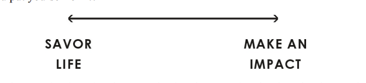
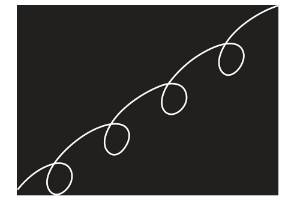
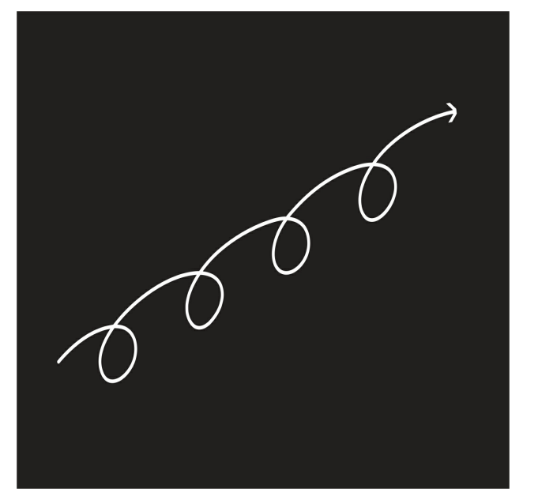
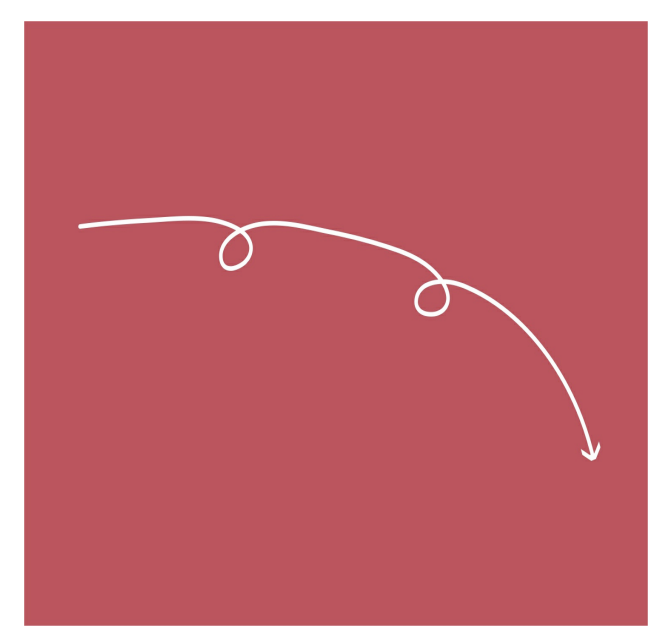
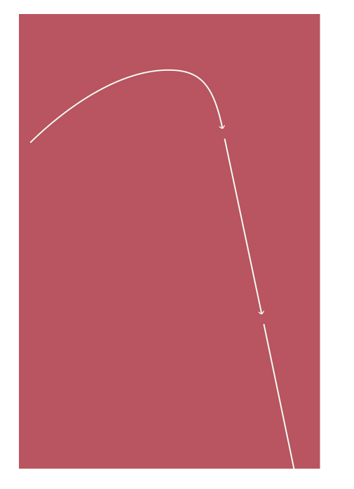
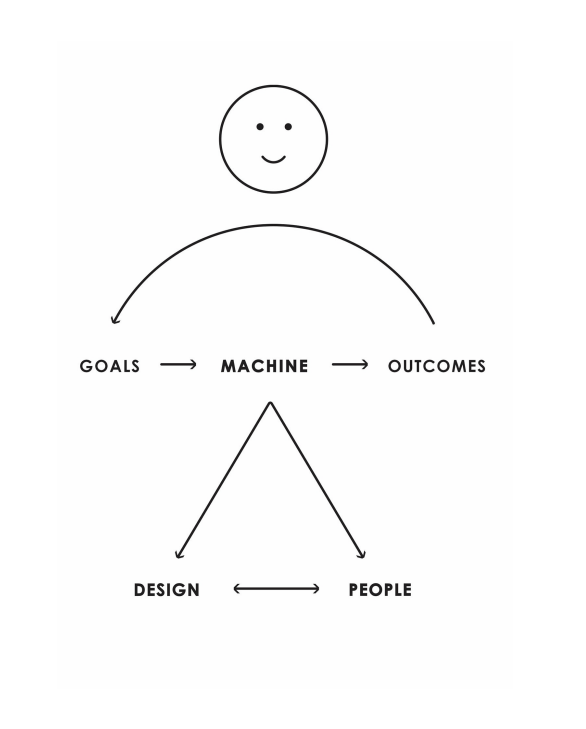

# PART II: LIFE PRINCIPLES

Không có gì quan trọng hơn việc hiểu thực tế hoạt động như thế nào và
Làm thế nào để đối phó với nó. Trạng thái tinh thần mà bạn mang đến cho quá trình này tạo nên tất cả
sự khác biệt. Tôi thấy hữu ích khi nghĩ về cuộc sống của mình như thể nó là một trò chơi trong
mà mỗi vấn đề tôi gặp phải là một câu đố mà tôi cần giải. Bằng cách giải câu đố,
Tôi nhận được một viên ngọc quý dưới dạng một nguyên tắc giúp tôi tránh được những điều tương tự.
vấn đề trong tương lai. Thu thập những viên đá quý này liên tục cải thiện của tôi
ra quyết định, vì vậy tôi có thể lên cấp độ chơi ngày càng cao hơn trong
mà trò chơi trở nên khó khăn hơn và số tiền đặt cược ngày càng lớn hơn.
Tất cả các loại cảm xúc đến với tôi khi tôi đang chơi và những cảm xúc đó
có thể giúp tôi hoặc làm hại tôi. Nếu tôi có thể điều hòa cảm xúc của mình với logic của mình
và chỉ hành động khi chúng ăn khớp với nhau, tôi đưa ra những quyết định sáng suốt hơn.
Tìm hiểu cách thực tế hoạt động, hình dung những thứ tôi muốn tạo và
sau đó xây dựng chúng ra là vô cùng thú vị đối với tôi. Vươn vai vì mục tiêu lớn
đặt tôi vào vị trí thất bại và cần phải học hỏi và nghĩ ra những điều mới
phát minh để tiến lên phía trước. Tôi thấy thật phấn khích khi bị cuốn vào
vòng phản hồi của quá trình học nhanh—giống như một người lướt sóng thích cưỡi trên một con sóng,
mặc dù đôi khi nó dẫn đến sự cố. Đừng hiểu lầm tôi, tôi vẫn
sợ va chạm và tôi vẫn thấy chúng đau đớn. Nhưng tôi giữ nỗi đau đó trong
quan điểm, biết rằng tôi sẽ vượt qua những thất bại này và hầu hết
việc học của tôi sẽ đến từ việc suy ngẫm về chúng.
14 Cũng như đường dài
người chạy bộ vượt qua nỗi đau để trải nghiệm niềm vui của “người chạy cao”, tôi
phần lớn đã vượt qua nỗi đau do sai lầm của tôi và thay vào đó hãy tận hưởng
niềm vui đi kèm với việc học hỏi từ nó. Tôi tin rằng với thực hành bạn có thể
thay đổi thói quen của bạn và trải nghiệm cùng một “người học sai lầm cao”.
1.1 Hãy là một người theo chủ nghĩa siêu thực.
Hiểu, chấp nhận và làm việc với thực tế vừa là thực tế, vừa là
xinh đẹp. Tôi đã trở thành một người theo chủ nghĩa siêu thực đến mức tôi đã học được cách
đánh giá cao vẻ đẹp của tất cả các thực tế, ngay cả những thực tế khắc nghiệt, và đã đi đến
coi thường chủ nghĩa duy tâm không thực tế.
Đừng hiểu sai ý tôi: Tôi tin vào việc biến ước mơ thành hiện thực. Đối với tôi, có
không có gì tốt hơn trong cuộc sống hơn là làm điều đó. Theo đuổi ước mơ là thứ mang lại cuộc sống
hương vị của nó. Quan điểm của tôi là những người tạo ra những điều tuyệt vời không nhàn rỗi
những người mơ mộng: Họ hoàn toàn có cơ sở trong thực tế. Siêu thực tế sẽ giúp
bạn chọn ước mơ của mình một cách khôn ngoan và sau đó đạt được chúng. tôi đã tìm thấy
sau đây hầu như luôn luôn đúng:
Một. Ước mơ + Thực tế + Quyết tâm = Một cuộc sống thành công. Những người đạt được
thành công và thúc đẩy sự tiến bộ hiểu sâu sắc về mối quan hệ nhân quả
chi phối thực tại và có những nguyên tắc sử dụng chúng để đạt được điều mình muốn.
Điều ngược lại cũng đúng: Những người theo chủ nghĩa lý tưởng không có cơ sở vững chắc trong thực tế
tạo ra vấn đề, không tiến bộ.
Một cuộc sống thành công trông như thế nào? Tất cả chúng ta đều có chỗ ngồi sâu của riêng mình
cần, vì vậy mỗi chúng ta phải tự quyết định thế nào là thành công. tôi không quan tâm
cho dù bạn muốn trở thành bậc thầy của vũ trụ, một củ khoai tây đi văng hay bất cứ thứ gì
khác - tôi thực sự không. Một số người muốn thay đổi thế giới và những người khác muốn
để hoạt động trong sự hài hòa đơn giản với nó và thưởng thức cuộc sống. Không phải là tốt hơn. Mỗi
chúng ta cần quyết định những gì chúng ta đánh giá cao nhất và chọn những con đường chúng ta đi đến
Đạt được nó.
Hãy dành một chút thời gian để suy ngẫm xem bạn đang ở đâu trên thang đo sau đây,
minh họa một sự lựa chọn quá đơn giản mà bạn nên suy nghĩ. sẽ ở đâu
bạn đặt mình vào nó?

Câu hỏi không chỉ là theo đuổi bao nhiêu mà là làm việc chăm chỉ như thế nào
để có được càng nhiều càng tốt. Tôi muốn số tiền điên cuồng của mỗi người, đã rất vui mừng khi
làm việc chăm chỉ để có được càng nhiều càng tốt, và thấy rằng họ có thể
phần lớn là một và giống nhau và củng cố lẫn nhau. Theo thời gian tôi đã học được
rằng nhận được nhiều hơn từ cuộc sống không chỉ là vấn đề làm việc chăm chỉ hơn. Nó
vấn đề quan trọng hơn là làm việc hiệu quả, bởi vì làm việc hiệu quả
có thể tăng khả năng của tôi lên hàng trăm lần. Tôi không quan tâm bạn muốn gì
hoặc bạn muốn làm việc chăm chỉ như thế nào cho nó. Đó là để bạn quyết định. tôi chỉ đang cố gắng
để chuyển cho bạn những gì đã giúp tôi tận dụng tối đa mỗi giờ
và mỗi đơn vị nỗ lực.
Quan trọng nhất, tôi đã học được rằng không thể trốn tránh sự thật rằng:

1.2 Sự thật—hay chính xác hơn là sự chính xác
sự hiểu biết về thực tại—là điều thiết yếu
nền tảng cho mọi kết quả tốt đẹp.
Hầu hết mọi người đấu tranh để nhìn thấy điều gì là sự thật khi nó không phải là điều họ muốn.
Điều đó thật tệ, bởi vì điều quan trọng hơn là hiểu và đối phó với cái xấu
thứ vì những thứ tốt sẽ tự chăm sóc bản thân.
Bạn có đồng ý với điều đó không? Nếu không, bạn không có khả năng hưởng lợi từ những gì
theo sau. Nếu bạn đồng ý, hãy xây dựng trên đó.
1.3 Hãy hoàn toàn cởi mở và triệt để
trong suốt.
Không ai trong chúng ta sinh ra đã biết điều gì là đúng; chúng ta hoặc phải khám phá những gì
đúng với bản thân mình hay tin và làm theo người khác. Điều quan trọng là phải biết cái nào
path sẽ mang lại kết quả tốt hơn.
15 Tôi tin rằng:
Một. Tư duy cởi mở triệt để và minh bạch triệt để là vô giá đối với sự phát triển nhanh chóng
học hỏi và thay đổi hiệu quả. Học tập là sản phẩm của thời gian thực liên tục
vòng phản hồi trong đó chúng tôi đưa ra quyết định, xem kết quả của chúng và cải thiện
kết quả là hiểu biết của chúng ta về thực tại. Hoàn toàn cởi mở
nâng cao hiệu quả của các vòng phản hồi đó, bởi vì nó làm cho những gì bạn
đang làm và tại sao, rõ ràng với chính bạn và những người khác rằng không thể có bất kỳ
hiểu lầm. Bạn càng cởi mở, bạn càng ít có khả năng
lừa dối bản thân—và càng có nhiều khả năng những người khác sẽ cho bạn sự trung thực
nhận xét. Nếu họ là những người “đáng tin cậy” (và điều rất quan trọng là phải biết
ai là người "đáng tin cậy"
16), bạn sẽ học được nhiều điều từ họ.
Hoàn toàn minh bạch và hoàn toàn cởi mở sẽ đẩy nhanh quá trình này
quá trình học tập. Nó cũng có thể khó khăn vì hoàn toàn minh bạch
chứ không phải cẩn thận hơn khiến một người bị chỉ trích. Đó là điều tự nhiên.
Tuy nhiên, nếu bạn không đặt mình ra khỏi đó với sự minh bạch triệt để của mình, bạn
sẽ không học.
b. Đừng để nỗi sợ hãi về những gì người khác nghĩ về bạn cản đường bạn. bạn phải
sẵn sàng làm mọi việc theo những cách độc đáo mà bạn cho là tốt nhất—và suy nghĩ cởi mở về những phản hồi chắc chắn đến từ kết quả của việc
theo cách đó.
Học cách trở nên minh bạch triệt để cũng giống như học cách nói trước công chúng:
Mặc dù ban đầu hơi khó xử, nhưng bạn càng làm điều đó, bạn càng cảm thấy thoải mái hơn
sẽ ở bên nó. Điều này đã đúng với tôi. Ví dụ, tôi vẫn theo bản năng
thấy mình hoàn toàn minh bạch theo cách mà tôi đang làm trong cuốn sách này
không thoải mái vì tôi đang tiết lộ tài liệu cá nhân cho công chúng sẽ
thu hút sự chú ý và chỉ trích. Tuy nhiên, tôi đang làm điều đó bởi vì tôi đã học được rằng đó là
tốt nhất, và tôi sẽ không cảm thấy hài lòng về bản thân nếu tôi để nỗi sợ hãi của mình cản đường.
Nói cách khác, tôi đã trải nghiệm những tác động tích cực của sự minh bạch triệt để
quá lâu đến nỗi bây giờ tôi cảm thấy khó chịu khi không được như vậy.
Bên cạnh việc cho tôi tự do là chính mình, nó còn cho phép tôi hiểu
những người khác và để họ hiểu tôi, điều đó hiệu quả hơn nhiều và
thú vị hơn nhiều so với việc không có sự hiểu biết này. Hãy tưởng tượng có bao nhiêu
chúng ta sẽ có ít hiểu lầm hơn và hiệu quả hơn bao nhiêu
thế giới sẽ như thế nào—và tất cả chúng ta sẽ tiến gần hơn đến mức nào để biết những gì
đúng—nếu thay vì che giấu suy nghĩ của mình, mọi người chia sẻ nó một cách cởi mở. Tôi không
nói về những bí mật nội tâm rất cá nhân của mọi người; Tôi đang nói về
ý kiến của mọi người về nhau và về cách thế giới vận hành. Như bạn sẽ thấy,
Tôi đã trực tiếp học được sức mạnh của loại sự thật triệt để này và
minh bạch là cải thiện việc ra quyết định của tôi và các mối quan hệ của tôi. Vì thế
bất cứ khi nào tôi phải đối mặt với sự lựa chọn, bản năng của tôi là minh bạch. TÔI
thực hành nó như một kỷ luật và tôi khuyên bạn nên làm như vậy.
c. Nắm bắt sự thật triệt để và minh bạch triệt để sẽ mang lại nhiều ý nghĩa hơn
công việc và các mối quan hệ có ý nghĩa hơn. Kinh nghiệm của tôi, dựa trên việc xem
hàng ngàn người thử phương pháp này, đó là với thực tế đại đa số
thấy nó rất bổ ích và thú vị đến nỗi họ gặp khó khăn trong việc vận hành bất kỳ
cách khác.
Điều này cần thực hành và thay đổi thói quen của một người. tôi đã tìm thấy rằng nó
thường mất khoảng mười tám tháng, đó là khoảng thời gian cần thiết để thay đổi
thói quen nhất.
1.4 Hãy nhìn vào thiên nhiên để tìm hiểu thực tế hoạt động như thế nào.
Tất cả các quy luật của thực tế đã được trao cho chúng ta bởi tự nhiên. Con người không tạo ra những thứ này
nhưng bằng cách hiểu chúng, chúng ta có thể sử dụng chúng để thúc đẩy sự tiến hóa của chính chúng ta
và đạt được mục tiêu của chúng tôi. Ví dụ, khả năng bay hoặc gửi điện thoại di động của chúng ta
các tín hiệu trên khắp thế giới đến từ sự hiểu biết và áp dụng các
quy luật của thực tế—các quy luật vật lý hoặc nguyên tắc chi phối thế giới tự nhiên.
Trong khi tôi dành phần lớn thời gian để nghiên cứu những thực tế ảnh hưởng đến tôi nhiều nhất
trực tiếp—những người thúc đẩy nền kinh tế, thị trường và những người tôi giao dịch
—Tôi cũng dành thời gian cho thiên nhiên và không thể không suy ngẫm về cách thức hoạt động của nó
quan sát, đọc và nói chuyện với một số chuyên gia giỏi nhất về
chủ thể. Tôi thấy thật thú vị và có giá trị khi tuân theo những luật mà chúng ta
con người có điểm chung với phần còn lại của tự nhiên và điều đó phân biệt chúng ta.
Làm điều đó đã có tác động lớn đến cách tiếp cận cuộc sống của tôi.
Trước hết, tôi thấy sự tiến hóa của bộ não thật tuyệt biết bao

Sự tiến hóa bao gồm sự thích nghi/phát minh mang lại lợi ích đột biến
sự suy giảm giá trị đó. Sự suy giảm đau đớn đó hoặc dẫn đến những sự thích nghi mới và
những phát minh mới mang lại những sản phẩm, tổ chức và con người mới
khả năng lên các cấp độ phát triển mới và cao hơn (như thể hiện trong phần trên cùng
sơ đồ ở trang đối diện); hoặc suy tàn và cái chết, trông giống như
sơ đồ ở phía dưới bên trái.
Hãy nghĩ về bất kỳ sản phẩm, tổ chức hoặc người nào bạn biết và bạn sẽ thấy
rằng điều này là đúng. Thế giới tràn ngập những điều tuyệt vời đã từng xuống cấp
và thất bại; chỉ một số ít đã tiếp tục sáng tạo lại bản thân để tiếp tục cái mới
đỉnh cao của sự vĩ đại. Tất cả các máy cuối cùng bị hỏng, phân hủy, và
tái chế các bộ phận của chúng để tạo ra máy móc mới. Điều đó bao gồm chúng tôi.
Đôi khi điều này làm chúng ta buồn vì chúng ta đã trở nên gắn bó với
máy móc, nhưng nếu bạn nhìn nó từ cấp độ cao hơn, nó thực sự rất đẹp
quan sát cách thức hoạt động của cỗ máy tiến hóa.
Từ quan điểm này, chúng ta có thể thấy rằng sự hoàn hảo không tồn tại; nó là một mục tiêu
điều đó thúc đẩy một quá trình thích ứng không bao giờ kết thúc. Nếu thiên nhiên, hay bất cứ thứ gì, là
hoàn hảo nó sẽ không được phát triển. Cơ quan, tổ chức, cá nhân
mọi người luôn không hoàn hảo cao nhưng có khả năng cải thiện. Vì vậy, thay vì
bị mắc kẹt trong việc che giấu những sai lầm của mình và giả vờ rằng chúng ta hoàn hảo, điều đó khiến
ý thức để tìm ra sự không hoàn hảo của chúng ta và đối phó với chúng. Bạn sẽ học được
bài học quý giá từ những sai lầm của bạn và tiếp tục, được trang bị tốt hơn để thành công
—hoặc bạn sẽ không và bạn sẽ thất bại.
Như câu nói:
đ. Tiến hóa hoặc chết. Chu kỳ tiến hóa này không chỉ dành cho con người mà còn cho các quốc gia,
công ty, nền kinh tế - cho mọi thứ. Và nó tự nhiên tự điều chỉnh như
một tổng thể, mặc dù không nhất thiết cho các bộ phận của nó. Ví dụ, nếu có quá
nhiều nguồn cung và lãng phí trên thị trường, giá sẽ giảm, các công ty sẽ ngừng hoạt động.
ngừng hoạt động và công suất sẽ giảm cho đến khi nguồn cung phù hợp với
nhu cầu, lúc đó chu kỳ sẽ bắt đầu di chuyển ngược lại
phương hướng. Tương tự như vậy, nếu một nền kinh tế trở nên tồi tệ, những người chịu trách nhiệm
điều hành nó sẽ tạo ra những thay đổi chính trị và chính sách cần thiết—hoặc chúng
sẽ không tồn tại, nhường chỗ cho những người thay thế họ xuất hiện. Những cái này
các chu kỳ liên tục và diễn ra theo những cách hợp lý — và chúng có xu hướng tự củng cố.

Điều quan trọng là thất bại, học hỏi và cải thiện nhanh chóng. Nếu bạn không ngừng học hỏi
và cải thiện, quá trình tiến hóa của bạn sẽ giống như quá trình
tăng dần. Làm điều đó không tốt và nó sẽ trông giống như những gì bạn nhìn thấy ở bên trái, hoặc
tệ hơn.
Tôi tin rằng:
1.5 Tiến hóa là thành tựu vĩ đại nhất của cuộc đời và
phần thưởng lớn nhất.
Theo bản năng, nó là như vậy, đó là lý do tại sao hầu hết chúng ta đều cảm thấy sức hút của nó - trong
nói cách khác, theo bản năng, chúng ta muốn cải thiện mọi thứ và đã tạo ra và
công nghệ phát triển để giúp chúng tôi. Lịch sử đã chỉ ra rằng tất cả các loài sẽ hoặc
bị tuyệt chủng hoặc tiến hóa thành các loài khác, mặc dù với cửa sổ thời gian hạn chế của chúng tôi
đó là khó khăn cho chúng tôi để xem. Nhưng chúng ta biết rằng cái mà chúng ta gọi là nhân loại là
chỉ đơn giản là kết quả của DNA tiến hóa thành một dạng mới khoảng hai trăm
nghìn năm trước, và chúng ta biết rằng nhân loại chắc chắn sẽ hoặc là
tuyệt chủng hoặc tiến hóa lên một trạng thái cao hơn. Cá nhân tôi tin rằng có một điều tốt
cơ hội con người sẽ bắt đầu phát triển với tốc độ chóng mặt với sự trợ giúp của các công nghệ do con người tạo ra có thể phân tích lượng dữ liệu khổng lồ và “suy nghĩ” nhanh hơn
và tốt hơn chúng ta có thể. Tôi tự hỏi chúng ta sẽ mất bao nhiêu thế kỷ để
tiến hóa thành một loài cấp cao hơn sẽ gần với sự toàn tri hơn nhiều
hơn chúng ta bây giờ—nếu chúng ta không hủy diệt chính mình trước.
Một trong những điều kỳ diệu nhất của tự nhiên là làm thế nào toàn bộ hệ thống đầy
của các sinh vật riêng lẻ hành động vì lợi ích riêng của chúng và không
hiểu hoặc hướng dẫn những gì đang diễn ra, có thể tạo ra một hoạt động đẹp mắt
và phát triển toàn diện. Mặc dù tôi không phải là chuyên gia về việc này, nhưng có vẻ như đó là vì
sự tiến hóa đã tạo ra a) các khuyến khích và tương tác dẫn đến các cá nhân
theo đuổi lợi ích riêng của họ và dẫn đến sự tiến bộ của toàn thể, b)
quá trình chọn lọc tự nhiên, và c) thử nghiệm và thích nghi nhanh chóng.
Một. Khuyến khích của cá nhân phải phù hợp với mục tiêu của nhóm. Để cung cấp cho bạn
ví dụ nhanh về việc tự nhiên tạo ra các khuyến khích dẫn đến các cá nhân theo đuổi
lợi ích riêng của họ dẫn đến sự tiến bộ của toàn bộ, nhìn vào tình dục
và chọn lọc tự nhiên. Thiên nhiên đã cho chúng ta một sự khuyến khích khủng khiếp để quan hệ tình dục trong
hình thức của khoái cảm tuyệt vời mà nó mang lại, mặc dù mục đích là có
tình dục là góp phần vào sự tiến bộ của DNA. Bằng cách đó, chúng tôi
cá nhân có được những gì chúng ta muốn trong khi đóng góp vào sự phát triển của
trọn.
b. Thực tế đang tối ưu hóa cho toàn bộ — không phải cho bạn. Đóng góp cho toàn bộ và
bạn có thể sẽ được khen thưởng. Chọn lọc tự nhiên dẫn đến những phẩm chất tốt hơn là
giữ lại và truyền lại (ví dụ, trong gen tốt hơn, khả năng tốt hơn để nuôi dưỡng
khác, sản phẩm tốt hơn, v.v.). Kết quả là một chu kỳ cải tiến liên tục
cho toàn bộ.
c. Thích ứng thông qua thử và sai nhanh chóng là vô giá. Quá trình thử và sai của chọn lọc tự nhiên cho phép cải tiến mà không ai hiểu hoặc
hướng dẫn nó. Điều tương tự cũng có thể áp dụng cho cách chúng ta học. Có ít nhất ba loại
học tập thúc đẩy sự tiến hóa: học tập dựa trên trí nhớ (lưu trữ
thông tin xuất hiện thông qua tâm trí có ý thức của một người để chúng ta có thể nhớ lại
trễ rồi); học tập tiềm thức (kiến thức chúng ta lấy từ
những trải nghiệm không bao giờ đi vào tâm trí có ý thức của chúng ta, mặc dù nó ảnh hưởng đến chúng ta
quyết định); và “việc học” xảy ra mà không cần suy nghĩ gì cả, chẳng hạn như
những thay đổi trong DNA mã hóa sự thích nghi của một loài. tôi đã từng nghĩ rằng
học tập có ý thức, dựa trên trí nhớ là hiệu quả nhất, nhưng kể từ đó tôi đã
hiểu rằng nó tạo ra tiến bộ chậm hơn so với thử nghiệm
và thích nghi. Để cung cấp cho bạn một ví dụ về cách tự nhiên cải thiện mà không cần
suy nghĩ, chỉ cần nhìn vào cuộc đấu tranh mà nhân loại (với tất cả suy nghĩ của nó) có
có kinh nghiệm trong việc cố gắng vượt qua virus (thậm chí không có não).
Virus giống như những đối thủ cờ vua xuất sắc. Bằng cách phát triển nhanh chóng (kết hợp
vật liệu di truyền khác nhau giữa các chủng khác nhau), chúng giữ cho những người thông minh nhất
tâm trí trong cộng đồng y tế toàn cầu bận rộn nghĩ ra các biện pháp đối phó để giữ
tắt chúng đi. Hiểu điều đó đặc biệt hữu ích trong thời đại mà máy tính
có thể chạy một số lượng lớn các mô phỏng sao chép quá trình tiến hóa để
giúp chúng tôi xem những gì hoạt động và những gì không.
Trong chương tiếp theo, tôi sẽ mô tả một quá trình đã giúp ích cho tôi, và tôi
tin rằng có thể giúp bạn, phát triển nhanh chóng. Nhưng trước tiên tôi muốn nhấn mạnh cách
quan trọng là quan điểm của bạn là cố gắng quyết định điều gì là quan trọng đối với bạn và
những gì để đi sau.
đ. Nhận ra rằng bạn đồng thời là tất cả và không là gì cả—và quyết định những gì bạn
muốn trở thành. Đó là một nghịch lý lớn mà cá nhân chúng ta đồng thời
tất cả mọi thứ và không có gì. Qua con mắt của chính mình, chúng ta là tất cả—ví dụ:
khi chúng ta chết, cả thế giới biến mất. Vì vậy, với hầu hết mọi người (và với những người khác
loài) chết là điều tồi tệ nhất có thể xảy ra, và đó là điều tối quan trọng
rằng chúng ta có cuộc sống tốt nhất có thể. Tuy nhiên, khi chúng ta coi thường
bản thân chúng ta qua con mắt của tự nhiên, chúng ta hoàn toàn không có ý nghĩa gì. Nó là
một thực tế rằng mỗi chúng ta chỉ là một trong khoảng bảy tỷ loài của chúng ta
còn sống

phải và rằng loài của chúng ta chỉ là một trong khoảng mười triệu loài trên
hành tinh của chúng ta. Trái đất chỉ là một trong khoảng 100 tỷ hành tinh trong thiên hà của chúng ta,
chỉ là một trong khoảng hai nghìn tỷ thiên hà trong vũ trụ. Và cuộc sống của chúng ta là
chỉ khoảng 1/3.000 sự tồn tại của nhân loại, mà bản thân nó chỉ là 1/20.000 của
sự tồn tại của Trái đất. Nói cách khác, chúng ta nhỏ bé và tồn tại trong thời gian ngắn đến khó tin và cho dù chúng ta đạt được thành tựu gì, tác động của chúng ta sẽ không đáng kể. Tại
đồng thời, theo bản năng, chúng ta muốn quan trọng và tiến hóa, và chúng ta có thể
quan trọng một chút xíu—và chính tất cả những bit nhỏ đó cộng lại để thúc đẩy sự tiến hóa
của vũ trụ.
Câu hỏi đặt ra là chúng ta quan trọng và phát triển như thế nào. Chúng ta có quan trọng với người khác không (ai
cũng không quan trọng trong phạm vi lớn của sự vật) hoặc theo một nghĩa nào đó lớn hơn
chúng ta sẽ không bao giờ thực sự đạt được? Hay nó không quan trọng nếu chúng ta quan trọng vì vậy chúng ta
nên quên câu hỏi đi và chỉ tận hưởng cuộc sống của chúng ta khi chúng còn tồn tại?
đ. Những gì bạn sẽ được sẽ phụ thuộc vào quan điểm bạn có. Bạn đi đâu trong cuộc đời
sẽ phụ thuộc vào cách bạn nhìn mọi thứ và bạn cảm thấy được kết nối với ai và những gì
(gia đình bạn, cộng đồng của bạn, đất nước của bạn, nhân loại, toàn bộ hệ sinh thái,
mọi thứ). Bạn sẽ phải quyết định mức độ bạn sẽ đặt lợi ích
của những người khác trên của riêng bạn, và bạn sẽ chọn làm như vậy cho những người khác.
Đó là bởi vì bạn sẽ thường xuyên gặp phải những tình huống buộc bạn phải
đưa ra những lựa chọn như vậy.
Mặc dù những quyết định như vậy có vẻ quá uyên bác đối với sở thích của bạn, nhưng bạn sẽ đưa ra
chúng một cách có ý thức hoặc tiềm thức, và chúng sẽ rất quan trọng.
Đối với cá nhân tôi, bây giờ tôi cảm thấy xúc động khi tiếp nhận thực tế, để nhìn xuống
vào bản thân tôi thông qua quan điểm của tự nhiên, và là một người vô cùng nhỏ bé
một phần của toàn bộ. Mục tiêu bản năng và trí tuệ của tôi chỉ đơn giản là phát triển và
đóng góp vào sự tiến hóa theo một cách nhỏ bé nào đó khi tôi ở đây và trong khi tôi là gì
Tôi là. Đồng thời, những điều tôi yêu thích nhất—công việc và cuộc sống của tôi
các mối quan hệ—là những gì thúc đẩy tôi. Vì vậy, tôi thấy thực tế và tự nhiên vận hành như thế nào,
bao gồm cả việc tôi và mọi thứ sẽ phân hủy và sắp xếp lại như thế nào, thật đẹp—
mặc dù về mặt cảm xúc, tôi thấy việc tách khỏi những người tôi quan tâm là khó khăn
đánh giá.
1.6 Hiểu bài học thực tiễn của tự nhiên.
Tôi nhận thấy việc hiểu cách hoạt động của tự nhiên và sự tiến hóa là hữu ích trong một
số cách. Quan trọng nhất, nó đã giúp tôi đối phó với thực tế của mình
hiệu quả hơn và đưa ra những lựa chọn khó khăn. Khi tôi bắt đầu nhìn vào thực tế
thông qua quan điểm tìm hiểu xem nó thực sự hoạt động như thế nào, thay vì
nghĩ rằng mọi thứ nên khác đi, tôi nhận ra rằng hầu hết mọi thứ lúc đầu
dường như “tồi tệ” đối với tôi—như những ngày mưa, sự yếu đuối và thậm chí cả cái chết—là
bởi vì tôi có định kiến về những gì cá nhân tôi muốn. Theo thời gian,
Tôi biết rằng phản ứng ban đầu của tôi là vì tôi đã không đặt bất cứ thứ gì tôi
phản ứng trong bối cảnh thực tế được xây dựng để tối ưu hóa cho
toàn bộ chứ không phải cho tôi.
Một. Tối đa hóa sự tiến hóa của bạn. Trước đó, tôi đã đề cập rằng những khả năng độc đáo của
tư duy logic, trừu tượng và từ cấp độ cao hơn được thực hiện trong
các cấu trúc nằm trong tân vỏ não. Những phần này của não nhiều hơn
được phát triển ở người và cho phép chúng ta suy ngẫm về bản thân và định hướng
sự tiến hóa. Bởi vì chúng ta có khả năng học tập có ý thức, dựa trên trí nhớ, chúng ta
có thể tiến hóa xa hơn và nhanh hơn bất kỳ loài nào khác, thay đổi không chỉ qua
các thế hệ nhưng trong vòng đời của chính chúng ta.
Động lực không ngừng hướng tới việc học hỏi và cải thiện này giúp trở nên tốt hơn
thú vị bẩm sinh và trở nên phấn khởi nhanh chóng. Mặc dù hầu hết mọi người
nghĩ rằng chúng đang phấn đấu để có được những thứ (đồ chơi, nhà to hơn, tiền,
trạng thái, v.v.) sẽ khiến họ hạnh phúc, đối với hầu hết mọi người, những điều đó không
cung cấp bất cứ nơi nào gần với sự hài lòng lâu dài mà trở nên tốt hơn
một cái gì đó làm.
20 Một khi chúng ta đạt được những thứ mà chúng ta đang phấn đấu, chúng ta hiếm khi
vẫn hài lòng với họ. Những thứ chỉ là mồi nhử. Đuổi theo họ
buộc chúng ta phải tiến hóa, và đó là sự tiến hóa chứ không phải bản thân phần thưởng
quan trọng đối với chúng ta và những người xung quanh chúng ta. Điều này có nghĩa là đối với hầu hết mọi người
thành công là đấu tranh và phát triển hiệu quả nhất có thể, tức là học tập
nhanh chóng về bản thân và môi trường xung quanh, sau đó thay đổi để cải thiện.
Lẽ tự nhiên nó phải như vậy vì quy luật giảm dần
trở lại.
21 Hãy xem việc kiếm tiền là như thế nào. Những người kiếm được rất nhiều
rằng họ thu được ít hoặc không có lợi ích cận biên nào từ nó sẽ bị ảnh hưởng tiêu cực
hậu quả, như với bất kỳ hình thức dư thừa nào khác, chẳng hạn như háu ăn. Nếu họ là
lành mạnh về trí tuệ, họ sẽ bắt đầu tìm kiếm cái gì đó mới hoặc tìm kiếm cái mới
sâu trong một cái gì đó cũ—và chúng sẽ trở nên mạnh mẽ hơn trong quá trình này. Như Freud
nói rằng, “Tình yêu và công việc là nền tảng của con người chúng ta.”
Công việc không nhất thiết phải là một công việc, mặc dù tôi tin rằng đó là
nói chung là tốt hơn nếu đó là một công việc. Nó có thể là bất kỳ loại thử thách dài hạn nào mà
dẫn đến sự cải thiện cá nhân. Như bạn có thể đoán, tôi tin rằng
cần phải có công việc có ý nghĩa là

kết nối với mong muốn bẩm sinh của con người để
cải thiện. Và các mối quan hệ là sự kết nối tự nhiên với những người khác khiến chúng ta
quan hệ với nhau và với xã hội rộng hơn.
b. Hãy nhớ “no pain, no gain.” Nhận ra rằng bẩm sinh chúng ta muốn tiến hóa—
và rằng những thứ khác mà chúng ta đang theo đuổi, trong khi tốt đẹp, sẽ không duy trì được
hạnh phúc—đã giúp tôi tập trung vào mục tiêu phát triển và đóng góp cho
tiến hóa theo cách vô cùng nhỏ bé của riêng tôi. Trong khi chúng tôi không thích đau đớn,
mọi thứ mà thiên nhiên tạo ra đều có mục đích, vì vậy thiên nhiên đã cho chúng ta nỗi đau trong một thời gian dài
mục đích. Vậy mục đích của nó là gì? Nó cảnh báo chúng ta và giúp định hướng chúng ta.
c. Quy luật cơ bản của tự nhiên là để có được sức mạnh, người ta phải đẩy
giới hạn của một người, đó là đau đớn. Như Carl Jung đã nói, “Con người cần những khó khăn. Họ
cần thiết cho sức khỏe.” Tuy nhiên, hầu hết mọi người theo bản năng tránh đau đớn. Đây là
đúng cho dù chúng ta đang nói về việc xây dựng cơ thể (ví dụ: nâng tạ) hay
tâm trí (ví dụ: thất vọng, đấu tranh tinh thần, bối rối, xấu hổ) —và
đặc biệt đúng khi mọi người đối mặt với thực tế khắc nghiệt của chính họ
sự không hoàn hảo.
1.7 Nỗi đau + Suy ngẫm = Tiến bộ.
Không thể tránh khỏi nỗi đau, đặc biệt nếu bạn đang theo đuổi những mục tiêu đầy tham vọng.
Dù bạn có tin hay không, bạn thật may mắn khi cảm nhận được nỗi đau đó nếu bạn tiếp cận nó
chính xác, vì đó là tín hiệu cho thấy bạn cần tìm giải pháp để có thể
tiến triển. Nếu bạn có thể phát triển một phản ứng phản xạ đối với nỗi đau tinh thần gây ra
bạn suy nghĩ về nó hơn là trốn tránh nó, nó sẽ dẫn đến sự
học tập/phát triển.
22 Sau khi thấy hiệu quả hơn bao nhiêu khi đối mặt với
thực tế đau đớn gây ra bởi các vấn đề, sai lầm và điểm yếu của bạn,
Tôi tin rằng bạn sẽ không muốn vận hành theo bất kỳ cách nào khác. Nó chỉ là một vấn đề của
tập thói quen làm việc đó.
Hầu hết mọi người đều gặp khó khăn trong việc phản ánh khi họ bị đau và họ
chú ý đến những thứ khác khi cơn đau qua đi, vì vậy họ bỏ lỡ
phản ánh cung cấp các bài học. Nếu bạn có thể phản ánh tốt trong khi bạn đang ở trong
đau (chắc là hỏi nhiều quá), tuyệt. Nhưng nếu bạn có thể nhớ
phản ánh sau khi nó trôi qua, điều đó cũng có giá trị. (Tôi đã tạo ứng dụng Nút Đau để trợ giúp
mọi người làm điều này, mà tôi mô tả trong phần phụ lục.)
Những thử thách bạn gặp phải sẽ kiểm tra và củng cố bạn. Nếu bạn không thất bại,
bạn không vượt quá giới hạn của mình và nếu bạn không vượt quá giới hạn của mình, bạn
không phát huy tối đa tiềm năng của bạn. Mặc dù quá trình đẩy các giới hạn của bạn,
đôi khi thất bại và đôi khi đột phá—và thu được lợi ích
từ cả những thất bại và thành công của bạn—không dành cho tất cả mọi người, nếu nó dành cho
bạn, nó có thể ly kỳ đến mức gây nghiện. Cuộc sống tất yếu sẽ mang lại
bạn những khoảnh khắc như vậy, và bạn sẽ quyết định xem bạn có muốn đi
quay lại để nhận thêm.
Nếu bạn chọn vượt qua quá trình đau đớn này của cá nhân
tiến hóa, tự nhiên chư vị sẽ “thăng” lên tầng thứ ngày càng cao hơn. Như bạn
leo lên trên cơn bão tuyết của những thứ xung quanh bạn, bạn sẽ nhận ra rằng
chúng có vẻ to hơn thực tế khi bạn nhìn cận cảnh chúng; cái đó
hầu hết mọi thứ trong cuộc sống chỉ là “một trong số đó”. Bạn càng lên cao,
bạn trở nên hiệu quả hơn khi làm việc với thực tế để định hình kết quả hướng tới
mục tiêu của bạn. Những gì từng có vẻ phức tạp không thể trở nên đơn giản.
Một. Đi đến nỗi đau hơn là trốn tránh nó. Nếu bạn không từ bỏ chính mình và thay vào đó
trở nên thoải mái khi luôn hoạt động với một mức độ đau đớn nào đó, bạn sẽ
phát triển với tốc độ nhanh hơn. Nó là như vậy.
Mỗi khi bạn đối mặt với một điều gì đó đau đớn, bạn có khả năng
thời điểm quan trọng trong cuộc sống của bạn—bạn có cơ hội để lựa chọn lành mạnh
và sự thật đau lòng hoặc ảo tưởng không lành mạnh nhưng thoải mái. Điều trớ trêu là nếu
bạn chọn con đường lành mạnh, nỗi đau sẽ sớm biến thành niềm vui. Nỗi đau
là tín hiệu! Giống như chuyển từ không tập thể dục sang tập thể dục, phát triển
thói quen ôm lấy nỗi đau và học hỏi từ nó sẽ “đưa bạn đến
bên."
Bằng cách “sang bờ bên kia”, ý tôi là bạn sẽ bị cuốn hút vào:
• Xác định, chấp nhận và học cách đối phó với những điểm yếu của bạn,
• Thích những người xung quanh trung thực với bạn hơn là giữ
những suy nghĩ tiêu cực của họ về bạn với chính họ, và
• Hãy là chính mình thay vì phải giả vờ mạnh mẽ nơi bạn đang ở
yếu đuối.
b. Nắm lấy tình yêu khó khăn. Trong cuộc sống của riêng tôi, những gì tôi muốn cung cấp cho mọi người, nhất
điều quan trọng đối với những người tôi yêu thương là sức mạnh để đương đầu với thực tế để đạt được những gì họ
muốn. Để theo đuổi mục tiêu của tôi là mang lại cho họ sức mạnh, tôi thường từ chối họ những gì
họ “muốn” bởi vì điều đó sẽ cho họ cơ hội để đấu tranh để
họ có thể phát triển sức mạnh để tự mình đạt được những gì họ muốn. Điều này có thể là
khó khăn cho mọi người về mặt cảm xúc, ngay cả khi họ hiểu về mặt trí tuệ rằng
gặp khó khăn là bài tập họ cần để phát triển mạnh mẽ và đó chỉ là
cho họ những gì họ muốn sẽ làm họ suy yếu và cuối cùng dẫn đến họ
cần thêm sự giúp đỡ.
23
Tất nhiên hầu hết mọi người không muốn có điểm yếu. Của chúng tôi
giáo dục và kinh nghiệm của chúng tôi

kinh nghiệm trên thế giới đã tạo điều kiện cho chúng ta trở thành
xấu hổ vì những điểm yếu của chúng tôi và che giấu chúng. Nhưng người ta hạnh phúc nhất khi
họ có thể là chính họ. Nếu bạn có thể cởi mở với những điểm yếu của mình, điều đó sẽ
làm cho bạn tự do hơn và sẽ giúp bạn đối phó với chúng tốt hơn. Tôi kêu gọi bạn không được
xấu hổ về những vấn đề của bạn, nhận ra rằng mọi người đều có chúng.
Đưa chúng lên bề mặt sẽ giúp bạn phá vỡ những thói quen xấu và phát triển
tốt, và bạn sẽ có được sức mạnh thực sự và sự lạc quan chính đáng.
Quá trình tiến hóa thích ứng sản xuất và đi lên này - quá trình
quá trình tìm kiếm, đạt được và theo đuổi các mục tiêu ngày càng tham vọng hơn
—không chỉ liên quan đến việc các cá nhân và xã hội tiến lên như thế nào. Nó là
có liên quan như nhau khi đối phó với những thất bại, đó là điều không thể tránh khỏi. Tại một số
điểm trong cuộc sống của bạn, bạn sẽ sụp đổ một cách lớn. Bạn có thể thất bại trong công việc hoặc
với gia đình, mất người thân, bị tai nạn hoặc bệnh tật nghiêm trọng, hoặc
khám phá cuộc sống mà bạn tưởng tượng mãi mãi nằm ngoài tầm với. Có một máy chủ đầy đủ
theo cách mà một cái gì đó sẽ có được bạn. Những lúc như vậy, bạn sẽ đau đớn và
có thể nghĩ rằng bạn không có sức mạnh để tiếp tục. Bạn hầu như luôn luôn làm,
Tuy nhiên; thành công cuối cùng của bạn sẽ phụ thuộc vào việc bạn nhận ra thực tế đó, thậm chí
mặc dù nó có vẻ không phải như vậy vào lúc này.
Đây là lý do tại sao nhiều người đã phải chịu đựng những thất bại dường như
tàn phá vào thời điểm đó đã kết thúc hạnh phúc như (hoặc thậm chí hạnh phúc hơn) họ
ban đầu là sau khi họ thích nghi thành công với chúng. Chất lượng của bạn
cuộc sống sẽ phụ thuộc vào những lựa chọn bạn đưa ra vào những thời điểm đau đớn đó. Các
nhanh hơn một thích nghi một cách thích hợp, thì tốt hơn.
24 Bất kể bạn muốn gì từ
cuộc sống, khả năng của bạn để thích nghi và di chuyển nhanh chóng và hiệu quả thông qua
quá trình tiến hóa cá nhân sẽ quyết định thành công của bạn và
niềm hạnh phúc. Nếu bạn làm tốt, bạn có thể thay đổi phản ứng tâm lý của mình đối với nó
để những gì đau đớn có thể trở thành những gì bạn khao khát.
1.8 Cân nhắc các hệ quả bậc hai và bậc ba.
Bằng cách nhận ra những hậu quả cấp cao hơn mà tự nhiên tối ưu hóa, tôi đã
đến để thấy rằng những người vượt quá hậu quả đầu tiên của họ
quyết định và bỏ qua các tác động của thứ tự thứ hai và thứ tự tiếp theo
hậu quả hiếm khi đạt được mục tiêu của họ. Điều này là do đơn đặt hàng đầu tiên
hậu quả thường có mong muốn ngược lại từ bậc hai
hậu quả, dẫn đến những sai lầm lớn trong việc ra quyết định. Ví dụ, các
hậu quả đầu tiên của tập thể dục (đau đớn và thời gian) thường là
được coi là không mong muốn, trong khi hậu quả bậc hai (sức khỏe tốt hơn
và ngoại hình hấp dẫn hơn) là mong muốn. Tương tự như vậy, thức ăn ngon
thường không tốt cho bạn và ngược lại.
Thông thường, hậu quả đầu tiên là những cám dỗ khiến chúng ta phải trả giá.
những gì chúng ta thực sự muốn, và đôi khi chúng là những rào cản cản trở chúng ta.
đường. Nó gần như thể tự nhiên sắp xếp chúng ta bằng cách ném cho chúng ta những lựa chọn đánh lừa mà
có cả hai loại hậu quả và trừng phạt những người thực hiện
quyết định chỉ dựa trên các hệ quả cấp một.
Ngược lại, những người chọn những gì họ thực sự muốn và tránh
những cám dỗ và vượt qua những nỗi đau khiến họ rời xa những gì họ
thực sự muốn, có nhiều khả năng có được cuộc sống thành công.
1.9 Sở hữu kết quả của bạn.
Phần lớn, cuộc sống mang đến cho bạn rất nhiều quyết định để thực hiện và rất nhiều
cơ hội để phục hồi từ những sai lầm của bạn, nếu bạn xử lý chúng tốt,
bạn có thể có một cuộc sống tuyệt vời. Tất nhiên, đôi khi có những ảnh hưởng lớn
về chất lượng cuộc sống của chúng ta đến từ những thứ nằm ngoài tầm kiểm soát của chúng ta—sự
hoàn cảnh chúng ta được sinh ra, tai nạn và bệnh tật, v.v.—nhưng đối với
phần lớn ngay cả những hoàn cảnh tồi tệ nhất cũng có thể trở nên tốt hơn với quyền
tiếp cận. Ví dụ, một người bạn của tôi lao xuống bể bơi, đánh
đầu, và trở thành một người liệt tứ chi. Nhưng anh ấy đã tiếp cận tình huống của mình tốt và
trở nên hạnh phúc như bất kỳ ai khác, bởi vì có nhiều con đường dẫn đến hạnh phúc.
Quan điểm của tôi đơn giản là thế này: Bất kể hoàn cảnh nào cuộc sống mang đến cho bạn, bạn sẽ
có nhiều khả năng thành công và tìm thấy hạnh phúc nếu bạn chịu trách nhiệm
đưa ra quyết định của bạn tốt thay vì phàn nàn về những điều
nằm ngoài tầm kiểm soát của bạn. Các nhà tâm lý học gọi điều này là có một “địa điểm bên trong của
kiểm soát,” và các nghiên cứu liên tục chỉ ra rằng những người có nó vượt trội hơn
những người không.
Vì vậy, đừng lo lắng về việc bạn có thích hoàn cảnh của mình hay không. Cuộc sống không
cho một chết tiệt về những gì bạn thích. Tùy thuộc vào bạn để kết nối những gì bạn muốn
với những gì bạn cần làm để có được nó và sau đó tìm dũng khí để mang nó
bởi vì. Trong chương tiếp theo, tôi sẽ chỉ cho bạn Quy trình 5 bước đã giúp
tôi tìm hiểu về thực tế và phát triển.
1.10 Nhìn máy từ cấp trên.
Khả năng duy nhất của con người chúng ta là nhìn xuống từ cấp độ cao hơn không được áp dụng
chỉ để hiểu thực tại và các mối quan hệ nhân-quả nằm bên dưới nó;
nó cũng áp dụng cho việc coi thường bản thân và những người xung quanh. tôi gọi cái này
khả năng vượt lên trên hoàn cảnh của mình và của người khác và có cái nhìn khách quan
xuống on họ “tư duy cấp cao hơn.” Tư duy ở cấp độ cao hơn mang lại cho bạn
khả năng nghiên cứu và ảnh hưởng đến các mối quan hệ nhân quả trong cuộc sống của bạn
và sử dụng chúng để đạt được kết quả bạn muốn.
Một. Hãy coi mình là một cỗ máy hoạt động trong một cỗ máy và biết rằng bạn có
khả năng thay đổi máy móc của bạn để tạo ra kết quả tốt hơn. Bạn có mục tiêu của bạn.
Tôi gọi cách mà bạn sẽ vận hành để đạt được mục tiêu là cỗ máy của mình. Nó bao gồm
thiết kế (những việc phải hoàn thành) và con người (những người sẽ thực hiện
những việc cần hoàn thành). Những người đó bao gồm bạn và những người giúp đỡ
Bạn. Ví dụ, hãy tưởng tượng rằng mục tiêu của bạn là một mục tiêu quân sự: chiếm một ngọn đồi từ
một kẻ thù. Thiết kế của bạn cho “cỗ máy” của bạn có thể bao gồm hai trinh sát, hai
lính bắn tỉa, bốn lính bộ binh, v.v. Mặc dù thiết kế phù hợp là cần thiết, nhưng
chỉ một nửa trận chiến. Điều quan trọng không kém là đặt đúng người vào mỗi
những vị trí đó. Họ cần những phẩm chất khác nhau để làm tốt công việc của mình—những
trinh sát phải là người chạy nhanh, lính bắn tỉa phải là thiện xạ - để
máy sẽ tạo ra kết quả mà bạn tìm kiếm.
b. Bằng cách so sánh kết quả với mục tiêu, bạn có thể xác định cách sửa đổi
máy của bạn. Quá trình đánh giá và cải tiến này phản ánh chính xác
quá trình tiến hóa mà tôi đã mô tả trước đó. Nó có nghĩa là xem xét làm thế nào để cải thiện
hoặc thay đổi thiết kế hoặc con người để đạt được mục tiêu của bạn. Về mặt sơ đồ, các
quy trình là một vòng phản hồi, như thể hiện trong sơ đồ ở trang đối diện.

c. Phân biệt giữa bạn với tư cách là người thiết kế máy móc và bạn với tư cách là một công nhân với
máy của bạn. Một trong những điều khó khăn nhất đối với mọi người là nhìn nhận một cách khách quan
hạ thấp bản thân trong hoàn cảnh của họ (tức là máy của họ) để
họ có thể đóng vai trò là người thiết kế và quản lý máy. Hầu hết mọi người ở lại
bị mắc kẹt trong quan điểm là một công nhân trong máy. Nếu bạn có thể
nhận ra sự khác biệt giữa những vai trò đó và nó còn hơn thế nữa
quan trọng là bạn phải là một nhà thiết kế/quản lý tốt cuộc sống của mình hơn là một người giỏi
làm việc trong đó, bạn sẽ đi đúng hướng. Để thành công, các
“nhà thiết kế/quản lý bạn” phải khách quan về “công nhân bạn” là gì
thực sự thích, không tin tưởng vào anh ta nhiều hơn anh ta xứng đáng, hoặc đưa anh ta vào công việc
anh ấy không nên tham gia. Thay vì có quan điểm chiến lược này, hầu hết mọi người
hoạt động theo cảm xúc và trong thời điểm này; cuộc sống của họ là một chuỗi vô hướng
trải nghiệm cảm xúc, đi từ điều này sang điều khác. Nếu bạn muốn nhìn
trở lại cuộc sống của bạn và cảm thấy bạn đã đạt được những gì bạn muốn, bạn không thể
vận hành theo cách đó.
đ. Sai lầm lớn nhất mà hầu hết mọi người mắc phải là không nhìn thấy chính mình và những người khác
một cách khách quan, dẫn đến việc họ lại vấp phải điểm yếu của chính mình và của người khác
Và một lần nữa. Những người làm điều này thất bại bởi vì họ bị mắc kẹt một cách ngoan cố trong
những cái đầu của chính mình. Nếu họ có thể giải quyết vấn đề này, họ có thể sống theo ý mình.
tiềm năng.
Đây là lý do tại sao tư duy cấp cao hơn là điều cần thiết để thành công.
đ. Người thành công là người có thể vượt lên trên chính mình để nhìn nhận mọi việc một cách khách quan
và quản lý những thứ đó để định hình sự thay đổi. Họ có thể tiếp nhận quan điểm của
những người khác thay vì bị mắc kẹt trong đầu với những thành kiến của riêng họ.
Họ có thể nhìn nhận một cách khách quan xem họ là người như thế nào—điểm mạnh và
điểm yếu—và những người khác như thế nào để đặt đúng người vào đúng vai trò
để đạt được mục tiêu của họ. Khi bạn hiểu cách thực hiện điều này, bạn sẽ thấy rằng
hầu như không có gì bạn không thể hoàn thành. Bạn sẽ chỉ phải học
làm thế nào để đối mặt với thực tế của bạn và sử dụng đầy đủ các nguồn lực theo ý của bạn.
Ví dụ: nếu bạn với tư cách là nhà thiết kế/quản lý phát hiện ra rằng bạn với tư cách là công nhân
không thể làm tốt điều gì đó, bạn cần tự sa thải mình với tư cách là công nhân và nhận
thay thế tốt, trong khi vẫn giữ vai trò là nhà thiết kế/quản lý của riêng bạn
mạng sống. Bạn không nên buồn nếu bạn phát hiện ra rằng bạn không giỏi về điều gì đó—
bạn nên vui mừng vì bạn đã phát hiện ra, bởi vì biết điều đó và đối phó
với nó sẽ cải thiện cơ hội của bạn để có được những gì bạn muốn.
Nếu bạn thất vọng vì bạn không thể là người làm tốt nhất
mọi thứ tự mình, bạn thật ngây thơ. Không ai có thể làm tốt mọi thứ.
Bạn có muốn có Einstein trong đội bóng rổ của mình không? Khi anh ta thất bại
rê bóng và sút tốt, bạn có nghĩ xấu về anh ấy không? Anh ấy có nên cảm thấy
làm nhục? Hãy tưởng tượng tất cả những lĩnh vực mà Einstein không đủ năng lực, và
hãy tưởng tượng anh ấy đã cố gắng như thế nào để trở nên xuất sắc ngay cả trong những lĩnh vực mà anh ấy là người
tốt nhất trên thế giới.
Quan sát mọi người đấu tranh và để người khác quan sát bạn đấu tranh có thể gợi ra
tất cả các loại cảm xúc do bản ngã điều khiển như cảm thông, thương hại, xấu hổ,
tức giận, hoặc phòng thủ. Bạn cần phải vượt qua tất cả những điều đó và ngừng nhìn thấy
đấu tranh như một cái gì đó tiêu cực. Hầu hết các cơ hội lớn nhất của cuộc đời đều đến
ra khỏi những khoảnh khắc đấu tranh; tùy thuộc vào bạn để tận dụng tối đa các bài kiểm tra này
tính sáng tạo và tính cách.
Khi gặp phải điểm yếu của mình, bạn có bốn lựa chọn:
1. Bạn có thể từ chối chúng (đó là điều mà hầu hết mọi người làm).
2. Bạn có thể chấp nhận chúng và làm việc với chúng để cố gắng chuyển đổi chúng
thành điểm mạnh (có thể hoạt động hoặc không hoạt động tùy thuộc vào
khả năng thay đổi).
3. Bạn có thể chấp nhận điểm yếu của mình và tìm cách khắc phục chúng.
4. Hoặc, bạn có thể thay đổi những gì bạn đang theo đuổi.
Giải pháp nào bạn chọn sẽ cực kỳ quan trọng đối với hướng đi của
cuộc sống của bạn. Con đường tồi tệ nhất bạn có thể đi là con đường đầu tiên. Từ chối chỉ có thể dẫn đến
bạn liên tục đập vào điểm yếu của mình, bị đau và không
nhận được bất cứ nơi nào. Thứ hai—chấp nhận điểm yếu của bạn trong khi cố gắng
biến chúng thành điểm mạnh—có lẽ là con đường tốt nhất nếu nó hiệu quả. Nhưng một vài
những thứ bạn sẽ không bao giờ giỏi và phải mất rất nhiều thời gian và công sức để
thay đổi. Manh mối duy nhất tốt nhất về việc liệu bạn có nên đi theo con đường này hay không là
liệu điều bạn đang cố gắng làm có phù hợp với bản chất của bạn hay không (tức là,
khả năng tự nhiên của bạn). Con đường thứ ba—chấp nhận điểm yếu của bạn trong khi
cố gắng tìm cách vượt qua chúng—là cách dễ nhất và thường khả thi nhất
con đường, nhưng nó là con đường ít được theo dõi nhất. Con đường thứ tư, thay đổi con người bạn
đi sau, cũng là một con đường tuyệt vời, mặc dù nó đòi hỏi sự linh hoạt từ phía bạn để
vượt qua định kiến ​​của bạn và tận hưởng sự phù hợp khi bạn tìm thấy nó.
f. Yêu cầu những người mạnh trong lĩnh vực mà bạn yếu giúp đỡ bạn là một điều tuyệt vời.
kỹ năng mà bạn nên phát triển cho dù thế nào đi chăng nữa, vì nó sẽ giúp bạn phát triển các lan can bảo vệ
điều đó sẽ ngăn bạn làm những gì bạn không nên làm. Tất cả thành công
mọi người giỏi việc này.
g. Bởi vì nórất khó để nhìn nhận bản thân một cách khách quan, bạn cần dựa vào đầu vào của
những người khác và toàn bộ bằng chứng. Tôi biết rằng cuộc sống của riêng tôi đã đầy
những sai lầm và rất nhiều phản hồi tuyệt vời. Chỉ bằng cách nhìn xuống điều này
cơ sở bằng chứng từ cấp cao hơn mà tôi có thể vượt qua
sai lầm và theo đuổi những gì tôi muốn. miễn là tôi đã được thực hành
điều này, tôi vẫn biết mình không thể nhìn nhận bản thân một cách khách quan, đó là lý do tại sao tôi tiếp tục
phụ thuộc quá nhiều vào đầu vào của người khác.
h. Nếu bạn đủ cởi mở và quyết tâm, bạn hầu như có thể đạt được bất cứ thứ gì bạn muốn.
muốn. Vì vậy, tôi chắc chắn không muốn ngăn cản bạn theo đuổi bất cứ điều gì bạn
muốn. Đồng thời, tôi mong bạn suy ngẫm xem liệu những gì bạn đang làm
sau là phù hợp với bản chất của bạn. Dù bản chất của bạn là gì, có rất nhiều
những con đường phù hợp với bạn, vì vậy đừng chỉ cố định vào một con đường. Nên một con đường cụ thể
gần, tất cả những gì bạn phải làm là tìm một cái khác tốt nhất phù hợp với những gì bạn đang
giống. (Bạn sẽ học được nhiều điều về cách xác định mình là người như thế nào sau này, trong
Hiểu rằng mọi người có kết nối rất khác nhau.)
Nhưng hầu hết mọi người đều thiếu dũng khí để đương đầu với những điểm yếu và
đưa ra những lựa chọn khó khăn mà quá trình này yêu cầu. Cuối cùng, nó đi xuống
năm quyết định sau:
1. Đừng nhầm lẫn những gì bạn ước là đúng với những gì thực sự đúng.
2. Đừng lo lắng về ngoại hình — thay vào đó hãy lo lắng về việc đạt được mục tiêu của bạn.
3. Đừng đánh giá quá cao các hậu quả cấp một so với hậu quả cấp hai và cấp ba.
4. Đừng để nỗi đau cản trở bước tiến của bạn.
5. Đừng đổ lỗi cho những kết quả tồi tệ cho bất kỳ ai trừ bản thân bạn.
14 Tôi chắc chắn rằng Thiền Siêu Việt mà tôi đã thực hành thường xuyên trong gần
nửa thế kỷ, đã giúp mang lại cho tôi sự bình tĩnh cần thiết để tiếp cận những thử thách của mình
cách này.
15 Bạn không nên cho rằng mình luôn là người tốt nhất để đưa ra quyết định cho
bản thân bạn bởi vì bạn thường không như vậy. Mặc dù chúng ta phải biết mình muốn gì, nhưng những người khác có thể
biết cách làm tốt hơn chúng ta vì họ có những thế mạnh mà chúng ta có
điểm yếu, hoặc kiến thức và kinh nghiệm có liên quan hơn. Ví dụ, nó có thể tốt hơn
để bạn làm theo lời khuyên của bác sĩ hơn là lời khuyên của chính bạn nếu bạn có một tình trạng y tế.
Ở phần sau của cuốn sách này, chúng ta sẽ xem xét một số cách thức khác nhau mà bộ não con người được kết nối và
sự hiểu biết của chúng ta về hệ thống dây điện của chính chúng ta sẽ ảnh hưởng như thế nào đến những lựa chọn mà chúng ta đưa ra cho
bản thân và chúng ta nên ủy thác cho người khác. Biết khi nào không nên làm của riêng bạn
quyết định là một trong những kỹ năng quan trọng nhất mà bạn có thể phát triển.
16 Tôi sẽ giải thích khái niệm độ tin cậy chi tiết hơn trong các chương sau, nhưng để bao quát nó
một cách nhanh chóng: Các bên đáng tin cậy là những người đã nhiều lần và thành công
điều gì đó—và có những lời giải thích tuyệt vời về cách họ đã làm điều đó.
17 Có nhiều điều người ta coi là “tốt” theo nghĩa là chúng tử tế hoặc
chu đáo nhưng không cung cấp được những gì mong muốn (như chủ nghĩa cộng sản “từ mỗi người theo
khả năng của mình, cho mỗi người theo nhu cầu của mình”). Thiên nhiên dường như coi chúng là “xấu,”
và tôi đồng ý với tự nhiên.
18 Mọi thứ khác ngoài sự tiến hóa cuối cùng đều tan rã; tất cả chúng ta, và mọi thứ khác
là, phương tiện cho sự tiến hóa. Ví dụ, trong khi chúng ta coi mình là những cá nhân, chúng ta
về cơ bản là các mạch cho các gen của chúng ta đã sống hàng triệu năm và liên tục sử dụng và
đổ xác như chúng ta.
19 Tôi giới thiệu sách của Richard Dawkins và E. O. Wilson về sự tiến hóa. Nếu tôi phải
chỉ chọn một, đó sẽ là Dòng sông ngoài vườn địa đàng của Dawkins.
20 Tất nhiên, chúng ta thường hài lòng với những thứ giống nhau—các mối quan hệ, sự nghiệp, v.v.—nhưng
trong trường hợp đó, thường là do chúng ta đang nhận được những thú vui mới từ
thay đổi kích thước của những thứ đó.
21 Lợi ích cận biên của việc chuyển từ tình trạng thiếu hụt sang tình trạng dư thừa của bất kỳ thứ gì đều giảm sút.
22 Khả năng phản xạ độc đáo của bạn—khả năng nhìn vào bản thân, thế giới xung quanh
bạn, và mối quan hệ giữa bạn và thế giới—có nghĩa là bạn có thể suy nghĩ sâu sắc và
cân đo đong đếm những điều tế nhị để đi đến sự học hỏi và lựa chọn sáng suốt. Yêu cầu đáng tin cậy khác
mọi người về nguyên nhân gốc rễ của nỗi đau của bạn để tăng cường phản xạ của bạn cũng là
thường rất hữu ích—đặc biệt là những người có quan điểm đối lập nhưng chia sẻ quan điểm của bạn
quan tâm đến việc tìm kiếm sự thật hơn là được chứng minh là đúng. Nếu bạn có thể phản ánh sâu sắc về
các vấn đề của bạn, chúng hầu như luôn thu nhỏ lại hoặc biến mất, bởi vì bạn hầu như luôn tìm thấy một
cách tốt hơn để đối phó với chúng hơn là nếu bạn không đối mặt trực tiếp với chúng.
23 Nói rõ hơn, tôi không nói rằng mọi người không nên được giúp đỡ. Tôi tin rằng mọi người nên
giúp đỡ bằng cách cho họ cơ hội và huấn luyện họ cần để trở nên đủ mạnh mẽ
để tận dụng cơ hội của họ. Tục ngữ có câu “Trời giúp ai giúp
chúng tôi." Nhưng điều này không hề dễ dàng, đặc biệt là với những người mà bạn quan tâm. Để có hiệu quả trong
giúp mọi người học hỏi từ những trải nghiệm đau đớn, bạn phải giải thích logic và quan tâm
đằng sau những gì bạn đang làm một cách rõ ràng và lặp đi lặp lại. Khi bạn đọc trong

“Nơi tôi đến
From,” đây là một phần lớn những gì buộc tôi phải giải thích các nguyên tắc của mình.
24 Khả năng nhìn thấy bối cảnh đang thay đổi và thích ứng của bạn là một chức năng của bạn
nhận thức và lý luận hơn khả năng học hỏi và xử lý nhanh chóng của bạn
---
- XẤU
Tránh đối mặt với “khắc nghiệt
thực tế.”

- TỐT
Đối mặt với “thực tế khắc nghiệt”.
---

- XẤU
Lo lắng về việc xuất hiện
Tốt.

- TỐT
Lo lắng về việc đạt được mục tiêu
mục tiêu
--
XẤU
Đưa ra quyết định của bạn về
cơ sở của thứ tự đầu tiên
hậu quả.
TỐT
Đưa ra quyết định của bạn về
cơ sở của thứ nhất, thứ hai, và
hậu quả bậc ba.
XẤU
Cho phép nỗi đau đứng yên trong
cách tiến bộ.
TỐT
Hiểu cách quản lý
đau đớn để tạo ra tiến bộ.
XẤU
Đừng giữ mình và
người khác chịu trách nhiệm.
TỐT
Giữ mình và người khác
chịu trách nhiệm.

--
