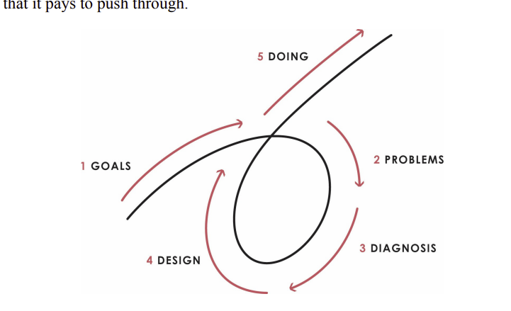
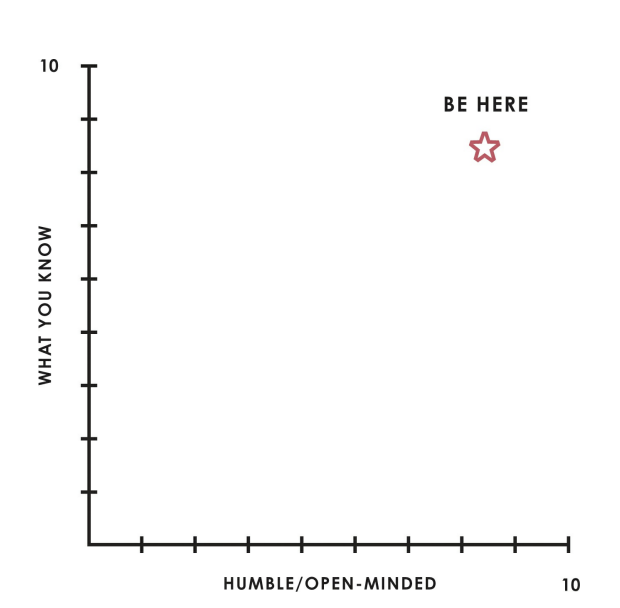

## 2 Sử dụng Quy trình 5 bước để Nhận
Bạn muốn gì từ cuộc sống

- lytical để bạn có thể
chẩn đoán chính xác các vấn đề của bạn, thiết kế một kế hoạch giúp bạn đi vòng quanh
chúng và làm những gì cần thiết để đạt được kết quả. Sau đó, bạn sẽ nhìn
ở kết quả mới mà bạn đạt được và thực hiện lại quy trình. Để tiến hóa
một cách nhanh chóng, bạn sẽ phải làm điều này nhanh chóng và liên tục, thiết lập mục tiêu của bạn
cao hơn liên tiếp.
Bạn sẽ cần thực hiện tốt tất cả năm bước để thành công và bạn phải làm
chúng từng cái một và theo thứ tự. Ví dụ, khi đặt mục tiêu, chỉ cần đặt
bàn thắng. Đừng nghĩ về cách bạn sẽ đạt được chúng hoặc bạn sẽ làm gì nếu
một cái gì đó đi sai. Khi bạn đang chẩn đoán vấn đề, đừng nghĩ về
bạn sẽ giải quyết chúng như thế nào—chỉ chẩn đoán chúng. Làm mờ các bước dẫn đến
kết quả dưới mức tối ưu bởi vì nó cản trở việc phát hiện ra các vấn đề thực sự.
Quá trình này lặp đi lặp lại: Thực hiện kỹ lưỡng từng bước sẽ cung cấp cho bạn
thông tin bạn cần để chuyển sang bước tiếp theo và thực hiện nó thật tốt.
Điều cần thiết là bạn tiếp cận quá trình này một cách rõ ràng, hợp lý.
cách, coi thường bản thân từ cấp độ cao hơn và tàn nhẫn
trung thực. Nếu cảm xúc của bạn đang trở nên tốt hơn, hãy lùi lại và dành thời gian
cho đến khi bạn có thể phản ánh rõ ràng. Nếu cần thiết, hãy tìm kiếm sự hướng dẫn từ sự bình tĩnh,
người chu đáo.
Để giúp bạn tập trung và hiệu quả, hãy giả vờ rằng cuộc sống của bạn là một cuộc đấu võ
nghệ thuật hoặc một trò chơi, mục tiêu của nó là vượt qua thử thách và đạt được
mục tiêu. Khi bạn chấp nhận các quy tắc của nó, bạn sẽ quen với sự khó chịu đến
với sự thất vọng liên tục. Bạn sẽ không bao giờ xử lý mọi thứ một cách hoàn hảo:
Sai lầm là không thể tránh khỏi và điều quan trọng là phải nhận ra và chấp nhận thực tế này.
mạng sống. Tin tốt là mỗi sai lầm bạn mắc phải đều có thể dạy cho bạn điều gì đó,
vì vậy không có kết thúc cho việc học. Bạn sẽ sớm nhận ra rằng những lời bào chữa như “đó không phải là
dễ dàng” hoặc “có vẻ không công bằng” hoặc thậm chí “Tôi không thể làm điều đó” đều không có giá trị và
rằng nó trả tiền để vượt qua.

Vậy nếu bạn không có tất cả các kỹ năng cần thiết để thành công thì sao? Đừng lo
về nó bởi vì điều đó đúng với tất cả mọi người. Bạn chỉ cần biết khi nào họ
là cần thiết và nơi bạn có thể đi để có được chúng. Với thực hành, bạn sẽ
cuối cùng chơi trò chơi này với sự tập trung bình tĩnh không thể ngăn cản khi đối mặt với
nghịch cảnh. Khả năng của bạn để có được những gì bạn muốn sẽ làm bạn phấn khích.
Bây giờ hãy xem cách tiếp cận từng bước trong năm bước.
2.1 Có mục tiêu rõ ràng.
Một. Ưu tiên: Mặc dù bạn có thể có hầu như mọi thứ bạn muốn, nhưng bạn không thể có
mọi thứ bạn muốn. Cuộc sống giống như một món khai vị khổng lồ với nhiều món ngon hơn
các lựa chọn thay thế mà bạn có thể hy vọng được nếm thử. Chọn một mục tiêu thường có nghĩa là
từ chối một số thứ bạn muốn để có được những thứ khác mà bạn muốn hoặc
cần nhiều hơn nữa. Một số người thất bại vào thời điểm này, thậm chí trước khi họ bắt đầu.
Sợ từ chối một phương án tốt để đổi lấy một phương án tốt hơn, họ cũng cố gắng theo đuổi
nhiều mục tiêu cùng một lúc, đạt được ít hoặc không đạt được mục tiêu nào. Đừng nản lòng
và đừng để mình bị tê liệt bởi tất cả các lựa chọn. Bạn có thể có nhiều
nhiều hơn những gì bạn cần để được hạnh phúc. Hãy lựa chọn của bạn và tiếp tục với nó.
b. Đừng nhầm mục tiêu với mong muốn. Một mục tiêu thích hợp là một cái gì đó mà bạn thực sự
cần đạt được. Mong muốn là những thứ bạn muốn có thể ngăn cản bạn
đạt được mục tiêu của bạn. Thông thường, mong muốn là hậu quả đầu tiên. Vì
ví dụ, mục tiêu của bạn có thể là rèn luyện thể chất, trong khi mong muốn của bạn là ăn
thức ăn ngon nhưng không lành mạnh. Đừng hiểu lầm ý tôi, nếu bạn muốn trở thành một
đi văng khoai tây, đó là tốt với tôi. Bạn có thể theo đuổi bất cứ mục tiêu nào bạn muốn.
Nhưng nếu bạn không muốn trở thành một củ khoai tây đi văng, thì tốt nhất bạn không nên mở chiếc túi đó
của chip.
c. Quyết định những gì bạn thực sự muốn trong cuộc sống bằng cách dung hòa các mục tiêu và mong muốn của bạn.
Lấy đam mê làm ví dụ. Không có đam mê, cuộc sống sẽ buồn tẻ; bạn sẽ không
muốn sống mà không có nó. Nhưng điều quan trọng là bạn làm gì với niềm đam mê của mình. LÀM
bạn để nó tiêu thụ bạn và đưa bạn đến những hành động phi lý, hay bạn khai thác nó để
thúc đẩy và thúc đẩy bạn trong khi bạn theo đuổi mục tiêu thực sự của mình? Điều gì sẽ
cuối cùng hoàn thành bạn là những điều cảm thấy phù hợp ở cả hai cấp độ, như cả hai đều mong muốn
và mục tiêu.
đ. Đừng nhầm lẫn những cạm bẫy của thành công với chính thành công. Thành tích
định hướng là quan trọng, nhưng những người ám ảnh về một đôi giày 1.200 đô la hoặc
một chiếc xe ưa thích rất hiếm khi hạnh phúc bởi vì họ không biết nó là gì
thực sự muốn và do đó những gì sẽ thỏa mãn họ.
đ. Đừng bao giờ loại trừ mục tiêu vì bạn nghĩ rằng nó không thể đạt được. Hãy táo bạo. Có
luôn luôn là một con đường tốt nhất có thể. Công việc của bạn là tìm ra nó và có can đảm để
làm theo nó. Những gì bạn nghĩ là có thể đạt được chỉ là một chức năng của những gì bạn biết tại
khoảnh khắc. Khi bạn bắt đầu theo đuổi, bạn sẽ học được rất nhiều điều, đặc biệt nếu bạn
tam giác với người khác; những con đường bạn chưa từng thấy trước đây sẽ xuất hiện. Tất nhiên rồi
có một số điều không thể hoặc gần như không thể, chẳng hạn như trung tâm chơi
tham gia đội bóng rổ chuyên nghiệp nếu bạn thấp hoặc chạy bốn phút
dặm ở tuổi bảy mươi.
f. Hãy nhớ rằng những kỳ vọng lớn tạo ra những năng lực tuyệt vời. Nếu bạn giới hạn của bạn
mục tiêu mà bạn biết mình có thể đạt được, thì bạn đang đặt tiêu chuẩn quá thấp.
g. Hầu như không gì có thể ngăn cản bạn thành công nếu bạn a) linh hoạt và b) tự chịu trách nhiệm. Tính linh hoạt là thứ cho phép bạn chấp nhận thực tế (hoặc
người hiểu biết) dạy bạn; tự chịu trách nhiệm là điều cần thiết bởi vì nếu
bạn thực sự tin rằng không đạt được mục tiêu là thất bại cá nhân của bạn, bạn
sẽ thấy việc bạn không đạt được nó là dấu hiệu cho thấy bạn chưa sáng tạo
hoặc linh hoạt hoặc đủ quyết tâm để làm những gì nó cần. Và bạn sẽ là như vậy
có nhiều động lực hơn để tìm ra con đường.
h. Biết cách đối phó tốt với những thất bại của bạn cũng quan trọng như biết cách
tiến về phía trước. Đôi khi bạn biết rằng bạn đang đi qua một thác nước và
Không có cách nào để tránh nó. Cuộc sống sẽ ném cho bạn những thách thức như vậy, một số
mà sẽ có vẻ tàn phá vào thời điểm đó. Trong thời điểm khó khăn, mục tiêu của bạn có thể là
giữ những gì bạn có, để giảm thiểu tỷ lệ mất mát của bạn, hoặc đơn giản là để đối phó với một
mất mát đó là không thể đảo ngược. Nhiệm vụ của bạn là luôn làm tốt nhất có thể
lựa chọn, biết rằng bạn sẽ được khen thưởng nếu bạn làm như vậy.
2.2 Xác định và không chịu đựng các vấn đề.
Một. Hãy xem những vấn đề nhức nhối như những cải tiến tiềm năng đang gào thét với bạn.
Mặc dù ban đầu sẽ không cảm thấy như vậy, nhưng mỗi và mọi vấn đề bạn gặp phải
là một cơ hội; vì lý do đó, điều cần thiết là bạn mang chúng đến
bề mặt. Hầu hết mọi người không thích làm điều này, đặc biệt nếu nó phơi bày
điểm yếu hoặc điểm yếu của người mà họ quan tâm, nhưng thành công
mọi người biết họ phải làm.
b. Đừng trốn tránh đối mặt với các vấn đề bởi vì chúng bắt nguồn từ thực tế khắc nghiệt mà
khó chịu khi nhìn vào. Suy nghĩ về những vấn đề khó giải quyết
có thể khiến bạn lo lắng, nhưng không nghĩ về chúng (và do đó không giải quyết
với họ) sẽ khiến bạn lo lắng hơn nữa. Khi một vấn đề bắt nguồn từ
sự thiếu tài năng hoặc kỹ năng của bạn, hầu hết mọi người cảm thấy xấu hổ. Hãy vượt qua nó. tôi cakhông phải
nhấn mạnh đủ điều này: Thừa nhận điểm yếu của bạn không giống như
đầu hàng họ. Đó là bước đầu tiên để vượt qua chúng. những cơn đau
bạn đang cảm thấy “nỗi đau ngày càng tăng” sẽ kiểm tra tính cách và phần thưởng của bạn
bạn khi bạn vượt qua chúng.
c. Hãy cụ thể trong việc xác định các vấn đề của bạn. Bạn cần phải chính xác, bởi vì
vấn đề khác nhau có giải pháp khác nhau. Nếu một vấn đề là do không đầy đủ
kỹ năng, đào tạo bổ sung có thể được yêu cầu; nếu nó phát sinh từ bẩm sinh
điểm yếu, bạn có thể cần tìm kiếm sự trợ giúp từ người khác hoặc thay đổi
vai bạn đóng. Nói cách khác, nếu bạn không giỏi về kế toán, hãy thuê một kế toán viên.
Nếu một vấn đề bắt nguồn từ điểm yếu của người khác, hãy thay thế chúng bằng
một người mạnh mẽ khi cần thiết. Nó là như vậy.
đ. Đừng nhầm lẫn nguyên nhân của vấn đề với vấn đề thực sự. “Tôi không thể có đủ
giấc ngủ” không phải là vấn đề; nó là một nguyên nhân tiềm năng (hoặc có lẽ là kết quả) của một
vấn đề. Để làm rõ suy nghĩ của bạn, trước tiên hãy cố gắng xác định kết quả xấu; ví dụ.,
“Tôi đang thể hiện kém trong công việc của mình.” Ngủ không đủ giấc có thể là nguyên nhân
của vấn đề đó, hoặc nguyên nhân có thể là cái gì khác—nhưng để
xác định điều đó, bạn cần biết chính xác vấn đề là gì.
đ. Phân biệt vấn đề lớn với vấn đề nhỏ. Bạn chỉ có rất nhiều thời gian và
năng lượng; đảm bảo rằng bạn đang đầu tư chúng vào việc khám phá những vấn đề mà nếu
cố định, sẽ mang lại cho bạn lợi nhuận lớn nhất. Nhưng đồng thời, đảm bảo rằng bạn
dành đủ thời gian cho những vấn đề nhỏ để đảm bảo chúng không
triệu chứng của những cái lớn hơn.
f. Một khi bạn xác định được một vấn đề, đừng chịu đựng nó. Chịu đựng một vấn đề có
hậu quả tương tự như việc không xác định được nó. Cho dù bạn chịu đựng nó bởi vì
bạn tin rằng nó không thể được giải quyết, bởi vì bạn không đủ quan tâm để giải quyết nó, hoặc
bởi vì bạn không thể tập hợp đủ mọi thứ cần thiết để giải quyết nó, nếu bạn không
có ý chí để thành công, thì tình hình của bạn là vô vọng. Bạn cần phát triển
một sự không khoan dung mãnh liệt đối với bất kỳ loại xấu xa nào, bất kể mức độ nghiêm trọng của nó.
2.3 Chẩn đoán các vấn đề để tìm ra nguyên nhân gốc rễ của chúng.
Một. Tập trung vào “cái gì là” trước khi quyết định “phải làm gì với nó”. Nó là một phổ biến
sai lầm khi di chuyển trong một nano giây từ việc xác định một vấn đề khó khăn sang
đề xuất một giải pháp cho nó. Tư duy chiến lược đòi hỏi cả chẩn đoán và
thiết kế. Một chẩn đoán tốt thường mất từ ​​mười lăm phút đến
giờ, tùy thuộc vào mức độ hoàn thành và mức độ phức tạp của vấn đề. Nó
liên quan đến việc nói chuyện với những người có liên quan và xem xét bằng chứng
cùng nhau để xác định nguyên nhân gốc rễ. Giống như các nguyên tắc, nguyên nhân gốc rễ biểu hiện
lặp đi lặp lại trong những tình huống dường như khác nhau. Phát hiện
chúng và xử lý chúng mang lại lợi tức hết lần này đến lần khác.
b. Phân biệt nguyên nhân gần với nguyên nhân gốc. Nguyên nhân gần đúng thường là
các hành động (hoặc thiếu hành động) dẫn đến các vấn đề, vì vậy chúng được mô tả
với động từ (Tôi đã lỡ chuyến tàu vì tôi không kiểm tra lịch trình của chuyến tàu). Nguồn gốc
nguyên nhân chạy sâu hơn nhiều và chúng thường được mô tả bằng tính từ (tôi
không kiểm tra lịch tàu vì tôi hay quên). Bạn chỉ có thể thực sự
giải quyết vấn đề của bạn bằng cách loại bỏ nguyên nhân gốc rễ của chúng, và để làm được điều đó, bạn phải
phân biệt các triệu chứng với bệnh.
c. Nhận ra rằng việc biết ai đó (bao gồm cả bạn) như thế nào sẽ cho bạn biết bạn
có thể mong đợi từ họ. Bạn sẽ phải vượt qua sự miễn cưỡng của mình để đánh giá những gì
mọi người giống như nếu bạn muốn bao quanh mình với những người có
phẩm chất bạn cần. Điều đó đi cho chính mình quá. Mọi người hầu như luôn luôn tìm thấy nó
khó nhận diện và chấp nhận sai lầm, khuyết điểm của bản thân.
Đôi khi đó là vì họ mù quáng với chúng, nhưng thường thì đó là vì
cái tôi của họ cản trở. Nhiều khả năng các cộng sự của bạn cũng miễn cưỡng như nhau
chỉ ra những sai lầm của bạn, bởi vì họ không muốn làm tổn thương bạn. tất cả các bạn cần phải
vượt qua chuyện này. Hơn bất cứ điều gì khác, điều làm nên sự khác biệt của những người sống
tiềm năng của họ từ những người không phải là họ sẵn sàng nhìn vào
bản thân và những người khác một cách khách quan và hiểu được nguyên nhân gốc rễ đứng trong
cách của họ.
2.4 Thiết kế một kế hoạch.
Một. Quay trở lại trước khi bạn đi về phía trước. Phát lại câu chuyện về nơi bạn đã đến (hoặc
những gì bạn đã làm) dẫn đến vị trí của bạn bây giờ, và sau đó hình dung
những gì bạn và những người khác phải làm trong tương lai để bạn đạt được mục tiêu của mình.
b. Hãy nghĩ về vấn đề của bạn như một tập hợp các kết quả được tạo ra bởi một cỗ máy. Luyện tập
tư duy cấp cao hơn bằng cách nhìn xuống máy của bạn và suy nghĩ về
làm thế nào nó có thể được thay đổi để tạo ra kết quả tốt hơn.
c. Hãy nhớ rằng thường có nhiều con đường để đạt được mục tiêu của bạn. Chỉ mình bạn
cần tìm một cái hoạt động.
đ. Hãy coi kế hoạch của bạn giống như một kịch bản phim trong đó bạn hình dung ai sẽ làm
những gì qua thời gian. Phác thảo kế hoạch một cách rộng rãi lúc đầu (ví dụ: “thuê những người tuyệt vời
người”) và sau đó tinh chỉnh nó. Bạn nên đi từ bức tranh lớn và đi sâu vào
đến các nhiệm vụ cụ thể và các mốc thời gian ước tính (ví dụ: “Trong hai tuần tới,
chọn những công ty săn đầu người sẽ tìm thấy những người tuyệt vời đó

e”). Thế giới thực
các vấn đề về chi phí, thời gian và nhân sự chắc chắn sẽ xuất hiện khi bạn làm điều này,
và điều đó sẽ giúp bạn tinh chỉnh thêm thiết kế của mình cho đến khi tất cả các bánh răng trong
máy đang chia lưới trơn tru.
đ. Viết ra kế hoạch của bạn cho mọi người xem và đo lường sự tiến bộ của bạn.
Điều này bao gồm tất cả các chi tiết chi tiết về người cần thực hiện nhiệm vụ gì và
khi. Các nhiệm vụ, câu chuyện và mục tiêu là khác nhau, vì vậy đừng trộn lẫn chúng
hướng lên. Hãy nhớ rằng, các nhiệm vụ là thứ kết nối câu chuyện với mục tiêu của bạn.
f. Nhận ra rằng không mất nhiều thời gian để thiết kế một kế hoạch tốt. Một kế hoạch có thể được
được phác thảo và tinh chỉnh chỉ trong vài giờ hoặc trải ra trong nhiều ngày hoặc nhiều tuần. Nhưng
quá trình này là cần thiết bởi vì nó xác định những gì bạn sẽ phải làm để trở thành
hiệu quả. Quá nhiều người mắc sai lầm khi hầu như không dành thời gian
về thiết kế bởi vì họ đang bận tâm với việc thực hiện. Nhớ:
Thiết kế đi trước làm!
2.5 Đẩy mạnh để hoàn thành.
Một. Những nhà hoạch định vĩ đại không thực hiện kế hoạch của họ sẽ chẳng đi đến đâu. Bạn cần đẩy
xuyên suốt và điều đó đòi hỏi sự tự giác tuân theo kịch bản của bạn. Nó quan trọng
để ghi nhớ các kết nối giữa các nhiệm vụ của bạn và các mục tiêu mà chúng
có nghĩa là để đạt được. Khi bạn cảm thấy mình không còn nhận ra điều đó, hãy dừng lại và hỏi
chính mình "tại sao?" Đánh mất lý do tại sao và bạn chắc chắn sẽ đánh mất mục tiêu của mình
bàn thắng.
b. Thói quen làm việc tốt bị đánh giá rất thấp. Những người vượt qua
thành công trong việc có các danh sách việc cần làm được ưu tiên hợp lý và họ thực hiện
nhất định mỗi mục được đánh dấu theo thứ tự.
c. Thiết lập các số liệu rõ ràng để đảm bảo rằng bạn đang tuân theo kế hoạch của mình. Lý tưởng nhất,
một người nào đó không phải bạn nên đo lường và báo cáo một cách khách quan về
sự tiến bộ của bạn. Nếu bạn không đạt được mục tiêu của mình, đó là một vấn đề khác
cần được chẩn đoán và giải quyết. Có nhiều người thành công, sáng tạo
những người không giỏi thực thi. Họ thành công vì họ rèn giũa cộng sinh
mối quan hệ với những người thực hiện nhiệm vụ có độ tin cậy cao.
Thats tất cả để có nó!
Hãy nhớ rằng tất cả 5 Bước đều xuất phát từ các giá trị của bạn. Giá trị của bạn
xác định những gì bạn muốn, tức là, mục tiêu của bạn. Cũng nên nhớ rằng 5 bước
là lặp đi lặp lại. Khi bạn hoàn thành một bước, bạn sẽ có được
thông tin rất có thể sẽ khiến bạn sửa đổi các bước khác. Khi
bạn đã hoàn thành cả năm mục tiêu, bạn sẽ bắt đầu lại với một mục tiêu mới. Nếu quy trình là
đang hoạt động, mục tiêu của bạn sẽ thay đổi chậm hơn so với thiết kế của bạn, điều này sẽ
thay đổi chậm hơn so với nhiệm vụ của bạn.
Một điểm quan trọng cuối cùng: Bạn sẽ cần tổng hợp và định hình tốt. Các
ba bước đầu tiên—đặt mục tiêu, xác định vấn đề và sau đó chẩn đoán
chúng—đang tổng hợp (ý tôi là biết bạn muốn đi đâu và
chuyện gì đang thực sự xảy ra). Thiết kế các giải pháp và đảm bảo rằng các thiết kế
được thực hiện đang định hình.
2.6 Hãy nhớ rằng điểm yếu không thành vấn đề nếu bạn
Tìm các giải pháp.
Bạn gần như chắc chắn không thể làm tốt tất cả các bước này, bởi vì mỗi bước đều yêu cầu
các kiểu suy nghĩ khác nhau và hầu như không ai có thể suy nghĩ tốt về tất cả những kiểu suy nghĩ này
cách. Ví dụ, thiết lập mục tiêu (chẳng hạn như xác định những gì bạn muốn cuộc sống của bạn
to be) đòi hỏi bạn phải giỏi tư duy ở cấp độ cao hơn như hình dung và
sự ưu tiên. Việc xác định và không chịu đựng các vấn đề đòi hỏi bạn phải
nhận thức và tổng hợp tốt và duy trì các tiêu chuẩn cao; chẩn đoán
đòi hỏi bạn phải logic, có thể nhìn thấy nhiều khả năng và sẵn sàng
có những cuộc trò chuyện khó khăn với người khác; thiết kế yêu cầu trực quan hóa và
tính thiết thực; làm những gì bạn đặt ra đòi hỏi phải có kỷ luật tự giác, công việc tốt
thói quen và định hướng kết quả. Bạn biết ai có tất cả những thứ đó
phẩm chất? Có lẽ không có ai. Tuy nhiên, cần phải thực hiện tốt tất cả 5 Bước để trở thành
thực sự thành công. Vậy bạn làm gì? Đầu tiên và quan trọng nhất, hãy khiêm tốn như vậy
bạn có thể nhận được những gì bạn cần từ những người khác!
Mọi người đều có điểm yếu. Chúng thường được tiết lộ trong các mô hình của
sai lầm mà họ mắc phải. Biết điểm yếu của bạn là gì và nhìn chằm chằm vào
chúng là bước đầu tiên trên con đường dẫn đến thành công.
Một. Nhìn vào các kiểu sai lầm của bạn và xác định bước nào trong 5 bước
Quá trình bạn thường thất bại. Yêu cầu những người khác đóng góp ý kiến của họ, vì không ai có thể hoàn toàn
khách quan về mình.
b. Mọi người đều có ít nhất một vấn đề lớn cản trở thành công của họ; tìm thấy
của bạn và đối phó với nó. Viết ra điều quan trọng nhất của bạn là gì (chẳng hạn như
xác định vấn đề, thiết kế giải pháp, thúc đẩy kết quả) và
tại sao nó tồn tại (cảm xúc của bạn làm bạn bối rối, bạn không thể hình dung đầy đủ
khả năng). Trong khi bạn và hầu hết mọi người có thể có nhiều hơn một chuyên ngành
trở ngại, nếu bạn có thể loại bỏ hoặc vượt qua trở ngại thực sự lớn đó, bạn sẽ
cải thiện đáng kể cuộc sống của bạn. Nếu bạn làm việc với nó, gần như chắc chắn bạn sẽ có thể
để đối phó thành công với một điều lớn của bạn.
Bạn có thể sửa chữa nó hoặc bạn có thể nhận được sự giúp đỡ của người khác để giải quyết nó tốt.
Có hai con đường dẫn đến thành công: 1) có được thứ bạn cần hoặc 2) có được
nó từ những người khác. Con đường thứ hai đòi hỏi bạn phải có sự khiêm tốn. khiêm nhường

nó giống như
quan trọng, hoặc thậm chí quan trọng hơn, như có những điểm mạnh bản thân. Đang có
cả hai là tốt nhất. Trên trang sau là một mẫu mà một số người tìm thấy
hữu ích.
2.7 Hiểu bản đồ tinh thần của chính bạn và của người khác
và khiêm nhường.
Một số người rất giỏi trong việc tự biết phải làm gì; họ có tốt
bản đồ tinh thần. Có thể họ đã có được chúng từ việc được dạy; có lẽ họ đã
may mắn với một liều lượng đặc biệt lớn của lẽ thường. Dù thế nào đi chăng nữa,
họ có nhiều câu trả lời bên trong hơn những người khác. Tương tự, một số
mọi người khiêm tốn và cởi mở hơn những người khác. Khiêm tốn thậm chí có thể được
có giá trị hơn là có bản đồ tinh thần tốt nếu nó giúp bạn tìm kiếm tốt hơn
câu trả lời mà bạn có thể tự nghĩ ra. Có cả tư duy cởi mở và bản đồ tinh thần tốt là điều có sức mạnh nhất.
Để truyền đạt khái niệm đơn giản này, hãy tưởng tượng xếp hạng từ một đến mười tốt như thế nào
bản đồ tinh thần của ai đó (nói cách khác, những gì họ biết) nằm trên trục Y và
họ khiêm tốn/cởi mở như thế nào trên trục X, như thể hiện ở phía đối diện
trang.
Mọi người bắt đầu ở khu vực phía dưới bên trái, với bản đồ tinh thần nghèo nàn và ít
cởi mở, và hầu hết mọi người vẫn bị mắc kẹt một cách bi thảm và ngạo mạn trong
vị trí đó. Bạn có thể cải thiện bằng cách đi lên trên trục bản đồ tinh thần
(bằng cách học cách làm mọi việc tốt hơn) hoặc hướng tới trục tư duy cởi mở.
Hoặc sẽ cung cấp cho bạn kiến ​​thức tốt hơn về những việc cần làm. Nếu bạn có
bản đồ tinh thần tốt và tính cởi mở thấp, điều đó sẽ tốt nhưng không tuyệt vời.
Bạn vẫn sẽ bỏ lỡ rất nhiều thứ có giá trị. Tương tự như vậy, nếu bạn có tư duy cởi mở cao nhưng bản đồ tinh thần không tốt, có thể bạn sẽ gặp khó khăn trong việc lựa chọn.
đúng người và quan điểm để làm theo. Người có tốt
bản đồ tinh thần và rất nhiều tư duy cởi mở sẽ luôn đánh bại người đó
người không có cả hai.
Bây giờ hãy dành một phút để suy nghĩ về con đường trở nên hiệu quả hơn của bạn.
Bạn sẽ đặt mình ở đâu trên biểu đồ này? Hỏi những người khác nơi họ sẽ đặt
Bạn.
Một khi bạn hiểu những gì bạn đang thiếu và có được sự cởi mở
sẽ cho phép bạn nhận trợ giúp từ những người khác, bạn sẽ thấy rằng hầu như có
không có gì bạn không thể hoàn thành

Most people fail to do this most of the time. In the next chapters, I’ll
explore why and how to rectify that
