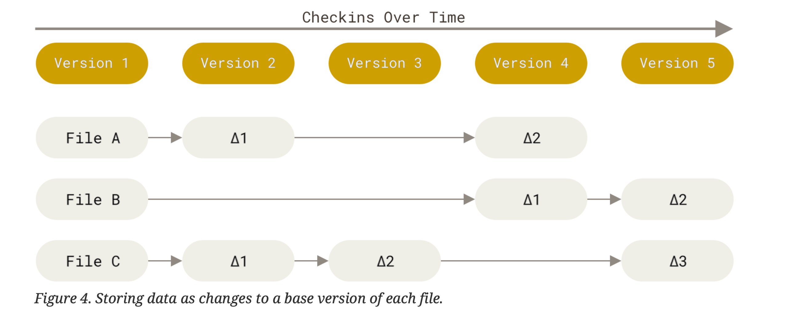
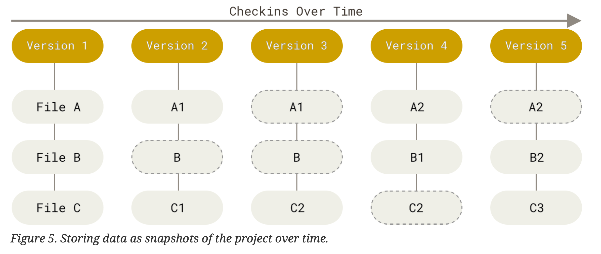
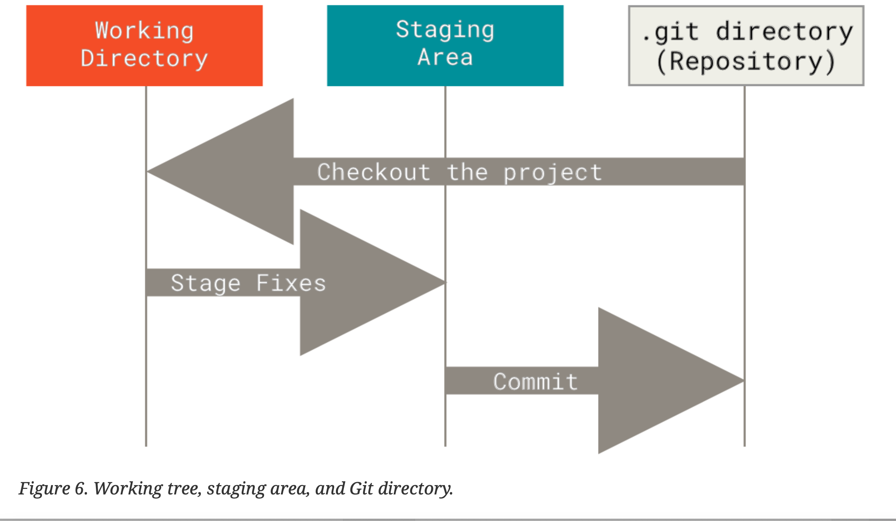
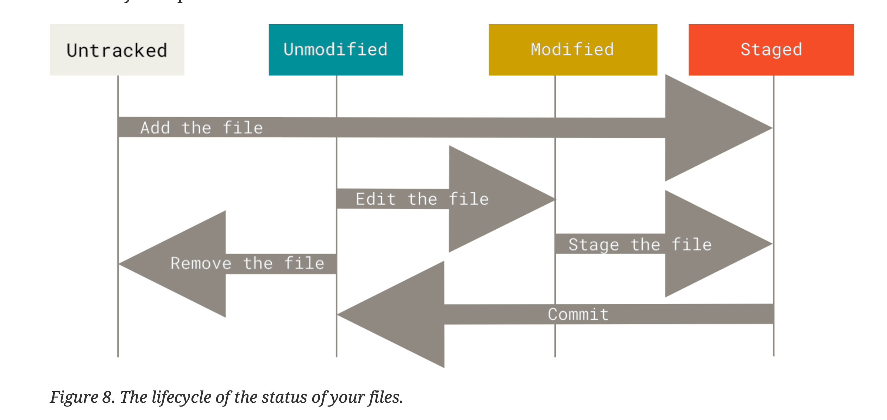

# Getting started
- Version Control System: hệ thống quản lý phiên bản
- VCS dùng để:
    - Revert lại bản cũ nếu cần (chi phí rất thấp)
    - Ban đầu chỉ dùng trên 1 máy gọi là Revision Control System (RCS)
    - Sau dùng trên nhiều máy, để nhiều người contribute vào thì gọi là Centralized Version Control System (CVCS)
    - Cái CVCS nhìn có vẻ ngon, nhưng phụ thuộc 100% vào remote server. Trường hợp remote server down => toàn bộ mọi người không làm việc được
    - Sinh ra cái Distributed Version Control System:
        - Trên server cũng có 1 cái CVCS
        - Dưới local cũng có 1 cái CVCS
        - Trường hợp server down cũng chả sao. Tự làm ở local. Sau server up thì push lên

## Lịch sử của Git
- 2002, Linux dùng BitKeeper để phân phối các bản distribution của mình
- 2005, mối quan hệ của cộng đồng Linux với BitKeeper rạn nứt, không còn lisence free nữa
- Việc này khiến Linux community cần tự chế 1 cái tool quản lý phiên bản cho riêng mình, cần đáp ứng các nhu cầu sau:
    - Tốc độ nhanh
    - Thiết kế đơn giản
    - Hỗ trợ mạnh mẽ cho non-linear developement (có nhiều branch song song)
    - Fully distributed
    - Có khả năng handle project lớn như Linux Kernel
## Git là gì?
- Git là 3 từ random, có khả năng phát âm được, và không trùng với bất cứ command nào đã có của Linux
- Mặc dù UI có vẻ nhìn giống nhau, nhưngGit lưu trữ và nghĩ về dữ liệu rất khác các VSC khác.

### Snapshots, not difference
- Bình thường các VSC sẽ chia thành 2 trường phái:
    - 1: Lưu data dựa trên thay đổi của từng file tại thời điểm commit(hay còn gọi là delta base)
    
    - 2: Lưu 1 ảnh của hệ thống tại thời điểm commit (hay đơn giản là chụp 1 cái ảnh của toàn bộ hệ thống tại thời điểm commit lại)
    
- Git giống như 1 mini system, có các tính năng khác build on top (thay vì chỉ đơn giản là 1 VSC tool)
- Gần như toàn bộ operation đều là local
    - VD bạn đang ngồi trên tàu hoả/máy bay để code => ko có mạng.
        - Nếu dùng SVN hoặc các tool khác cần online mới commit được => bất tiện vkl.
        - Dùng git thì commit local, sau có mạng push lên là xong.

### Vài note:
- Git đảm bảo tính toàn vẹn
    - Tất cả mọi thứ trong git đều được checksum trước khi lưu trữ.
    - Git dùng SHA-1, 40 kí tự

- Git chỉ add data thôi
    - Khi bạn làm bất cứ điều gì, gần như git chỉ add vào git database thôi
- Ba trạng thái của Git (rất quan trọng):
    - `modified`: file có sự thay đổi, chưa commit vào database
    - `staged`: đánh dấu file có sự thay đổi đã được đưa vào version tiếp theo khi commit
    - `committed`: data đã được lưu vào local database

- Working tree: là 1 phiên bản được lấy ra từ project. Các file này được lấy ra từ compressed database, lưu luôn trên đĩa để bạn sử dụng hoặc sửa đổi.
- Staging area: là 1 file, nằm trong thư mục .git, lưu trữ các thông tin sẽ có trong commit tiếp theo. Gọi theo cách giản dị của git chính là index
- Git directory: Nơi git lưu meta data và các object trong database cho project của bạn. Đây là thành phần quan trọng nhất của Git, cũng chính là thứ mà bạn copy/ clone project từ máy người khác về.
- Git config: nằm ở 3 thư mục:
    - `/etc/gitconfig`: cho toàn bộ user
    - `~/.gitconfig` hoặc `~/config/gitconfig`: cho user hiện tại
    - `.git/config`: config cho repo hiện tại.
- Cái nào trùng nhau sẽ bị override, cái ở dưới load sau, sẽ override lên cái trên
- Muốn xem config lấy từ đâu, dùng lệnh `git config --list --show-origin`

# Git cơ bản
- `git status`: xem trạng thái
- `git add`: đưa file vào vùng stag
- `git commit`: đưa file vào database
- `git add -a`: add toàn bộ file đang sửa đổi vào vùng stag
- `git rm`: remove file và add file vào vùng stag luôn
    - Nếu chỉ dùng `rm` thì nó chỉ remove file thôi, cần dùng git add {file-name} để add file nữa.

## Git ignore
- Rule cho file .gitignore:
    - Dòng trống, hoặc dòng bắt đầu bởi `#` sẽ bị ignore
    - Pattern không định nghĩa gì đặc biệt => sẽ apply đệ quy các rule
    - Pattern bắt đầu bởi `/` sẽ không đệ quy
    - Bắt đầu bởi `/` tượng trưng cho dòng trống
    - Đảo chiều của mệnh đề bằng cách dùng dấu `!` ở đầu.

## Undo things
- Ví dụ commit xong xuôi, nhận thấy quên add 1 file => dùng git commit --amend => sẽ đưa file trong vùng stag vào commit gần nhất
    - Command này đơn giản là replace toàn bộ commit gần nhất bằng commit hiện tại.
    - Nếu đã commit lên remote rồi thì đừng dùng command này không là lỗi sml

