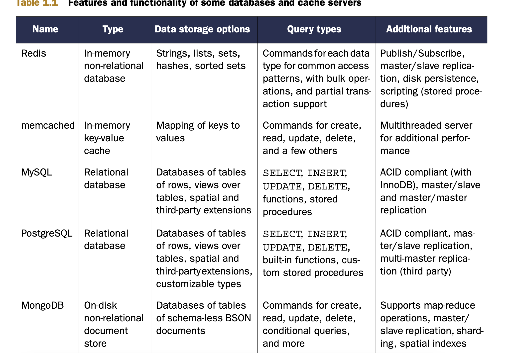

# Foreword
- Tác giả gặp bài toán đếm số lượng người truy cập website
- Dùng DB chậm => dùng in-memory để xử lý cho nhanh 
- Xong tác giả viết 1 con lib gà gà làm bằng C, thế là 1 thời gian sau redis ra đời.

# Chap 1: Getting to know Redis
- Redis là in memory remote database
- Có 5 kiểu dữ liệu => support hầu hết các cases, bài toán
- Một số tính năng: replication, persistence, client-side sharding giúp redis có khả năng xử lý hàng trăm GB data, hàng triệu request 1 giây

## 1.1. What is redis?
- Redis là very fast non-relational database
- Support replication, persistence, client-side sharding
- Redis so với software và db khác:
    - Redis là non-relational database
    - Thường thấy redis bị so sánh với memcache. Khác nhau cơ bản nhất redis và memcache:
        - memcache chỉ support string
        - redis support 5 loại data type, đa dạng hơn.
- So sánh redis với db khác



- Một số feature khác:
    - Ghi xuống đĩa:
        - Khi đạt 1 số lượng write trong 1 khoảng thời gian nhất định
        - Khi cmd write to disk được gọi
        - Dùng append mode
    - Master/slave để tăng read perf:
        - Sẽ sync từ master sang replica.

- Why redis:
    - Memcache dùng APPEND để lưu phần tử vào mảng có sẵn. Xoá đi vẫn dùng APPEND + cho vào blacklist để tránh việc truy cập ngẫu nhiên.
    - Redis thì dùng LIST, SET => add và remove direct luôn, không cần blacklist gì cả.
    - Dùng redis thì code ngắn hơn (do ko có blacklist) => dễ maintain hơn.
    - Một case khác là những cái report lâu dài. Bình thường database sẽ lưu vào db, khi có thêm dữ liệu thì update lại record => chậm do có action random read & random write. Trong redis đơn giản dùng INCR command. Kể cả random read, write thì vẫn nhanh do nằm trên mem.
    - Dùng redis thì không cần write file tạm (như db bình thường vẫn write file tạm), sau đó mất công xoá file tạm nữa.

## 1.2. What Redis data strutures look like
- Có 5 loại: string, list, set, sorted set, hash
- Có vài shared command: del, type, rename

## 1.3.  Hello Redis
- Cùng xem 1 vài bài toán thực tế với Redis

### 1.3.1. Voting articles
- Giả sử có khoảng 1000 bài viết được đăng mỗi ngày
- Trong 1000 bài này, cần đưa ra top 50 bài viết hay (có ít nhất 200 lượt vote mỗi bài)
- Tổ chức cũng khá dễ:
    - Lưu nội dung article vào hashmap `article:<id>` -> {title, link, poster, time, votes}
    - Lưu 2 sorted set (zset): time-base (theo thời gian tạo) và score-base (theo điểm)
    - Lưu 1 set những user đã vote cho article này: `vote:<id>` -> {user_ids}
- Các bài toán gặp phải:
    - Vote thế nào?
    - Post bài mới thế nào?
    - Fetch bài về thế nào?
    - Group bài thế nào?
        - Group khá hay: Giả dụ có:
            - Set group programming
            - zset by score
            - Giờ cần lấy ra zset by score của group programing?
            - => dùng ZINTERSTORE để lưu vào 1 key trung gian, set expire 60s (do ko phải lúc nào cũng có người vào group này)
    - Bài tập ứng dụng làm tính năng downvote
        - Gợi ý: 
            - Khi user upvote => sadd vào set
            - Khi user downvote => smove vào set khác

- Tóm lại cái hay của chương này:
    - Redis có nhiều kiểu dữ liệu mà thằng khác không có
    - Redis là in-memory => fast
    - Redis hỗ trợ remote
    - Redis hỗ trợ persistence (lưu xuống đĩa, lưu dữ liệu khi reboot)
    - Redis scaleable (master/slave)

# Chap 2: Anatomy of Redis web application
- HTTP request là stateless, ko lưu lại thông tin của các request cũ
- Trong chap này giả sử đang làm việc với 1 chuỗi web bán lẻ:
    - 100 triệu truy cập 1 ngày
    - ~ 5 triệu user mỗi ngày
    - 100.000 item được mua mỗi ngày
- Con số này khá lớn. Tuy nhiên nếu lớn còn giải quyết được => nhỏ có cái mẹ gì đâu :v

## 2.1. Login & cookie caching
- Cookie có 2 loại:
    - Signed cookie: Lưu luôn info người dùng vào cookie + kèm chữ kí. Lên server parse ra rồi dùng.
        - Ưu điểm: 
            - Thông tin được lưu hết trong cookie rồi
            - Thêm thông tin cũng dễ
        - Nhược:
            - Việc kí vào thông tin implement khá phức tạp.
            - Dễ quên việc kí/ kiểm tra tính hợp lệ của dữ liệu (VD lưu thông tin user, mà thông tin user bị thay đổi)
    - Token cookie: là 1 cái token, server lấy để query vào db => information
        - Ưu điểm:
            - Nhỏ => device như mobile req cũng nhanh
            - Dễ dàng thêm thông tin (?)
        - Nhược điểm:
            - Thông tin lưu trữ nhiều ở server
            - Nếu dùng relational db để query info dựa trên cookie => là 1 expensive thao tác.
- Trong bài này chọn token cookie để implement.
- Dùng hmap để lưu trữ
- Để check token, dùng `hget <key> <field>`
    - VD: `hget login: {token}`
- Để update token, recent view:
    - hset login: token user
    - zadd recent: token timestamp
    - Nếu user view 1 item nào đó, thêm vào list recent view, trim lấy 25 thằng ngon nhất thôi:
        - zadd viewed:{token} item timestampt
        - zremrangebyrank viewed:{token} 0 -26
- Nếu lưu tất cả token vào set => có ngày đầy sml do hết bộ nhớ
- => chỉ lưu 10 triệu record thôi
- => mỗi giây check 1 lần, hoặc 60s check 1 lần, remove bớt đi

```
QUIT = False
LIMIT = 10 000 000

def clean_sessions(conn):
    while not QUIT:
        size = conn.zcard('recent:')
        if size < LIMIT:
            time.sleep(1000)
            continue

        end_index = min(size - LIMIT, 100) // delete 100 cái một thôi cho đỡ lag hệ thống
        tokens = conn.zrange('recent:', 0, end_index - 1)

        session_keys = []
        for token in tokens:
            session_keys.append('viewed:' + token)
        
        conn.delete(*session_keys)
        conn.hdel('login:', *tokens)
        conn.zrem('recent:', *tokens)
```

