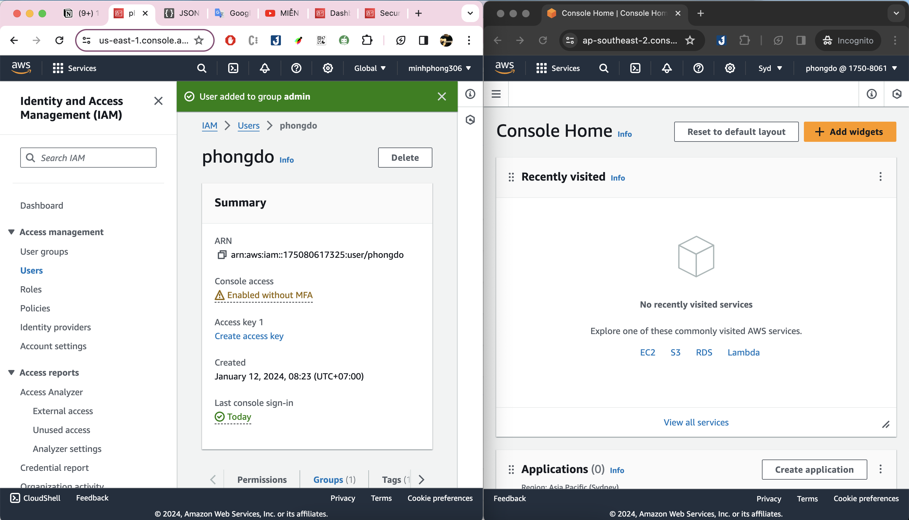
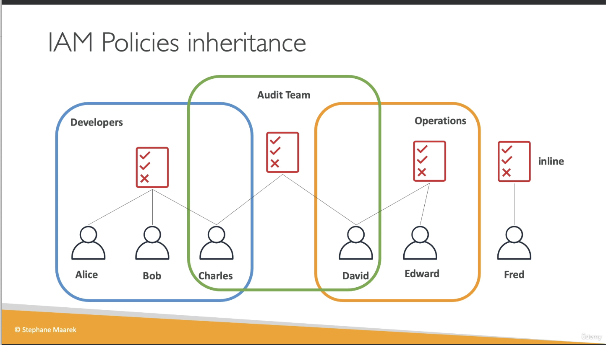
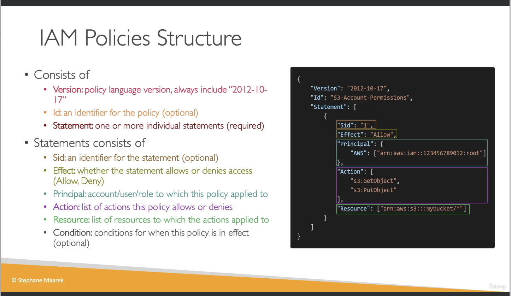

# 12-01- IAM

- **IAM** = Identity and access management, **Global service**
- **Root account** được tạo default, thường không nên dùng và share ra
- **Users** là những người trong organization, có thể được group lại
- **Groups** chỉ chứa users, không chứa được group khác.
- User không bắt buộc phải thuộc về group nào cả (dù đây không phải best practice). Và một user có thể thuộc nhiều groups.
- Ví dụ:
    - Group developers: Alice, Bob, Chales
    - Group Operation: David, Edward
    - Not belong to any group: Fred
    - Group Audit team: Chales, David
    

---

# IAM: Permission

- Users và Groups có thể được assigned quyền bằng cách dùng JSON trông như này:
```
{
  "Version": "2021-10-17",
  "Statement": [
    {
      "Effect": "Allow",
      "Action": "ec2:Describe*",
      "Resource": "*"
    },
    {
      "Effect": "Allow",
      "Action": "elasticloadbalancing:Describe*",
      "Resource": "*"
    },
    {
      "Effect": "Allow",
      "Action": [
        "cloudwatch:ListMetrics",
        "cloudwatch:GetMetricsStatistics",
        "cloudwatch:Describe*"
      ],
      "Resource": "*"
    }
  ]
}
```

# Hands-on lab
- Result


# IAM Policies
- policy có thể đính vào group hoặc đính trực tiếp vào user
- nếu user thuộc nhiều group ~> user sẽ tự động được ăn policy của cả 2 group



- Policy structure
  - Version
  - Id
  - Statement

