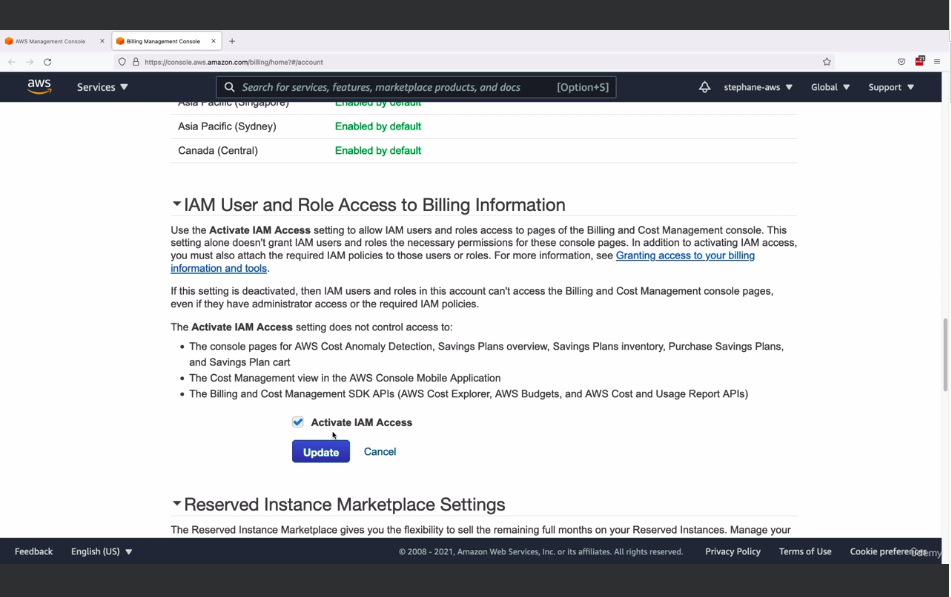
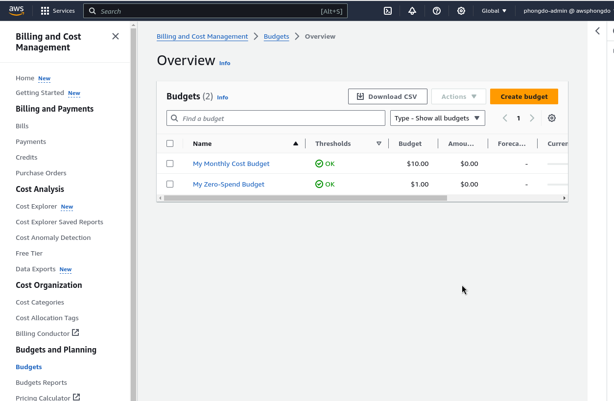

# AWS Budget Setup
- Để nhìn thấy budget, cần setting trong root account (click icon ở góc > account)

- Có thể vào menu free-tier để xem cái gì free, đang dùng tới đâu rồi

- Result

# EC2 Basic
- EC2 là dịch vụ phổ biến nhất của AWS
- EC2 = Elastic Compute Cloud
- Thường cung cấp:
  - Thue máy ảo (EC2)
  - Lưu trữ data trên máy ờf

## EC2 user data
- 