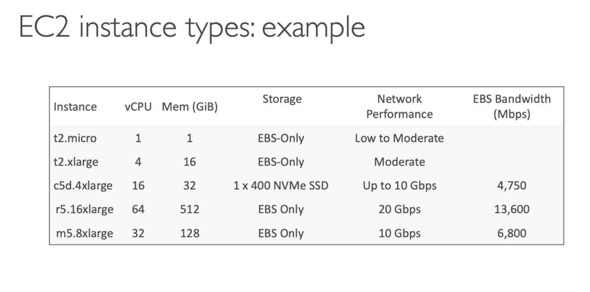

# AWS Budget Setup
- Để nhìn thấy budget, cần setting trong root account (click icon ở góc > account)

- Có thể vào menu free-tier để xem cái gì free, đang dùng tới đâu rồi

- Result

# EC2 Basic
- EC2 là dịch vụ phổ biến nhất của AWS
- EC2 = Elastic Compute Cloud
- Thường cung cấp:
  - Thue máy ảo (EC2)
  - Lưu trữ data trên máy ảo / EBS volumes
  - Distribute load across machines (ELB)
  - Scaling service dùng auto-scaling group (ASG)
- Biết về EC2 là nền tảng để hiểu cloud hoạt động thế nào
- EC2 sizing & configuration options
  - Operating System (OS): Linux, Window or Mac OS
  - How much power & cores (CPU)
  - How much random-access memory (RAM)
  - How much storage space:
    - Network-attached (EBS & EFS)
    - Hardware (EC2 Instance Store)
  - Network card: speed of card, Public IP Address
  - Firewall rules: security group
  - Bootstrap script

## EC2 user data
- Có thể boostrap instance dùng EC2 User Data script (nghĩa là chạy command lúc máy khởi động lên)
  - Script này chỉ chạy 1 lần duy nhất, lúc máy khởi động lên
- Thường dùng để:
  - Install updates
  - Install sofware
  - Download common file
  - ...
- EC2 User Data script run với quyền sudo

## EC2 instance types
