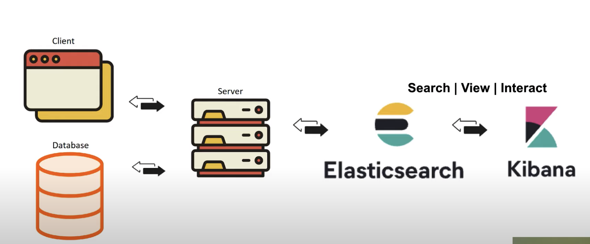

> https://www.youtube.com/watch?v=gS_nHTWZEJ8&list=LL&index=1&ab_channel=OfficialElasticCommunity
> https://github.com/LisaHJung/Part-1-Intro-to-Elasticsearch-and-Kibana?tab=readme-ov-file

# Giới thiệu
- Elastic Stack bao gồm:
  - Elasticsearch: trái tim của hệ thống
  - Kibana: Dùng để visualize.
  - Beats: chưa biết.
  - Logstash: chưa biết.

- Use case sử dụng:
  - Logging
  - Metrics
  - Security Analytics
  - Business Analytic
- Mục tiêu bài này:
  - Hiểu các use case của Elasticsearch và Kibana.
  - Hiểu basic architecture của Elasticsearch.
  - Thực hiện CRUD với Elasticsearch và Kibana.

# Hiểu các use case của Elasticsearch và Kibana.
## Elasticsearch
- Giả sử bạn đang làm website bán rau củ quả.
- Bạn cần cung cấp Great Search Experience = tìm kiếm nhanh ra kết quả liên quan; scale lên không ảnh hưởng.
- Điều mà các DB hiện thông thường không đáp ứng được là không thể search "gần đúng" được.
  - VD: tìm tên mắm tôm hãng "alex", nhưng người dùng nhập "blex" và vẫn phải ra kết quả.
- Như vậy, Elasticsearch giúp tìm kiếm kết quả.
## Kibana
- Giúp visualize dữ liệu theo mong muốn. Về bản chất là sẽ thực thi các câu query trên Elasticsearch.


# Hiểu basic architecture của Elasticsearch
- Có vài khái niệm:
  - Node: là một instance của Elasticsearch. Có unique id và name. Thuộc về một cluster nhất định.
  - Cluster: là một cụm các node
  - Document: Dữ liệu được lưu ở dạng document. Có một unique ID.
  - Index: Dữ liệu được gom nhóm vào các index khác nhau.
  - Shard: là đơn vị lưu trữ các documents.
  - Replica shard là các shard backup.
  - Có thể search song song:
    - VD: có 1 shard, 500k document, search hết 10s.
      - Bây giờ tăng lên 10 shard, chia đều 500k document này ra, search chỉ hết 1s.
  - Việc dùng replica shard cũng giúp tăng tốc query.

# Thực hiện CRUD với Elasticsearch và Kibana
## Setup
```
docker volume create elk-elastic
docker volume create elk-kibana
docker network create elastic
docker run --name es01 --mount source=elk-elastic,destination=/usr/share/elasticsearch/data --net elastic -p 9200:9200  -it -m 2GB  -e "cluster.routing.allocation.disk.threshold_enabled=false" docker.elastic.co/elasticsearch/elasticsearch:8.13.2


━━━━━━━━━━━━━━━━━━━━━━━━━━━━━━━━━━━━━━━━━━━━━━━━━━━━━━━━━
✅ Elasticsearch security features have been automatically configured!
✅ Authentication is enabled and cluster connections are encrypted.

ℹ️  Password for the elastic user (reset with `bin/elasticsearch-reset-password -u elastic`):
  N7DwK3+C59vA3oo7srly

ℹ️  HTTP CA certificate SHA-256 fingerprint:
  9026eb00bf375ac39f2ac0f158f94d6912bf4ed8cc58eaeb3b5b69b9dc616920

ℹ️  Configure Kibana to use this cluster:
• Run Kibana and click the configuration link in the terminal when Kibana starts.
• Copy the following enrollment token and paste it into Kibana in your browser (valid for the next 30 minutes):
  eyJ2ZXIiOiI4LjEzLjIiLCJhZHIiOlsiMTcyLjI4LjAuMjo5MjAwIl0sImZnciI6IjkwMjZlYjAwYmYzNzVhYzM5ZjJhYzBmMTU4Zjk0ZDY5MTJiZjRlZDhjYzU4ZWFlYjNiNWI2OWI5ZGM2MTY5MjAiLCJrZXkiOiJsTnQzTW84QlZZeUFxR1FkOTZvZTpJM29BQ1hVd1JET0trNDlLeVExcHl3In0=

ℹ️ Configure other nodes to join this cluster:
• Copy the following enrollment token and start new Elasticsearch nodes with `bin/elasticsearch --enrollment-token <token>` (valid for the next 30 minutes):
  eyJ2ZXIiOiI4LjEzLjIiLCJhZHIiOlsiMTcyLjI4LjAuMjo5MjAwIl0sImZnciI6IjkwMjZlYjAwYmYzNzVhYzM5ZjJhYzBmMTU4Zjk0ZDY5MTJiZjRlZDhjYzU4ZWFlYjNiNWI2OWI5ZGM2MTY5MjAiLCJrZXkiOiJsdHQzTW84QlZZeUFxR1FkOTZveDpFRDhOSUZXZlJBMm8xa3ZwcDdrQWtBIn0=

  If you're running in Docker, copy the enrollment token and run:
  `docker run -e "ENROLLMENT_TOKEN=<token>" docker.elastic.co/elasticsearch/elasticsearch:8.13.2`
━━━━━━━━━━━━━━━━━━━━━━━━━━━━━━━━━━━━━━━━━━━━━━━━━━━━━━━━━

docker pull docker.elastic.co/kibana/kibana:8.13.2
docker run --name kib01 --net elastic -p 5601:5601 docker.elastic.co/kibana/kibana:8.13.2

# Remove the Elastic network
docker network rm elastic

# Remove the Elasticsearch container
docker rm es01

# Remove the Kibana container
docker rm kib01

```
- http://0.0.0.0:5601/app/dev_tools#/console

## Lấy thông tin về cluster và nodes
```
GET _API/parameter
```

- Cluster health
```
GET _cluster/health


{
  "cluster_name": "docker-cluster",
  "status": "green",
  "timed_out": false,
  "number_of_nodes": 1,
  "number_of_data_nodes": 1,
  "active_primary_shards": 0,
  "active_shards": 0,
  "relocating_shards": 0,
  "initializing_shards": 0,
  "unassigned_shards": 0,
  "delayed_unassigned_shards": 0,
  "number_of_pending_tasks": 0,
  "number_of_in_flight_fetch": 0,
  "task_max_waiting_in_queue_millis": 0,
  "active_shards_percent_as_number": {
    "value": "100.0n",
    "type": "Big Number"
  }
}


GET _nodes/stats
{
  "_nodes": {
    "total": 1,
    "successful": 1,
    "failed": 0
  },
  "cluster_name": "docker-cluster",
  "nodes": {
    "A4XVuekdRF6hbHFkfe8tzg": {
      "timestamp": 1714539868356,
      "name": "03ed673ff0db",
      "transport_address": "172.28.0.2:9300",
      "host": "172.28.0.2",
      "ip": "172.28.0.2:9300",
      "roles": [
        "data",
        "data_cold",
        "data_content",
        "data_frozen",
        "data_hot",
        "data_warm",
        "ingest",
        "master",
        "ml",
        "remote_cluster_client",
        "transform"
      ],
      "attributes": {
        "ml.allocated_processors_double": "8.0",
        "ml.allocated_processors": "8",
        "ml.machine_memory": "2147483648",
        "transform.config_version": "10.0.0",
        "xpack.installed": "true",
        "ml.config_version": "12.0.0",
        "ml.max_jvm_size": "1073741824"
      },
      "indices": {
        "docs": {
          "count": 430,
          "deleted": 15
        },
        "shard_stats": {
          "total_count": 32
        },
        "store": {
          "size_in_bytes": 3396221,
          "total_data_set_size_in_bytes": 3396221,
          "reserved_in_bytes": 0
        },
        "indexing": {
          "index_total": 606,
          "index_time_in_millis": 1836,
          "index_current": 0,
          "index_failed": 3,
          "delete_total": 3,
          "delete_time_in_millis": 8,
          "delete_current": 0,
          "noop_update_total": 0,
          "is_throttled": false,
          "throttle_time_in_millis": 0,
          "write_load": 0.00007379116307413544
        },
        "get": {
          "total": 436,
          "time_in_millis": 425,
          "exists_total": 297,
          "exists_time_in_millis": 385,
          "missing_total": 139,
          "missing_time_in_millis": 40,
          "current": 0
        },
        "search": {
          "open_contexts": 0,
          "query_total": 1000,
          "query_time_in_millis": 4287,
          "query_current": 0,
          "fetch_total": 988,
          "fetch_time_in_millis": 284,
          "fetch_current": 0,
          "scroll_total": 539,
          "scroll_time_in_millis": 66565,
          "scroll_current": 0,
          "suggest_total": 0,
          "suggest_time_in_millis": 0,
          "suggest_current": 0
        },
        "merges": {
          "current": 0,
          "current_docs": 0,
          "current_size_in_bytes": 0,
          "total": 10,
          "total_time_in_millis": 392,
          "total_docs": 505,
          "total_size_in_bytes": 945548,
          "total_stopped_time_in_millis": 0,
          "total_throttled_time_in_millis": 0,
          "total_auto_throttle_in_bytes": 671088640
        },
        "refresh": {
          "total": 277,
          "total_time_in_millis": 4971,
          "external_total": 219,
          "external_total_time_in_millis": 5160,
          "listeners": 0
        },
        "flush": {
          "total": 54,
          "periodic": 54,
          "total_time_in_millis": 2729
        },
        "warmer": {
          "current": 0,
          "total": 184,
          "total_time_in_millis": 154
        },
        "query_cache": {
          "memory_size_in_bytes": 0,
          "total_count": 0,
          "hit_count": 0,
          "miss_count": 0,
          "cache_size": 0,
          "cache_count": 0,
          "evictions": 0
        },
        "fielddata": {
          "memory_size_in_bytes": 1472,
          "evictions": 0,
          "global_ordinals": {
            "build_time_in_millis": 21
          }
        },
        "completion": {
          "size_in_bytes": 0
        },
        "segments": {
          "count": 36,
          "memory_in_bytes": 0,
          "terms_memory_in_bytes": 0,
          "stored_fields_memory_in_bytes": 0,
          "term_vectors_memory_in_bytes": 0,
          "norms_memory_in_bytes": 0,
          "points_memory_in_bytes": 0,
          "doc_values_memory_in_bytes": 0,
          "index_writer_memory_in_bytes": 120532,
          "version_map_memory_in_bytes": 0,
          "fixed_bit_set_memory_in_bytes": 592,
          "max_unsafe_auto_id_timestamp": -1,
          "file_sizes": {}
        },
        "translog": {
          "operations": 15,
          "size_in_bytes": 8649,
          "uncommitted_operations": 15,
          "uncommitted_size_in_bytes": 8649,
          "earliest_last_modified_age": 30197
        },
        "request_cache": {
          "memory_size_in_bytes": 0,
          "evictions": 0,
          "hit_count": 1,
          "miss_count": 58
        },
        "recovery": {
          "current_as_source": 0,
          "current_as_target": 0,
          "throttle_time_in_millis": 0
        },
        "bulk": {
          "total_operations": 265,
          "total_time_in_millis": 2113,
          "total_size_in_bytes": 4324302,
          "avg_time_in_millis": 0,
          "avg_size_in_bytes": 8653
        },
        "mappings": {
          "total_count": 11011,
          "total_estimated_overhead_in_bytes": 11275264
        },
        "dense_vector": {
          "value_count": 0
        }
      },
      "os": {
        "timestamp": 1714539868364,
        "cpu": {
          "percent": 1,
          "load_average": {
            "1m": 0.21,
            "5m": 0.27,
            "15m": 0.26
          }
        },
        "mem": {
          "total_in_bytes": 2147483648,
          "adjusted_total_in_bytes": 2147483648,
          "free_in_bytes": 99672064,
          "used_in_bytes": 2047811584,
          "free_percent": 5,
          "used_percent": 95
        },
        "swap": {
          "total_in_bytes": 2147483648,
          "free_in_bytes": 2147483648,
          "used_in_bytes": 0
        },
        "cgroup": {
          "cpuacct": {
            "control_group": "/",
            "usage_nanos": 226715906000
          },
          "cpu": {
            "control_group": "/",
            "cfs_period_micros": 100000,
            "cfs_quota_micros": -1,
            "stat": {
              "number_of_elapsed_periods": 0,
              "number_of_times_throttled": 0,
              "time_throttled_nanos": 0
            }
          },
          "memory": {
            "control_group": "/",
            "limit_in_bytes": "2147483648",
            "usage_in_bytes": "2047811584"
          }
        }
      },
      "process": {
        "timestamp": 1714539868365,
        "open_file_descriptors": 609,
        "max_file_descriptors": 1048576,
        "cpu": {
          "percent": 0,
          "total_in_millis": 190970
        },
        "mem": {
          "total_virtual_in_bytes": 7312711680
        }
      },
      "jvm": {
        "timestamp": 1714539868365,
        "uptime_in_millis": 1228647,
        "mem": {
          "heap_used_in_bytes": 479000384,
          "heap_used_percent": 44,
          "heap_committed_in_bytes": 1073741824,
          "heap_max_in_bytes": 1073741824,
          "non_heap_used_in_bytes": 247922840,
          "non_heap_committed_in_bytes": 265093120,
          "pools": {
            "young": {
              "used_in_bytes": 352321536,
              "max_in_bytes": 0,
              "peak_used_in_bytes": 612368384,
              "peak_max_in_bytes": 0
            },
            "old": {
              "used_in_bytes": 94426048,
              "max_in_bytes": 1073741824,
              "peak_used_in_bytes": 94426048,
              "peak_max_in_bytes": 1073741824
            },
            "survivor": {
              "used_in_bytes": 32252800,
              "max_in_bytes": 0,
              "peak_used_in_bytes": 66427392,
              "peak_max_in_bytes": 0
            }
          }
        },
        "threads": {
          "count": 125,
          "peak_count": 125
        },
        "gc": {
          "collectors": {
            "young": {
              "collection_count": 17,
              "collection_time_in_millis": 737
            },
            "G1 Concurrent GC": {
              "collection_count": 12,
              "collection_time_in_millis": 231
            },
            "old": {
              "collection_count": 0,
              "collection_time_in_millis": 0
            }
          }
        },
        "buffer_pools": {
          "mapped": {
            "count": 42,
            "used_in_bytes": 3235769,
            "total_capacity_in_bytes": 3235769
          },
          "direct": {
            "count": 76,
            "used_in_bytes": 9510123,
            "total_capacity_in_bytes": 9510121
          },
          "mapped - 'non-volatile memory'": {
            "count": 0,
            "used_in_bytes": 0,
            "total_capacity_in_bytes": 0
          }
        },
        "classes": {
          "current_loaded_count": 33455,
          "total_loaded_count": 34646,
          "total_unloaded_count": 1191
        }
      },
      "thread_pool": {
        "analyze": {
          "threads": 0,
          "queue": 0,
          "active": 0,
          "rejected": 0,
          "largest": 0,
          "completed": 0
        },
        "auto_complete": {
          "threads": 0,
          "queue": 0,
          "active": 0,
          "rejected": 0,
          "largest": 0,
          "completed": 0
        },
        "azure_event_loop": {
          "threads": 0,
          "queue": 0,
          "active": 0,
          "rejected": 0,
          "largest": 0,
          "completed": 0
        },
        "ccr": {
          "threads": 0,
          "queue": 0,
          "active": 0,
          "rejected": 0,
          "largest": 0,
          "completed": 0
        },
        "cluster_coordination": {
          "threads": 1,
          "queue": 0,
          "active": 0,
          "rejected": 0,
          "largest": 1,
          "completed": 481
        },
        "downsample_indexing": {
          "threads": 0,
          "queue": 0,
          "active": 0,
          "rejected": 0,
          "largest": 0,
          "completed": 0
        },
        "esql": {
          "threads": 4,
          "queue": 0,
          "active": 0,
          "rejected": 0,
          "largest": 4,
          "completed": 4
        },
        "esql_worker": {
          "threads": 0,
          "queue": 0,
          "active": 0,
          "rejected": 0,
          "largest": 0,
          "completed": 0
        },
        "fetch_shard_started": {
          "threads": 0,
          "queue": 0,
          "active": 0,
          "rejected": 0,
          "largest": 0,
          "completed": 0
        },
        "fetch_shard_store": {
          "threads": 0,
          "queue": 0,
          "active": 0,
          "rejected": 0,
          "largest": 0,
          "completed": 0
        },
        "flush": {
          "threads": 4,
          "queue": 0,
          "active": 0,
          "rejected": 0,
          "largest": 4,
          "completed": 54
        },
        "force_merge": {
          "threads": 0,
          "queue": 0,
          "active": 0,
          "rejected": 0,
          "largest": 0,
          "completed": 0
        },
        "generic": {
          "threads": 14,
          "queue": 0,
          "active": 0,
          "rejected": 0,
          "largest": 14,
          "completed": 5075
        },
        "get": {
          "threads": 0,
          "queue": 0,
          "active": 0,
          "rejected": 0,
          "largest": 0,
          "completed": 0
        },
        "inference_utility": {
          "threads": 1,
          "queue": 0,
          "active": 0,
          "rejected": 0,
          "largest": 1,
          "completed": 1
        },
        "management": {
          "threads": 5,
          "queue": 0,
          "active": 1,
          "rejected": 0,
          "largest": 5,
          "completed": 3114
        },
        "ml_datafeed": {
          "threads": 0,
          "queue": 0,
          "active": 0,
          "rejected": 0,
          "largest": 0,
          "completed": 0
        },
        "ml_job_comms": {
          "threads": 0,
          "queue": 0,
          "active": 0,
          "rejected": 0,
          "largest": 0,
          "completed": 0
        },
        "ml_native_inference_comms": {
          "threads": 0,
          "queue": 0,
          "active": 0,
          "rejected": 0,
          "largest": 0,
          "completed": 0
        },
        "ml_utility": {
          "threads": 2,
          "queue": 0,
          "active": 0,
          "rejected": 0,
          "largest": 2,
          "completed": 2549
        },
        "profiling": {
          "threads": 0,
          "queue": 0,
          "active": 0,
          "rejected": 0,
          "largest": 0,
          "completed": 0
        },
        "refresh": {
          "threads": 4,
          "queue": 0,
          "active": 0,
          "rejected": 0,
          "largest": 4,
          "completed": 24986
        },
        "repository_azure": {
          "threads": 0,
          "queue": 0,
          "active": 0,
          "rejected": 0,
          "largest": 0,
          "completed": 0
        },
        "rollup_indexing": {
          "threads": 0,
          "queue": 0,
          "active": 0,
          "rejected": 0,
          "largest": 0,
          "completed": 0
        },
        "search": {
          "threads": 13,
          "queue": 0,
          "active": 0,
          "rejected": 0,
          "largest": 13,
          "completed": 32
        },
        "search_coordination": {
          "threads": 1,
          "queue": 0,
          "active": 0,
          "rejected": 0,
          "largest": 1,
          "completed": 1
        },
        "search_throttled": {
          "threads": 0,
          "queue": 0,
          "active": 0,
          "rejected": 0,
          "largest": 0,
          "completed": 0
        },
        "search_worker": {
          "threads": 13,
          "queue": 0,
          "active": 0,
          "rejected": 0,
          "largest": 13,
          "completed": 1002
        },
        "searchable_snapshots_cache_fetch_async": {
          "threads": 0,
          "queue": 0,
          "active": 0,
          "rejected": 0,
          "largest": 0,
          "completed": 0
        },
        "searchable_snapshots_cache_prewarming": {
          "threads": 0,
          "queue": 0,
          "active": 0,
          "rejected": 0,
          "largest": 0,
          "completed": 0
        },
        "security-crypto": {
          "threads": 2,
          "queue": 0,
          "active": 0,
          "rejected": 0,
          "largest": 2,
          "completed": 2
        },
        "security-token-key": {
          "threads": 0,
          "queue": 0,
          "active": 0,
          "rejected": 0,
          "largest": 0,
          "completed": 0
        },
        "snapshot": {
          "threads": 0,
          "queue": 0,
          "active": 0,
          "rejected": 0,
          "largest": 0,
          "completed": 0
        },
        "snapshot_meta": {
          "threads": 0,
          "queue": 0,
          "active": 0,
          "rejected": 0,
          "largest": 0,
          "completed": 0
        },
        "system_critical_read": {
          "threads": 4,
          "queue": 0,
          "active": 0,
          "rejected": 0,
          "largest": 4,
          "completed": 33
        },
        "system_critical_write": {
          "threads": 4,
          "queue": 0,
          "active": 0,
          "rejected": 0,
          "largest": 4,
          "completed": 6
        },
        "system_read": {
          "threads": 4,
          "queue": 0,
          "active": 0,
          "rejected": 0,
          "largest": 4,
          "completed": 2227
        },
        "system_write": {
          "threads": 4,
          "queue": 0,
          "active": 0,
          "rejected": 0,
          "largest": 4,
          "completed": 341
        },
        "warmer": {
          "threads": 4,
          "queue": 0,
          "active": 0,
          "rejected": 0,
          "largest": 4,
          "completed": 658
        },
        "watcher": {
          "threads": 0,
          "queue": 0,
          "active": 0,
          "rejected": 0,
          "largest": 0,
          "completed": 0
        },
        "write": {
          "threads": 8,
          "queue": 0,
          "active": 0,
          "rejected": 0,
          "largest": 8,
          "completed": 471
        }
      },
      "fs": {
        "timestamp": 1714539868366,
        "total": {
          "total_in_bytes": 62671097856,
          "free_in_bytes": 4408291328,
          "available_in_bytes": 1191575552
        },
        "data": [
          {
            "path": "/usr/share/elasticsearch/data",
            "mount": "/usr/share/elasticsearch/data (/dev/vda1)",
            "type": "ext4",
            "total_in_bytes": 62671097856,
            "free_in_bytes": 4408291328,
            "available_in_bytes": 1191575552
          }
        ],
        "io_stats": {
          "devices": [
            {
              "device_name": "vda1",
              "operations": 52662,
              "read_operations": 30059,
              "write_operations": 22603,
              "read_kilobytes": 451012,
              "write_kilobytes": 314224,
              "io_time_in_millis": 47315
            }
          ],
          "total": {
            "operations": 52662,
            "read_operations": 30059,
            "write_operations": 22603,
            "read_kilobytes": 451012,
            "write_kilobytes": 314224,
            "io_time_in_millis": 47315
          }
        }
      },
      "transport": {
        "server_open": 0,
        "total_outbound_connections": 1,
        "rx_count": 4,
        "rx_size_in_bytes": 927,
        "tx_count": 4,
        "tx_size_in_bytes": 927,
        "inbound_handling_time_histogram": [
          {
            "lt_millis": 1,
            "count": 97
          },
          {
            "ge_millis": 1,
            "lt_millis": 2,
            "count": 804
          },
          {
            "ge_millis": 2,
            "lt_millis": 4,
            "count": 1168
          },
          {
            "ge_millis": 4,
            "lt_millis": 8,
            "count": 298
          },
          {
            "ge_millis": 8,
            "lt_millis": 16,
            "count": 82
          },
          {
            "ge_millis": 16,
            "lt_millis": 32,
            "count": 42
          },
          {
            "ge_millis": 32,
            "lt_millis": 64,
            "count": 26
          },
          {
            "ge_millis": 64,
            "lt_millis": 128,
            "count": 19
          },
          {
            "ge_millis": 128,
            "lt_millis": 256,
            "count": 5
          },
          {
            "ge_millis": 256,
            "lt_millis": 512,
            "count": 15
          },
          {
            "ge_millis": 512,
            "lt_millis": 1024,
            "count": 1
          }
        ],
        "outbound_handling_time_histogram": [
          {
            "lt_millis": 1,
            "count": 2
          },
          {
            "ge_millis": 1,
            "lt_millis": 2,
            "count": 0
          },
          {
            "ge_millis": 2,
            "lt_millis": 4,
            "count": 1
          },
          {
            "ge_millis": 4,
            "lt_millis": 8,
            "count": 0
          },
          {
            "ge_millis": 8,
            "lt_millis": 16,
            "count": 1
          }
        ],
        "actions": {
          "internal:transport/handshake": {
            "requests": {
              "count": 1,
              "total_size_in_bytes": 151,
              "histogram": [
                {
                  "ge_bytes": 128,
                  "lt_bytes": 256,
                  "count": 1
                }
              ]
            },
            "responses": {
              "count": 1,
              "total_size_in_bytes": 692,
              "histogram": [
                {
                  "ge_bytes": 512,
                  "lt_bytes": 1024,
                  "count": 1
                }
              ]
            }
          }
        }
      },
      "http": {
        "current_open": 12,
        "total_opened": 186,
        "clients": [
          {
            "id": 1262964258,
            "agent": "kibana",
            "local_address": "172.28.0.2:9200",
            "remote_address": "172.28.0.3:54418",
            "last_uri": "/_security/_authenticate",
            "x_opaque_id": "acb031c1-b6fd-41bb-be7d-5df1a2ccdf4e;kibana:application:home:",
            "opened_time_millis": 1714539522811,
            "closed_time_millis": 1714539588164,
            "last_request_time_millis": 1714539528082,
            "request_count": 5,
            "request_size_bytes": 0
          },
          {
            "id": 888943565,
            "agent": "kibana",
            "local_address": "172.28.0.2:9200",
            "remote_address": "172.28.0.3:44748",
            "last_uri": "/_nodes?filter_path=nodes.*.version%2Cnodes.*.http.publish_address%2Cnodes.*.ip",
            "x_opaque_id": "unknownId",
            "opened_time_millis": 1714539562757,
            "closed_time_millis": 1714539622649,
            "last_request_time_millis": 1714539562757,
            "request_count": 1,
            "request_size_bytes": 0
          },
          {
            "id": 123653378,
            "agent": "kibana",
            "local_address": "172.28.0.2:9200",
            "remote_address": "172.28.0.3:44738",
            "last_uri": "/.kibana_task_manager/_search?ignore_unavailable=true",
            "x_opaque_id": "unknownId",
            "opened_time_millis": 1714539562757,
            "closed_time_millis": 1714539622649,
            "last_request_time_millis": 1714539562757,
            "request_count": 1,
            "request_size_bytes": 1253
          },
          {
            "id": 270400199,
            "agent": "kibana",
            "local_address": "172.28.0.2:9200",
            "remote_address": "172.28.0.3:54402",
            "last_uri": "/_template",
            "x_opaque_id": "unknownId",
            "opened_time_millis": 1714539522811,
            "closed_time_millis": 1714539671466,
            "last_request_time_millis": 1714539611631,
            "request_count": 33,
            "request_size_bytes": 57924
          },
          {
            "id": 1764596258,
            "agent": "kibana",
            "local_address": "172.28.0.2:9200",
            "remote_address": "172.28.0.3:36584",
            "last_uri": "/_data_stream",
            "x_opaque_id": "unknownId;kibana:usage_collection:collector.fetch:core",
            "opened_time_millis": 1714539368969,
            "closed_time_millis": 1714539671466,
            "last_request_time_millis": 1714539611631,
            "request_count": 146,
            "request_size_bytes": 406851
          },
          {
            "id": 1955276699,
            "agent": "kibana",
            "local_address": "172.28.0.2:9200",
            "remote_address": "172.28.0.3:58988",
            "last_uri": "/_alias",
            "x_opaque_id": "c3bf51be-b89e-4086-861b-e2a79188cb1e;kibana:application:dev_tools:",
            "opened_time_millis": 1714539528082,
            "closed_time_millis": 1714539671466,
            "last_request_time_millis": 1714539611631,
            "request_count": 122,
            "request_size_bytes": 401301
          },
          {
            "id": 1443313190,
            "local_address": "172.28.0.2:9200",
            "remote_address": "172.28.0.3:45880",
            "last_uri": "/_nodes?pretty=true",
            "x_forwarded_for": "192.168.65.1",
            "opened_time_millis": 1714539728220,
            "closed_time_millis": 1714539728220,
            "last_request_time_millis": 1714539728220,
            "request_count": 1,
            "request_size_bytes": 0
          },
          {
            "id": 1827767925,
            "local_address": "172.28.0.2:9200",
            "remote_address": "172.28.0.3:60152",
            "last_uri": "/_nodes/stats?pretty=true",
            "x_forwarded_for": "192.168.65.1",
            "opened_time_millis": 1714539758555,
            "closed_time_millis": 1714539758755,
            "last_request_time_millis": 1714539758555,
            "request_count": 1,
            "request_size_bytes": 0
          },
          {
            "id": 1074496611,
            "local_address": "172.28.0.2:9200",
            "remote_address": "172.28.0.3:34876",
            "last_uri": "/favorite_candy?pretty=true",
            "x_forwarded_for": "192.168.65.1",
            "opened_time_millis": 1714539796326,
            "closed_time_millis": 1714539796526,
            "last_request_time_millis": 1714539796326,
            "request_count": 1,
            "request_size_bytes": 0
          },
          {
            "id": 789578713,
            "agent": "kibana",
            "local_address": "172.28.0.2:9200",
            "remote_address": "172.28.0.3:43178",
            "last_uri": "/_monitoring/bulk?system_id=kibana&system_api_version=7&interval=10000ms",
            "x_opaque_id": "unknownId",
            "opened_time_millis": 1714539742696,
            "closed_time_millis": 1714539802923,
            "last_request_time_millis": 1714539742896,
            "request_count": 3,
            "request_size_bytes": 3956
          },
          {
            "id": 1624011174,
            "agent": "kibana",
            "local_address": "172.28.0.2:9200",
            "remote_address": "172.28.0.3:47174",
            "last_uri": "/.kibana_8.13.2/_update/usage-counters%3AuiCounter%3A01052024%3Aenqueued_enqueued%3Aebt_counters.client%3Aclick?refresh=wait_for&require_alias=true",
            "x_opaque_id": "9c60dfa1-6d6b-4433-a687-a61130bb1e74;kibana:application:dev_tools:",
            "opened_time_millis": 1714539672670,
            "closed_time_millis": 1714539802923,
            "last_request_time_millis": 1714539742495,
            "request_count": 81,
            "request_size_bytes": 229793
          },
          {
            "id": 1703810727,
            "agent": "kibana",
            "local_address": "172.28.0.2:9200",
            "remote_address": "172.28.0.3:36526",
            "last_uri": "/.kibana_8.13.2/_update/usage-counters%3AuiCounter%3A01052024%3Asucceeded_200%3Aebt_counters.elastic_v3_browser%3Aclick?refresh=wait_for&require_alias=true",
            "x_opaque_id": "unknownId",
            "opened_time_millis": 1714539368763,
            "closed_time_millis": 1714539802923,
            "last_request_time_millis": 1714539742495,
            "request_count": 277,
            "request_size_bytes": 858023
          },
          {
            "id": 1700134337,
            "local_address": "172.28.0.2:9200",
            "remote_address": "172.28.0.3:50138",
            "last_uri": "/favorite_candy/_doc?pretty=true",
            "x_forwarded_for": "192.168.65.1",
            "opened_time_millis": 1714539834603,
            "closed_time_millis": 1714539834804,
            "last_request_time_millis": 1714539834603,
            "request_count": 1,
            "request_size_bytes": 55
          },
          {
            "id": 2013923593,
            "local_address": "172.28.0.2:9200",
            "remote_address": "172.28.0.3:51902",
            "last_uri": "/_nodes/stats?pretty=true",
            "x_forwarded_for": "192.168.65.1",
            "opened_time_millis": 1714539868144,
            "last_request_time_millis": 1714539868344,
            "request_count": 1,
            "request_size_bytes": 0
          },
          {
            "id": 1303712816,
            "agent": "kibana",
            "local_address": "172.28.0.2:9200",
            "remote_address": "172.28.0.3:58984",
            "last_uri": "/.kibana_8.13.2/_update/usage-counters%3AuiCounter%3A01052024%3Asucceeded_200%3Aebt_counters.elastic_v3_browser%3Aviewport_resize?refresh=wait_for&require_alias=true",
            "x_opaque_id": "c3bf51be-b89e-4086-861b-e2a79188cb1e;kibana:application:dev_tools:",
            "opened_time_millis": 1714539528082,
            "last_request_time_millis": 1714539832598,
            "request_count": 39,
            "request_size_bytes": 70794
          },
          {
            "id": 1815578406,
            "agent": "kibana",
            "local_address": "172.28.0.2:9200",
            "remote_address": "172.28.0.3:47160",
            "last_uri": "/_monitoring/bulk?system_id=kibana&system_api_version=7&interval=10000ms",
            "x_opaque_id": "9c60dfa1-6d6b-4433-a687-a61130bb1e74;kibana:application:dev_tools:",
            "opened_time_millis": 1714539672670,
            "last_request_time_millis": 1714539852916,
            "request_count": 25,
            "request_size_bytes": 43120
          },
          {
            "id": 30973538,
            "agent": "kibana",
            "local_address": "172.28.0.2:9200",
            "remote_address": "172.28.0.3:50090",
            "last_uri": "/.kibana_8.13.2/_update/usage-counters%3AuiCounter%3A01052024%3Aenqueued_enqueued%3Aebt_counters.client%3Aviewport_resize?refresh=wait_for&require_alias=true",
            "x_opaque_id": "647aca34-845e-40d3-9113-129ee42a93b8;kibana:application:dev_tools:",
            "opened_time_millis": 1714539830994,
            "last_request_time_millis": 1714539832598,
            "request_count": 2,
            "request_size_bytes": 1848
          },
          {
            "id": 1238669807,
            "agent": "kibana",
            "local_address": "172.28.0.2:9200",
            "remote_address": "172.28.0.3:47166",
            "last_uri": "/_data_stream",
            "x_opaque_id": "9c60dfa1-6d6b-4433-a687-a61130bb1e74;kibana:application:dev_tools:",
            "opened_time_millis": 1714539672670,
            "last_request_time_millis": 1714539834804,
            "request_count": 117,
            "request_size_bytes": 322367
          },
          {
            "id": 343281864,
            "agent": "kibana",
            "local_address": "172.28.0.2:9200",
            "remote_address": "172.28.0.3:43166",
            "last_uri": "/_template",
            "x_opaque_id": "unknownId",
            "opened_time_millis": 1714539742495,
            "last_request_time_millis": 1714539834804,
            "request_count": 75,
            "request_size_bytes": 198934
          },
          {
            "id": 204775665,
            "agent": "kibana",
            "local_address": "172.28.0.2:9200",
            "remote_address": "172.28.0.3:58978",
            "last_uri": "/_security/user/_has_privileges",
            "x_opaque_id": "c3bf51be-b89e-4086-861b-e2a79188cb1e;kibana:application:dev_tools:",
            "opened_time_millis": 1714539528082,
            "last_request_time_millis": 1714539868144,
            "request_count": 40,
            "request_size_bytes": 1806
          },
          {
            "id": 209369267,
            "agent": "kibana",
            "local_address": "172.28.0.2:9200",
            "remote_address": "172.28.0.3:50110",
            "last_uri": "/_alias",
            "x_opaque_id": "unknownId",
            "opened_time_millis": 1714539832598,
            "last_request_time_millis": 1714539834804,
            "request_count": 5,
            "request_size_bytes": 965
          },
          {
            "id": 1287672337,
            "agent": "kibana",
            "local_address": "172.28.0.2:9200",
            "remote_address": "172.28.0.3:50122",
            "last_uri": "/_monitoring/bulk?system_id=kibana&system_api_version=7&interval=10000ms",
            "x_opaque_id": "unknownId",
            "opened_time_millis": 1714539832598,
            "last_request_time_millis": 1714539832798,
            "request_count": 3,
            "request_size_bytes": 3969
          },
          {
            "id": 1934438807,
            "agent": "kibana",
            "local_address": "172.28.0.2:9200",
            "remote_address": "172.28.0.3:50094",
            "last_uri": "/.kibana_security_session/_doc/%2Bldn%2B6gUE%2FQ7pCgDZz12B%2FKhTr6CPc7cFRmggpoorxY%3D",
            "x_opaque_id": "unknownId",
            "opened_time_millis": 1714539831796,
            "last_request_time_millis": 1714539868144,
            "request_count": 64,
            "request_size_bytes": 212520
          },
          {
            "id": 467945733,
            "agent": "kibana",
            "local_address": "172.28.0.2:9200",
            "remote_address": "172.28.0.3:43174",
            "last_uri": "/.kibana_8.13.2/_update/usage-counters%3AuiCounter%3A01052024%3Asucceeded_200%3Aebt_counters.elastic_v3_browser%3Aclick?refresh=wait_for&require_alias=true",
            "x_opaque_id": "unknownId",
            "opened_time_millis": 1714539742495,
            "last_request_time_millis": 1714539832598,
            "request_count": 25,
            "request_size_bytes": 69693
          },
          {
            "id": 1066683898,
            "agent": "kibana",
            "local_address": "172.28.0.2:9200",
            "remote_address": "172.28.0.3:37140",
            "last_uri": "/_xpack",
            "x_opaque_id": "unknownId;kibana:usage_collection:collector.fetch:monitoringTelemetry",
            "opened_time_millis": 1714539369621,
            "last_request_time_millis": 1714539852314,
            "request_count": 18,
            "request_size_bytes": 402
          }
        ],
        "routes": {
          "/": {
            "requests": {
              "count": 13,
              "total_size_in_bytes": 0,
              "size_histogram": [
                {
                  "lt_bytes": 1,
                  "count": 13
                }
              ]
            },
            "responses": {
              "count": 13,
              "total_size_in_bytes": 6540,
              "size_histogram": [
                {
                  "ge_bytes": 32,
                  "lt_bytes": 64,
                  "count": 1
                },
                {
                  "ge_bytes": 64,
                  "lt_bytes": 128,
                  "count": 0
                },
                {
                  "ge_bytes": 128,
                  "lt_bytes": 256,
                  "count": 0
                },
                {
                  "ge_bytes": 256,
                  "lt_bytes": 512,
                  "count": 0
                },
                {
                  "ge_bytes": 512,
                  "lt_bytes": 1024,
                  "count": 12
                }
              ],
              "handling_time_histogram": [
                {
                  "lt_millis": 1,
                  "count": 3
                },
                {
                  "ge_millis": 1,
                  "lt_millis": 2,
                  "count": 8
                },
                {
                  "ge_millis": 2,
                  "lt_millis": 4,
                  "count": 1
                },
                {
                  "ge_millis": 4,
                  "lt_millis": 8,
                  "count": 1
                }
              ]
            }
          },
          "/_alias": {
            "requests": {
              "count": 8,
              "total_size_in_bytes": 0,
              "size_histogram": [
                {
                  "lt_bytes": 1,
                  "count": 8
                }
              ]
            },
            "responses": {
              "count": 8,
              "total_size_in_bytes": 25208,
              "size_histogram": [
                {
                  "ge_bytes": 2048,
                  "lt_bytes": 4096,
                  "count": 8
                }
              ],
              "handling_time_histogram": [
                {
                  "ge_millis": 2,
                  "lt_millis": 4,
                  "count": 6
                },
                {
                  "ge_millis": 4,
                  "lt_millis": 8,
                  "count": 2
                }
              ]
            }
          },
          "/_aliases": {
            "requests": {
              "count": 6,
              "total_size_in_bytes": 1056,
              "size_histogram": [
                {
                  "ge_bytes": 128,
                  "lt_bytes": 256,
                  "count": 6
                }
              ]
            },
            "responses": {
              "count": 6,
              "total_size_in_bytes": 126,
              "size_histogram": [
                {
                  "ge_bytes": 16,
                  "lt_bytes": 32,
                  "count": 6
                }
              ],
              "handling_time_histogram": [
                {
                  "ge_millis": 128,
                  "lt_millis": 256,
                  "count": 2
                },
                {
                  "ge_millis": 256,
                  "lt_millis": 512,
                  "count": 0
                },
                {
                  "ge_millis": 512,
                  "lt_millis": 1024,
                  "count": 4
                }
              ]
            }
          },
          "/_bulk": {
            "requests": {
              "count": 76,
              "total_size_in_bytes": 625445,
              "size_histogram": [
                {
                  "ge_bytes": 64,
                  "lt_bytes": 128,
                  "count": 1
                },
                {
                  "ge_bytes": 128,
                  "lt_bytes": 256,
                  "count": 0
                },
                {
                  "ge_bytes": 256,
                  "lt_bytes": 512,
                  "count": 0
                },
                {
                  "ge_bytes": 512,
                  "lt_bytes": 1024,
                  "count": 63
                },
                {
                  "ge_bytes": 1024,
                  "lt_bytes": 2048,
                  "count": 1
                },
                {
                  "ge_bytes": 2048,
                  "lt_bytes": 4096,
                  "count": 6
                },
                {
                  "ge_bytes": 4096,
                  "lt_bytes": 8192,
                  "count": 3
                },
                {
                  "ge_bytes": 8192,
                  "lt_bytes": 16384,
                  "count": 1
                },
                {
                  "ge_bytes": 16384,
                  "lt_bytes": 32768,
                  "count": 0
                },
                {
                  "ge_bytes": 32768,
                  "lt_bytes": 65536,
                  "count": 0
                },
                {
                  "ge_bytes": 65536,
                  "lt_bytes": 131072,
                  "count": 0
                },
                {
                  "ge_bytes": 131072,
                  "lt_bytes": 262144,
                  "count": 0
                },
                {
                  "ge_bytes": 262144,
                  "lt_bytes": 524288,
                  "count": 0
                },
                {
                  "ge_bytes": 524288,
                  "lt_bytes": 1048576,
                  "count": 1
                }
              ]
            },
            "responses": {
              "count": 76,
              "total_size_in_bytes": 54021,
              "size_histogram": [
                {
                  "ge_bytes": 128,
                  "lt_bytes": 256,
                  "count": 28
                },
                {
                  "ge_bytes": 256,
                  "lt_bytes": 512,
                  "count": 37
                },
                {
                  "ge_bytes": 512,
                  "lt_bytes": 1024,
                  "count": 7
                },
                {
                  "ge_bytes": 1024,
                  "lt_bytes": 2048,
                  "count": 1
                },
                {
                  "ge_bytes": 2048,
                  "lt_bytes": 4096,
                  "count": 2
                },
                {
                  "ge_bytes": 4096,
                  "lt_bytes": 8192,
                  "count": 0
                },
                {
                  "ge_bytes": 8192,
                  "lt_bytes": 16384,
                  "count": 0
                },
                {
                  "ge_bytes": 16384,
                  "lt_bytes": 32768,
                  "count": 1
                }
              ],
              "handling_time_histogram": [
                {
                  "ge_millis": 4,
                  "lt_millis": 8,
                  "count": 38
                },
                {
                  "ge_millis": 8,
                  "lt_millis": 16,
                  "count": 28
                },
                {
                  "ge_millis": 16,
                  "lt_millis": 32,
                  "count": 5
                },
                {
                  "ge_millis": 32,
                  "lt_millis": 64,
                  "count": 4
                },
                {
                  "ge_millis": 64,
                  "lt_millis": 128,
                  "count": 1
                }
              ]
            }
          },
          "/_cat/indices/{index}": {
            "requests": {
              "count": 6,
              "total_size_in_bytes": 0,
              "size_histogram": [
                {
                  "lt_bytes": 1,
                  "count": 6
                }
              ]
            },
            "responses": {
              "count": 6,
              "total_size_in_bytes": 1412,
              "size_histogram": [
                {
                  "ge_bytes": 128,
                  "lt_bytes": 256,
                  "count": 6
                }
              ],
              "handling_time_histogram": [
                {
                  "ge_millis": 4,
                  "lt_millis": 8,
                  "count": 1
                },
                {
                  "ge_millis": 8,
                  "lt_millis": 16,
                  "count": 2
                },
                {
                  "ge_millis": 16,
                  "lt_millis": 32,
                  "count": 0
                },
                {
                  "ge_millis": 32,
                  "lt_millis": 64,
                  "count": 0
                },
                {
                  "ge_millis": 64,
                  "lt_millis": 128,
                  "count": 0
                },
                {
                  "ge_millis": 128,
                  "lt_millis": 256,
                  "count": 3
                }
              ]
            }
          },
          "/_cluster/health": {
            "requests": {
              "count": 1,
              "total_size_in_bytes": 0,
              "size_histogram": [
                {
                  "lt_bytes": 1,
                  "count": 1
                }
              ]
            },
            "responses": {
              "count": 1,
              "total_size_in_bytes": 469,
              "size_histogram": [
                {
                  "ge_bytes": 256,
                  "lt_bytes": 512,
                  "count": 1
                }
              ],
              "handling_time_histogram": [
                {
                  "ge_millis": 4,
                  "lt_millis": 8,
                  "count": 1
                }
              ]
            }
          },
          "/_cluster/health/{index}": {
            "requests": {
              "count": 6,
              "total_size_in_bytes": 0,
              "size_histogram": [
                {
                  "lt_bytes": 1,
                  "count": 6
                }
              ]
            },
            "responses": {
              "count": 6,
              "total_size_in_bytes": 2342,
              "size_histogram": [
                {
                  "ge_bytes": 256,
                  "lt_bytes": 512,
                  "count": 6
                }
              ],
              "handling_time_histogram": [
                {
                  "ge_millis": 1,
                  "lt_millis": 2,
                  "count": 1
                },
                {
                  "ge_millis": 2,
                  "lt_millis": 4,
                  "count": 1
                },
                {
                  "ge_millis": 4,
                  "lt_millis": 8,
                  "count": 1
                },
                {
                  "ge_millis": 8,
                  "lt_millis": 16,
                  "count": 2
                },
                {
                  "ge_millis": 16,
                  "lt_millis": 32,
                  "count": 1
                }
              ]
            }
          },
          "/_cluster/settings": {
            "requests": {
              "count": 8,
              "total_size_in_bytes": 0,
              "size_histogram": [
                {
                  "lt_bytes": 1,
                  "count": 8
                }
              ]
            },
            "responses": {
              "count": 8,
              "total_size_in_bytes": 58195,
              "size_histogram": [
                {
                  "ge_bytes": 32,
                  "lt_bytes": 64,
                  "count": 6
                },
                {
                  "ge_bytes": 64,
                  "lt_bytes": 128,
                  "count": 0
                },
                {
                  "ge_bytes": 128,
                  "lt_bytes": 256,
                  "count": 0
                },
                {
                  "ge_bytes": 256,
                  "lt_bytes": 512,
                  "count": 0
                },
                {
                  "ge_bytes": 512,
                  "lt_bytes": 1024,
                  "count": 0
                },
                {
                  "ge_bytes": 1024,
                  "lt_bytes": 2048,
                  "count": 0
                },
                {
                  "ge_bytes": 2048,
                  "lt_bytes": 4096,
                  "count": 0
                },
                {
                  "ge_bytes": 4096,
                  "lt_bytes": 8192,
                  "count": 0
                },
                {
                  "ge_bytes": 8192,
                  "lt_bytes": 16384,
                  "count": 0
                },
                {
                  "ge_bytes": 16384,
                  "lt_bytes": 32768,
                  "count": 1
                },
                {
                  "ge_bytes": 32768,
                  "lt_bytes": 65536,
                  "count": 1
                }
              ],
              "handling_time_histogram": [
                {
                  "ge_millis": 1,
                  "lt_millis": 2,
                  "count": 4
                },
                {
                  "ge_millis": 2,
                  "lt_millis": 4,
                  "count": 1
                },
                {
                  "ge_millis": 4,
                  "lt_millis": 8,
                  "count": 1
                },
                {
                  "ge_millis": 8,
                  "lt_millis": 16,
                  "count": 0
                },
                {
                  "ge_millis": 16,
                  "lt_millis": 32,
                  "count": 0
                },
                {
                  "ge_millis": 32,
                  "lt_millis": 64,
                  "count": 1
                },
                {
                  "ge_millis": 64,
                  "lt_millis": 128,
                  "count": 0
                },
                {
                  "ge_millis": 128,
                  "lt_millis": 256,
                  "count": 1
                }
              ]
            }
          },
          "/_cluster/stats": {
            "requests": {
              "count": 1,
              "total_size_in_bytes": 0,
              "size_histogram": [
                {
                  "lt_bytes": 1,
                  "count": 1
                }
              ]
            },
            "responses": {
              "count": 1,
              "total_size_in_bytes": 6447,
              "size_histogram": [
                {
                  "ge_bytes": 4096,
                  "lt_bytes": 8192,
                  "count": 1
                }
              ],
              "handling_time_histogram": [
                {
                  "ge_millis": 512,
                  "lt_millis": 1024,
                  "count": 1
                }
              ]
            }
          },
          "/_component_template": {
            "requests": {
              "count": 9,
              "total_size_in_bytes": 0,
              "size_histogram": [
                {
                  "lt_bytes": 1,
                  "count": 9
                }
              ]
            },
            "responses": {
              "count": 9,
              "total_size_in_bytes": 3121713,
              "size_histogram": [
                {
                  "ge_bytes": 262144,
                  "lt_bytes": 524288,
                  "count": 9
                }
              ],
              "handling_time_histogram": [
                {
                  "ge_millis": 8,
                  "lt_millis": 16,
                  "count": 7
                },
                {
                  "ge_millis": 16,
                  "lt_millis": 32,
                  "count": 1
                },
                {
                  "ge_millis": 32,
                  "lt_millis": 64,
                  "count": 1
                }
              ]
            }
          },
          "/_component_template/{name}": {
            "requests": {
              "count": 38,
              "total_size_in_bytes": 321810,
              "size_histogram": [
                {
                  "lt_bytes": 1,
                  "count": 6
                },
                {
                  "ge_bytes": 1,
                  "lt_bytes": 2,
                  "count": 0
                },
                {
                  "ge_bytes": 2,
                  "lt_bytes": 4,
                  "count": 0
                },
                {
                  "ge_bytes": 4,
                  "lt_bytes": 8,
                  "count": 0
                },
                {
                  "ge_bytes": 8,
                  "lt_bytes": 16,
                  "count": 0
                },
                {
                  "ge_bytes": 16,
                  "lt_bytes": 32,
                  "count": 0
                },
                {
                  "ge_bytes": 32,
                  "lt_bytes": 64,
                  "count": 0
                },
                {
                  "ge_bytes": 64,
                  "lt_bytes": 128,
                  "count": 0
                },
                {
                  "ge_bytes": 128,
                  "lt_bytes": 256,
                  "count": 2
                },
                {
                  "ge_bytes": 256,
                  "lt_bytes": 512,
                  "count": 7
                },
                {
                  "ge_bytes": 512,
                  "lt_bytes": 1024,
                  "count": 6
                },
                {
                  "ge_bytes": 1024,
                  "lt_bytes": 2048,
                  "count": 6
                },
                {
                  "ge_bytes": 2048,
                  "lt_bytes": 4096,
                  "count": 1
                },
                {
                  "ge_bytes": 4096,
                  "lt_bytes": 8192,
                  "count": 0
                },
                {
                  "ge_bytes": 8192,
                  "lt_bytes": 16384,
                  "count": 2
                },
                {
                  "ge_bytes": 16384,
                  "lt_bytes": 32768,
                  "count": 6
                },
                {
                  "ge_bytes": 32768,
                  "lt_bytes": 65536,
                  "count": 0
                },
                {
                  "ge_bytes": 65536,
                  "lt_bytes": 131072,
                  "count": 2
                }
              ]
            },
            "responses": {
              "count": 38,
              "total_size_in_bytes": 2354,
              "size_histogram": [
                {
                  "ge_bytes": 16,
                  "lt_bytes": 32,
                  "count": 32
                },
                {
                  "ge_bytes": 32,
                  "lt_bytes": 64,
                  "count": 0
                },
                {
                  "ge_bytes": 64,
                  "lt_bytes": 128,
                  "count": 0
                },
                {
                  "ge_bytes": 128,
                  "lt_bytes": 256,
                  "count": 1
                },
                {
                  "ge_bytes": 256,
                  "lt_bytes": 512,
                  "count": 5
                }
              ],
              "handling_time_histogram": [
                {
                  "lt_millis": 1,
                  "count": 1
                },
                {
                  "ge_millis": 1,
                  "lt_millis": 2,
                  "count": 3
                },
                {
                  "ge_millis": 2,
                  "lt_millis": 4,
                  "count": 1
                },
                {
                  "ge_millis": 4,
                  "lt_millis": 8,
                  "count": 0
                },
                {
                  "ge_millis": 8,
                  "lt_millis": 16,
                  "count": 1
                },
                {
                  "ge_millis": 16,
                  "lt_millis": 32,
                  "count": 0
                },
                {
                  "ge_millis": 32,
                  "lt_millis": 64,
                  "count": 0
                },
                {
                  "ge_millis": 64,
                  "lt_millis": 128,
                  "count": 0
                },
                {
                  "ge_millis": 128,
                  "lt_millis": 256,
                  "count": 8
                },
                {
                  "ge_millis": 256,
                  "lt_millis": 512,
                  "count": 21
                },
                {
                  "ge_millis": 512,
                  "lt_millis": 1024,
                  "count": 3
                }
              ]
            }
          },
          "/_connector": {
            "requests": {
              "count": 1,
              "total_size_in_bytes": 0,
              "size_histogram": [
                {
                  "lt_bytes": 1,
                  "count": 1
                }
              ]
            },
            "responses": {
              "count": 1,
              "total_size_in_bytes": 24,
              "size_histogram": [
                {
                  "ge_bytes": 16,
                  "lt_bytes": 32,
                  "count": 1
                }
              ],
              "handling_time_histogram": [
                {
                  "ge_millis": 32,
                  "lt_millis": 64,
                  "count": 1
                }
              ]
            }
          },
          "/_connector/_sync_job": {
            "requests": {
              "count": 1,
              "total_size_in_bytes": 0,
              "size_histogram": [
                {
                  "lt_bytes": 1,
                  "count": 1
                }
              ]
            },
            "responses": {
              "count": 1,
              "total_size_in_bytes": 24,
              "size_histogram": [
                {
                  "ge_bytes": 16,
                  "lt_bytes": 32,
                  "count": 1
                }
              ],
              "handling_time_histogram": [
                {
                  "ge_millis": 32,
                  "lt_millis": 64,
                  "count": 1
                }
              ]
            }
          },
          "/_data_stream": {
            "requests": {
              "count": 8,
              "total_size_in_bytes": 0,
              "size_histogram": [
                {
                  "lt_bytes": 1,
                  "count": 8
                }
              ]
            },
            "responses": {
              "count": 8,
              "total_size_in_bytes": 152,
              "size_histogram": [
                {
                  "ge_bytes": 16,
                  "lt_bytes": 32,
                  "count": 8
                }
              ],
              "handling_time_histogram": [
                {
                  "lt_millis": 1,
                  "count": 2
                },
                {
                  "ge_millis": 1,
                  "lt_millis": 2,
                  "count": 5
                },
                {
                  "ge_millis": 2,
                  "lt_millis": 4,
                  "count": 1
                }
              ]
            }
          },
          "/_data_stream/{name}": {
            "requests": {
              "count": 9,
              "total_size_in_bytes": 0,
              "size_histogram": [
                {
                  "lt_bytes": 1,
                  "count": 9
                }
              ]
            },
            "responses": {
              "count": 9,
              "total_size_in_bytes": 603,
              "size_histogram": [
                {
                  "ge_bytes": 16,
                  "lt_bytes": 32,
                  "count": 8
                },
                {
                  "ge_bytes": 32,
                  "lt_bytes": 64,
                  "count": 0
                },
                {
                  "ge_bytes": 64,
                  "lt_bytes": 128,
                  "count": 0
                },
                {
                  "ge_bytes": 128,
                  "lt_bytes": 256,
                  "count": 0
                },
                {
                  "ge_bytes": 256,
                  "lt_bytes": 512,
                  "count": 1
                }
              ],
              "handling_time_histogram": [
                {
                  "lt_millis": 1,
                  "count": 3
                },
                {
                  "ge_millis": 1,
                  "lt_millis": 2,
                  "count": 2
                },
                {
                  "ge_millis": 2,
                  "lt_millis": 4,
                  "count": 2
                },
                {
                  "ge_millis": 4,
                  "lt_millis": 8,
                  "count": 1
                },
                {
                  "ge_millis": 8,
                  "lt_millis": 16,
                  "count": 0
                },
                {
                  "ge_millis": 16,
                  "lt_millis": 32,
                  "count": 0
                },
                {
                  "ge_millis": 32,
                  "lt_millis": 64,
                  "count": 0
                },
                {
                  "ge_millis": 64,
                  "lt_millis": 128,
                  "count": 0
                },
                {
                  "ge_millis": 128,
                  "lt_millis": 256,
                  "count": 0
                },
                {
                  "ge_millis": 256,
                  "lt_millis": 512,
                  "count": 0
                },
                {
                  "ge_millis": 512,
                  "lt_millis": 1024,
                  "count": 0
                },
                {
                  "ge_millis": 1024,
                  "lt_millis": 2048,
                  "count": 0
                },
                {
                  "ge_millis": 2048,
                  "lt_millis": 4096,
                  "count": 1
                }
              ]
            }
          },
          "/_ilm/policy/{name}": {
            "requests": {
              "count": 10,
              "total_size_in_bytes": 1934,
              "size_histogram": [
                {
                  "lt_bytes": 1,
                  "count": 1
                },
                {
                  "ge_bytes": 1,
                  "lt_bytes": 2,
                  "count": 0
                },
                {
                  "ge_bytes": 2,
                  "lt_bytes": 4,
                  "count": 0
                },
                {
                  "ge_bytes": 4,
                  "lt_bytes": 8,
                  "count": 0
                },
                {
                  "ge_bytes": 8,
                  "lt_bytes": 16,
                  "count": 0
                },
                {
                  "ge_bytes": 16,
                  "lt_bytes": 32,
                  "count": 0
                },
                {
                  "ge_bytes": 32,
                  "lt_bytes": 64,
                  "count": 1
                },
                {
                  "ge_bytes": 64,
                  "lt_bytes": 128,
                  "count": 0
                },
                {
                  "ge_bytes": 128,
                  "lt_bytes": 256,
                  "count": 2
                },
                {
                  "ge_bytes": 256,
                  "lt_bytes": 512,
                  "count": 6
                }
              ]
            },
            "responses": {
              "count": 10,
              "total_size_in_bytes": 418,
              "size_histogram": [
                {
                  "ge_bytes": 16,
                  "lt_bytes": 32,
                  "count": 9
                },
                {
                  "ge_bytes": 32,
                  "lt_bytes": 64,
                  "count": 0
                },
                {
                  "ge_bytes": 64,
                  "lt_bytes": 128,
                  "count": 0
                },
                {
                  "ge_bytes": 128,
                  "lt_bytes": 256,
                  "count": 1
                }
              ],
              "handling_time_histogram": [
                {
                  "ge_millis": 2,
                  "lt_millis": 4,
                  "count": 1
                },
                {
                  "ge_millis": 4,
                  "lt_millis": 8,
                  "count": 0
                },
                {
                  "ge_millis": 8,
                  "lt_millis": 16,
                  "count": 0
                },
                {
                  "ge_millis": 16,
                  "lt_millis": 32,
                  "count": 0
                },
                {
                  "ge_millis": 32,
                  "lt_millis": 64,
                  "count": 0
                },
                {
                  "ge_millis": 64,
                  "lt_millis": 128,
                  "count": 1
                },
                {
                  "ge_millis": 128,
                  "lt_millis": 256,
                  "count": 1
                },
                {
                  "ge_millis": 256,
                  "lt_millis": 512,
                  "count": 3
                },
                {
                  "ge_millis": 512,
                  "lt_millis": 1024,
                  "count": 1
                },
                {
                  "ge_millis": 1024,
                  "lt_millis": 2048,
                  "count": 0
                },
                {
                  "ge_millis": 2048,
                  "lt_millis": 4096,
                  "count": 2
                },
                {
                  "ge_millis": 4096,
                  "lt_millis": 8192,
                  "count": 1
                }
              ]
            }
          },
          "/_index_template": {
            "requests": {
              "count": 8,
              "total_size_in_bytes": 0,
              "size_histogram": [
                {
                  "lt_bytes": 1,
                  "count": 8
                }
              ]
            },
            "responses": {
              "count": 8,
              "total_size_in_bytes": 1036064,
              "size_histogram": [
                {
                  "ge_bytes": 65536,
                  "lt_bytes": 131072,
                  "count": 8
                }
              ],
              "handling_time_histogram": [
                {
                  "ge_millis": 4,
                  "lt_millis": 8,
                  "count": 6
                },
                {
                  "ge_millis": 8,
                  "lt_millis": 16,
                  "count": 2
                }
              ]
            }
          },
          "/_index_template/_simulate/{name}": {
            "requests": {
              "count": 13,
              "total_size_in_bytes": 8212,
              "size_histogram": [
                {
                  "ge_bytes": 512,
                  "lt_bytes": 1024,
                  "count": 13
                }
              ]
            },
            "responses": {
              "count": 13,
              "total_size_in_bytes": 465281,
              "size_histogram": [
                {
                  "ge_bytes": 1024,
                  "lt_bytes": 2048,
                  "count": 1
                },
                {
                  "ge_bytes": 2048,
                  "lt_bytes": 4096,
                  "count": 7
                },
                {
                  "ge_bytes": 4096,
                  "lt_bytes": 8192,
                  "count": 0
                },
                {
                  "ge_bytes": 8192,
                  "lt_bytes": 16384,
                  "count": 0
                },
                {
                  "ge_bytes": 16384,
                  "lt_bytes": 32768,
                  "count": 0
                },
                {
                  "ge_bytes": 32768,
                  "lt_bytes": 65536,
                  "count": 0
                },
                {
                  "ge_bytes": 65536,
                  "lt_bytes": 131072,
                  "count": 5
                }
              ],
              "handling_time_histogram": [
                {
                  "ge_millis": 16,
                  "lt_millis": 32,
                  "count": 1
                },
                {
                  "ge_millis": 32,
                  "lt_millis": 64,
                  "count": 2
                },
                {
                  "ge_millis": 64,
                  "lt_millis": 128,
                  "count": 5
                },
                {
                  "ge_millis": 128,
                  "lt_millis": 256,
                  "count": 0
                },
                {
                  "ge_millis": 256,
                  "lt_millis": 512,
                  "count": 5
                }
              ]
            }
          },
          "/_index_template/{name}": {
            "requests": {
              "count": 37,
              "total_size_in_bytes": 18733,
              "size_histogram": [
                {
                  "lt_bytes": 1,
                  "count": 11
                },
                {
                  "ge_bytes": 1,
                  "lt_bytes": 2,
                  "count": 0
                },
                {
                  "ge_bytes": 2,
                  "lt_bytes": 4,
                  "count": 0
                },
                {
                  "ge_bytes": 4,
                  "lt_bytes": 8,
                  "count": 0
                },
                {
                  "ge_bytes": 8,
                  "lt_bytes": 16,
                  "count": 0
                },
                {
                  "ge_bytes": 16,
                  "lt_bytes": 32,
                  "count": 0
                },
                {
                  "ge_bytes": 32,
                  "lt_bytes": 64,
                  "count": 0
                },
                {
                  "ge_bytes": 64,
                  "lt_bytes": 128,
                  "count": 0
                },
                {
                  "ge_bytes": 128,
                  "lt_bytes": 256,
                  "count": 1
                },
                {
                  "ge_bytes": 256,
                  "lt_bytes": 512,
                  "count": 9
                },
                {
                  "ge_bytes": 512,
                  "lt_bytes": 1024,
                  "count": 15
                },
                {
                  "ge_bytes": 1024,
                  "lt_bytes": 2048,
                  "count": 0
                },
                {
                  "ge_bytes": 2048,
                  "lt_bytes": 4096,
                  "count": 0
                },
                {
                  "ge_bytes": 4096,
                  "lt_bytes": 8192,
                  "count": 1
                }
              ]
            },
            "responses": {
              "count": 37,
              "total_size_in_bytes": 3497,
              "size_histogram": [
                {
                  "ge_bytes": 16,
                  "lt_bytes": 32,
                  "count": 26
                },
                {
                  "ge_bytes": 32,
                  "lt_bytes": 64,
                  "count": 0
                },
                {
                  "ge_bytes": 64,
                  "lt_bytes": 128,
                  "count": 0
                },
                {
                  "ge_bytes": 128,
                  "lt_bytes": 256,
                  "count": 4
                },
                {
                  "ge_bytes": 256,
                  "lt_bytes": 512,
                  "count": 7
                }
              ],
              "handling_time_histogram": [
                {
                  "lt_millis": 1,
                  "count": 2
                },
                {
                  "ge_millis": 1,
                  "lt_millis": 2,
                  "count": 7
                },
                {
                  "ge_millis": 2,
                  "lt_millis": 4,
                  "count": 0
                },
                {
                  "ge_millis": 4,
                  "lt_millis": 8,
                  "count": 0
                },
                {
                  "ge_millis": 8,
                  "lt_millis": 16,
                  "count": 1
                },
                {
                  "ge_millis": 16,
                  "lt_millis": 32,
                  "count": 1
                },
                {
                  "ge_millis": 32,
                  "lt_millis": 64,
                  "count": 0
                },
                {
                  "ge_millis": 64,
                  "lt_millis": 128,
                  "count": 0
                },
                {
                  "ge_millis": 128,
                  "lt_millis": 256,
                  "count": 10
                },
                {
                  "ge_millis": 256,
                  "lt_millis": 512,
                  "count": 6
                },
                {
                  "ge_millis": 512,
                  "lt_millis": 1024,
                  "count": 10
                }
              ]
            }
          },
          "/_ingest/pipeline/{id}": {
            "requests": {
              "count": 11,
              "total_size_in_bytes": 8975,
              "size_histogram": [
                {
                  "lt_bytes": 1,
                  "count": 2
                },
                {
                  "ge_bytes": 1,
                  "lt_bytes": 2,
                  "count": 0
                },
                {
                  "ge_bytes": 2,
                  "lt_bytes": 4,
                  "count": 0
                },
                {
                  "ge_bytes": 4,
                  "lt_bytes": 8,
                  "count": 0
                },
                {
                  "ge_bytes": 8,
                  "lt_bytes": 16,
                  "count": 0
                },
                {
                  "ge_bytes": 16,
                  "lt_bytes": 32,
                  "count": 0
                },
                {
                  "ge_bytes": 32,
                  "lt_bytes": 64,
                  "count": 0
                },
                {
                  "ge_bytes": 64,
                  "lt_bytes": 128,
                  "count": 0
                },
                {
                  "ge_bytes": 128,
                  "lt_bytes": 256,
                  "count": 1
                },
                {
                  "ge_bytes": 256,
                  "lt_bytes": 512,
                  "count": 1
                },
                {
                  "ge_bytes": 512,
                  "lt_bytes": 1024,
                  "count": 6
                },
                {
                  "ge_bytes": 1024,
                  "lt_bytes": 2048,
                  "count": 0
                },
                {
                  "ge_bytes": 2048,
                  "lt_bytes": 4096,
                  "count": 1
                }
              ]
            },
            "responses": {
              "count": 11,
              "total_size_in_bytes": 193,
              "size_histogram": [
                {
                  "ge_bytes": 2,
                  "lt_bytes": 4,
                  "count": 2
                },
                {
                  "ge_bytes": 4,
                  "lt_bytes": 8,
                  "count": 0
                },
                {
                  "ge_bytes": 8,
                  "lt_bytes": 16,
                  "count": 0
                },
                {
                  "ge_bytes": 16,
                  "lt_bytes": 32,
                  "count": 9
                }
              ],
              "handling_time_histogram": [
                {
                  "lt_millis": 1,
                  "count": 1
                },
                {
                  "ge_millis": 1,
                  "lt_millis": 2,
                  "count": 0
                },
                {
                  "ge_millis": 2,
                  "lt_millis": 4,
                  "count": 1
                },
                {
                  "ge_millis": 4,
                  "lt_millis": 8,
                  "count": 0
                },
                {
                  "ge_millis": 8,
                  "lt_millis": 16,
                  "count": 0
                },
                {
                  "ge_millis": 16,
                  "lt_millis": 32,
                  "count": 0
                },
                {
                  "ge_millis": 32,
                  "lt_millis": 64,
                  "count": 0
                },
                {
                  "ge_millis": 64,
                  "lt_millis": 128,
                  "count": 2
                },
                {
                  "ge_millis": 128,
                  "lt_millis": 256,
                  "count": 0
                },
                {
                  "ge_millis": 256,
                  "lt_millis": 512,
                  "count": 5
                },
                {
                  "ge_millis": 512,
                  "lt_millis": 1024,
                  "count": 0
                },
                {
                  "ge_millis": 1024,
                  "lt_millis": 2048,
                  "count": 0
                },
                {
                  "ge_millis": 2048,
                  "lt_millis": 4096,
                  "count": 1
                },
                {
                  "ge_millis": 4096,
                  "lt_millis": 8192,
                  "count": 1
                }
              ]
            }
          },
          "/_license": {
            "requests": {
              "count": 15,
              "total_size_in_bytes": 0,
              "size_histogram": [
                {
                  "lt_bytes": 1,
                  "count": 15
                }
              ]
            },
            "responses": {
              "count": 15,
              "total_size_in_bytes": 5565,
              "size_histogram": [
                {
                  "ge_bytes": 256,
                  "lt_bytes": 512,
                  "count": 15
                }
              ],
              "handling_time_histogram": [
                {
                  "ge_millis": 1,
                  "lt_millis": 2,
                  "count": 9
                },
                {
                  "ge_millis": 2,
                  "lt_millis": 4,
                  "count": 4
                },
                {
                  "ge_millis": 4,
                  "lt_millis": 8,
                  "count": 2
                }
              ]
            }
          },
          "/_mget": {
            "requests": {
              "count": 75,
              "total_size_in_bytes": 12376,
              "size_histogram": [
                {
                  "ge_bytes": 64,
                  "lt_bytes": 128,
                  "count": 64
                },
                {
                  "ge_bytes": 128,
                  "lt_bytes": 256,
                  "count": 1
                },
                {
                  "ge_bytes": 256,
                  "lt_bytes": 512,
                  "count": 7
                },
                {
                  "ge_bytes": 512,
                  "lt_bytes": 1024,
                  "count": 2
                },
                {
                  "ge_bytes": 1024,
                  "lt_bytes": 2048,
                  "count": 1
                }
              ]
            },
            "responses": {
              "count": 75,
              "total_size_in_bytes": 99522,
              "size_histogram": [
                {
                  "ge_bytes": 64,
                  "lt_bytes": 128,
                  "count": 1
                },
                {
                  "ge_bytes": 128,
                  "lt_bytes": 256,
                  "count": 0
                },
                {
                  "ge_bytes": 256,
                  "lt_bytes": 512,
                  "count": 0
                },
                {
                  "ge_bytes": 512,
                  "lt_bytes": 1024,
                  "count": 63
                },
                {
                  "ge_bytes": 1024,
                  "lt_bytes": 2048,
                  "count": 1
                },
                {
                  "ge_bytes": 2048,
                  "lt_bytes": 4096,
                  "count": 6
                },
                {
                  "ge_bytes": 4096,
                  "lt_bytes": 8192,
                  "count": 3
                },
                {
                  "ge_bytes": 8192,
                  "lt_bytes": 16384,
                  "count": 1
                }
              ],
              "handling_time_histogram": [
                {
                  "ge_millis": 1,
                  "lt_millis": 2,
                  "count": 10
                },
                {
                  "ge_millis": 2,
                  "lt_millis": 4,
                  "count": 51
                },
                {
                  "ge_millis": 4,
                  "lt_millis": 8,
                  "count": 10
                },
                {
                  "ge_millis": 8,
                  "lt_millis": 16,
                  "count": 2
                },
                {
                  "ge_millis": 16,
                  "lt_millis": 32,
                  "count": 2
                }
              ]
            }
          },
          "/_ml/anomaly_detectors/{job_id}": {
            "requests": {
              "count": 1,
              "total_size_in_bytes": 0,
              "size_histogram": [
                {
                  "lt_bytes": 1,
                  "count": 1
                }
              ]
            },
            "responses": {
              "count": 1,
              "total_size_in_bytes": 21,
              "size_histogram": [
                {
                  "ge_bytes": 16,
                  "lt_bytes": 32,
                  "count": 1
                }
              ],
              "handling_time_histogram": [
                {
                  "ge_millis": 8,
                  "lt_millis": 16,
                  "count": 1
                }
              ]
            }
          },
          "/_ml/trained_models/{model_id}/_stats": {
            "requests": {
              "count": 1,
              "total_size_in_bytes": 0,
              "size_histogram": [
                {
                  "lt_bytes": 1,
                  "count": 1
                }
              ]
            },
            "responses": {
              "count": 1,
              "total_size_in_bytes": 379,
              "size_histogram": [
                {
                  "ge_bytes": 256,
                  "lt_bytes": 512,
                  "count": 1
                }
              ],
              "handling_time_histogram": [
                {
                  "ge_millis": 16,
                  "lt_millis": 32,
                  "count": 1
                }
              ]
            }
          },
          "/_monitoring/bulk": {
            "requests": {
              "count": 80,
              "total_size_in_bytes": 216167,
              "size_histogram": [
                {
                  "ge_bytes": 2048,
                  "lt_bytes": 4096,
                  "count": 80
                }
              ]
            },
            "responses": {
              "count": 80,
              "total_size_in_bytes": 3200,
              "size_histogram": [
                {
                  "ge_bytes": 32,
                  "lt_bytes": 64,
                  "count": 80
                }
              ],
              "handling_time_histogram": [
                {
                  "lt_millis": 1,
                  "count": 34
                },
                {
                  "ge_millis": 1,
                  "lt_millis": 2,
                  "count": 42
                },
                {
                  "ge_millis": 2,
                  "lt_millis": 4,
                  "count": 2
                },
                {
                  "ge_millis": 4,
                  "lt_millis": 8,
                  "count": 0
                },
                {
                  "ge_millis": 8,
                  "lt_millis": 16,
                  "count": 1
                },
                {
                  "ge_millis": 16,
                  "lt_millis": 32,
                  "count": 1
                }
              ]
            }
          },
          "/_nodes": {
            "requests": {
              "count": 322,
              "total_size_in_bytes": 0,
              "size_histogram": [
                {
                  "lt_bytes": 1,
                  "count": 322
                }
              ]
            },
            "responses": {
              "count": 322,
              "total_size_in_bytes": 98597,
              "size_histogram": [
                {
                  "ge_bytes": 64,
                  "lt_bytes": 128,
                  "count": 321
                },
                {
                  "ge_bytes": 128,
                  "lt_bytes": 256,
                  "count": 0
                },
                {
                  "ge_bytes": 256,
                  "lt_bytes": 512,
                  "count": 0
                },
                {
                  "ge_bytes": 512,
                  "lt_bytes": 1024,
                  "count": 0
                },
                {
                  "ge_bytes": 1024,
                  "lt_bytes": 2048,
                  "count": 0
                },
                {
                  "ge_bytes": 2048,
                  "lt_bytes": 4096,
                  "count": 0
                },
                {
                  "ge_bytes": 4096,
                  "lt_bytes": 8192,
                  "count": 0
                },
                {
                  "ge_bytes": 8192,
                  "lt_bytes": 16384,
                  "count": 0
                },
                {
                  "ge_bytes": 16384,
                  "lt_bytes": 32768,
                  "count": 0
                },
                {
                  "ge_bytes": 32768,
                  "lt_bytes": 65536,
                  "count": 1
                }
              ],
              "handling_time_histogram": [
                {
                  "ge_millis": 1,
                  "lt_millis": 2,
                  "count": 12
                },
                {
                  "ge_millis": 2,
                  "lt_millis": 4,
                  "count": 171
                },
                {
                  "ge_millis": 4,
                  "lt_millis": 8,
                  "count": 127
                },
                {
                  "ge_millis": 8,
                  "lt_millis": 16,
                  "count": 8
                },
                {
                  "ge_millis": 16,
                  "lt_millis": 32,
                  "count": 3
                },
                {
                  "ge_millis": 32,
                  "lt_millis": 64,
                  "count": 1
                }
              ]
            }
          },
          "/_nodes/stats": {
            "requests": {
              "count": 1,
              "total_size_in_bytes": 0,
              "size_histogram": [
                {
                  "lt_bytes": 1,
                  "count": 1
                }
              ]
            },
            "responses": {
              "count": 1,
              "total_size_in_bytes": 195573,
              "size_histogram": [
                {
                  "ge_bytes": 131072,
                  "lt_bytes": 262144,
                  "count": 1
                }
              ],
              "handling_time_histogram": [
                {
                  "ge_millis": 32,
                  "lt_millis": 64,
                  "count": 1
                }
              ]
            }
          },
          "/_nodes/usage": {
            "requests": {
              "count": 1,
              "total_size_in_bytes": 0,
              "size_histogram": [
                {
                  "lt_bytes": 1,
                  "count": 1
                }
              ]
            },
            "responses": {
              "count": 1,
              "total_size_in_bytes": 2136,
              "size_histogram": [
                {
                  "ge_bytes": 2048,
                  "lt_bytes": 4096,
                  "count": 1
                }
              ],
              "handling_time_histogram": [
                {
                  "ge_millis": 32,
                  "lt_millis": 64,
                  "count": 1
                }
              ]
            }
          },
          "/_pit": {
            "requests": {
              "count": 16,
              "total_size_in_bytes": 2672,
              "size_histogram": [
                {
                  "ge_bytes": 16,
                  "lt_bytes": 32,
                  "count": 2
                },
                {
                  "ge_bytes": 32,
                  "lt_bytes": 64,
                  "count": 0
                },
                {
                  "ge_bytes": 64,
                  "lt_bytes": 128,
                  "count": 0
                },
                {
                  "ge_bytes": 128,
                  "lt_bytes": 256,
                  "count": 14
                }
              ]
            },
            "responses": {
              "count": 16,
              "total_size_in_bytes": 512,
              "size_histogram": [
                {
                  "ge_bytes": 32,
                  "lt_bytes": 64,
                  "count": 16
                }
              ],
              "handling_time_histogram": [
                {
                  "lt_millis": 1,
                  "count": 2
                },
                {
                  "ge_millis": 1,
                  "lt_millis": 2,
                  "count": 10
                },
                {
                  "ge_millis": 2,
                  "lt_millis": 4,
                  "count": 3
                },
                {
                  "ge_millis": 4,
                  "lt_millis": 8,
                  "count": 0
                },
                {
                  "ge_millis": 8,
                  "lt_millis": 16,
                  "count": 1
                }
              ]
            }
          },
          "/_search": {
            "requests": {
              "count": 21,
              "total_size_in_bytes": 13373,
              "size_histogram": [
                {
                  "ge_bytes": 128,
                  "lt_bytes": 256,
                  "count": 3
                },
                {
                  "ge_bytes": 256,
                  "lt_bytes": 512,
                  "count": 3
                },
                {
                  "ge_bytes": 512,
                  "lt_bytes": 1024,
                  "count": 14
                },
                {
                  "ge_bytes": 1024,
                  "lt_bytes": 2048,
                  "count": 1
                }
              ]
            },
            "responses": {
              "count": 21,
              "total_size_in_bytes": 22491,
              "size_histogram": [
                {
                  "ge_bytes": 128,
                  "lt_bytes": 256,
                  "count": 6
                },
                {
                  "ge_bytes": 256,
                  "lt_bytes": 512,
                  "count": 10
                },
                {
                  "ge_bytes": 512,
                  "lt_bytes": 1024,
                  "count": 1
                },
                {
                  "ge_bytes": 1024,
                  "lt_bytes": 2048,
                  "count": 2
                },
                {
                  "ge_bytes": 2048,
                  "lt_bytes": 4096,
                  "count": 1
                },
                {
                  "ge_bytes": 4096,
                  "lt_bytes": 8192,
                  "count": 0
                },
                {
                  "ge_bytes": 8192,
                  "lt_bytes": 16384,
                  "count": 1
                }
              ],
              "handling_time_histogram": [
                {
                  "ge_millis": 1,
                  "lt_millis": 2,
                  "count": 1
                },
                {
                  "ge_millis": 2,
                  "lt_millis": 4,
                  "count": 3
                },
                {
                  "ge_millis": 4,
                  "lt_millis": 8,
                  "count": 5
                },
                {
                  "ge_millis": 8,
                  "lt_millis": 16,
                  "count": 8
                },
                {
                  "ge_millis": 16,
                  "lt_millis": 32,
                  "count": 2
                },
                {
                  "ge_millis": 32,
                  "lt_millis": 64,
                  "count": 2
                }
              ]
            }
          },
          "/_security/_authenticate": {
            "requests": {
              "count": 59,
              "total_size_in_bytes": 0,
              "size_histogram": [
                {
                  "lt_bytes": 1,
                  "count": 59
                }
              ]
            },
            "responses": {
              "count": 59,
              "total_size_in_bytes": 15676,
              "size_histogram": [
                {
                  "ge_bytes": 256,
                  "lt_bytes": 512,
                  "count": 59
                }
              ],
              "handling_time_histogram": [
                {
                  "lt_millis": 1,
                  "count": 26
                },
                {
                  "ge_millis": 1,
                  "lt_millis": 2,
                  "count": 28
                },
                {
                  "ge_millis": 2,
                  "lt_millis": 4,
                  "count": 4
                },
                {
                  "ge_millis": 4,
                  "lt_millis": 8,
                  "count": 0
                },
                {
                  "ge_millis": 8,
                  "lt_millis": 16,
                  "count": 0
                },
                {
                  "ge_millis": 16,
                  "lt_millis": 32,
                  "count": 0
                },
                {
                  "ge_millis": 32,
                  "lt_millis": 64,
                  "count": 0
                },
                {
                  "ge_millis": 64,
                  "lt_millis": 128,
                  "count": 0
                },
                {
                  "ge_millis": 128,
                  "lt_millis": 256,
                  "count": 1
                }
              ]
            }
          },
          "/_security/api_key": {
            "requests": {
              "count": 1,
              "total_size_in_bytes": 39,
              "size_histogram": [
                {
                  "ge_bytes": 32,
                  "lt_bytes": 64,
                  "count": 1
                }
              ]
            },
            "responses": {
              "count": 1,
              "total_size_in_bytes": 80,
              "size_histogram": [
                {
                  "ge_bytes": 64,
                  "lt_bytes": 128,
                  "count": 1
                }
              ],
              "handling_time_histogram": [
                {
                  "ge_millis": 8,
                  "lt_millis": 16,
                  "count": 1
                }
              ]
            }
          },
          "/_security/enroll/kibana": {
            "requests": {
              "count": 1,
              "total_size_in_bytes": 0,
              "size_histogram": [
                {
                  "lt_bytes": 1,
                  "count": 1
                }
              ]
            },
            "responses": {
              "count": 1,
              "total_size_in_bytes": 2013,
              "size_histogram": [
                {
                  "ge_bytes": 1024,
                  "lt_bytes": 2048,
                  "count": 1
                }
              ],
              "handling_time_histogram": [
                {
                  "ge_millis": 512,
                  "lt_millis": 1024,
                  "count": 1
                }
              ]
            }
          },
          "/_security/privilege/": {
            "requests": {
              "count": 1,
              "total_size_in_bytes": 983521,
              "size_histogram": [
                {
                  "ge_bytes": 524288,
                  "lt_bytes": 1048576,
                  "count": 1
                }
              ]
            },
            "responses": {
              "count": 1,
              "total_size_in_bytes": 6756,
              "size_histogram": [
                {
                  "ge_bytes": 4096,
                  "lt_bytes": 8192,
                  "count": 1
                }
              ],
              "handling_time_histogram": [
                {
                  "ge_millis": 512,
                  "lt_millis": 1024,
                  "count": 1
                }
              ]
            }
          },
          "/_security/privilege/{application}": {
            "requests": {
              "count": 1,
              "total_size_in_bytes": 0,
              "size_histogram": [
                {
                  "lt_bytes": 1,
                  "count": 1
                }
              ]
            },
            "responses": {
              "count": 1,
              "total_size_in_bytes": 2,
              "size_histogram": [
                {
                  "ge_bytes": 2,
                  "lt_bytes": 4,
                  "count": 1
                }
              ],
              "handling_time_histogram": [
                {
                  "ge_millis": 64,
                  "lt_millis": 128,
                  "count": 1
                }
              ]
            }
          },
          "/_security/profile/_activate": {
            "requests": {
              "count": 1,
              "total_size_in_bytes": 80,
              "size_histogram": [
                {
                  "ge_bytes": 64,
                  "lt_bytes": 128,
                  "count": 1
                }
              ]
            },
            "responses": {
              "count": 1,
              "total_size_in_bytes": 243,
              "size_histogram": [
                {
                  "ge_bytes": 128,
                  "lt_bytes": 256,
                  "count": 1
                }
              ],
              "handling_time_histogram": [
                {
                  "ge_millis": 1024,
                  "lt_millis": 2048,
                  "count": 1
                }
              ]
            }
          },
          "/_security/profile/{uid}": {
            "requests": {
              "count": 3,
              "total_size_in_bytes": 0,
              "size_histogram": [
                {
                  "lt_bytes": 1,
                  "count": 3
                }
              ]
            },
            "responses": {
              "count": 3,
              "total_size_in_bytes": 774,
              "size_histogram": [
                {
                  "ge_bytes": 256,
                  "lt_bytes": 512,
                  "count": 3
                }
              ],
              "handling_time_histogram": [
                {
                  "ge_millis": 2,
                  "lt_millis": 4,
                  "count": 2
                },
                {
                  "ge_millis": 4,
                  "lt_millis": 8,
                  "count": 0
                },
                {
                  "ge_millis": 8,
                  "lt_millis": 16,
                  "count": 0
                },
                {
                  "ge_millis": 16,
                  "lt_millis": 32,
                  "count": 1
                }
              ]
            }
          },
          "/_security/user/_has_privileges": {
            "requests": {
              "count": 49,
              "total_size_in_bytes": 17567,
              "size_histogram": [
                {
                  "ge_bytes": 64,
                  "lt_bytes": 128,
                  "count": 6
                },
                {
                  "ge_bytes": 128,
                  "lt_bytes": 256,
                  "count": 40
                },
                {
                  "ge_bytes": 256,
                  "lt_bytes": 512,
                  "count": 1
                },
                {
                  "ge_bytes": 512,
                  "lt_bytes": 1024,
                  "count": 0
                },
                {
                  "ge_bytes": 1024,
                  "lt_bytes": 2048,
                  "count": 1
                },
                {
                  "ge_bytes": 2048,
                  "lt_bytes": 4096,
                  "count": 0
                },
                {
                  "ge_bytes": 4096,
                  "lt_bytes": 8192,
                  "count": 0
                },
                {
                  "ge_bytes": 8192,
                  "lt_bytes": 16384,
                  "count": 1
                }
              ]
            },
            "responses": {
              "count": 49,
              "total_size_in_bytes": 20636,
              "size_histogram": [
                {
                  "ge_bytes": 128,
                  "lt_bytes": 256,
                  "count": 46
                },
                {
                  "ge_bytes": 256,
                  "lt_bytes": 512,
                  "count": 0
                },
                {
                  "ge_bytes": 512,
                  "lt_bytes": 1024,
                  "count": 1
                },
                {
                  "ge_bytes": 1024,
                  "lt_bytes": 2048,
                  "count": 1
                },
                {
                  "ge_bytes": 2048,
                  "lt_bytes": 4096,
                  "count": 0
                },
                {
                  "ge_bytes": 4096,
                  "lt_bytes": 8192,
                  "count": 0
                },
                {
                  "ge_bytes": 8192,
                  "lt_bytes": 16384,
                  "count": 1
                }
              ],
              "handling_time_histogram": [
                {
                  "ge_millis": 1,
                  "lt_millis": 2,
                  "count": 9
                },
                {
                  "ge_millis": 2,
                  "lt_millis": 4,
                  "count": 26
                },
                {
                  "ge_millis": 4,
                  "lt_millis": 8,
                  "count": 9
                },
                {
                  "ge_millis": 8,
                  "lt_millis": 16,
                  "count": 0
                },
                {
                  "ge_millis": 16,
                  "lt_millis": 32,
                  "count": 2
                },
                {
                  "ge_millis": 32,
                  "lt_millis": 64,
                  "count": 2
                },
                {
                  "ge_millis": 64,
                  "lt_millis": 128,
                  "count": 0
                },
                {
                  "ge_millis": 128,
                  "lt_millis": 256,
                  "count": 0
                },
                {
                  "ge_millis": 256,
                  "lt_millis": 512,
                  "count": 1
                }
              ]
            }
          },
          "/_template": {
            "requests": {
              "count": 8,
              "total_size_in_bytes": 0,
              "size_histogram": [
                {
                  "lt_bytes": 1,
                  "count": 8
                }
              ]
            },
            "responses": {
              "count": 8,
              "total_size_in_bytes": 221272,
              "size_histogram": [
                {
                  "ge_bytes": 16384,
                  "lt_bytes": 32768,
                  "count": 8
                }
              ],
              "handling_time_histogram": [
                {
                  "ge_millis": 2,
                  "lt_millis": 4,
                  "count": 6
                },
                {
                  "ge_millis": 4,
                  "lt_millis": 8,
                  "count": 2
                }
              ]
            }
          },
          "/_template/{name}": {
            "requests": {
              "count": 2,
              "total_size_in_bytes": 0,
              "size_histogram": [
                {
                  "lt_bytes": 1,
                  "count": 2
                }
              ]
            },
            "responses": {
              "count": 2,
              "total_size_in_bytes": 4,
              "size_histogram": [
                {
                  "ge_bytes": 2,
                  "lt_bytes": 4,
                  "count": 2
                }
              ],
              "handling_time_histogram": [
                {
                  "ge_millis": 1,
                  "lt_millis": 2,
                  "count": 1
                },
                {
                  "ge_millis": 2,
                  "lt_millis": 4,
                  "count": 1
                }
              ]
            }
          },
          "/_xpack": {
            "requests": {
              "count": 58,
              "total_size_in_bytes": 0,
              "size_histogram": [
                {
                  "lt_bytes": 1,
                  "count": 58
                }
              ]
            },
            "responses": {
              "count": 58,
              "total_size_in_bytes": 83520,
              "size_histogram": [
                {
                  "ge_bytes": 1024,
                  "lt_bytes": 2048,
                  "count": 58
                }
              ],
              "handling_time_histogram": [
                {
                  "lt_millis": 1,
                  "count": 2
                },
                {
                  "ge_millis": 1,
                  "lt_millis": 2,
                  "count": 20
                },
                {
                  "ge_millis": 2,
                  "lt_millis": 4,
                  "count": 24
                },
                {
                  "ge_millis": 4,
                  "lt_millis": 8,
                  "count": 7
                },
                {
                  "ge_millis": 8,
                  "lt_millis": 16,
                  "count": 1
                },
                {
                  "ge_millis": 16,
                  "lt_millis": 32,
                  "count": 3
                },
                {
                  "ge_millis": 32,
                  "lt_millis": 64,
                  "count": 0
                },
                {
                  "ge_millis": 64,
                  "lt_millis": 128,
                  "count": 1
                }
              ]
            }
          },
          "/_xpack/usage": {
            "requests": {
              "count": 1,
              "total_size_in_bytes": 0,
              "size_histogram": [
                {
                  "lt_bytes": 1,
                  "count": 1
                }
              ]
            },
            "responses": {
              "count": 1,
              "total_size_in_bytes": 19798,
              "size_histogram": [
                {
                  "ge_bytes": 16384,
                  "lt_bytes": 32768,
                  "count": 1
                }
              ],
              "handling_time_histogram": [
                {
                  "ge_millis": 1024,
                  "lt_millis": 2048,
                  "count": 1
                }
              ]
            }
          },
          "/{index}": {
            "requests": {
              "count": 70,
              "total_size_in_bytes": 62388,
              "size_histogram": [
                {
                  "lt_bytes": 1,
                  "count": 47
                },
                {
                  "ge_bytes": 1,
                  "lt_bytes": 2,
                  "count": 0
                },
                {
                  "ge_bytes": 2,
                  "lt_bytes": 4,
                  "count": 0
                },
                {
                  "ge_bytes": 4,
                  "lt_bytes": 8,
                  "count": 0
                },
                {
                  "ge_bytes": 8,
                  "lt_bytes": 16,
                  "count": 0
                },
                {
                  "ge_bytes": 16,
                  "lt_bytes": 32,
                  "count": 0
                },
                {
                  "ge_bytes": 32,
                  "lt_bytes": 64,
                  "count": 0
                },
                {
                  "ge_bytes": 64,
                  "lt_bytes": 128,
                  "count": 14
                },
                {
                  "ge_bytes": 128,
                  "lt_bytes": 256,
                  "count": 0
                },
                {
                  "ge_bytes": 256,
                  "lt_bytes": 512,
                  "count": 1
                },
                {
                  "ge_bytes": 512,
                  "lt_bytes": 1024,
                  "count": 2
                },
                {
                  "ge_bytes": 1024,
                  "lt_bytes": 2048,
                  "count": 0
                },
                {
                  "ge_bytes": 2048,
                  "lt_bytes": 4096,
                  "count": 1
                },
                {
                  "ge_bytes": 4096,
                  "lt_bytes": 8192,
                  "count": 0
                },
                {
                  "ge_bytes": 8192,
                  "lt_bytes": 16384,
                  "count": 5
                }
              ]
            },
            "responses": {
              "count": 70,
              "total_size_in_bytes": 16242,
              "size_histogram": [
                {
                  "lt_bytes": 1,
                  "count": 4
                },
                {
                  "ge_bytes": 1,
                  "lt_bytes": 2,
                  "count": 0
                },
                {
                  "ge_bytes": 2,
                  "lt_bytes": 4,
                  "count": 11
                },
                {
                  "ge_bytes": 4,
                  "lt_bytes": 8,
                  "count": 0
                },
                {
                  "ge_bytes": 8,
                  "lt_bytes": 16,
                  "count": 0
                },
                {
                  "ge_bytes": 16,
                  "lt_bytes": 32,
                  "count": 0
                },
                {
                  "ge_bytes": 32,
                  "lt_bytes": 64,
                  "count": 0
                },
                {
                  "ge_bytes": 64,
                  "lt_bytes": 128,
                  "count": 28
                },
                {
                  "ge_bytes": 128,
                  "lt_bytes": 256,
                  "count": 0
                },
                {
                  "ge_bytes": 256,
                  "lt_bytes": 512,
                  "count": 17
                },
                {
                  "ge_bytes": 512,
                  "lt_bytes": 1024,
                  "count": 10
                }
              ],
              "handling_time_histogram": [
                {
                  "lt_millis": 1,
                  "count": 3
                },
                {
                  "ge_millis": 1,
                  "lt_millis": 2,
                  "count": 16
                },
                {
                  "ge_millis": 2,
                  "lt_millis": 4,
                  "count": 10
                },
                {
                  "ge_millis": 4,
                  "lt_millis": 8,
                  "count": 6
                },
                {
                  "ge_millis": 8,
                  "lt_millis": 16,
                  "count": 5
                },
                {
                  "ge_millis": 16,
                  "lt_millis": 32,
                  "count": 2
                },
                {
                  "ge_millis": 32,
                  "lt_millis": 64,
                  "count": 0
                },
                {
                  "ge_millis": 64,
                  "lt_millis": 128,
                  "count": 0
                },
                {
                  "ge_millis": 128,
                  "lt_millis": 256,
                  "count": 1
                },
                {
                  "ge_millis": 256,
                  "lt_millis": 512,
                  "count": 1
                },
                {
                  "ge_millis": 512,
                  "lt_millis": 1024,
                  "count": 8
                },
                {
                  "ge_millis": 1024,
                  "lt_millis": 2048,
                  "count": 17
                },
                {
                  "ge_millis": 2048,
                  "lt_millis": 4096,
                  "count": 1
                }
              ]
            }
          },
          "/{index}/_alias": {
            "requests": {
              "count": 1,
              "total_size_in_bytes": 0,
              "size_histogram": [
                {
                  "lt_bytes": 1,
                  "count": 1
                }
              ]
            },
            "responses": {
              "count": 1,
              "total_size_in_bytes": 2,
              "size_histogram": [
                {
                  "ge_bytes": 2,
                  "lt_bytes": 4,
                  "count": 1
                }
              ],
              "handling_time_histogram": [
                {
                  "ge_millis": 16,
                  "lt_millis": 32,
                  "count": 1
                }
              ]
            }
          },
          "/{index}/_alias/{name}": {
            "requests": {
              "count": 14,
              "total_size_in_bytes": 0,
              "size_histogram": [
                {
                  "lt_bytes": 1,
                  "count": 14
                }
              ]
            },
            "responses": {
              "count": 14,
              "total_size_in_bytes": 28,
              "size_histogram": [
                {
                  "ge_bytes": 2,
                  "lt_bytes": 4,
                  "count": 14
                }
              ],
              "handling_time_histogram": [
                {
                  "ge_millis": 1,
                  "lt_millis": 2,
                  "count": 4
                },
                {
                  "ge_millis": 2,
                  "lt_millis": 4,
                  "count": 8
                },
                {
                  "ge_millis": 4,
                  "lt_millis": 8,
                  "count": 1
                },
                {
                  "ge_millis": 8,
                  "lt_millis": 16,
                  "count": 1
                }
              ]
            }
          },
          "/{index}/_bulk": {
            "requests": {
              "count": 1,
              "total_size_in_bytes": 247,
              "size_histogram": [
                {
                  "ge_bytes": 128,
                  "lt_bytes": 256,
                  "count": 1
                }
              ]
            },
            "responses": {
              "count": 1,
              "total_size_in_bytes": 254,
              "size_histogram": [
                {
                  "ge_bytes": 128,
                  "lt_bytes": 256,
                  "count": 1
                }
              ],
              "handling_time_histogram": [
                {
                  "ge_millis": 8,
                  "lt_millis": 16,
                  "count": 1
                }
              ]
            }
          },
          "/{index}/_count": {
            "requests": {
              "count": 7,
              "total_size_in_bytes": 63,
              "size_histogram": [
                {
                  "lt_bytes": 1,
                  "count": 6
                },
                {
                  "ge_bytes": 1,
                  "lt_bytes": 2,
                  "count": 0
                },
                {
                  "ge_bytes": 2,
                  "lt_bytes": 4,
                  "count": 0
                },
                {
                  "ge_bytes": 4,
                  "lt_bytes": 8,
                  "count": 0
                },
                {
                  "ge_bytes": 8,
                  "lt_bytes": 16,
                  "count": 0
                },
                {
                  "ge_bytes": 16,
                  "lt_bytes": 32,
                  "count": 0
                },
                {
                  "ge_bytes": 32,
                  "lt_bytes": 64,
                  "count": 1
                }
              ]
            },
            "responses": {
              "count": 7,
              "total_size_in_bytes": 525,
              "size_histogram": [
                {
                  "ge_bytes": 64,
                  "lt_bytes": 128,
                  "count": 7
                }
              ],
              "handling_time_histogram": [
                {
                  "ge_millis": 4,
                  "lt_millis": 8,
                  "count": 2
                },
                {
                  "ge_millis": 8,
                  "lt_millis": 16,
                  "count": 3
                },
                {
                  "ge_millis": 16,
                  "lt_millis": 32,
                  "count": 1
                },
                {
                  "ge_millis": 32,
                  "lt_millis": 64,
                  "count": 0
                },
                {
                  "ge_millis": 64,
                  "lt_millis": 128,
                  "count": 1
                }
              ]
            }
          },
          "/{index}/_create/{id}": {
            "requests": {
              "count": 44,
              "total_size_in_bytes": 2623372,
              "size_histogram": [
                {
                  "ge_bytes": 128,
                  "lt_bytes": 256,
                  "count": 3
                },
                {
                  "ge_bytes": 256,
                  "lt_bytes": 512,
                  "count": 2
                },
                {
                  "ge_bytes": 512,
                  "lt_bytes": 1024,
                  "count": 32
                },
                {
                  "ge_bytes": 1024,
                  "lt_bytes": 2048,
                  "count": 1
                },
                {
                  "ge_bytes": 2048,
                  "lt_bytes": 4096,
                  "count": 1
                },
                {
                  "ge_bytes": 4096,
                  "lt_bytes": 8192,
                  "count": 0
                },
                {
                  "ge_bytes": 8192,
                  "lt_bytes": 16384,
                  "count": 0
                },
                {
                  "ge_bytes": 16384,
                  "lt_bytes": 32768,
                  "count": 1
                },
                {
                  "ge_bytes": 32768,
                  "lt_bytes": 65536,
                  "count": 0
                },
                {
                  "ge_bytes": 65536,
                  "lt_bytes": 131072,
                  "count": 0
                },
                {
                  "ge_bytes": 131072,
                  "lt_bytes": 262144,
                  "count": 2
                },
                {
                  "ge_bytes": 262144,
                  "lt_bytes": 524288,
                  "count": 1
                },
                {
                  "ge_bytes": 524288,
                  "lt_bytes": 1048576,
                  "count": 0
                },
                {
                  "ge_bytes": 1048576,
                  "lt_bytes": 2097152,
                  "count": 1
                }
              ]
            },
            "responses": {
              "count": 44,
              "total_size_in_bytes": 9372,
              "size_histogram": [
                {
                  "ge_bytes": 128,
                  "lt_bytes": 256,
                  "count": 43
                },
                {
                  "ge_bytes": 256,
                  "lt_bytes": 512,
                  "count": 0
                },
                {
                  "ge_bytes": 512,
                  "lt_bytes": 1024,
                  "count": 1
                }
              ],
              "handling_time_histogram": [
                {
                  "ge_millis": 2,
                  "lt_millis": 4,
                  "count": 1
                },
                {
                  "ge_millis": 4,
                  "lt_millis": 8,
                  "count": 2
                },
                {
                  "ge_millis": 8,
                  "lt_millis": 16,
                  "count": 9
                },
                {
                  "ge_millis": 16,
                  "lt_millis": 32,
                  "count": 16
                },
                {
                  "ge_millis": 32,
                  "lt_millis": 64,
                  "count": 3
                },
                {
                  "ge_millis": 64,
                  "lt_millis": 128,
                  "count": 2
                },
                {
                  "ge_millis": 128,
                  "lt_millis": 256,
                  "count": 1
                },
                {
                  "ge_millis": 256,
                  "lt_millis": 512,
                  "count": 4
                },
                {
                  "ge_millis": 512,
                  "lt_millis": 1024,
                  "count": 3
                },
                {
                  "ge_millis": 1024,
                  "lt_millis": 2048,
                  "count": 3
                }
              ]
            }
          },
          "/{index}/_doc": {
            "requests": {
              "count": 1,
              "total_size_in_bytes": 55,
              "size_histogram": [
                {
                  "ge_bytes": 32,
                  "lt_bytes": 64,
                  "count": 1
                }
              ]
            },
            "responses": {
              "count": 1,
              "total_size_in_bytes": 227,
              "size_histogram": [
                {
                  "ge_bytes": 128,
                  "lt_bytes": 256,
                  "count": 1
                }
              ],
              "handling_time_histogram": [
                {
                  "ge_millis": 64,
                  "lt_millis": 128,
                  "count": 1
                }
              ]
            }
          },
          "/{index}/_doc/{id}": {
            "requests": {
              "count": 248,
              "total_size_in_bytes": 28360,
              "size_histogram": [
                {
                  "lt_bytes": 1,
                  "count": 232
                },
                {
                  "ge_bytes": 1,
                  "lt_bytes": 2,
                  "count": 0
                },
                {
                  "ge_bytes": 2,
                  "lt_bytes": 4,
                  "count": 0
                },
                {
                  "ge_bytes": 4,
                  "lt_bytes": 8,
                  "count": 0
                },
                {
                  "ge_bytes": 8,
                  "lt_bytes": 16,
                  "count": 0
                },
                {
                  "ge_bytes": 16,
                  "lt_bytes": 32,
                  "count": 0
                },
                {
                  "ge_bytes": 32,
                  "lt_bytes": 64,
                  "count": 0
                },
                {
                  "ge_bytes": 64,
                  "lt_bytes": 128,
                  "count": 0
                },
                {
                  "ge_bytes": 128,
                  "lt_bytes": 256,
                  "count": 2
                },
                {
                  "ge_bytes": 256,
                  "lt_bytes": 512,
                  "count": 2
                },
                {
                  "ge_bytes": 512,
                  "lt_bytes": 1024,
                  "count": 6
                },
                {
                  "ge_bytes": 1024,
                  "lt_bytes": 2048,
                  "count": 2
                },
                {
                  "ge_bytes": 2048,
                  "lt_bytes": 4096,
                  "count": 2
                },
                {
                  "ge_bytes": 4096,
                  "lt_bytes": 8192,
                  "count": 1
                },
                {
                  "ge_bytes": 8192,
                  "lt_bytes": 16384,
                  "count": 1
                }
              ]
            },
            "responses": {
              "count": 248,
              "total_size_in_bytes": 132162,
              "size_histogram": [
                {
                  "ge_bytes": 64,
                  "lt_bytes": 128,
                  "count": 80
                },
                {
                  "ge_bytes": 128,
                  "lt_bytes": 256,
                  "count": 17
                },
                {
                  "ge_bytes": 256,
                  "lt_bytes": 512,
                  "count": 69
                },
                {
                  "ge_bytes": 512,
                  "lt_bytes": 1024,
                  "count": 73
                },
                {
                  "ge_bytes": 1024,
                  "lt_bytes": 2048,
                  "count": 2
                },
                {
                  "ge_bytes": 2048,
                  "lt_bytes": 4096,
                  "count": 4
                },
                {
                  "ge_bytes": 4096,
                  "lt_bytes": 8192,
                  "count": 1
                },
                {
                  "ge_bytes": 8192,
                  "lt_bytes": 16384,
                  "count": 2
                }
              ],
              "handling_time_histogram": [
                {
                  "ge_millis": 1,
                  "lt_millis": 2,
                  "count": 79
                },
                {
                  "ge_millis": 2,
                  "lt_millis": 4,
                  "count": 118
                },
                {
                  "ge_millis": 4,
                  "lt_millis": 8,
                  "count": 21
                },
                {
                  "ge_millis": 8,
                  "lt_millis": 16,
                  "count": 9
                },
                {
                  "ge_millis": 16,
                  "lt_millis": 32,
                  "count": 9
                },
                {
                  "ge_millis": 32,
                  "lt_millis": 64,
                  "count": 1
                },
                {
                  "ge_millis": 64,
                  "lt_millis": 128,
                  "count": 0
                },
                {
                  "ge_millis": 128,
                  "lt_millis": 256,
                  "count": 2
                },
                {
                  "ge_millis": 256,
                  "lt_millis": 512,
                  "count": 1
                },
                {
                  "ge_millis": 512,
                  "lt_millis": 1024,
                  "count": 8
                }
              ]
            }
          },
          "/{index}/_field_caps": {
            "requests": {
              "count": 1,
              "total_size_in_bytes": 78,
              "size_histogram": [
                {
                  "ge_bytes": 64,
                  "lt_bytes": 128,
                  "count": 1
                }
              ]
            },
            "responses": {
              "count": 1,
              "total_size_in_bytes": 26,
              "size_histogram": [
                {
                  "ge_bytes": 16,
                  "lt_bytes": 32,
                  "count": 1
                }
              ],
              "handling_time_histogram": [
                {
                  "ge_millis": 8,
                  "lt_millis": 16,
                  "count": 1
                }
              ]
            }
          },
          "/{index}/_mapping/": {
            "requests": {
              "count": 2,
              "total_size_in_bytes": 0,
              "size_histogram": [
                {
                  "lt_bytes": 1,
                  "count": 2
                }
              ]
            },
            "responses": {
              "count": 2,
              "total_size_in_bytes": 1364,
              "size_histogram": [
                {
                  "ge_bytes": 256,
                  "lt_bytes": 512,
                  "count": 1
                },
                {
                  "ge_bytes": 512,
                  "lt_bytes": 1024,
                  "count": 1
                }
              ],
              "handling_time_histogram": [
                {
                  "ge_millis": 4,
                  "lt_millis": 8,
                  "count": 1
                },
                {
                  "ge_millis": 8,
                  "lt_millis": 16,
                  "count": 1
                }
              ]
            }
          },
          "/{index}/_pit": {
            "requests": {
              "count": 21,
              "total_size_in_bytes": 0,
              "size_histogram": [
                {
                  "lt_bytes": 1,
                  "count": 21
                }
              ]
            },
            "responses": {
              "count": 21,
              "total_size_in_bytes": 2933,
              "size_histogram": [
                {
                  "ge_bytes": 16,
                  "lt_bytes": 32,
                  "count": 6
                },
                {
                  "ge_bytes": 32,
                  "lt_bytes": 64,
                  "count": 0
                },
                {
                  "ge_bytes": 64,
                  "lt_bytes": 128,
                  "count": 0
                },
                {
                  "ge_bytes": 128,
                  "lt_bytes": 256,
                  "count": 15
                }
              ],
              "handling_time_histogram": [
                {
                  "ge_millis": 1,
                  "lt_millis": 2,
                  "count": 2
                },
                {
                  "ge_millis": 2,
                  "lt_millis": 4,
                  "count": 10
                },
                {
                  "ge_millis": 4,
                  "lt_millis": 8,
                  "count": 4
                },
                {
                  "ge_millis": 8,
                  "lt_millis": 16,
                  "count": 2
                },
                {
                  "ge_millis": 16,
                  "lt_millis": 32,
                  "count": 2
                },
                {
                  "ge_millis": 32,
                  "lt_millis": 64,
                  "count": 1
                }
              ]
            }
          },
          "/{index}/_search": {
            "requests": {
              "count": 514,
              "total_size_in_bytes": 601585,
              "size_histogram": [
                {
                  "ge_bytes": 32,
                  "lt_bytes": 64,
                  "count": 6
                },
                {
                  "ge_bytes": 64,
                  "lt_bytes": 128,
                  "count": 21
                },
                {
                  "ge_bytes": 128,
                  "lt_bytes": 256,
                  "count": 59
                },
                {
                  "ge_bytes": 256,
                  "lt_bytes": 512,
                  "count": 123
                },
                {
                  "ge_bytes": 512,
                  "lt_bytes": 1024,
                  "count": 67
                },
                {
                  "ge_bytes": 1024,
                  "lt_bytes": 2048,
                  "count": 199
                },
                {
                  "ge_bytes": 2048,
                  "lt_bytes": 4096,
                  "count": 5
                },
                {
                  "ge_bytes": 4096,
                  "lt_bytes": 8192,
                  "count": 33
                },
                {
                  "ge_bytes": 8192,
                  "lt_bytes": 16384,
                  "count": 1
                }
              ]
            },
            "responses": {
              "count": 514,
              "total_size_in_bytes": 285554,
              "size_histogram": [
                {
                  "ge_bytes": 2,
                  "lt_bytes": 4,
                  "count": 13
                },
                {
                  "ge_bytes": 4,
                  "lt_bytes": 8,
                  "count": 0
                },
                {
                  "ge_bytes": 8,
                  "lt_bytes": 16,
                  "count": 0
                },
                {
                  "ge_bytes": 16,
                  "lt_bytes": 32,
                  "count": 0
                },
                {
                  "ge_bytes": 32,
                  "lt_bytes": 64,
                  "count": 0
                },
                {
                  "ge_bytes": 64,
                  "lt_bytes": 128,
                  "count": 81
                },
                {
                  "ge_bytes": 128,
                  "lt_bytes": 256,
                  "count": 169
                },
                {
                  "ge_bytes": 256,
                  "lt_bytes": 512,
                  "count": 173
                },
                {
                  "ge_bytes": 512,
                  "lt_bytes": 1024,
                  "count": 52
                },
                {
                  "ge_bytes": 1024,
                  "lt_bytes": 2048,
                  "count": 6
                },
                {
                  "ge_bytes": 2048,
                  "lt_bytes": 4096,
                  "count": 2
                },
                {
                  "ge_bytes": 4096,
                  "lt_bytes": 8192,
                  "count": 12
                },
                {
                  "ge_bytes": 8192,
                  "lt_bytes": 16384,
                  "count": 6
                }
              ],
              "handling_time_histogram": [
                {
                  "ge_millis": 1,
                  "lt_millis": 2,
                  "count": 34
                },
                {
                  "ge_millis": 2,
                  "lt_millis": 4,
                  "count": 96
                },
                {
                  "ge_millis": 4,
                  "lt_millis": 8,
                  "count": 164
                },
                {
                  "ge_millis": 8,
                  "lt_millis": 16,
                  "count": 143
                },
                {
                  "ge_millis": 16,
                  "lt_millis": 32,
                  "count": 30
                },
                {
                  "ge_millis": 32,
                  "lt_millis": 64,
                  "count": 17
                },
                {
                  "ge_millis": 64,
                  "lt_millis": 128,
                  "count": 16
                },
                {
                  "ge_millis": 128,
                  "lt_millis": 256,
                  "count": 7
                },
                {
                  "ge_millis": 256,
                  "lt_millis": 512,
                  "count": 6
                },
                {
                  "ge_millis": 512,
                  "lt_millis": 1024,
                  "count": 1
                }
              ]
            }
          },
          "/{index}/_settings": {
            "requests": {
              "count": 1,
              "total_size_in_bytes": 0,
              "size_histogram": [
                {
                  "lt_bytes": 1,
                  "count": 1
                }
              ]
            },
            "responses": {
              "count": 1,
              "total_size_in_bytes": 2,
              "size_histogram": [
                {
                  "ge_bytes": 2,
                  "lt_bytes": 4,
                  "count": 1
                }
              ],
              "handling_time_histogram": [
                {
                  "ge_millis": 4,
                  "lt_millis": 8,
                  "count": 1
                }
              ]
            }
          },
          "/{index}/_stats": {
            "requests": {
              "count": 19,
              "total_size_in_bytes": 0,
              "size_histogram": [
                {
                  "lt_bytes": 1,
                  "count": 19
                }
              ]
            },
            "responses": {
              "count": 19,
              "total_size_in_bytes": 10702,
              "size_histogram": [
                {
                  "ge_bytes": 32,
                  "lt_bytes": 64,
                  "count": 16
                },
                {
                  "ge_bytes": 64,
                  "lt_bytes": 128,
                  "count": 2
                },
                {
                  "ge_bytes": 128,
                  "lt_bytes": 256,
                  "count": 0
                },
                {
                  "ge_bytes": 256,
                  "lt_bytes": 512,
                  "count": 0
                },
                {
                  "ge_bytes": 512,
                  "lt_bytes": 1024,
                  "count": 0
                },
                {
                  "ge_bytes": 1024,
                  "lt_bytes": 2048,
                  "count": 0
                },
                {
                  "ge_bytes": 2048,
                  "lt_bytes": 4096,
                  "count": 0
                },
                {
                  "ge_bytes": 4096,
                  "lt_bytes": 8192,
                  "count": 0
                },
                {
                  "ge_bytes": 8192,
                  "lt_bytes": 16384,
                  "count": 1
                }
              ],
              "handling_time_histogram": [
                {
                  "lt_millis": 1,
                  "count": 1
                },
                {
                  "ge_millis": 1,
                  "lt_millis": 2,
                  "count": 12
                },
                {
                  "ge_millis": 2,
                  "lt_millis": 4,
                  "count": 4
                },
                {
                  "ge_millis": 4,
                  "lt_millis": 8,
                  "count": 0
                },
                {
                  "ge_millis": 8,
                  "lt_millis": 16,
                  "count": 1
                },
                {
                  "ge_millis": 16,
                  "lt_millis": 32,
                  "count": 1
                }
              ]
            }
          },
          "/{index}/_stats/{metric}": {
            "requests": {
              "count": 1,
              "total_size_in_bytes": 0,
              "size_histogram": [
                {
                  "lt_bytes": 1,
                  "count": 1
                }
              ]
            },
            "responses": {
              "count": 1,
              "total_size_in_bytes": 2641,
              "size_histogram": [
                {
                  "ge_bytes": 2048,
                  "lt_bytes": 4096,
                  "count": 1
                }
              ],
              "handling_time_histogram": [
                {
                  "ge_millis": 128,
                  "lt_millis": 256,
                  "count": 1
                }
              ]
            }
          },
          "/{index}/_update/{id}": {
            "requests": {
              "count": 85,
              "total_size_in_bytes": 98700,
              "size_histogram": [
                {
                  "ge_bytes": 512,
                  "lt_bytes": 1024,
                  "count": 77
                },
                {
                  "ge_bytes": 1024,
                  "lt_bytes": 2048,
                  "count": 6
                },
                {
                  "ge_bytes": 2048,
                  "lt_bytes": 4096,
                  "count": 1
                },
                {
                  "ge_bytes": 4096,
                  "lt_bytes": 8192,
                  "count": 0
                },
                {
                  "ge_bytes": 8192,
                  "lt_bytes": 16384,
                  "count": 1
                }
              ]
            },
            "responses": {
              "count": 85,
              "total_size_in_bytes": 51627,
              "size_histogram": [
                {
                  "ge_bytes": 256,
                  "lt_bytes": 512,
                  "count": 25
                },
                {
                  "ge_bytes": 512,
                  "lt_bytes": 1024,
                  "count": 58
                },
                {
                  "ge_bytes": 1024,
                  "lt_bytes": 2048,
                  "count": 1
                },
                {
                  "ge_bytes": 2048,
                  "lt_bytes": 4096,
                  "count": 0
                },
                {
                  "ge_bytes": 4096,
                  "lt_bytes": 8192,
                  "count": 1
                }
              ],
              "handling_time_histogram": [
                {
                  "ge_millis": 64,
                  "lt_millis": 128,
                  "count": 5
                },
                {
                  "ge_millis": 128,
                  "lt_millis": 256,
                  "count": 19
                },
                {
                  "ge_millis": 256,
                  "lt_millis": 512,
                  "count": 25
                },
                {
                  "ge_millis": 512,
                  "lt_millis": 1024,
                  "count": 36
                }
              ]
            }
          },
          "/{index}/_update_by_query": {
            "requests": {
              "count": 533,
              "total_size_in_bytes": 3845510,
              "size_histogram": [
                {
                  "ge_bytes": 4096,
                  "lt_bytes": 8192,
                  "count": 266
                },
                {
                  "ge_bytes": 8192,
                  "lt_bytes": 16384,
                  "count": 267
                }
              ]
            },
            "responses": {
              "count": 533,
              "total_size_in_bytes": 121074,
              "size_histogram": [
                {
                  "ge_bytes": 128,
                  "lt_bytes": 256,
                  "count": 533
                }
              ],
              "handling_time_histogram": [
                {
                  "ge_millis": 2,
                  "lt_millis": 4,
                  "count": 9
                },
                {
                  "ge_millis": 4,
                  "lt_millis": 8,
                  "count": 341
                },
                {
                  "ge_millis": 8,
                  "lt_millis": 16,
                  "count": 128
                },
                {
                  "ge_millis": 16,
                  "lt_millis": 32,
                  "count": 18
                },
                {
                  "ge_millis": 32,
                  "lt_millis": 64,
                  "count": 23
                },
                {
                  "ge_millis": 64,
                  "lt_millis": 128,
                  "count": 9
                },
                {
                  "ge_millis": 128,
                  "lt_millis": 256,
                  "count": 4
                },
                {
                  "ge_millis": 256,
                  "lt_millis": 512,
                  "count": 1
                }
              ]
            }
          }
        }
      },
      "breakers": {
        "eql_sequence": {
          "limit_size_in_bytes": 536870912,
          "limit_size": "512mb",
          "estimated_size_in_bytes": 0,
          "estimated_size": "0b",
          "overhead": 1,
          "tripped": 0
        },
        "model_inference": {
          "limit_size_in_bytes": 536870912,
          "limit_size": "512mb",
          "estimated_size_in_bytes": 0,
          "estimated_size": "0b",
          "overhead": 1,
          "tripped": 0
        },
        "inflight_requests": {
          "limit_size_in_bytes": 1073741824,
          "limit_size": "1gb",
          "estimated_size_in_bytes": 0,
          "estimated_size": "0b",
          "overhead": 2,
          "tripped": 0
        },
        "request": {
          "limit_size_in_bytes": 644245094,
          "limit_size": "614.3mb",
          "estimated_size_in_bytes": 0,
          "estimated_size": "0b",
          "overhead": 1,
          "tripped": 0
        },
        "fielddata": {
          "limit_size_in_bytes": 429496729,
          "limit_size": "409.5mb",
          "estimated_size_in_bytes": 1472,
          "estimated_size": "1.4kb",
          "overhead": 1.03,
          "tripped": 0
        },
        "parent": {
          "limit_size_in_bytes": 1020054732,
          "limit_size": "972.7mb",
          "estimated_size_in_bytes": 479000384,
          "estimated_size": "456.8mb",
          "overhead": 1,
          "tripped": 0
        }
      },
      "script": {
        "compilations": 41,
        "cache_evictions": 0,
        "compilation_limit_triggered": 0,
        "compilations_history": {
          "5m": 0,
          "15m": 31,
          "24h": 41
        },
        "contexts": []
      },
      "discovery": {
        "cluster_state_queue": {
          "total": 0,
          "pending": 0,
          "committed": 0
        },
        "serialized_cluster_states": {
          "full_states": {
            "count": 0,
            "uncompressed_size_in_bytes": 0,
            "compressed_size_in_bytes": 0
          },
          "diffs": {
            "count": 0,
            "uncompressed_size_in_bytes": 0,
            "compressed_size_in_bytes": 0
          }
        },
        "published_cluster_states": {
          "full_states": 0,
          "incompatible_diffs": 0,
          "compatible_diffs": 0
        },
        "cluster_state_update": {
          "unchanged": {
            "count": 76,
            "computation_time_millis": 56,
            "notification_time_millis": 17
          },
          "success": {
            "count": 143,
            "computation_time_millis": 3369,
            "publication_time_millis": 10722,
            "context_construction_time_millis": 7,
            "commit_time_millis": 8064,
            "completion_time_millis": 8200,
            "master_apply_time_millis": 2274,
            "notification_time_millis": 66
          },
          "failure": {
            "count": 0,
            "computation_time_millis": 0,
            "publication_time_millis": 0,
            "context_construction_time_millis": 0,
            "commit_time_millis": 0,
            "completion_time_millis": 0,
            "master_apply_time_millis": 0,
            "notification_time_millis": 0
          }
        },
        "cluster_applier_stats": {
          "recordings": [
            {
              "name": "org.elasticsearch.indices.cluster.IndicesClusterStateService@c33b980",
              "cumulative_execution_count": 143,
              "cumulative_execution_time_millis": 1013
            },
            {
              "name": "org.elasticsearch.ingest.geoip.GeoIpDownloaderTaskExecutor@452f90d7",
              "cumulative_execution_count": 143,
              "cumulative_execution_time_millis": 147
            },
            {
              "name": "org.elasticsearch.xpack.ilm.IndexLifecycleService@223f22e4",
              "cumulative_execution_count": 286,
              "cumulative_execution_time_millis": 86
            },
            {
              "name": "org.elasticsearch.xpack.security.support.SecurityIndexManager@76a673f1",
              "cumulative_execution_count": 143,
              "cumulative_execution_time_millis": 56
            },
            {
              "name": "org.elasticsearch.indices.SystemIndexMappingUpdateService@a7eabbc",
              "cumulative_execution_count": 143,
              "cumulative_execution_time_millis": 48
            },
            {
              "name": "connecting to new nodes",
              "cumulative_execution_count": 143,
              "cumulative_execution_time_millis": 37
            },
            {
              "name": "org.elasticsearch.cluster.service.TransportVersionsFixupListener@6af9b7ef",
              "cumulative_execution_count": 143,
              "cumulative_execution_time_millis": 37
            },
            {
              "name": "org.elasticsearch.ingest.IngestService@7937bc87",
              "cumulative_execution_count": 143,
              "cumulative_execution_time_millis": 30
            },
            {
              "name": "org.elasticsearch.xpack.monitoring.MonitoringTemplateRegistry@272d68c1",
              "cumulative_execution_count": 143,
              "cumulative_execution_time_millis": 30
            },
            {
              "name": "org.elasticsearch.xpack.application.analytics.AnalyticsTemplateRegistry@1fbb6b13",
              "cumulative_execution_count": 143,
              "cumulative_execution_time_millis": 30
            },
            {
              "name": "org.elasticsearch.xpack.watcher.WatcherLifeCycleService@1c288a2",
              "cumulative_execution_count": 143,
              "cumulative_execution_time_millis": 30
            },
            {
              "name": "org.elasticsearch.xpack.ml.MlAutoUpdateService@4d4cdde7",
              "cumulative_execution_count": 143,
              "cumulative_execution_time_millis": 29
            },
            {
              "name": "org.elasticsearch.xpack.application.connector.ConnectorTemplateRegistry@60e71013",
              "cumulative_execution_count": 143,
              "cumulative_execution_time_millis": 28
            },
            {
              "name": "org.elasticsearch.xpack.stack.LegacyStackTemplateRegistry@762e1976",
              "cumulative_execution_count": 143,
              "cumulative_execution_time_millis": 28
            },
            {
              "name": "org.elasticsearch.xpack.stack.StackTemplateRegistry@7f8c334c",
              "cumulative_execution_count": 143,
              "cumulative_execution_time_millis": 27
            },
            {
              "name": "org.elasticsearch.license.ClusterStateLicenseService@151a36ed",
              "cumulative_execution_count": 143,
              "cumulative_execution_time_millis": 27
            },
            {
              "name": "org.elasticsearch.xpack.ml.MlInitializationService@670d0d84",
              "cumulative_execution_count": 143,
              "cumulative_execution_time_millis": 21
            },
            {
              "name": "org.elasticsearch.xpack.ml.inference.loadingservice.ModelLoadingService@2cdd0f3a",
              "cumulative_execution_count": 143,
              "cumulative_execution_time_millis": 18
            },
            {
              "name": "org.elasticsearch.xpack.ml.inference.assignment.TrainedModelAssignmentNodeService@4c5ff481",
              "cumulative_execution_count": 143,
              "cumulative_execution_time_millis": 15
            },
            {
              "name": "org.elasticsearch.xpack.ml.MlAssignmentNotifier@5b297be8",
              "cumulative_execution_count": 143,
              "cumulative_execution_time_millis": 15
            },
            {
              "name": "org.elasticsearch.snapshots.SnapshotsService@bd73329",
              "cumulative_execution_count": 143,
              "cumulative_execution_time_millis": 14
            },
            {
              "name": "org.elasticsearch.reservedstate.service.FileSettingsService@dd081fb",
              "cumulative_execution_count": 143,
              "cumulative_execution_time_millis": 13
            },
            {
              "name": "org.elasticsearch.indices.store.IndicesStore@73cddbf",
              "cumulative_execution_count": 143,
              "cumulative_execution_time_millis": 12
            },
            {
              "name": "org.elasticsearch.xpack.slm.history.SnapshotLifecycleTemplateRegistry@766a5bbe",
              "cumulative_execution_count": 143,
              "cumulative_execution_time_millis": 12
            },
            {
              "name": "org.elasticsearch.xpack.security.authc.TokenService$$Lambda/0x00007f933cb7e150@cd8ac26",
              "cumulative_execution_count": 143,
              "cumulative_execution_time_millis": 12
            },
            {
              "name": "org.elasticsearch.xpack.fleet.FleetTemplateRegistry@7503bc15",
              "cumulative_execution_count": 143,
              "cumulative_execution_time_millis": 9
            },
            {
              "name": "org.elasticsearch.health.node.LocalHealthMonitor@30bb877",
              "cumulative_execution_count": 143,
              "cumulative_execution_time_millis": 8
            },
            {
              "name": "org.elasticsearch.cluster.metadata.SystemIndexMetadataUpgradeService@883a771",
              "cumulative_execution_count": 143,
              "cumulative_execution_time_millis": 8
            },
            {
              "name": "org.elasticsearch.action.ingest.IngestActionForwarder@fbbe2b3",
              "cumulative_execution_count": 143,
              "cumulative_execution_time_millis": 7
            },
            {
              "name": "org.elasticsearch.xpack.ml.inference.assignment.TrainedModelAssignmentClusterService@33cf21cc",
              "cumulative_execution_count": 143,
              "cumulative_execution_time_millis": 7
            },
            {
              "name": "org.elasticsearch.xpack.transform.TransformClusterStateListener@1ec2fc30",
              "cumulative_execution_count": 143,
              "cumulative_execution_time_millis": 6
            },
            {
              "name": "org.elasticsearch.ingest.geoip.DatabaseNodeService$$Lambda/0x00007f933c87fab8@3a17f90c",
              "cumulative_execution_count": 143,
              "cumulative_execution_time_millis": 6
            },
            {
              "name": "org.elasticsearch.snapshots.SnapshotShardsService@68aecae2",
              "cumulative_execution_count": 143,
              "cumulative_execution_time_millis": 6
            },
            {
              "name": "org.elasticsearch.persistent.PersistentTasksNodeService@7d0a9d53",
              "cumulative_execution_count": 143,
              "cumulative_execution_time_millis": 5
            },
            {
              "name": "org.elasticsearch.xpack.deprecation.logging.DeprecationIndexingTemplateRegistry@3a1c29dc",
              "cumulative_execution_count": 143,
              "cumulative_execution_time_millis": 5
            },
            {
              "name": "org.elasticsearch.xpack.autoscaling.capacity.nodeinfo.AutoscalingNodeInfoService$$Lambda/0x00007f933ca90800@4706852f",
              "cumulative_execution_count": 143,
              "cumulative_execution_time_millis": 5
            },
            {
              "name": "org.elasticsearch.xpack.ml.notifications.AbstractMlAuditor$$Lambda/0x00007f933c9acbb0@56157a92",
              "cumulative_execution_count": 143,
              "cumulative_execution_time_millis": 5
            },
            {
              "name": "org.elasticsearch.xpack.security.support.SecurityIndexManager@1433b52a",
              "cumulative_execution_count": 143,
              "cumulative_execution_time_millis": 4
            },
            {
              "name": "org.elasticsearch.xpack.ml.process.MlMemoryTracker@23530240",
              "cumulative_execution_count": 143,
              "cumulative_execution_time_millis": 4
            },
            {
              "name": "org.elasticsearch.xpack.ml.MlIndexTemplateRegistry@637049a0",
              "cumulative_execution_count": 143,
              "cumulative_execution_time_millis": 4
            },
            {
              "name": "org.elasticsearch.cluster.InternalClusterInfoService@7475e01a",
              "cumulative_execution_count": 143,
              "cumulative_execution_time_millis": 4
            },
            {
              "name": "org.elasticsearch.xpack.transform.notifications.TransformAuditor$$Lambda/0x00007f933cb12680@1c7e3e60",
              "cumulative_execution_count": 143,
              "cumulative_execution_time_millis": 4
            },
            {
              "name": "org.elasticsearch.cluster.coordination.CoordinationDiagnosticsService@5e38c9a3",
              "cumulative_execution_count": 143,
              "cumulative_execution_time_millis": 4
            },
            {
              "name": "org.elasticsearch.xpack.slm.SnapshotLifecycleService@eefc1c6",
              "cumulative_execution_count": 143,
              "cumulative_execution_time_millis": 4
            },
            {
              "name": "org.elasticsearch.xpack.slm.SnapshotRetentionService@24a4e14a",
              "cumulative_execution_count": 143,
              "cumulative_execution_time_millis": 4
            },
            {
              "name": "org.elasticsearch.xpack.watcher.support.WatcherIndexTemplateRegistry@285021cd",
              "cumulative_execution_count": 143,
              "cumulative_execution_time_millis": 4
            },
            {
              "name": "org.elasticsearch.cluster.routing.DelayedAllocationService@73a55730",
              "cumulative_execution_count": 143,
              "cumulative_execution_time_millis": 3
            },
            {
              "name": "org.elasticsearch.health.metadata.HealthMetadataService$$Lambda/0x00007f933cd9cfe0@4a2f084b",
              "cumulative_execution_count": 143,
              "cumulative_execution_time_millis": 3
            },
            {
              "name": "org.elasticsearch.xpack.ml.MlMetrics@15a39cbc",
              "cumulative_execution_count": 143,
              "cumulative_execution_time_millis": 3
            },
            {
              "name": "org.elasticsearch.xpack.security.support.SecurityIndexManager@1250fb73",
              "cumulative_execution_count": 143,
              "cumulative_execution_time_millis": 3
            },
            {
              "name": "org.elasticsearch.persistent.PersistentTasksClusterService@19462932",
              "cumulative_execution_count": 143,
              "cumulative_execution_time_millis": 3
            },
            {
              "name": "org.elasticsearch.xpack.searchablesnapshots.cache.blob.BlobStoreCacheMaintenanceService@49246fb7",
              "cumulative_execution_count": 143,
              "cumulative_execution_time_millis": 3
            },
            {
              "name": "org.elasticsearch.datastreams.lifecycle.DataStreamLifecycleService@370aafa0",
              "cumulative_execution_count": 143,
              "cumulative_execution_time_millis": 3
            },
            {
              "name": "org.elasticsearch.snapshots.RestoreService@6859e7b5",
              "cumulative_execution_count": 143,
              "cumulative_execution_time_millis": 2
            },
            {
              "name": "org.elasticsearch.cluster.metadata.TemplateUpgradeService@6b5debf0",
              "cumulative_execution_count": 143,
              "cumulative_execution_time_millis": 2
            },
            {
              "name": "org.elasticsearch.xpack.ilm.history.ILMHistoryTemplateRegistry@136b3c35",
              "cumulative_execution_count": 143,
              "cumulative_execution_time_millis": 2
            },
            {
              "name": "org.elasticsearch.xpack.ml.autoscaling.NodeRealAvailabilityZoneMapper@4232d48d",
              "cumulative_execution_count": 143,
              "cumulative_execution_time_millis": 2
            },
            {
              "name": "org.elasticsearch.xpack.searchablesnapshots.SearchableSnapshots$RepositoryUuidWatcher@1cd9c645",
              "cumulative_execution_count": 143,
              "cumulative_execution_time_millis": 2
            },
            {
              "name": "org.elasticsearch.repositories.RepositoriesService@5703a5eb",
              "cumulative_execution_count": 143,
              "cumulative_execution_time_millis": 2
            },
            {
              "name": "org.elasticsearch.xpack.core.async.AsyncTaskMaintenanceService@5516f03f",
              "cumulative_execution_count": 143,
              "cumulative_execution_time_millis": 2
            },
            {
              "name": "org.elasticsearch.indices.TimestampFieldMapperService@7575230e",
              "cumulative_execution_count": 143,
              "cumulative_execution_time_millis": 2
            },
            {
              "name": "org.elasticsearch.shutdown.PluginShutdownService@306aaa16",
              "cumulative_execution_count": 143,
              "cumulative_execution_time_millis": 1
            },
            {
              "name": "org.elasticsearch.xpack.ml.MlUpgradeModeActionFilter$$Lambda/0x00007f933c9ad440@6465b1b4",
              "cumulative_execution_count": 143,
              "cumulative_execution_time_millis": 1
            },
            {
              "name": "org.elasticsearch.xpack.ccr.action.AutoFollowCoordinator@5de32b17",
              "cumulative_execution_count": 143,
              "cumulative_execution_time_millis": 1
            },
            {
              "name": "org.elasticsearch.action.ingest.IngestActionForwarder@379cb1b3",
              "cumulative_execution_count": 143,
              "cumulative_execution_time_millis": 1
            },
            {
              "name": "org.elasticsearch.indices.recovery.PeerRecoverySourceService@49240638",
              "cumulative_execution_count": 143,
              "cumulative_execution_time_millis": 1
            },
            {
              "name": "org.elasticsearch.gateway.GatewayService@4b06c874",
              "cumulative_execution_count": 143,
              "cumulative_execution_time_millis": 1
            },
            {
              "name": "org.elasticsearch.xpack.enrich.EnrichPolicyMaintenanceService@7384ee6f",
              "cumulative_execution_count": 143,
              "cumulative_execution_time_millis": 1
            },
            {
              "name": "org.elasticsearch.health.node.HealthInfoCache@2d339ae1",
              "cumulative_execution_count": 143,
              "cumulative_execution_time_millis": 1
            },
            {
              "name": "org.elasticsearch.xpack.profiling.ProfilingIndexTemplateRegistry@2e8a39a0",
              "cumulative_execution_count": 143,
              "cumulative_execution_time_millis": 1
            },
            {
              "name": "org.elasticsearch.xpack.ml.utils.persistence.ResultsPersisterService$$Lambda/0x00007f933c9ae5d8@61c633b1",
              "cumulative_execution_count": 143,
              "cumulative_execution_time_millis": 1
            },
            {
              "name": "org.elasticsearch.xpack.ccr.action.ShardFollowTaskCleaner@7ceaad5b",
              "cumulative_execution_count": 143,
              "cumulative_execution_time_millis": 1
            },
            {
              "name": "org.elasticsearch.cluster.coordination.MasterHistory@4489eba0",
              "cumulative_execution_count": 143,
              "cumulative_execution_time_millis": 1
            },
            {
              "name": "org.elasticsearch.xpack.profiling.ProfilingIndexManager@70d7a6cd",
              "cumulative_execution_count": 143,
              "cumulative_execution_time_millis": 1
            },
            {
              "name": "org.elasticsearch.snapshots.InternalSnapshotsInfoService@47b01a26",
              "cumulative_execution_count": 143,
              "cumulative_execution_time_millis": 1
            },
            {
              "name": "org.elasticsearch.xpack.ml.inference.TrainedModelStatsService$$Lambda/0x00007f933cab4a70@7cd6f0aa",
              "cumulative_execution_count": 143,
              "cumulative_execution_time_millis": 0
            },
            {
              "name": "org.elasticsearch.xpack.ml.job.snapshot.upgrader.SnapshotUpgradeTaskExecutor$$Lambda/0x00007f933cd8e388@227d468a",
              "cumulative_execution_count": 143,
              "cumulative_execution_time_millis": 0
            },
            {
              "name": "org.elasticsearch.xpack.ml.notifications.AbstractMlAuditor$$Lambda/0x00007f933c9acbb0@1832abe3",
              "cumulative_execution_count": 143,
              "cumulative_execution_time_millis": 0
            },
            {
              "name": "org.elasticsearch.xpack.watcher.WatcherIndexingListener@6bbf6c44",
              "cumulative_execution_count": 143,
              "cumulative_execution_time_millis": 0
            },
            {
              "name": "org.elasticsearch.xpack.ml.autoscaling.MlAutoscalingDeciderService@6226893",
              "cumulative_execution_count": 143,
              "cumulative_execution_time_millis": 0
            },
            {
              "name": "org.elasticsearch.node.ResponseCollectorService@3d03324b",
              "cumulative_execution_count": 143,
              "cumulative_execution_time_millis": 0
            },
            {
              "name": "org.elasticsearch.xpack.ml.notifications.AbstractMlAuditor$$Lambda/0x00007f933c9acbb0@70d098fb",
              "cumulative_execution_count": 143,
              "cumulative_execution_time_millis": 0
            },
            {
              "name": "org.elasticsearch.action.admin.cluster.repositories.cleanup.TransportCleanupRepositoryAction$$Lambda/0x00007f933d09d2d8@67e27389",
              "cumulative_execution_count": 143,
              "cumulative_execution_time_millis": 0
            },
            {
              "name": "org.elasticsearch.xpack.ml.job.process.autodetect.AutodetectProcessManager@7ea2d808",
              "cumulative_execution_count": 143,
              "cumulative_execution_time_millis": 0
            },
            {
              "name": "org.elasticsearch.cluster.routing.allocation.allocator.DesiredBalanceShardsAllocator$$Lambda/0x00007f933c9e0ae8@ee6d91e",
              "cumulative_execution_count": 143,
              "cumulative_execution_time_millis": 0
            },
            {
              "name": "applying settings",
              "cumulative_execution_count": 37,
              "cumulative_execution_time_millis": 0
            },
            {
              "name": "running task [Publication{term=1, version=143}]",
              "cumulative_execution_count": 1,
              "cumulative_execution_time_millis": 0
            },
            {
              "name": "org.elasticsearch.xpack.ml.notifications.AbstractMlAuditor$$Lambda/0x00007f933c9acbb0@5e018fc4",
              "cumulative_execution_count": 143,
              "cumulative_execution_time_millis": 0
            },
            {
              "name": "org.elasticsearch.xpack.ml.action.TransportStartDataFrameAnalyticsAction$TaskExecutor$$Lambda/0x00007f933cd8db50@63e95d99",
              "cumulative_execution_count": 143,
              "cumulative_execution_time_millis": 0
            },
            {
              "name": "org.elasticsearch.xpack.ml.notifications.AbstractMlAuditor$$Lambda/0x00007f933c9acbb0@6ca6e075",
              "cumulative_execution_count": 143,
              "cumulative_execution_time_millis": 0
            },
            {
              "name": "org.elasticsearch.xpack.profiling.ProfilingDataStreamManager@521c044e",
              "cumulative_execution_count": 143,
              "cumulative_execution_time_millis": 0
            },
            {
              "name": "ClusterStateObserver[ObservingContext[ContextPreservingListener[org.elasticsearch.action.bulk.TransportShardBulkAction$1@488737c4]]]",
              "cumulative_execution_count": 1,
              "cumulative_execution_time_millis": 0
            },
            {
              "name": "org.elasticsearch.datastreams.UpdateTimeSeriesRangeService@cdb9894",
              "cumulative_execution_count": 143,
              "cumulative_execution_time_millis": 0
            },
            {
              "name": "org.elasticsearch.xpack.ml.job.task.OpenJobPersistentTasksExecutor$$Lambda/0x00007f933cd8d078@5bdc1b8c",
              "cumulative_execution_count": 143,
              "cumulative_execution_time_millis": 0
            },
            {
              "name": "org.elasticsearch.xpack.ml.datafeed.DatafeedRunner$TaskRunner@27280972",
              "cumulative_execution_count": 143,
              "cumulative_execution_time_millis": 0
            },
            {
              "name": "org.elasticsearch.xpack.ml.notifications.AbstractMlAuditor$$Lambda/0x00007f933c9acbb0@44db741d",
              "cumulative_execution_count": 143,
              "cumulative_execution_time_millis": 0
            },
            {
              "name": "org.elasticsearch.xpack.ml.notifications.AbstractMlAuditor$$Lambda/0x00007f933c9acbb0@dfa9523",
              "cumulative_execution_count": 143,
              "cumulative_execution_time_millis": 0
            },
            {
              "name": "org.elasticsearch.tasks.TaskManager@59940081",
              "cumulative_execution_count": 143,
              "cumulative_execution_time_millis": 0
            },
            {
              "name": "org.elasticsearch.xpack.shutdown.NodeSeenService@36612b1a",
              "cumulative_execution_count": 143,
              "cumulative_execution_time_millis": 0
            },
            {
              "name": "org.elasticsearch.health.node.selection.HealthNodeTaskExecutor$$Lambda/0x00007f933cd8a9a0@3b3503fc",
              "cumulative_execution_count": 143,
              "cumulative_execution_time_millis": 0
            },
            {
              "name": "org.elasticsearch.script.ScriptService@4de763b9",
              "cumulative_execution_count": 143,
              "cumulative_execution_time_millis": 0
            }
          ]
        }
      },
      "ingest": {
        "total": {
          "count": 0,
          "time_in_millis": 0,
          "current": 0,
          "failed": 0
        },
        "pipelines": {
          "logs-default-pipeline": {
            "count": 0,
            "time_in_millis": 0,
            "current": 0,
            "failed": 0,
            "processors": [
              {
                "set": {
                  "type": "set",
                  "stats": {
                    "count": 0,
                    "time_in_millis": 0,
                    "current": 0,
                    "failed": 0
                  }
                }
              },
              {
                "pipeline:logs@custom": {
                  "type": "pipeline",
                  "stats": {
                    "count": 0,
                    "time_in_millis": 0,
                    "current": 0,
                    "failed": 0
                  }
                }
              }
            ]
          },
          "synthetics-tcp-1.2.1": {
            "count": 0,
            "time_in_millis": 0,
            "current": 0,
            "failed": 0,
            "processors": [
              {
                "pipeline:global@custom": {
                  "type": "pipeline",
                  "stats": {
                    "count": 0,
                    "time_in_millis": 0,
                    "current": 0,
                    "failed": 0
                  }
                }
              },
              {
                "pipeline:synthetics@custom": {
                  "type": "pipeline",
                  "stats": {
                    "count": 0,
                    "time_in_millis": 0,
                    "current": 0,
                    "failed": 0
                  }
                }
              },
              {
                "pipeline:synthetics-synthetics.integration@custom": {
                  "type": "pipeline",
                  "stats": {
                    "count": 0,
                    "time_in_millis": 0,
                    "current": 0,
                    "failed": 0
                  }
                }
              },
              {
                "pipeline:synthetics-tcp@custom": {
                  "type": "pipeline",
                  "stats": {
                    "count": 0,
                    "time_in_millis": 0,
                    "current": 0,
                    "failed": 0
                  }
                }
              }
            ]
          },
          "synthetics-browser.screenshot-1.2.1": {
            "count": 0,
            "time_in_millis": 0,
            "current": 0,
            "failed": 0,
            "processors": [
              {
                "pipeline:global@custom": {
                  "type": "pipeline",
                  "stats": {
                    "count": 0,
                    "time_in_millis": 0,
                    "current": 0,
                    "failed": 0
                  }
                }
              },
              {
                "pipeline:synthetics@custom": {
                  "type": "pipeline",
                  "stats": {
                    "count": 0,
                    "time_in_millis": 0,
                    "current": 0,
                    "failed": 0
                  }
                }
              },
              {
                "pipeline:synthetics-synthetics.integration@custom": {
                  "type": "pipeline",
                  "stats": {
                    "count": 0,
                    "time_in_millis": 0,
                    "current": 0,
                    "failed": 0
                  }
                }
              },
              {
                "pipeline:synthetics-browser.screenshot@custom": {
                  "type": "pipeline",
                  "stats": {
                    "count": 0,
                    "time_in_millis": 0,
                    "current": 0,
                    "failed": 0
                  }
                }
              }
            ]
          },
          "logs@json-message": {
            "count": 0,
            "time_in_millis": 0,
            "current": 0,
            "failed": 0,
            "processors": [
              {
                "rename": {
                  "type": "rename",
                  "stats": {
                    "count": 0,
                    "time_in_millis": 0,
                    "current": 0,
                    "failed": 0
                  }
                }
              },
              {
                "json": {
                  "type": "json",
                  "stats": {
                    "count": 0,
                    "time_in_millis": 0,
                    "current": 0,
                    "failed": 0
                  }
                }
              },
              {
                "dot_expander": {
                  "type": "dot_expander",
                  "stats": {
                    "count": 0,
                    "time_in_millis": 0,
                    "current": 0,
                    "failed": 0
                  }
                }
              },
              {
                "remove": {
                  "type": "remove",
                  "stats": {
                    "count": 0,
                    "time_in_millis": 0,
                    "current": 0,
                    "failed": 0
                  }
                }
              }
            ]
          },
          "synthetics-http-1.2.1": {
            "count": 0,
            "time_in_millis": 0,
            "current": 0,
            "failed": 0,
            "processors": [
              {
                "pipeline:global@custom": {
                  "type": "pipeline",
                  "stats": {
                    "count": 0,
                    "time_in_millis": 0,
                    "current": 0,
                    "failed": 0
                  }
                }
              },
              {
                "pipeline:synthetics@custom": {
                  "type": "pipeline",
                  "stats": {
                    "count": 0,
                    "time_in_millis": 0,
                    "current": 0,
                    "failed": 0
                  }
                }
              },
              {
                "pipeline:synthetics-synthetics.integration@custom": {
                  "type": "pipeline",
                  "stats": {
                    "count": 0,
                    "time_in_millis": 0,
                    "current": 0,
                    "failed": 0
                  }
                }
              },
              {
                "pipeline:synthetics-http@custom": {
                  "type": "pipeline",
                  "stats": {
                    "count": 0,
                    "time_in_millis": 0,
                    "current": 0,
                    "failed": 0
                  }
                }
              }
            ]
          },
          "synthetics-browser.network-1.2.1": {
            "count": 0,
            "time_in_millis": 0,
            "current": 0,
            "failed": 0,
            "processors": [
              {
                "pipeline:global@custom": {
                  "type": "pipeline",
                  "stats": {
                    "count": 0,
                    "time_in_millis": 0,
                    "current": 0,
                    "failed": 0
                  }
                }
              },
              {
                "pipeline:synthetics@custom": {
                  "type": "pipeline",
                  "stats": {
                    "count": 0,
                    "time_in_millis": 0,
                    "current": 0,
                    "failed": 0
                  }
                }
              },
              {
                "pipeline:synthetics-synthetics.integration@custom": {
                  "type": "pipeline",
                  "stats": {
                    "count": 0,
                    "time_in_millis": 0,
                    "current": 0,
                    "failed": 0
                  }
                }
              },
              {
                "pipeline:synthetics-browser.network@custom": {
                  "type": "pipeline",
                  "stats": {
                    "count": 0,
                    "time_in_millis": 0,
                    "current": 0,
                    "failed": 0
                  }
                }
              }
            ]
          },
          ".fleet_final_pipeline-1": {
            "count": 0,
            "time_in_millis": 0,
            "current": 0,
            "failed": 0,
            "processors": [
              {
                "script:truncate-subseconds-event-ingested": {
                  "type": "script",
                  "stats": {
                    "count": 0,
                    "time_in_millis": 0,
                    "current": 0,
                    "failed": 0
                  }
                }
              },
              {
                "remove": {
                  "type": "remove",
                  "stats": {
                    "count": 0,
                    "time_in_millis": 0,
                    "current": 0,
                    "failed": 0
                  }
                }
              },
              {
                "remove": {
                  "type": "remove",
                  "stats": {
                    "count": 0,
                    "time_in_millis": 0,
                    "current": 0,
                    "failed": 0
                  }
                }
              },
              {
                "set_security_user": {
                  "type": "set_security_user",
                  "stats": {
                    "count": 0,
                    "time_in_millis": 0,
                    "current": 0,
                    "failed": 0
                  }
                }
              },
              {
                "script:agent-id-status": {
                  "type": "script",
                  "stats": {
                    "count": 0,
                    "time_in_millis": 0,
                    "current": 0,
                    "failed": 0
                  }
                }
              },
              {
                "remove": {
                  "type": "remove",
                  "stats": {
                    "count": 0,
                    "time_in_millis": 0,
                    "current": 0,
                    "failed": 0
                  }
                }
              }
            ]
          },
          "logs@json-pipeline": {
            "count": 0,
            "time_in_millis": 0,
            "current": 0,
            "failed": 0,
            "processors": [
              {
                "rename": {
                  "type": "rename",
                  "stats": {
                    "count": 0,
                    "time_in_millis": 0,
                    "current": 0,
                    "failed": 0
                  }
                }
              },
              {
                "json": {
                  "type": "json",
                  "stats": {
                    "count": 0,
                    "time_in_millis": 0,
                    "current": 0,
                    "failed": 0
                  }
                }
              },
              {
                "dot_expander": {
                  "type": "dot_expander",
                  "stats": {
                    "count": 0,
                    "time_in_millis": 0,
                    "current": 0,
                    "failed": 0
                  }
                }
              },
              {
                "remove": {
                  "type": "remove",
                  "stats": {
                    "count": 0,
                    "time_in_millis": 0,
                    "current": 0,
                    "failed": 0
                  }
                }
              }
            ]
          },
          "ent-search-generic-ingestion": {
            "count": 0,
            "time_in_millis": 0,
            "current": 0,
            "failed": 0,
            "processors": [
              {
                "attachment": {
                  "type": "attachment",
                  "stats": {
                    "count": 0,
                    "time_in_millis": 0,
                    "current": 0,
                    "failed": 0
                  }
                }
              },
              {
                "set:set_body": {
                  "type": "set",
                  "stats": {
                    "count": 0,
                    "time_in_millis": 0,
                    "current": 0,
                    "failed": 0
                  }
                }
              },
              {
                "gsub:remove_replacement_chars": {
                  "type": "gsub",
                  "stats": {
                    "count": 0,
                    "time_in_millis": 0,
                    "current": 0,
                    "failed": 0
                  }
                }
              },
              {
                "gsub:remove_extra_whitespace": {
                  "type": "gsub",
                  "stats": {
                    "count": 0,
                    "time_in_millis": 0,
                    "current": 0,
                    "failed": 0
                  }
                }
              },
              {
                "trim": {
                  "type": "trim",
                  "stats": {
                    "count": 0,
                    "time_in_millis": 0,
                    "current": 0,
                    "failed": 0
                  }
                }
              },
              {
                "remove:remove_meta_fields": {
                  "type": "remove",
                  "stats": {
                    "count": 0,
                    "time_in_millis": 0,
                    "current": 0,
                    "failed": 0
                  }
                }
              }
            ]
          },
          ".slo-observability.sli.pipeline-v3": {
            "count": 0,
            "time_in_millis": 0,
            "current": 0,
            "failed": 0,
            "processors": [
              {
                "set": {
                  "type": "set",
                  "stats": {
                    "count": 0,
                    "time_in_millis": 0,
                    "current": 0,
                    "failed": 0
                  }
                }
              },
              {
                "date_index_name": {
                  "type": "date_index_name",
                  "stats": {
                    "count": 0,
                    "time_in_millis": 0,
                    "current": 0,
                    "failed": 0
                  }
                }
              }
            ]
          },
          "behavioral_analytics-events-final_pipeline": {
            "count": 0,
            "time_in_millis": 0,
            "current": 0,
            "failed": 0,
            "processors": [
              {
                "set": {
                  "type": "set",
                  "stats": {
                    "count": 0,
                    "time_in_millis": 0,
                    "current": 0,
                    "failed": 0
                  }
                }
              },
              {
                "uri_parts": {
                  "type": "uri_parts",
                  "stats": {
                    "count": 0,
                    "time_in_millis": 0,
                    "current": 0,
                    "failed": 0
                  }
                }
              },
              {
                "uri_parts": {
                  "type": "uri_parts",
                  "stats": {
                    "count": 0,
                    "time_in_millis": 0,
                    "current": 0,
                    "failed": 0
                  }
                }
              },
              {
                "foreach": {
                  "type": "foreach",
                  "stats": {
                    "count": 0,
                    "time_in_millis": 0,
                    "current": 0,
                    "failed": 0
                  }
                }
              },
              {
                "user_agent": {
                  "type": "user_agent",
                  "stats": {
                    "count": 0,
                    "time_in_millis": 0,
                    "current": 0,
                    "failed": 0
                  }
                }
              },
              {
                "rename": {
                  "type": "rename",
                  "stats": {
                    "count": 0,
                    "time_in_millis": 0,
                    "current": 0,
                    "failed": 0
                  }
                }
              },
              {
                "rename": {
                  "type": "rename",
                  "stats": {
                    "count": 0,
                    "time_in_millis": 0,
                    "current": 0,
                    "failed": 0
                  }
                }
              },
              {
                "geoip": {
                  "type": "geoip",
                  "stats": {
                    "count": 0,
                    "time_in_millis": 0,
                    "current": 0,
                    "failed": 0
                  }
                }
              },
              {
                "remove": {
                  "type": "remove",
                  "stats": {
                    "count": 0,
                    "time_in_millis": 0,
                    "current": 0,
                    "failed": 0
                  }
                }
              }
            ]
          },
          "synthetics-icmp-1.2.1": {
            "count": 0,
            "time_in_millis": 0,
            "current": 0,
            "failed": 0,
            "processors": [
              {
                "pipeline:global@custom": {
                  "type": "pipeline",
                  "stats": {
                    "count": 0,
                    "time_in_millis": 0,
                    "current": 0,
                    "failed": 0
                  }
                }
              },
              {
                "pipeline:synthetics@custom": {
                  "type": "pipeline",
                  "stats": {
                    "count": 0,
                    "time_in_millis": 0,
                    "current": 0,
                    "failed": 0
                  }
                }
              },
              {
                "pipeline:synthetics-synthetics.integration@custom": {
                  "type": "pipeline",
                  "stats": {
                    "count": 0,
                    "time_in_millis": 0,
                    "current": 0,
                    "failed": 0
                  }
                }
              },
              {
                "pipeline:synthetics-icmp@custom": {
                  "type": "pipeline",
                  "stats": {
                    "count": 0,
                    "time_in_millis": 0,
                    "current": 0,
                    "failed": 0
                  }
                }
              }
            ]
          },
          "logs@default-pipeline": {
            "count": 0,
            "time_in_millis": 0,
            "current": 0,
            "failed": 0,
            "processors": [
              {
                "set": {
                  "type": "set",
                  "stats": {
                    "count": 0,
                    "time_in_millis": 0,
                    "current": 0,
                    "failed": 0
                  }
                }
              },
              {
                "pipeline:logs@custom": {
                  "type": "pipeline",
                  "stats": {
                    "count": 0,
                    "time_in_millis": 0,
                    "current": 0,
                    "failed": 0
                  }
                }
              }
            ]
          },
          "synthetics-browser-1.2.1": {
            "count": 0,
            "time_in_millis": 0,
            "current": 0,
            "failed": 0,
            "processors": [
              {
                "pipeline:global@custom": {
                  "type": "pipeline",
                  "stats": {
                    "count": 0,
                    "time_in_millis": 0,
                    "current": 0,
                    "failed": 0
                  }
                }
              },
              {
                "pipeline:synthetics@custom": {
                  "type": "pipeline",
                  "stats": {
                    "count": 0,
                    "time_in_millis": 0,
                    "current": 0,
                    "failed": 0
                  }
                }
              },
              {
                "pipeline:synthetics-synthetics.integration@custom": {
                  "type": "pipeline",
                  "stats": {
                    "count": 0,
                    "time_in_millis": 0,
                    "current": 0,
                    "failed": 0
                  }
                }
              },
              {
                "pipeline:synthetics-browser@custom": {
                  "type": "pipeline",
                  "stats": {
                    "count": 0,
                    "time_in_millis": 0,
                    "current": 0,
                    "failed": 0
                  }
                }
              }
            ]
          },
          ".kibana-observability-ai-assistant-kb-ingest-pipeline": {
            "count": 0,
            "time_in_millis": 0,
            "current": 0,
            "failed": 0,
            "processors": [
              {
                "inference": {
                  "type": "inference",
                  "stats": {
                    "count": 0,
                    "time_in_millis": 0,
                    "current": 0,
                    "failed": 0
                  }
                }
              }
            ]
          }
        }
      },
      "adaptive_selection": {
        "A4XVuekdRF6hbHFkfe8tzg": {
          "outgoing_searches": 0,
          "avg_queue_size": 0,
          "avg_service_time_ns": 142969,
          "avg_response_time_ns": 2916472,
          "rank": "2.9"
        }
      },
      "script_cache": {
        "sum": {
          "compilations": 41,
          "cache_evictions": 0,
          "compilation_limit_triggered": 0
        }
      },
      "indexing_pressure": {
        "memory": {
          "current": {
            "combined_coordinating_and_primary_in_bytes": 0,
            "coordinating_in_bytes": 0,
            "primary_in_bytes": 0,
            "replica_in_bytes": 0,
            "all_in_bytes": 0
          },
          "total": {
            "combined_coordinating_and_primary_in_bytes": 4523630,
            "coordinating_in_bytes": 4523630,
            "primary_in_bytes": 4537118,
            "replica_in_bytes": 0,
            "all_in_bytes": 4523630,
            "coordinating_rejections": 0,
            "primary_rejections": 0,
            "replica_rejections": 0
          },
          "limit_in_bytes": 107374182
        }
      },
      "repositories": {}
    }
  }
}

PUT favorite_candy1

{
  "acknowledged": true,
  "shards_acknowledged": true,
  "index": "favorite_candy1"
}


POST favorite_candy/_doc
{
  "first_name": "Lisa",
  "candy": "Sour Skittles"
}

{
  "_index": "favorite_candy",
  "_id": "vduKMo8BVYyAqGQdsKpI",
  "_version": 1,
  "result": "created",
  "_shards": {
    "total": 2,
    "successful": 1,
    "failed": 0
  },
  "_seq_no": 1,
  "_primary_term": 1
}
```
- Nếu muốn define một cái id thì dùng PUT
```
PUT favorite_candy/_doc/1
{
  "first_name": "John",
  "candy": "Starburst"
}

{
  "_index": "favorite_candy",
  "_id": "1",
  "_version": 1,
  "result": "created",
  "_shards": {
    "total": 2,
    "successful": 1,
    "failed": 0
  },
  "_seq_no": 2,
  "_primary_term": 1
}
```
- Mặc định thì PUT sẽ ghi đè lên bản ghi nếu đã tồn tại. Nếu không muốn ghi đè, dùng _create
```
PUT favorite_candy/_create/1
{
  "first_name": "Phong",
  "candy": "Sugar less"
}

{
  "error": {
    "root_cause": [
      {
        "type": "version_conflict_engine_exception",
        "reason": "[1]: version conflict, document already exists (current version [1])",
        "index_uuid": "SlPMPQ-LS2urMoWHotF4Ug",
        "shard": "0",
        "index": "favorite_candy"
      }
    ],
    "type": "version_conflict_engine_exception",
    "reason": "[1]: version conflict, document already exists (current version [1])",
    "index_uuid": "SlPMPQ-LS2urMoWHotF4Ug",
    "shard": "0",
    "index": "favorite_candy"
  },
  "status": 409
}
```

- Update một document: dùng POST và _update
```
POST favorite_candy/_update/1
{
  "doc": {
    "candy": "Sugar less"
  }
}

{
  "_index": "favorite_candy",
  "_id": "1",
  "_version": 2,
  "result": "updated",
  "_shards": {
    "total": 2,
    "successful": 1,
    "failed": 0
  },
  "_seq_no": 3,
  "_primary_term": 1
}

GET favorite_candy/_doc/1

{
  "_index": "favorite_candy",
  "_id": "1",
  "_version": 2,
  "_seq_no": 3,
  "_primary_term": 1,
  "found": true,
  "_source": {
    "first_name": "John",
    "candy": "Sugar less"
  }
}
```
- Xoá document:
```
DELETE {index}/_doc/${id}
```

# Bài tập
1. Tạo index `destination`
```
PUT destination
```

2. Tạo 5 địa điểm với name và country
```
POST destination/_doc
{
  "name": "Paris",
  "country": "France"
}

POST destination/_doc
{
  "name": "Moscow",
  "country": "Russia"
}

POST destination/_doc
{
  "name": "Stockholm",
  "country": "Sweden"
}

POST destination/_doc
{
  "name": "Amsterdam",
  "country": "Netherlands"
}
```
3. Đọc từng document để check content
```
GET destination/_search

{
  "took": 17,
  "timed_out": false,
  "_shards": {
    "total": 1,
    "successful": 1,
    "skipped": 0,
    "failed": 0
  },
  "hits": {
    "total": {
      "value": 5,
      "relation": "eq"
    },
    "max_score": 1,
    "hits": [
      {
        "_index": "destination",
        "_id": "vtuUMo8BVYyAqGQdC6pi",
        "_score": 1,
        "_source": {
          "name": "Ha Noi",
          "country": "Viet Nam"
        }
      },
      {
        "_index": "destination",
        "_id": "v9uWMo8BVYyAqGQdA6rK",
        "_score": 1,
        "_source": {
          "name": "Paris",
          "country": "France"
        }
      },
      {
        "_index": "destination",
        "_id": "wNuWMo8BVYyAqGQdC6p2",
        "_score": 1,
        "_source": {
          "name": "Moscow",
          "country": "Russia"
        }
      },
      {
        "_index": "destination",
        "_id": "wduWMo8BVYyAqGQdE6p1",
        "_score": 1,
        "_source": {
          "name": "Stockholm",
          "country": "Sweden"
        }
      },
      {
        "_index": "destination",
        "_id": "wtuWMo8BVYyAqGQdnKoh",
        "_score": 1,
        "_source": {
          "name": "Amsterdam",
          "country": "Netherlands"
        }
      }
    ]
  }
}
```
4. Update một field của document
- ~> Update Ha Noi thành Da Nang

```
POST destination/_update/vtuUMo8BVYyAqGQdC6pi
{
  "doc": {
    "name": "Da Nang"
  }
}

{
  "_index": "destination",
  "_id": "vtuUMo8BVYyAqGQdC6pi",
  "_version": 2,
  "result": "updated",
  "_shards": {
    "total": 2,
    "successful": 1,
    "failed": 0
  },
  "_seq_no": 5,
  "_primary_term": 1
}
```

5. Đọc lại document, check là đã update thành công
```
GET destination/_doc/vtuUMo8BVYyAqGQdC6pi

{
  "_index": "destination",
  "_id": "vtuUMo8BVYyAqGQdC6pi",
  "_version": 2,
  "_seq_no": 5,
  "_primary_term": 1,
  "found": true,
  "_source": {
    "name": "Da Nang",
    "country": "Viet Nam"
  }
}
```

7. Xoá document của một địa điểm
```
DELETE destination/_doc/v9uWMo8BVYyAqGQdA6rK

{
  "_index": "destination",
  "_id": "v9uWMo8BVYyAqGQdA6rK",
  "_version": 2,
  "result": "deleted",
  "_shards": {
    "total": 2,
    "successful": 1,
    "failed": 0
  },
  "_seq_no": 6,
  "_primary_term": 1
}
```

7. Check lai toàn bộ kết quả
```
GET destination/_search
{
  "query": {
    "match_all": {}
  }
}


{
  "took": 1,
  "timed_out": false,
  "_shards": {
    "total": 1,
    "successful": 1,
    "skipped": 0,
    "failed": 0
  },
  "hits": {
    "total": {
      "value": 4,
      "relation": "eq"
    },
    "max_score": 1,
    "hits": [
      {
        "_index": "destination",
        "_id": "wNuWMo8BVYyAqGQdC6p2",
        "_score": 1,
        "_source": {
          "name": "Moscow",
          "country": "Russia"
        }
      },
      {
        "_index": "destination",
        "_id": "wduWMo8BVYyAqGQdE6p1",
        "_score": 1,
        "_source": {
          "name": "Stockholm",
          "country": "Sweden"
        }
      },
      {
        "_index": "destination",
        "_id": "wtuWMo8BVYyAqGQdnKoh",
        "_score": 1,
        "_source": {
          "name": "Amsterdam",
          "country": "Netherlands"
        }
      },
      {
        "_index": "destination",
        "_id": "vtuUMo8BVYyAqGQdC6pi",
        "_score": 1,
        "_source": {
          "name": "Da Nang",
          "country": "Viet Nam"
        }
      }
    ]
  }
}
```