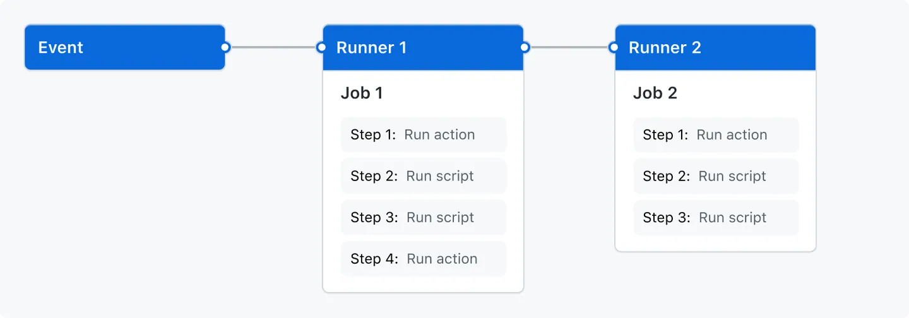

# Overview
- GitHub action là một continuous integration and continuous delivery platform giúp bạn automated build, test, deployment pipeline.
- Bạn có thể tạo một workflows giúp bạn build và test cho mỗi PR của bạn.
- GitHub action không chỉ dừng lại ở DevOps, nó còn giúp bạn xử lý các sự kiện khi có event xảy ra trong repo của bạn
    - Ví dụ: khi có người tạo issue mới.
- GitHub cung cấp các máy Linux, Windows và MacOS để chạy workflows, hoặc bạn có thể host runner chạy ở server của bạn.

# Thành phần của GitHub Actions
- Bạn có thể cấu hình GitHub Action workflow được trigger khi một sự kiện xảy ra trong repo của bạn.
    - VD: khi PR được open, khi issue được tạo ra.
- Workflow của bạn có thể bao gồm một hoặc nhiều jobs, có thể chạy tuần tự hoặc song song.
- Các jobs được chạy phía trong VM runner, gồm nhiều steps.
- Steps có thể là các bước chạy script, hoặc chạy một action khác.

## Workflows
- Workflow là một configurable automated process sẽ chạy một hoặc nhiều jobs
- Workflow sử dụng cú pháp YAML.
- Workflow có thể được trigger bởi:
    - Một sự kiện (event)
    - Thủ công
    - Theo 1 lịch trình đặt sẵn (schedule)
- Workflows được định nghĩa trong folder `.github/workflows`.
- Một repo có thể gồm nhiều workflow.
- Workflow có thể làm các việc sau:
    - Build và test PR
    - Deploy application mỗi khi release được tạo ra.
    - Thêm label cho các issue được tạo ra.
- Bạn có thể sử dụng lại workflow bằng cách reference chúng đến nhau.

## Events
- Event là một sự kiện trong repo trigger một workflow chạy.
- Event có thể được trigger manually, theo schedule hoặc dùng rest API.

## Jobs
- Một job là một tập hợp các bước (steps).
- Mỗi step có thể là các shell script, hoặc là một action khác.
- Step được chạy theo thứ tự và phụ thuộc vào nhau.
- Vì các step được chạy ở trong 1 runner, nên bạn hòan tòan có thể lấy share data giữa các step với nhau.
- Bạn có thể cấu hình các job phụ thuộc lẫn nhau.
    - Mặc định không nói gì thì các job sẽ chạy song song với nhau.
    - Khi bạn cấu hình các jobs phụ thuộc vào nhua, nó sẽ đợi cho tới khi job depend hòan thành rồi mới chạy.
- Ví dụ: có thể cấu hình nhiều job build các phần khác nhau. Sau khi build xong thì job gom các bản build mới chạy.

## Action
- Action là một ứng dụng giúp chạy các ứng dụng phức tạp lặp lại nhiều lần.
- Action giúp giảm lặp code viết trong workflow.
- Action có thể pull code từ GitHub về, setup toolchain cho build environment, setup authentication cho cloud provider.
- Bạn có thể tự viết action, hoặc có thể sử dụng action có sẵn trên GitHub marketplace.

## Runners
- Runner là một server chạy workflow của bạn.
- Mỗi runner chỉ chạy được 1 job tại một thời điểm.
- GitHub cung cấp Linux, MacOS và Window runner.
- Mỗi workflow chạy một máy ảo mới tinh.
- GitHub cũng cung cấp các con runner lớn với cấu hình cao cho nhu cầu cao.
- Bạn cũng có thể host runner của bạn.

# Next step
- GitHub Action có thể giúp bạn automate gần như các khía cạnh khác nhau của quá trình phát triển ứng dụng.
- Bạn có thể tham khảo thêm các mục sau:
    - Tạo GitHub action
    - Building & testing
    - Publishing packages
    - Deploy project.
    - Manage project
    - Use cases & example