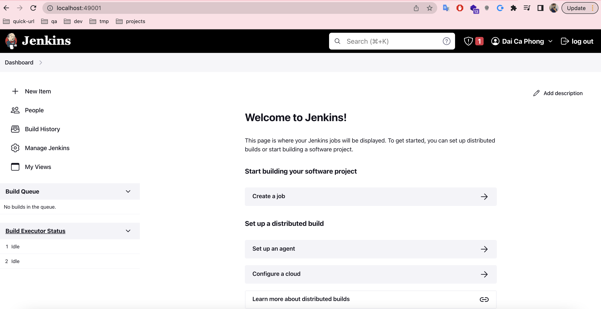

# Context
- Video link: [Youtube](https://www.youtube.com/watch?v=89yWXXIOisk&list=PLhW3qG5bs-L_ZCOA4zNPSoGbnVQ-rp_dG&ab_channel=AutomationStepbyStep)

# Notes
## Lesson 1: Introduction & getting started
- Jenkins là java app, dùng trong hệ thống CICD
- Đại khái Jenkins sẽ:
    - Pull code về
    - Build code, chạy automation test nếu có
    - Deploy lên production
    - Report sau khi build nếu có
- Cài jenkins trên local dùng docker (Hướng dẫn: [link](https://huongdanjava.com/vi/cai-dat-jenkins-su-dung-docker.html))
```
docker run -d -p 49001:8080 -v $PWD/jenkins:/var/jenkins_home -t jenkins/jenkins
```

- Vào trong thư mục jenkins/secret, cat file initialAdminPassword để lấy pass
- Mở browser: http://localhost:49001
- Cài đặt plugins recommend cho nhanh
- Tạo username, pwd: root/root
- Hưởng thụ thành quả

