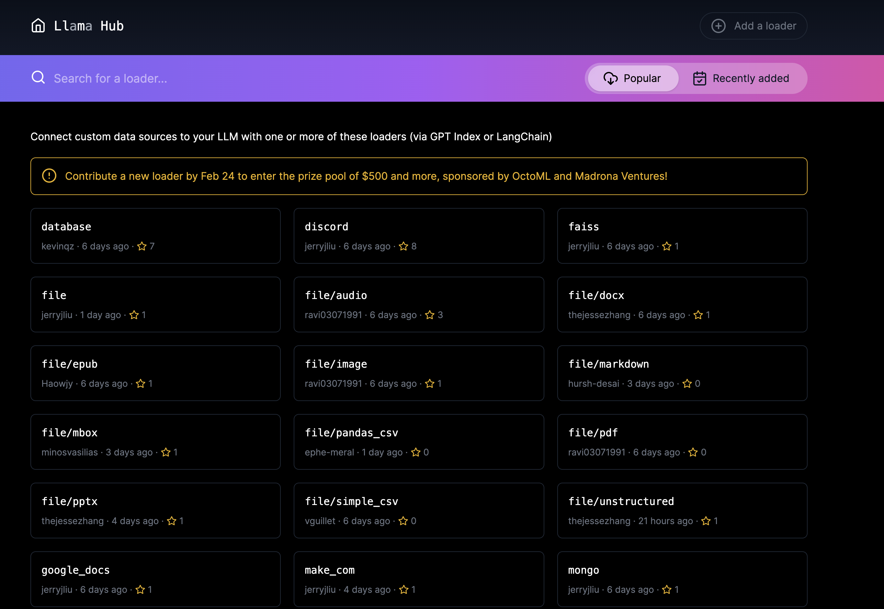

# Loading Data (Ingestion) 
- https://docs.llamaindex.ai/en/stable/understanding/loading/loading/

- Trước khi chọn LLM có thể tương tác với dữ liệu, bạn cần xử lý dữ liệu và load nó.
- Quá trình ingestion gồm 3 giai đoạn chính:
1. Load dữ liệu
2. Transform dữ liệu
3. Index và store dữ liệu
- Index và store sẽ nói sau, bài này tập trung nói về load & transform.

## Loaders
- LlamaIndex load dữ liệu thông qua data connectors, gọi là `Reader`.
- Data connector đọc dữ liệu và format lại thành Docuemnt.
- Document là một tập hợp của các dữ liệu (text, image, audio) và metadata liên quan.

### Loading sử dụng SimpleDirectoryReader
- Đại khái đọc tất cả các file trong một thư mục

```python
from llama_index.core import SimpleDirectoryReader

documents = SimpleDirectoryReader("./data").load_data()
```

### Sử dụng Readers từ LlamaHub
- Ví dụ dùng DatabaseReader:

```python
from llama_index.core import download_loader

from llama_index.readers.database import DatabaseReader

reader = DatabaseReader(
    scheme=os.getenv("DB_SCHEME"),
    host=os.getenv("DB_HOST"),
    port=os.getenv("DB_PORT"),
    user=os.getenv("DB_USER"),
    password=os.getenv("DB_PASS"),
    dbname=os.getenv("DB_NAME"),
)

query = "SELECT * FROM users"
documents = reader.load_data(query=query)
```

### Tạo Document trực tiếp
```python
from llama_index.core import Document

doc = Document(text="text")
```

## Transformations
- Sau khi dữ liệu được load, bạn cần xử lý và transform nó trước khi lưu vào storage.
- Quá trình transform này bao gồm:
  - Chunking: chặt nhỏ ra thành các node
  - Extract metadata: gắn nội dung cho node: parent, sibling, summary nội dung node, đặt title cho node,...
  - Embedding từng chunk:
- Quá trình này rất quan trọng để make sure dữ liệu có thể được lấy ra và sử dụng một cách tối ưu nhất bởi LLM.
- Transformation input/output là các Node (Document là subclass của Node).
- Các transformation có thể được xếp lên nhau và sắp xếp theo thứ tự.

### High-Level Transformation API
- Chúng ta có `.from_documents()` method, nhận vào một array `Document` objects, parse và chunk chúng.

```python
from llama_index.core import VectorStoreIndex

vector_index = VectorStoreIndex.from_documents(documents)
vector_index.as_query_engine()
```
- Under the hood, các Node thực chất khá giống với Document (gồm text và metadata), khác ở chỗ các Node còn thể hiện mối quan hệ tới parent Document nữa.

- Nếu bạn muốn customize core component, thay ddooir global Settings:

```python
from llama_index.core.node_parser import SentenceSplitter

text_splitter = SentenceSplitter(chunk_size=512, chunk_overlap=10)

# global
from llama_index.core import Settings

Settings.text_splitter = text_splitter

# per-index
index = VectorStoreIndex.from_documents(
    documents, transformations=[text_splitter]
)
```

### Low-Level Transformantion API
- Tách document thành Nodes:

```python
from llama_index.core import SimpleDirectoryReader
from llama_index.core.ingestion import IngestionPipeline
from llama_index.core.node_parser import TokenTextSplitter

documents = SimpleDirectoryReader("./data").load_data()

pipeline = IngestionPipeline(transformations=[TokenTextSplitter(), ...])

nodes = pipeline.run(documents=documents)
```

- Thêm metadata

```python
document = Document(
    text="text",
    metadata={"filename": "<doc_file_name>", "category": "<category>"},
)
```
- Tạo và pass Node trực tiếp:

```python
from llama_index.core.schema import TextNode

node1 = TextNode(text="<text_chunk>", id_="<node_id>")
node2 = TextNode(text="<text_chunk>", id_="<node_id>")

index = VectorStoreIndex([node1, node2])
```

# Llama Hub
- Data connector ở Llama hub nhiều vl.


## Cách dùng

```python
from llama_index.core import download_loader

from llama_index.readers.google import GoogleDocsReader

loader = GoogleDocsReader()
documents = loader.load_data(document_ids=[...])
```
- Có khá nhiều connector khác nữa:
  - Notion
  - Google Docs
  - Slack
  - Discord
  - Apify Actorszo

# Next
- https://docs.llamaindex.ai/en/stable/understanding/indexing/indexing/
- https://docs.llamaindex.ai/en/stable/understanding/storing/storing/