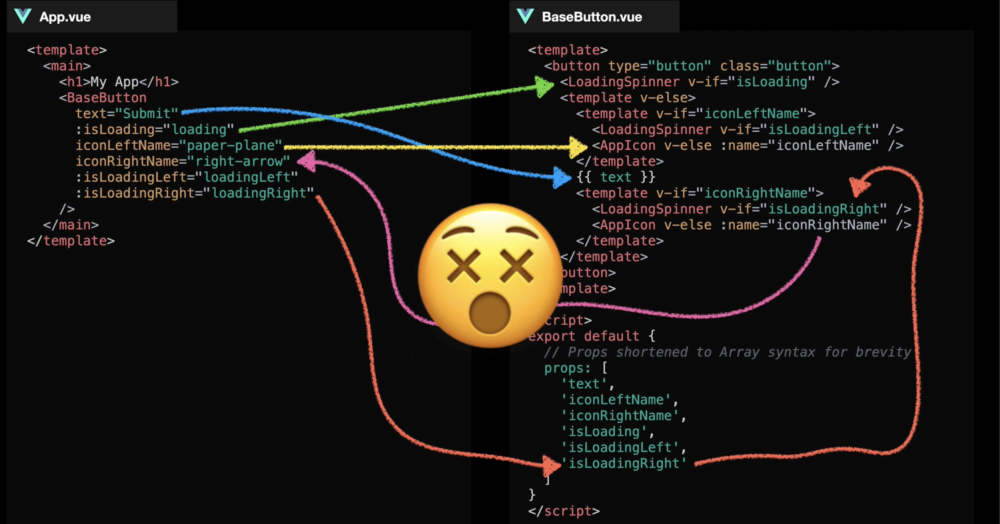
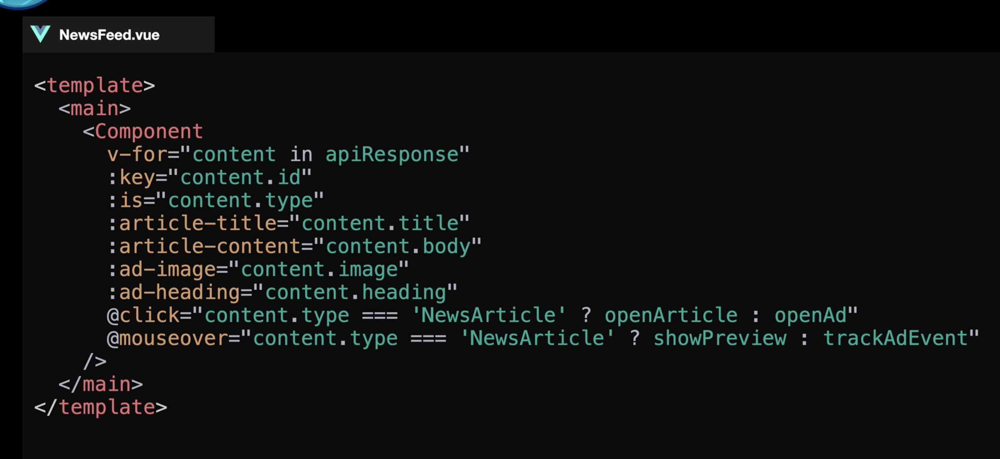
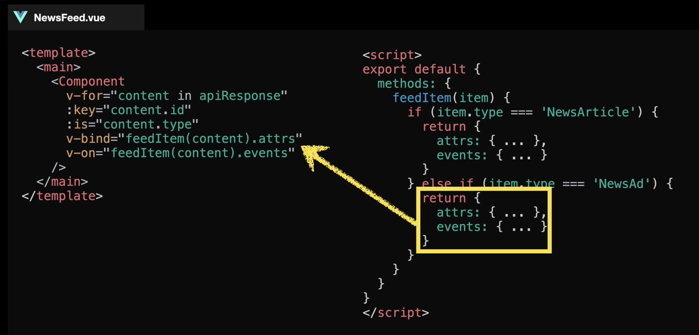

# Part 1: Prop fundamental
- Design component thì nên vẽ nó ra, xem nó có cách phần nào, hình dung thành các props
- Khi tạo prop cần trả lời 3 câu hỏi:
+ Kiểu dữ liệu nào sẽ được dùng?
+ Kiểu có phải là cristical (rất cần thiết) cho component không?
+ Có giá trị default không?

- Nếu có giá trị default rồi thì nên bỏ required đi nha.
- Cái nào để default mà make sense (có ý nghĩa) thì nên để, còn ko thì để require.
- Như vd dưới đây, cái ảnh thì để default đc, nhưng cái title để default hơi kì => required.

```
<script>
export default {
    props: {
        image: {
            type: String,
            default: '/images/default.jpg'
        },
        title: {
            type: String,
            required: true
        },
        length: {
            type: [Number, String],
            default: 90
        },
        watched: {
            type: Boolean,
            default: false
        }
    }
}
<script>
```

# Part 2: Custom validation
- Thêm validator vào prop là được
- VD validate ảnh cần nằm trong folder ảnh và có đuôi PNG hoặc JPG

```
<script>
export default {
    props: {
        images: {
            type: String,
            default: '/images/default.png',
            validator: propValue => {
                const hasImageDir = propValue.indexOf('/images/') > -1
                const isPNG = propValue.endsWith('.png')
                const isJPEG = propValue.endsWith('.jpeg') || propValue.endsWith('.jpg')

                const hasValidExtension = isPNG || isJPEG

                return hasImageDir && hasValidExtension
            }
        }
    }
}
</script>
```

# Part 3: Problem with props
- Props qúa nhiều khiến code ko clean, rối rắm.
- Lúc này nên dùng slot cho khoẻ



# Part 4: Slot fundamental
- Slot để truyền từ component cha xuống con. 
- Có thể đặt default value cho slot

```
// BaseButton.vue
<template>
    <button class="button">
        <slot> Submit </slot> <--- default value đây này.
    </button>
</template>
export default {
    name: 'BaseButton'
}
```

```
// App.vue

<template>
    <div>
        <BaseButton>
            Cancel
        </BaseButton>
    </div>
</template>
```

# Part 5: Named slot
- Thêm name="slotname" ở trong child component
```
<template>
    <header>
        <slot name="header"></slot>
    </header>

    <slot></slot>

    <footer>
        <slot name="footer"></slot>
    </footer>
</template>
```

- Ở parent, dùng thẻ template ft. v-slot:
```
<template>
    <BlogLayout>
        <template v-slot:header>
            This is header text
        </template>

        Default content in default slot here

        <template v-slot:footer>
            Content footer here
        </template>
    </BlogLayout>
</template>
```

- v-slot có shorthand là #, tức là 
```
<template v-slot="header">
```
- sẽ tương đương với
```
<template #header>
```

# Part 6: Scoped slot
- Scoped slot cho phép component expose data đến template block của slot.
- Để dùng scoped slot khá dễ:
- Trong slot sử dụng binding để bind giá trị vào 1 cái tên cụ thể:

```
<template>
    <div class="book">
        <slot name="title"
        :bookTitle="bookTitle"
        />
    </div>
</tempalate>

<script>
export default {
    data() {
        return {
            bookTitle: 'Oh my god'
        }
    }
}
</script>
```

- Trong component cha, lúc dùng slot name thì gán 1 object vào để lấy dữ liệu ra

```
<template>
    <Book>
        <template v-slot:header="slotProps">
            {{ slotProps.bookTitle }}
        </template>
    </Book>
</template>
```
- Chỗ `v-slot:header="slotProps"` có thể viết rõ hơn là: `slot="header" slot-scope="slotProps"`

- Tại sao gọi là scoped slot?
    - Vì giá trị chỉ có tác dụng trong vùng template mà nó khai báo thôi :v

- Chỗ scoped slot có thể dùng destructuring của ES6  cho dễ nhìn

```
<template v-slot:header=" { bookTitle }">
    {{ bookTitle }}
</template>
```

# Part 7: One object 
- Đại khái giúp việc binding gọn gàng hơn
- VD: thay vì viết

```

```
- có thể dùng
```

```
- Ngoài ra có thể dùng data cho nó gọn hơn nữa
```
<template>
    
</template>

<script>
export default {
    data() {
        return {
            imgAttrs: {
                src: 'img.png',
                alt: 'Simple alt'
            }
        }
    }
}
</script>
```
- Tuy nhiên thì ko nên dùng cách này, cứ bind riêng ra cho nó rõ ràng. Học cho biết thôi.
- Tương tự với v-on:

```

```
- Có thể rút gọn lại:

```

```
- Một vài case hiệu quả:


