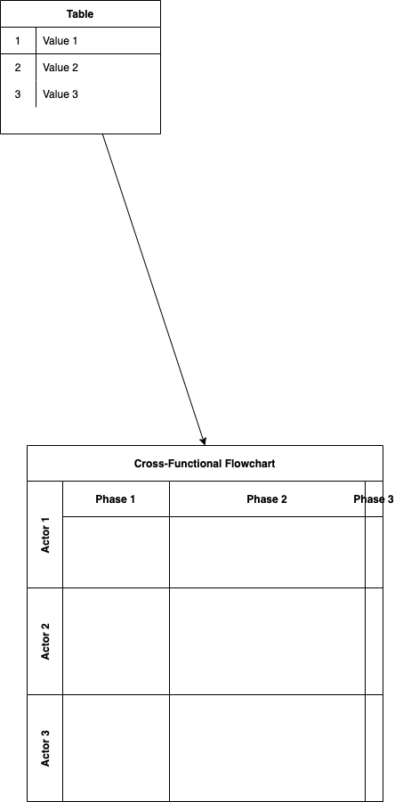

- Source: https://www.youtube.com/watch?v=X48VuDVv0do&ab_channel=TechWorldwithNana

## K8s component
- Pod là đơn vị nhỏ nhất
    - Mỗi pod có 1 IP khác nhau.
    - Khi pod restart hoặc được tạo mới, IP mới sẽ được sinh ra.
- service có ip cố định để gọi.
- ingress là 1 thanh niên trung gian, dùng để forward request từ bên ngoài vào bên trong pod.
- Config map để chứa các config thường xuyên thay đổi

