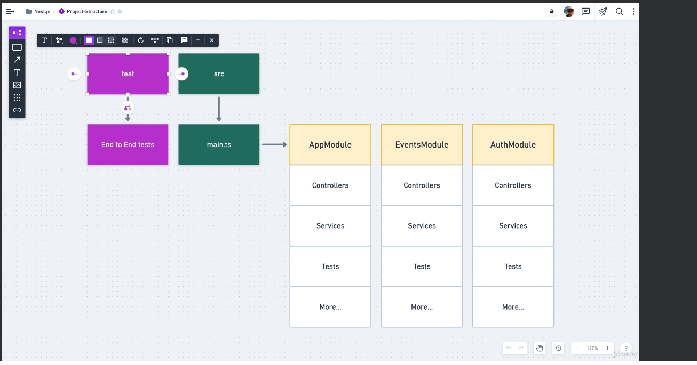

> https://www.udemy.com/course/master-nestjs-the-javascript-nodejs-framework/learn/lecture/25602724#overview

# Using CLI

- Install: 
```
npm install -g @nestjs/cli
```

- Create new project
```
nest new <project-name>
cd
npm run start:dev
```
- ~> localhost:3000

# Project structure
- tsconfig.json ~> config how Typescript transpile to Js
- package.json ~> package dependencies, run command


- Tổng kết lại:
    - Application có 1 file là main.ts, sẽ start ứng dụng từ đây (bootstrap)
    - Concept của Nestjs là bao gồm các module, mặc định có 1 module là AppModule
    - Module bao gồm controllers, services, entities
    - Module được định nghĩa trong module file, sử dụng decorator @Module
