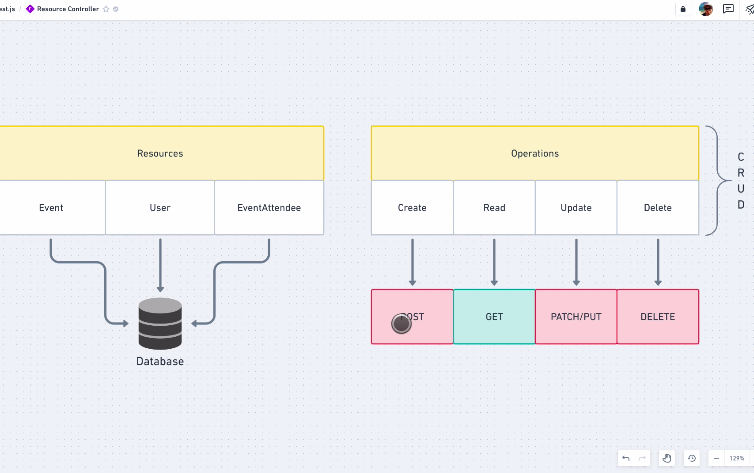
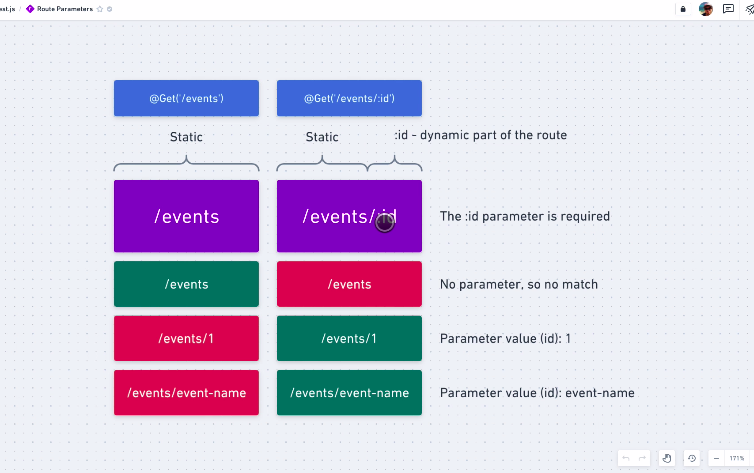
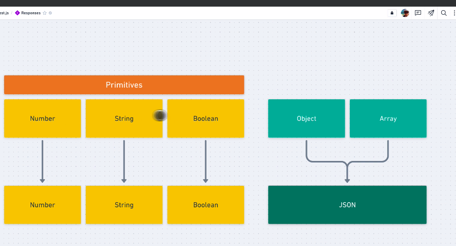
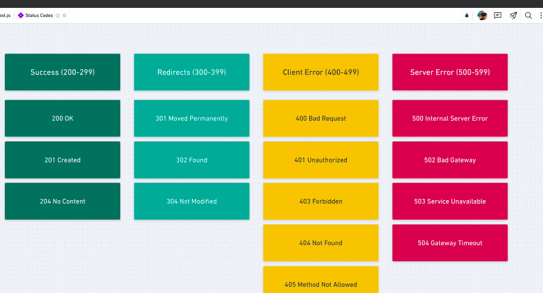

> 20/02/2024

# Controller
- Requests được handle bởi controller, có các method gọi là actions
- Controller dùng decorator, gọi là @Controller, dùng để định nghĩa các path cần thiết 


- Controller nên ngắn gọn thôi

## Route parameter


- Cùng xét đoạn code sau:
```
@Get(':id)
findOne(@Param('id') id) {
    return id;
}
```
- Nếu dùng dạng `@Param('id') id` (có định nghĩa id trong ngoặc tròn) ~> cái id trả về sẽ là giá trị id
    - VD: request GET /events/123 ~> trả về 123
- Còn nếu dùng dạng `@Param() id` (không định nghĩa id trong ngoặc tròn) ~> cái id sẽ trả về 1 object là tòan bộ các param
    - VD: request GET /events/123 ~> trả về: {“id”: 123}
- `@Body()` dùng để đọc body
```
@Post()
create(@Body() input) {
    return input
}
```
- Response & Status codes
    - Nếu response ở controller trả ra  dạng primitive type thì sẽ giữ nguyên
    - Còn dạng object ‌hoặc array thì sẽ bị convert sang JSON



## Request payload - data transfer object
- Đại khái tạo 1 object cho body, cho strong type
```typescript
export class CreateEventDto {
    name: string;
    description: string;
    when: string;
    address: string;
}
```

- Payload create thì request có all field nên làm như trên, còn thằng update, đặc biệt là patch thì có thể missing vài field nên đưa dấu ? vào
```
export class UpdateEventDto {
    name?: string;
    description?: string;
    when?: string;
    address?: string;
}
```

- Trông hơi duplicate ~> nest có package mapped-types cho dễ dùng
```
npm i --save @nestjs/mapped-types
```
 
 ```typescript
 import { PartialType } from "@nestjs/mapped-types";
 import { CreateEventDto } from "./create-event-dto';

 export class UpdateEventDto extends PartialType(CreateEventDto) {

 }
 ```
 - Viết như này thì thằng UpdateEventDto tự có các thuộc tính của thằng CreateEventDto và là dấu ?