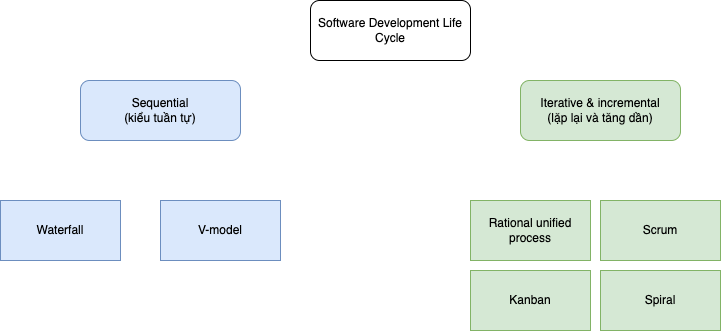
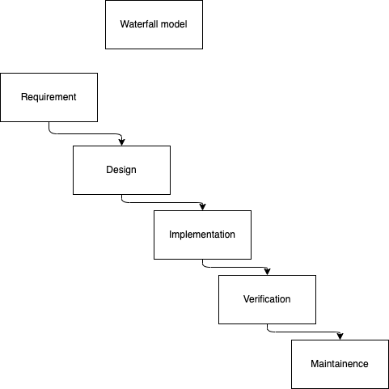
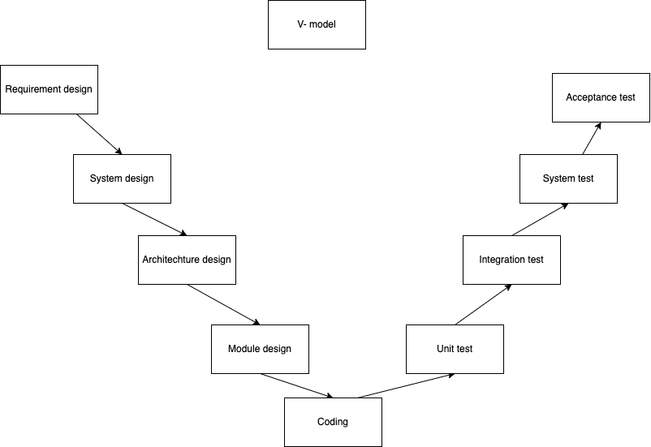

> https://softwaretestingfundamentals.com/software-development-life-cycle/

- Software Development Life Cycle hay Software development process định nghĩa ra các giai đoạn khác nhau trong quá trình xây dựng phần mềm
- Định nghĩa từ ISTQB:
    - `Software development life cycle`: The activities performed at each stage in software development, and how they related one to other logically and chronologically.
        - Nghĩa là các hoạt động được thực hiện qua các giai đoạn khác nhau trong quá trình phát triển phần mềm, và cách chúng liên hệ với nhau một cách logic và thông qua trình tự thời gian
    - `software lifecycle`:  the period of time that begins when a software product is conceived and ends when the software is no longer available for use. The software lifecycle typically includes a concept phase, requirements phase, design phase, implementation phase, test phase, installation and checkout phase, operation and maintainance phase, retirement phase. Note these phases may overlap or be performed iteratively
        - nghĩa là: là khoảng thời gian từ lúc sản phẩm nhen nhóm hình thành, cho tới khi sản phẩm được kết thúc, không dùng được nữa. Thường thì vòng đời phát triển sản phẩm bao gồm một số giai đoạn như sau: ý tưởng, yêu cầu, thiết kế, thực thi, kiểm tra, cài đặt và kiểm tra lại, vận hành và bảo trì, giải tán. Lưu ý rằng các phase này có thể đè lên nhau, hoặc lặp đi lặp lại.
    
# Models (mô hình)
- Có rất nhiều mô hình phát triển phần mềm trên thế giới, nhưng có thể tóm gọn vào 2 nhóm:

## Sequential development models (mô hình phát triển tuần tự)
- Là mô hình truyền thống
- Phát triển qua các bước tuần tự được định nghĩa sẵn
- Nghĩa là các hoạt động phát triển sản phẩm là tuyến tính, giai đoạn sau chỉ có thể bắt đầu khi giai đoạn trước được hoàn thành.
- Phần mềm thường có rất nhiều tính năng, thường mất từ vài tháng tới vài năm để hoàn thiện.
- Cứ tưởng tượng giống việc bạn xây nhà mà ko được nhìn vào cái nhà mình lần nào trước khi nó hoàn thành vậy.

- Ví dụ về mô hình phát triển tuần tự thì có thể kể đến:

### Waterfall models
- Quá trình phát triển giống như thác nước: các bước kế tiếp nhau

Testing chỉ được làm khi code xong toàn bộ phần mềm

### V-model
- V-model là mô hình mở rộng của waterfall, thay vì đi xuống toàn bộ giống waterfall thì sẽ có bước đi lên sau khi coding, trông giống hình chữ V:
    - Requirement design >> System design >> Architechture design >> Module design >> Coding >> Unit Test >> Integration test >> System test >> Acceptance test

