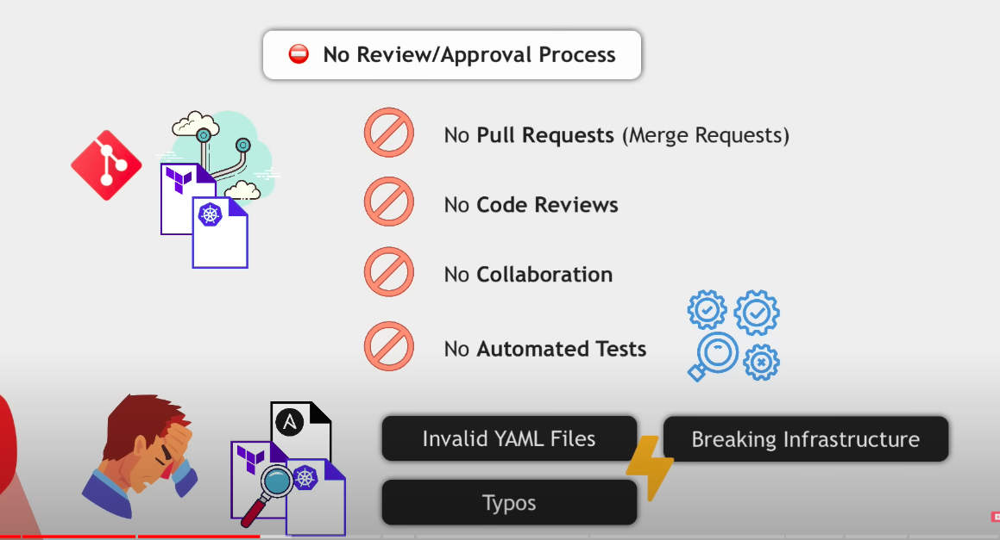

# Buổi 1: Giới thiệu về GitOps và Argo CD

# Mục tiêu
Cung cấp cái nhìn tổng quan về GitOps và Argo CD, giúp người tham dự hiểu rõ khái niệm, lợi ích và cách ứng dụng Argo CD trong quản lý ứng dụng.

# Thời gian
30-60 phút

# **Nội dung chi tiết**:

## 1. **Giới thiệu khái niệm GitOps**
- **Các vấn đề với DevOps truyền thống**:
  - Chúng ta có Infrastructure as Code: nghĩa là từ config sẽ cài đặt được một máy chủ theo mong muốn.
  
  - Infrastruture as Code còn cần cả: Network as Code, Policy as Code, Configuration as Code => gọi chung là X as Code
  - X as Code thường được triển khai thông qua: Ansible, Terraform
  
  - Thường được triển khai và lưu trữ:
    - Test locally
    - Share in Git repo
    - Code review manually (no test run).
  
  - Khi apply config:
    - kubectl apply ...
    - terraform apply ...
  
  - Issue:
    - Mọi người đề có access.
    - Khó trace được ai là người execute
    - Phiên bản trên Git có thể không phải là phiên bản thực tế, vì có thể người khác manually change.
    - Chỉ thấy được lỗi khi apply.
  - => Kết luận: Dù là IaC nhưng vẫn có bước manually
- **How GitOps work**:
  - Main concept: Single source of truth: chỉ tin vào code ở repo Git.
  
  
  - Create PR -> Run CI -> Approval changes -> Run CD pipeline
  - Push & pull model
    - Push: kiểu thường thấy: Khi run cd, chạy qua pipeline để deploy new version to environment.
    
    - Pull: ngược lại: môi trường sẽ tự động watch các thay đổi từ repo
    
- **Tóm lại**
  - Easy rollback
  
  - Cluster disater recovery
  
  - Single source of truth
  
  - Increasing security
  
## 2. **Argo CD là gì?**
- **Tổng quan về Argo CD**:
  - Argo CD là một công cụ GitOps dành cho Kubernetes, được sử dụng để triển khai và quản lý trạng thái của ứng dụng thông qua Git repository.
  - Without Argo CD
  
  - With Argo CD
  
- **Tính năng chính của Argo CD**:
  - Tự động đồng bộ hóa trạng thái ứng dụng từ Git tới Kubernetes.
  - Hỗ trợ rollback và quản lý các phiên bản triển khai.
  - Có giao diện UI mạnh mẽ để giám sát và điều chỉnh triển khai.
  
- **Argo CD alternative**:


## 3. **Lợi ích khi sử dụng Argo CD**
- Tương tự phần GitOps.

## 4. **Demo: Triển khai ứng dụng đầu tiên với Argo CD**
- **Cài đặt môi trường trên Fedora 40**:
  - Cài đặt K8S
    - Cài đặt kind: `go install sigs.k8s.io/kind@v0.24.0`
    - Copy binary của kind vào bin: mv kind /usr/local/bin
    - Thêm file sh để chạy: `create_cluster.sh`
    ```
    #!/bin/bash


    set -o errexit

    # create registry container unless it already exists
    reg_name='kind-registry'
    reg_port='5001'
    if [ "$(docker inspect -f '{{.State.Running}}' "${reg_name}" 2>/dev/null || true)" != 'true' ]; then
      docker run \
        -d --restart=always -p "127.0.0.1:${reg_port}:5000" --name "${reg_name}" \
        registry:2
    fi

    if ! grep -q kind <<< $(kind get clusters); then
        kind create cluster --config cluster.yaml
        kubectl apply -f https://raw.githubusercontent.com/kubernetes/ingress-nginx/main/deploy/static/provider/kind/deploy.yaml
        kubectl wait --namespace ingress-nginx \
          --for=condition=ready pod \
          --selector=app.kubernetes.io/component=controller \
          --timeout=90s
    else
        echo "cluster already running"
    fi

    # connect the registry to the cluster network if not already connected
    if [ "$(docker inspect -f='{{json .NetworkSettings.Networks.kind}}' "${reg_name}")" = 'null' ]; then
      docker network connect "kind" "${reg_name}"
    fi

    # Document the local registry
    # https://github.com/kubernetes/enhancements/tree/master/keps/sig-cluster-lifecycle/generic/1755-communicating-a-local-registry
    cat <<EOF | kubectl apply -f -
    apiVersion: v1
    kind: ConfigMap
    metadata:
      name: local-registry-hosting
      namespace: kube-public
    data:
      localRegistryHosting.v1: |
        host: "localhost:${reg_port}"
        help: "https://kind.sigs.k8s.io/docs/user/local-registry/"
    EOF
    ```
    - Thêm file config để chạy: `cluster.yaml`
    ```
    kind: Cluster
    apiVersion: kind.x-k8s.io/v1alpha4
    nodes:
    - role: control-plane
      image: kindest/node:v1.25.8@sha256:00d3f5314cc35327706776e95b2f8e504198ce59ac545d0200a89e69fce10b7f
      kubeadmConfigPatches:
      - |
        kind: InitConfiguration
        nodeRegistration:
          kubeletExtraArgs:
            node-labels: "ingress-ready=true"
      extraPortMappings:
      - containerPort: 80
        hostPort: 80
        protocol: TCP
      - containerPort: 443
        hostPort: 443
        protocol: TCP
    - role: worker
      image: kindest/node:v1.25.8@sha256:00d3f5314cc35327706776e95b2f8e504198ce59ac545d0200a89e69fce10b7f
    - role: worker
      image: kindest/node:v1.25.8@sha256:00d3f5314cc35327706776e95b2f8e504198ce59ac545d0200a89e69fce10b7f
    containerdConfigPatches:
    - |-
      [plugins."io.containerd.grpc.v1.cri".registry]
        # ensure config_path is disabled so the config below is respected
        # TODO: kind will eventually migrate to using config_path
        # see:
        # https://github.com/kubernetes-sigs/kind/issues/2875
        # https://github.com/containerd/containerd/blob/main/docs/cri/config.md#registry-configuration
        config_path = ""
      [plugins."io.containerd.grpc.v1.cri".registry.mirrors."localhost:5001"]
        endpoint = ["http://kind-registry:5000"]

    ```
  - Cài đặt Argo CD trên Kubernetes cluster.
    - Tạo namespace ArgoCD
    ```
    kubectl create namespace argocd
    ```
    - Cài đặt ArgoCD
    ```
    kubectl apply -n argocd -f https://raw.githubusercontent.com/argoproj/argo-cd/stable/manifests/install.yaml
    ```
    - Kiểm tra kết quả
    ```bash
    kubectl get pod -n argocd

    NAME                                                READY   STATUS    RESTARTS   AGE
    argocd-application-controller-0                     1/1     Running   0          3h12m
    argocd-applicationset-controller-7d4b8488b8-xkggm   1/1     Running   0          3h12m
    argocd-dex-server-67c94bf946-rqbfm                  1/1     Running   0          3h12m
    argocd-notifications-controller-67bdc84d96-mwmxh    1/1     Running   0          3h12m
    argocd-redis-649b8bc987-x6t6d                       1/1     Running   0          3h12m
    argocd-repo-server-6488456fd-f89ph                  1/1     Running   0          3h12m
    argocd-server-b7898877f-ncr2r                       1/1     Running   0          3h12m
    ```
    - Forward port để mở UI
    ```
    kubectl port-forward -n argocd svc/argocd-server 8080:443
    ```
    - Lấy password login admin
    ```bash
    kubectl get secret argocd-initial-admin-secret -n argocd -o yaml
    echo RFg4SXJkSFpmcEVwZmVwcA== | base64 --decode
    ```
  - Kết nối Argo CD với Git repository chứa cấu hình ứng dụng.
    - Tạo file config cho ứng dụng
    ```
    https://gitlab.com/minhphong306/argocd-app-config2/-/tree/main?ref_type=heads
    ```
    - Apply config:
    ```
    kubectl apply -f application.yaml
    ```
- **Thực hiện watching changes**:
  - Thay đổi phiên bản tại `dev/deployment.yaml: nanajanashia/argocd-app:1.1` lên version 1.1.
  - Click sync lại và quan sát quá trình thay đổi.

- **Giám sát triển khai qua giao diện UI của Argo CD**:
  - Xem trạng thái triển khai, logs, và các chi tiết của ứng dụng.
  - Thực hiện rollback ứng dụng từ giao diện UI.
# 7.ArgoCD @
- Login bằng IPA (VPN account);
- Tổ chức thông qua các application:
## 6. **Thảo luận & Hỏi đáp**
   - Giải đáp các thắc mắc về GitOps và Argo CD.
   - Chia sẻ kinh nghiệm thực tế khi triển khai GitOps và Argo CD trong các dự án.

# 8. What's next
- Kiến trúc ArgoCD
- Xây dựng và quản lý các môi trường (dev, staging, production) với Argo CD
- Xây dựng O24-liked environment.
---

# **Lời kết**:
- **Xin gửi lời cảm ơn tới**:
  - **Kênh Youtube của Nana Tech World**: https://www.youtube.com/watch?v=MeU5_k9ssrs&ab_channel=TechWorldwithNana
  - **Link đến tài liệu chính thức của Argo CD**: https://argo-cd.readthedocs.io/en/stable/getting_started/#1-install-argo-cd
  - **Anh Thành** support
  
- **Bài tập về nhà**:
  - Người tham dự thiết lập Argo CD trong môi trường local hoặc cloud và triển khai một ứng dụng cơ bản thông qua GitOps.
  - Tạo Git repository chứa cấu hình của ứng dụng, đẩy lên GitHub/GitLab và kết nối với Argo CD.
  - Chụp ảnh hoặc quay video quá trình triển khai thành công và chia sẻ vào buổi sau.
