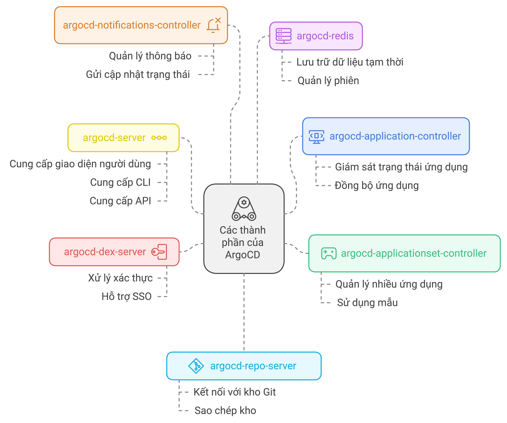

# Trả lời câu hỏi buổi trước

## 1. Push Model vs Pull Model, ưu nhược điểm
Dưới đây là bảng so sánh **Push Model** và **Pull Model (GitOps)**:

| **Tiêu chí**               | **Push Model**                                                 | **Pull Model (GitOps)**                                      |
|----------------------------|----------------------------------------------------------------|--------------------------------------------------------------|
| **Mô tả**                  | CI/CD tool **push** các thay đổi trực tiếp vào cluster ngay sau quá trình build, test, packaging. | ArgoCD/FluxCD **pull** cấu hình từ Git repo, so sánh với trạng thái thực tế của cluster và đồng bộ tự động. |
| **Ưu điểm chính**          | - **Đơn giản hóa quy trình triển khai**: Mọi thứ nằm trong pipeline, dễ dàng quản lý. <br> - **Dễ tích hợp với CI**: Phù hợp với các công cụ CI/CD truyền thống như Jenkins, dễ cấu hình. | - **Tăng cường bảo mật**: Cluster chỉ cần quyền pull từ Git, không cần mở quyền truy cập từ CI server. <br> - **Tự động đồng bộ**: Kiểm tra liên tục để đồng bộ trạng thái thực tế với Git. <br> - **Khả năng audit & rollback**: Mọi thay đổi trong Git được lưu lại, dễ kiểm tra và rollback. |
| **Nhược điểm chính**       | - **Thiếu bảo mật**: CI/CD server cần quyền truy cập trực tiếp vào cluster, dễ bị xâm nhập. <br> - **Phụ thuộc vào pipeline**: Không có khả năng tự động phát hiện và xử lý khi có thay đổi thủ công hoặc sự cố. <br> - **Thiếu tự động điều chỉnh**: Không tự đồng bộ khi có sự khác biệt giữa trạng thái thực tế và mong muốn. | - **Phức tạp ban đầu**: Cần cấu hình ArgoCD, quản lý nhiều Git repo. <br> - **Thời gian phản hồi chậm hơn**: Kiểm tra thay đổi định kỳ hoặc qua webhook, có thể có độ trễ so với Push Model. |
| **Tự động hóa & đồng bộ**   | Không có khả năng tự đồng bộ khi có sự khác biệt giữa trạng thái thực tế và mong muốn. | Tự động đồng bộ, đảm bảo hệ thống luôn ở trạng thái mong muốn như trong Git. |
| **Khả năng bảo mật**        | CI/CD server cần quyền truy cập trực tiếp vào Kubernetes cluster, dễ gặp rủi ro bảo mật. | Cluster chỉ cần quyền pull từ Git repo, giảm thiểu rủi ro bảo mật. |
| **Phụ thuộc vào CI**        | Hoàn toàn phụ thuộc vào CI/CD pipeline để điều khiển việc deploy. | Không phụ thuộc vào CI, hệ thống CD tự điều khiển quá trình triển khai. |
| **Khả năng audit & rollback**| Khó audit và rollback nếu không có lịch sử cấu hình riêng. | Dễ dàng audit và rollback nhờ Git lưu lại toàn bộ lịch sử thay đổi. |

## 2. Tại sao tách repository cho Configuration & Application Source Code là Best Practice?
- Tóm tắt: Việc tách biệt repo giúp quản lý ứng dụng và cấu hình deployment trở nên dễ dàng, linh hoạt, bảo mật và kiểm soát tốt hơn
- Chi tiết phía dưới

### 1. Tách biệt trách nhiệm (Separation of Concerns)
- **App source code repo** chỉ chứa mã nguồn ứng dụng (code logic), trong khi **configuration repo** chứa các thông tin cấu hình về deployment (Helm charts, Kubernetes manifests, YAML files).
- Điều này giúp tách biệt rõ ràng giữa hai loại thay đổi: thay đổi trong code logic của ứng dụng và thay đổi cấu hình triển khai.

### 2. Tăng cường kiểm soát và audit
- Cấu hình deployment thường là **infrastructure as code (IaC)**, và được quản lý trong repository riêng biệt. Điều này cho phép các nhóm quản lý môi trường (Ops) kiểm soát độc lập với nhóm phát triển ứng dụng (Dev), tránh tình trạng "conflict" về quyền thay đổi.
- Bạn có thể dễ dàng theo dõi lịch sử thay đổi (audit trail) của cấu hình deployment riêng biệt, giúp quản lý rủi ro trong triển khai.

### 3. Linh hoạt trong quản lý phiên bản
- Mã nguồn ứng dụng và cấu hình deployment có thể có **chu kỳ release khác nhau**. Tách repo cho phép bạn quản lý phiên bản (version control) của các ứng dụng và cấu hình một cách độc lập.
- Khi bạn cập nhật cấu hình (ví dụ như scaling replicas hoặc thay đổi biến môi trường), bạn không cần phải thay đổi ứng dụng. Tương tự, nếu chỉ có thay đổi nhỏ trong ứng dụng, không cần phải chạm đến file cấu hình.

### 4. Đơn giản hóa rollback và roll-forward
- Nếu có vấn đề xảy ra với một bản phát hành, bạn có thể nhanh chóng **rollback** hoặc **roll-forward** cấu hình mà không cần phải điều chỉnh mã nguồn của ứng dụng.
- Việc quản lý hai repo tách biệt giúp rollback trở nên đơn giản và chính xác hơn vì bạn có thể kiểm soát và khôi phục từng phần một cách độc lập.

### 5. Dễ dàng triển khai đa môi trường (dev, staging, production)
- Bạn có thể quản lý cấu hình của từng môi trường riêng biệt, cho phép áp dụng các thông số tùy chỉnh (ví dụ: số lượng replica, cấu hình tài nguyên) cho từng môi trường mà không cần phải thay đổi mã nguồn ứng dụng.
- Điều này phù hợp với GitOps, nơi **infrastructure và configuration as code** được áp dụng qua từng môi trường từ dev đến production.

---

# Kiến thức buổi này:
## Agenda
- Kiến trúc ArgoCD
- Xây dựng và quản lý các môi trường (dev, staging, production) với Argo CD

## Kiến trúc ArgoCD
```bash
➜  ~ k get pods -n argocd
NAME                                               READY   STATUS    RESTARTS       AGE
argocd-application-controller-0                    1/1     Running   1 (101m ago)   11h
argocd-applicationset-controller-cc88d5c8c-blqqj   1/1     Running   0              6m15s
argocd-dex-server-58bcbfbf7f-44s7f                 1/1     Running   0              6m15s
argocd-notifications-controller-7bf5cf685f-pnggm   1/1     Running   0              6m15s
argocd-redis-5f84f67c5f-w22v5                      1/1     Running   0              6m15s
argocd-repo-server-7cb575ccd8-299rx                1/1     Running   0              6m15s
argocd-server-56b4548564-wqk7x                     1/1     Running   0              6m15s
```


1. **argocd-application-controller**: Bộ não giám sát và đồng bộ ứng dụng.
- **Vai trò**: Đây là **bộ não** của ArgoCD, chịu trách nhiệm giám sát và đồng bộ hóa trạng thái của các ứng dụng. Nó liên tục so sánh trạng thái mong muốn (từ Git) với trạng thái thực tế trên Kubernetes. Nếu có sự khác biệt, controller sẽ tự động cập nhật cluster để đảm bảo trạng thái mong muốn.
- **Ví dụ thực tế**: Hãy tưởng tượng bạn có một ứng dụng trên Kubernetes với 3 replicas. Nếu một trong những replicas gặp sự cố và bị crash, `argocd-application-controller` sẽ phát hiện sự khác biệt giữa trạng thái thực tế (2 replicas) và trạng thái mong muốn (3 replicas), rồi tự động khởi động lại replica bị thiếu để đảm bảo luôn có 3 replica hoạt động.

2. **argocd-repo-server**: Cầu nối giữa Git và ArgoCD để lấy cấu hình ứng dụng.
- **Vai trò**: Kết nối với các Git repositories để tải về cấu hình ứng dụng (YAML, Helm chart). Nó xác định trạng thái mong muốn của ứng dụng và cung cấp thông tin này cho Application Controller để thực hiện đồng bộ.
- **Ví dụ thực tế**: Nếu bạn cập nhật cấu hình ứng dụng trong Git (ví dụ, tăng số lượng replicas từ 3 lên 5), `argocd-repo-server` sẽ kéo cấu hình mới từ Git, sau đó gửi thông tin này cho `argocd-application-controller` để triển khai thay đổi trên Kubernetes.

3. **argocd-server**: Giao diện người dùng và API cho phép tương tác với ArgoCD.
- **Vai trò**: Cung cấp **giao diện người dùng (UI)**, **CLI**, và **API** cho người dùng. Đây là nơi bạn tương tác với ArgoCD, kiểm tra trạng thái ứng dụng, và thực hiện các thao tác thủ công (ví dụ: đồng bộ hoặc rollback).
- **Ví dụ thực tế**: Khi bạn mở giao diện web của ArgoCD để xem trạng thái các ứng dụng, thêm ứng dụng mới, hoặc thực hiện rollback nếu có lỗi trong một lần triển khai, tất cả các tương tác này đều thông qua `argocd-server`.

4. **argocd-applicationset-controller**: Tự động hóa quản lý nhiều ứng dụng/môi trường.
- **Vai trò**: Quản lý nhiều ứng dụng dựa trên một tập hợp cấu hình mẫu (template). Điều này rất hữu ích khi bạn cần triển khai nhiều ứng dụng hoặc môi trường (dev, staging, production) mà chỉ cần thay đổi một số ít thông số (ví dụ: môi trường hay tên cluster).
- **Ví dụ thực tế**: Giả sử bạn có một ứng dụng được triển khai trên 3 cluster khác nhau (dev, staging, production). Với `argocd-applicationset-controller`, bạn chỉ cần định nghĩa cấu hình chung cho ứng dụng, và nó sẽ tự động tạo ra các phiên bản ứng dụng riêng cho từng cluster.

5. **argocd-dex-server**: Xác thực người dùng với SSO.
- **Vai trò**: Đảm nhận chức năng **xác thực và Single Sign-On (SSO)**. Nó cho phép bạn sử dụng các dịch vụ như LDAP, GitHub, hoặc Google OAuth để xác thực người dùng truy cập vào ArgoCD.
- **Ví dụ thực tế**: Nếu bạn sử dụng Google OAuth để đăng nhập vào ArgoCD, `argocd-dex-server` sẽ xác thực tài khoản Google của bạn và cho phép truy cập nếu bạn có quyền.

6. **argocd-notifications-controller**: Gửi thông báo về trạng thái ứng dụng.
- **Vai trò**: Gửi **thông báo** về trạng thái của các ứng dụng. Nó tích hợp với các kênh thông báo như Slack, email, hoặc webhook để cảnh báo khi có sự cố, hoặc khi ứng dụng đã được triển khai thành công.
- **Ví dụ thực tế**: Nếu một ứng dụng bị lỗi trong quá trình đồng bộ (sync failure), `argocd-notifications-controller` có thể gửi cảnh báo đến kênh Slack của đội DevOps để thông báo về vấn đề này.

7. **argocd-redis**: Tăng hiệu năng và quản lý phiên tạm thời.
- **Vai trò**: Lưu trữ tạm thời và quản lý các phiên làm việc (session) cũng như trạng thái đồng bộ hóa. Đây là thành phần hỗ trợ về mặt hiệu năng và quản lý phiên cho ArgoCD.
- **Ví dụ thực tế**: Khi nhiều người dùng cùng truy cập ArgoCD hoặc khi bạn có nhiều ứng dụng cần được giám sát đồng thời, `argocd-redis` sẽ giúp lưu trữ tạm thời các trạng thái và tối ưu hóa hiệu năng để các yêu cầu xử lý nhanh hơn.

### Ví dụ thực tế xuyên suốt các thành phần
### **Context**: 
Bạn đang quản lý một ứng dụng web đơn giản, ví dụ như một trang web thương mại điện tử. Ứng dụng này cần được triển khai từ một repository Git trên nhiều môi trường (dev, staging, production), và bạn cần ArgoCD để tự động quản lý việc này theo mô hình GitOps.

### **Quy trình hoạt động xuyên suốt các thành phần của ArgoCD**:

#### **1. Người dùng cập nhật cấu hình trên Git (argocd-repo-server)**:
Bạn quyết định tăng số lượng replicas của ứng dụng web trên môi trường staging từ 2 lên 3 để cải thiện hiệu năng. Bạn mở Git repository chứa các manifest YAML và chỉnh sửa giá trị replicas trong file deployment YAML của môi trường staging, sau đó commit thay đổi này vào repository.

- **argocd-repo-server** nhận diện có thay đổi mới trong Git repository. Nó kéo về (pull) cấu hình mới nhất từ Git và cung cấp thông tin này cho `argocd-application-controller` để bắt đầu quá trình đồng bộ.

#### **2. So sánh trạng thái và đồng bộ hóa (argocd-application-controller)**:
Sau khi nhận thông tin từ `argocd-repo-server`, **argocd-application-controller** bắt đầu so sánh trạng thái mong muốn (3 replicas) với trạng thái thực tế của ứng dụng trong Kubernetes cluster (2 replicas hiện tại). Nó phát hiện sự khác biệt giữa cấu hình Git và trạng thái thực tế, và tự động khởi động quá trình đồng bộ (sync) để cập nhật số lượng replicas.

- **argocd-application-controller** tạo ra yêu cầu tới Kubernetes cluster để thay đổi số lượng replicas của ứng dụng từ 2 lên 3.

#### **3. Truy cập và theo dõi qua giao diện người dùng (argocd-server)**:
Trong khi quá trình đồng bộ đang diễn ra, bạn muốn theo dõi tình trạng triển khai qua giao diện web của ArgoCD. Bạn mở trình duyệt, truy cập **argocd-server**, nơi cung cấp giao diện để bạn xem các ứng dụng đang được quản lý, trạng thái đồng bộ, và nhật ký (logs) của quá trình triển khai.

- Bạn có thể thấy trên UI rằng ứng dụng đang trong quá trình "In Sync", cho biết việc cập nhật số lượng replicas từ 2 lên 3 đang được thực hiện.

#### **4. Xác thực và phân quyền người dùng (argocd-dex-server)**:
Khi bạn đăng nhập vào giao diện ArgoCD, **argocd-dex-server** đảm bảo việc xác thực danh tính của bạn thông qua Google OAuth (hoặc các dịch vụ xác thực khác). Nếu bạn là người được phân quyền (ví dụ: thuộc nhóm DevOps), bạn sẽ được phép truy cập để theo dõi hoặc thực hiện thao tác trên ứng dụng.

- **argocd-dex-server** xử lý việc xác thực và đảm bảo rằng bạn được quyền truy cập vào giao diện quản lý ứng dụng, đồng thời bảo vệ hệ thống khỏi những truy cập không hợp lệ.

#### **5. Quản lý nhiều môi trường với ApplicationSet (argocd-applicationset-controller)**:
Nếu bạn đang quản lý cùng một ứng dụng trên nhiều môi trường (dev, staging, production), **argocd-applicationset-controller** sẽ đảm bảo rằng các cấu hình phù hợp với từng môi trường được áp dụng. Ví dụ, số lượng replicas cho dev có thể là 1, staging là 3, và production là 5. Bạn chỉ cần định nghĩa một cấu hình chung và `argocd-applicationset-controller` sẽ tạo ra các ứng dụng cụ thể cho từng môi trường.

- Khi bạn cập nhật cấu hình staging lên 3 replicas, `argocd-applicationset-controller` sẽ đảm bảo các môi trường khác không bị ảnh hưởng và chỉ môi trường staging được đồng bộ.

#### **6. Gửi thông báo khi triển khai thành công (argocd-notifications-controller)**:
Sau khi việc đồng bộ hoàn tất và số lượng replicas được cập nhật thành công từ 2 lên 3, **argocd-notifications-controller** sẽ gửi thông báo đến nhóm DevOps qua Slack để thông báo rằng ứng dụng trên môi trường staging đã được triển khai thành công.

- Bạn và nhóm của bạn sẽ nhận được thông báo qua Slack hoặc email với nội dung: *"Ứng dụng trên môi trường staging đã được triển khai thành công với 3 replicas."*

#### **7. Hiệu năng và quản lý phiên tạm thời (argocd-redis)**:
Trong quá trình nhiều người dùng cùng truy cập vào ArgoCD, **argocd-redis** giúp lưu trữ các phiên làm việc (session) và trạng thái tạm thời. Điều này giúp tăng tốc độ phản hồi khi nhiều yêu cầu được gửi đến hệ thống, và cải thiện hiệu suất xử lý.

- Khi bạn và các đồng nghiệp cùng theo dõi trạng thái ứng dụng trên giao diện ArgoCD, `argocd-redis` đảm bảo các phiên làm việc của người dùng được lưu trữ và quản lý hiệu quả mà không gây ảnh hưởng đến hiệu năng hệ thống.

## Xây dựng và quản lý các môi trường với Argo CD cho hiệu quả
- 1. Tách biệt cấu hình giữa các môi trường
- 2. Sử dụng **ApplicationSet** để quản lý nhiều môi trường**
- 3. Áp dụng **Helm hoặc Kustomize** cho cấu hình động
- 4. Sử dụng **Sync Policies** để đồng bộ hóa tự động
- 5. Bảo mật thông tin nhạy cảm với Sealed Secrets hoặc Helm Secrets
- 6. Giám sát và cảnh báo qua Notifications Controller

# What's next:
- Xây dựng O24-liked environment